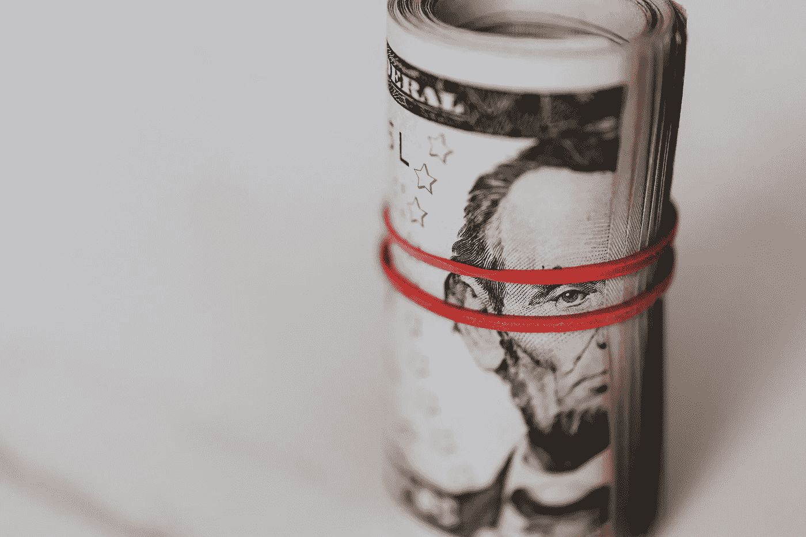

# 5 个摧毁投资组合的破坏性逻辑谬误

> 原文：<https://medium.datadriveninvestor.com/5-destructive-logical-fallacies-that-crush-investment-portfolios-2c46884c1d03?source=collection_archive---------1----------------------->

## 我在一家投资公司的操作室目睹的令人厌恶的事情

Photo by [Karolina Grabowska](https://www.pexels.com/@karolina-grabowska?utm_content=attributionCopyText&utm_medium=referral&utm_source=pexels) from [Pexels](https://www.pexels.com/photo/roll-of-american-dollars-tightened-with-red-band-4386471/?utm_content=attributionCopyText&utm_medium=referral&utm_source=pexels)

多年来，我一直担任投资顾问。对于刚毕业的商学院学生来说，这是职业生涯的起点。总的来说，这是一次有效的经历，但我总是面临一个道德上的困境。

这是一项以佣金为基础的工作，因此逻辑谬误往往是接近新投资者或进行更大规模操作的首选武器。目睹这些逻辑缺陷扭曲现实，并说服人们做出错误决定，只有一个好处:

我学到了足够的东西，不会被同样的诡计所迷惑。我学到了足够的东西来教你不要成为同一个陷阱的猎物。

在这里，我将列出你在阅读或聆听投资建议时应该注意的逻辑谬误。

## **叙事谬误**

上午 11 点 43 分，股指下跌近 3%。投资门户网站挤爆头条新闻，告知美联储当天 15:00 的会议日程令市场紧张，投资者正在寻找波动较小的选项。

下午 14:51，上午下跌的相同指数稳步回升，现在上涨了 1%。几个小时前，同样的新闻网站还在告诉渴望得到解释的投资者，因为美联储会议，一切都变红了，现在它们告诉我们，对会议的良好预期正在推动市场。

在几个小时的时间里，记者们利用同一次会议(仍未发生)来解释市场截然相反的行为。

虽然很可笑，但也出奇的普遍。新闻网站的收入来自用户阅读他们写的任何胡言乱语的点击量和时间。谁会花时间在一个诚实的新闻媒体上？尤其是因为他们会有这样的标题:

“*标准普尔 500 指数今天下跌近 2%。我们不知道为什么，但相信这只是另一个随机变化*。

人们更喜欢阅读解释，不管它们有多假。所以新闻媒体提供他们。叙事谬误之所以存在，是因为人类很难接受短期内大多数市场变化是随机发生的。

金融新闻渠道是制造叙事的润滑良好的机器。他们寻找任何理由来证明随机市场波动的合理性。至少偶尔，他们会给我们一个滑稽的机会，让我们看到他们用同一个事件来解释相反的波动。

## 沉没成本谬论

在运营办公室，我们把这种谬论称为“被迷惑的失败者的错误”。

这可能是新投资者中最常见的谬误，看到它的影响令人心碎。

最常见的情况是某个投资组合大幅贬值。这位投资者认为，如果他已经损失了 20%、30%，“现在退出”是没有意义的。

这种推理本身毫无意义。如果他有任何信息，资产将有一个逆转和增值。但就其本身而言，你的投资组合已经感受到了 X%,因此最好什么都不做的想法是没有意义的。除非 X 是 100%，因为在这种情况下，你不能再做任何事了。

 [## 100 年来，这些红利珍珠一直在说服投资者

### 你想要支付可靠红利的股票吗？那你应该看看这两个车厂。有些股票有…

www.datadriveninvestor.com](https://www.datadriveninvestor.com/2020/08/24/these-dividend-pearls-have-been-convincing-investors-for-100-years/) 

## 绿色木材谬论

这个名字来源于[纳西姆·尼古拉斯·塔勒布](https://medium.com/u/f138bf5466fe?source=post_page-----2c46884c1d03--------------------------------)讲述的一个例子:

> 乔·西格尔(Joe Siegel)是一种叫做“绿色木材”的商品的最成功的交易者之一，他实际上认为这是涂上绿色的木材(而不是新切的木材，因为没有干燥而被称为绿色)。他以交易这些东西为职业！在外地做事的人，不受一套考试的约束；它们是以最不规范的方式选择的——好的参数不会产生太大的差异。[……]这意味着，对投资原理、叙述或理论模型的假定理解在实际交易中是无益的。

以上节选自塔勒布的《T2》一书，我推荐这位作者，因为他的[见解帮助拯救了我的生意](https://medium.com/the-innovation/how-nassim-nicholas-taleb-saved-my-business-b6a12368beed)。但甚至在看之前，我就在操作室看过很多次了。当你错误地认为某种知识或技能对投资决策有帮助，而实际上它没有影响时，就会发生这种情况。

我看到这种谬论的最显著的一次是在我和一个叫卢卡的经纪人一起工作的时候。他来自一个传统而强大的咖啡农王朝。在我们的操作室，交易量最大的衍生品之一是咖啡期货。于是卢卡加入了这个派对，告诉我们他有很多专家信息。就像他告诉我们，他堂兄的叔叔的邻居通知说，由于缺少雨水，咖啡收成正在减少，所以未来的价格应该会上涨。

我从没见过有人像他一样在咖啡期货上损失这么多钱。

## 生存偏差

有时我们办公室组织会议和课程。他们把经验丰富的成功投资者和潜在客户安排在同一个房间里。不用说，在听到经验丰富的投资者的利润和成功的故事后，前景变得相当兴奋。如果任何人对他们的回报进行平均，它会以相当大的幅度击败指数。

因此，对于这些前景，获得高于指数的回报看起来完全可以实现，甚至很容易做到。问题是，房间里的投资者只是幸存者。没有破产的投机者或濒临破产的摇摆交易者。

通过只与幸存者交谈，想要成为投资者的人有着巨大的偏见，不知道失败的故事。你会发现这种偏见最常见的地方是投资课程、网络研讨会和咨询。他们经常把它作为一种销售伎俩，伪装成“检查我们的成功案例”。没有人展示失败的例子。

## 确认偏差

我把这种偏见留到了最后，因为这是我的最爱。这是我最喜欢的，因为它是——抱歉，如果你曾经有过——最愚蠢的。

确认偏差是人类大脑的一种倾向，它会提醒我们短暂的胜利，而忘记我们小小的损失。在某种程度上，这是一种自我保护的工具。问题是它经常失控，高估我们的胜利和再次发生的机会。

我们经纪公司的一位投资者曾经投资了一只股票，代码为 KELP3(我稍微修改了代码，但熟悉巴西股票的人都会明白)。当时，每只股票的价格约为 18 美分，因此一个微小的变化就可能成就或毁掉一个投资组合。

这位投资者在他的操作中有将近 20%的利润，在下一次操作中有一个较小但很重要的利润。问题是，在这两次幸运出手之后，他认为自己是股票走势方面的专家。但是股票的波动是——你猜——随机的。他损失了大部分收益，当我离开公司的时候，他已经损失了很多，但仍坚持摇摆交易。

当有人说他“熟悉”某种股票的走势时，这种确认偏见几乎总是存在的。

对于任何熟悉逻辑偏见和谬误的人来说，“熟悉”随机资产变化显然是荒谬的。这听起来就像一个人说他是掷骰子的专家一样可笑。

在结束这篇文章之前，我想离题一下，所有这些谬误和偏见只是我在操作层经历的一小部分。事实上，这里有大量优秀的建议(尽管没有一条来自咖啡商卢卡)。最好的一个是关于杜松子酒和它如何有助于建立一个投资组合。但这是后面的文章。

李维·博尔巴是 expatriateconsultancy.com**的首席执行官，也是一位畅销书作家。你可以在这里查看* [*他的书*](https://www.amazon.com/Levi-Borba/e/B082X6GSZF?ref_=dbs_p_ebk_r00_abau_000000) *。**

***进入专家视角—** [**订阅 DDI 英特尔**](https://datadriveninvestor.com/ddi-intel)*