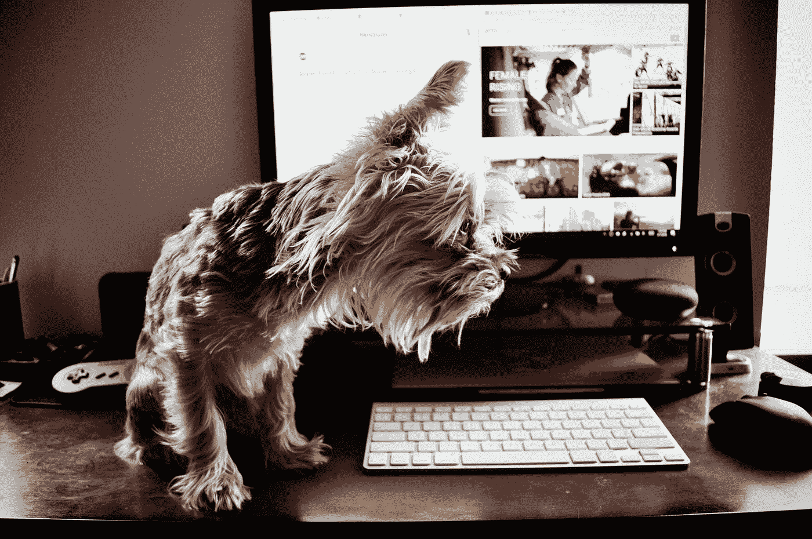

# 筑巢企业家应该避免的 5 种干扰

> 原文：<https://medium.datadriveninvestor.com/5-distractions-the-nesting-entrepreneur-should-avoid-f7754709452e?source=collection_archive---------13----------------------->

## 有时我们像鸟一样，容易被移动的物体分散注意力

Photo by [Garrhet Sampson](https://unsplash.com/@garrhetsampson?utm_source=medium&utm_medium=referral) on [Unsplash](https://unsplash.com?utm_source=medium&utm_medium=referral)

面对现实吧，并不是所有的企业家都幸运地在发现自己企业家的一面的第二天就成功了。像我这样的企业家被认为是筑巢的，可能有点害怕发动政变，把舒适留给不确定性。它可以是一系列的许多事情，许多事件，使人们处于不愉快的环境或情况下，这些都被一次又一次地证明不是有益的。

想想那些带着一个价值百万美元的想法从学校毕业并完成大学学业的人，但是他们太害怕冒险去实现它。相反，他们满足于纸学位，这种激烈的竞争让他们追逐因完成多年教育而悬在他们头上的债务。这并不是说在以后的生活中不会发生，而是说在某个时候想法变成现实的可能性很小，这就是想法的美妙之处。当它来到你身边时，它只属于你一小会儿，如果你有所行动的话。

 [## 在创业之旅中，拥抱学习|数据驱动的投资者

### 好像建立一个数百万美元的公司还不够困难，企业家必须额外照顾他们的…

www.datadriveninvestor.com](https://www.datadriveninvestor.com/2018/10/16/on-the-entrepreneurial-trek-embrace-the-learning/) 

这同样适用于在职企业家。有保证的双周薪水的舒适似乎是一个太甜蜜的交易，不能放弃或离开。尤其是当福利包附带健康保险时，当账单和家庭被添加到等式中时。然而，这些并不是嵌套企业家面临的唯一干扰。

## **让筑巢企业家分心的 5 件事**

Photo by [Andy Orin](https://unsplash.com/@aorin?utm_source=medium&utm_medium=referral) on [Unsplash](https://unsplash.com?utm_source=medium&utm_medium=referral)

## **5。重要的他者—**

在一些家庭中，当丈夫或妻子受到企业家精神的启发时，丈夫和妻子之间的平衡可能会受到干扰或中断。在某些情况下，嫉妒可能是罪魁祸首。当一个人找到生活中真正的激情并努力实现它时，他/她的另一半可能会收到一种压倒性的复杂感觉，并为自己没有找到同样的感觉而后悔。

这也可能是因为两人的想法不一致，或者目标不一致。假设你有一个商业伙伴，在某些圈子里，婚姻被视为一种商业伙伴关系，你在经营生意，但你的伙伴是一个挥金如土的人，事实上，是一个挥金如土的人。这肯定会导致失败。像大多数婚姻一样，这种情况无论如何都会发生，当一对夫妇意见不一致时，缺乏沟通会变成怨恨，导致你的另一半成为干扰而不是支持者。

**如何预防—** 让你的另一半加入进来吧！与他们交流你的愿望和目标，尽最大努力让他们参与到你的努力中，将你的创业冒险变成一种伙伴关系。

## **4。其他企业家的成功—**

在这个社交媒体的时代，人们很容易沉迷于别人在做什么或者假装在做什么。因此，作为一名企业家，很容易被他人的成功以及他们为实现梦想或实现目标所做的或正在做的事情所吞没。

这可能是一个很大的动力，同时也是一个更大的干扰。如果你总是读到其他人和他们作为企业家的成功，你什么时候会找到时间来实现你的成功呢？

**如何防止这种情况—**
限制或完全减少你的社交媒体时间。众所周知，Youtube 虫洞是真实存在的，这也适用于 Tic Toc、脸书、Snapchat、Twitter 和 Instagram。

限制您的时间或完全删除应用程序。严肃地说，如果你认真思考这一想法，史蒂夫·乔布斯、比尔·盖茨、马克·库班和亚历克西斯·奥哈尼安都限制技术、手机、iPads 和社交媒体在他们家中的使用。史蒂夫·乔布斯根本不允许 iPad 出现在家里，所以花几分钟时间让它融入进来。

根据美国消费者新闻与商业频道的说法，当与比尔·盖茨、马克·库班和亚历克西斯·奥哈尼安谈论他们的孩子和家中的技术时，他们有以下贡献:

亚历克西斯·奥哈尼安，

> “我妻子和我都想让她(女儿)知道科技发展受到限制是什么感觉……我真的很期待在她长大后和她一起玩电子游戏，但让她有时间思考、玩积木、玩玩具真的很重要，所以我们会对她严加监管。”

马克·库班 —,

> “我不想撒谎，我给了我儿子 150 美元，让他两个月不要看那些视频，”库班说。“但如果他看数学视频，或者为我做数学题，他就可以赚钱，他可以赚时间看《我的世界》的视频。”

比尔·盖茨—

> “吃饭的时候，我们在餐桌上没有手机，我们直到孩子 14 岁才给他们手机，他们抱怨其他孩子比我们早拿到手机……”

这有什么意义？我喜欢从孩子的角度来看待创造力，他们看待世界的方式不同，除了可能性什么都没有。如果对孩子不好，那么也有可能对你的创造力不好。

你有什么想法？

## 3.你周围的人—

曾经有一段时间，我公开谈论我的想法，并与他人分享，这也包括家人。没过多久，我就痛苦地认识到，你的朋友和家人并不总是把你的最佳利益放在心上。这些人不理解企业家的概念，或者想要更好的、不同的东西。

这些努力工作的人实现了企业家的梦想，因为他们会如此努力地工作，让别人变得富有，并且不能证明放弃他们的保障和舒适是正当的。这里的注意力分散在于他们对想要改善你的生活和处境的沮丧、侮辱和操纵的话语。

你看，有些人害怕他们会被落在后面，错过你的生活，所以他们可能会破坏你的梦想，然后有些人只想窃取你的想法并为自己所用。

## 如何防止这种情况—

对与你分享你的愿望、梦想和想法的人非常挑剔。有些人会建议你也过度保护它们，只与你全心信任的人分享，你知道的人会把你的最佳利益放在心上，只希望你得到最好的。

在某些圈子里，保密协议是必要的，但我认为这是一个非常极端的措施。不是每个人都是坚定的斯多葛派，言语伤人，即使是我们中最坚强的人也不时需要积极的肯定。奇怪的是，我最近才意识到，苏斯博士充满了积极的信息，可以帮助各行各业继续走在这条好路上。

 [## 能改变你生活的 15 句苏斯博士名言

### 如果你闭上眼睛，你会错过最好的东西。

medium.com](https://medium.com/one-minute-musings/15-dr-seuss-quotes-that-can-change-your-life-81716de026e5) 

## 2.批准你薪水支票的人—

对一些人来说，这是显而易见的，但一开始对我来说不是。我有一个老板，当她意识到我在创业时，她试图让我的工作变得更难。在这段时间里，她让我的生活变得异常艰难。她盯上了我，当时是我的未婚夫，在没有通知我的情况下，将包裹、邮购、发票退回给公司，并且总是忘记通知我。这都是为了我的工作，而不是我创业的一部分。这完全令人沮丧。

我让制造商联系我，询问退货、过期发票和因补货费而产生的费用。一旦这达到了沸点，我别无选择，只能直接面对她。

如果你曾经面对你的主管，询问他们的行为，对你和我们履行工作职责的能力的影响，以及他们行为的法律含义。不管你是否正确，这都不是一个好的处境。当你处理工作场所的行为时，人力资源只是先保护公司，然后才是管理。

幸运的是，我已经收集了证据，并与第三方机构建立了一个关于工作场所政策和骚扰(现在是欺凌)的案例。当我与她对质时，我所要做的就是提及联邦罪行，给她我律师的信息，这些信息已经在文件上了，如果她继续这种行为并威胁要解雇我，那么我将不得不采取进一步的法律行动。我从这次经历中学到了重要的一课。

## 如何防止这种情况—

把你的事业留给自己，工作不需要知道你正在建立一个事业，无论是大是小。此外，始终做好你的尽职调查，记录一切，尤其是在动荡时期和面对逆境时。通常，在你想放弃的时候，是你最需要战斗的时候，不是更努力，而是更聪明。

## 1.你汇报的工作—

现在的人活着就是为了工作，但这一切都是错的。生活应该是有趣的，人们应该为生活而工作。一天工作 40 个小时，领着薪水过日子不如一周工作 4 个小时令人兴奋。让我们现实一点，一周工作 4 小时，对一些人来说甚至是不合理的，但这并不意味着这是不可行的。当你一周工作 40 个小时，也许还有几个周末，你什么时候会有时间加速你的冒险？

工作带来舒适和稳定，但也有局限性。所有的决定和选择都有后果。努力让别人富有还是努力让自己舒适，这才是真正的问题。还有一个百万美元的问题，

> “如果你必须在余生中做些什么，那会是什么？”

现在你有了一份清单，上面列出了让正在筑巢的企业家分心的 5 件事。即使是[日内交易加密货币](https://medium.com/@LexNickels/cryptocurrency-beginner-crash-course-175a4aeb732d)或乘着股票市场的低迷。也许是时候离开老巢，踏上成功之路了。从来没有比现在更好的时机了。

明年的这个时候，你会在哪里？

[莱克斯尼克尔斯](https://medium.com/u/f65191326255?source=post_page-----f7754709452e--------------------------------)版权所有。

 [## 与客户合作时永远不要忘记的 6 件事

### 作为一名自由职业者，有许多挑战，但不得不追着你的客户付款不应该是其中之一…

medium.com](https://medium.com/datadriveninvestor/6-things-to-never-forget-when-working-with-clients-5260766a678e)  [## 从 300 学到的 3 件创业的事

### 你不必成为斯巴达战士也能像斯巴达战士一样战斗。

medium.com](https://medium.com/one-minute-musings/3-entrepreneurial-things-learned-from-300-e23ab77f7bc)