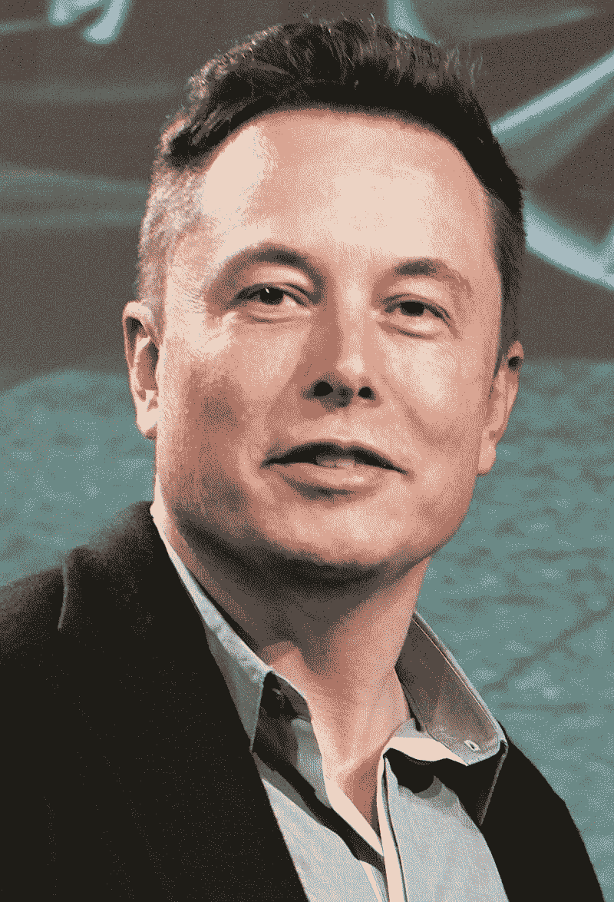

# 埃隆·马斯克的 5 句名言激励你走向成功

> 原文：<https://medium.datadriveninvestor.com/5-elon-musk-quotes-to-inspire-you-for-success-ea5f1dfd83?source=collection_archive---------16----------------------->

Steve Jurvetson — [https://www.flickr.com/photos/jurvetson/18659265152/](https://www.flickr.com/photos/jurvetson/18659265152/)

埃隆·马斯克建立了数十亿美元的公司，被认为是我们这个时代最有远见的人。他的目标是改善这个世界，赚足够的钱去火星。

1971 年 6 月 28 日出生于南非比勒陀利亚的马斯克成为了 PayPal 成功的功臣之一。他还创立了 SpaceX、特斯拉、Zip2 和 SolarCity 等公司。

对许多人来说，他是现实生活中的铁人。他通常每周工作 80 多个小时，似乎没有什么能让他慢下来。

 [## 教科书行业如何最终被颠覆，并将继续改变|数据驱动…

### 就此而言，教科书产业在美国乃至全世界都有着悠久的历史。事实上，他们已经…

www.datadriveninvestor.com](https://www.datadriveninvestor.com/2018/09/25/how-the-textbook-industry-has-finally-been-disrupted-and-will-continue-to-change/) 

我希望我们都能被这个不可思议的人所激励，为我们的成功而努力。

让我与你分享我最喜欢的五句埃隆·马斯克名言，激发你的灵感:

> “如果你早上起床后觉得未来会更好，那这就是光明的一天。否则就不是了。”

这不仅仅是积极的思考。有目标并为之努力是让我们感到活着的原因。休息和放松是很好的，但是随着时间的推移，停下来继续前进会开始扼杀我们的动力。一旦我们感到停滞不前，我们对生活的看法就会变得不那么乐观。一旦我们不再感到积极，我们会采取更少的行动，甚至感到更加困顿。不要让这种消极的螺旋抓住你。相反，处理好每一天，永远不要停止进步。

**如何使用这句话:**

用一天中的第一个小时为接下来的时间定下基调。从冥想或呼吸开始，不要消耗新闻。不要让消极影响你的观点。相反，问问自己如何让这一天变得不同寻常。

> “我觉得普通人选择不平凡是有可能的。”

变得与众不同并没有你想象的那么难。我不说一下子开多家公司或者改变世界。大多数人不会做什么特别的事。这就是为什么你不需要太多就能脱颖而出。

但你必须做出选择。

与其看另一集《毒枭》,不如做你的兼职工作。

与其在 Instagram 上再翻 15 分钟，不如读本书。

与其吃第二块蛋糕，不如去散散步。

**如何使用这句话:**

你不是伯恩非凡。你每天做的小决定让你与众不同。

> “我要么看着它发生，要么成为它的一部分。”

当我大约 16 岁的时候，和我一起踢足球的两个家伙开始组织聚会。他们很快就成功了，并从事活动管理工作至今。这是我第一次觉得我应该成为某件事情的一部分——相反，我只是在旁观。

这并不意味着你应该分散自己，努力成为所有事情的一部分。但是如果你感到有一股强大的力量吸引着你，那就成为它的一部分，不要错过机会。

**如何使用这句话:**

不要等别人超过你。做一个开创事情的人，做一个打破事情的人，做一个最终成功的人。

> “人们对冒险有极大的偏见。每个人都在努力优化自己的臀部遮盖效果。”

当我学习交易时，重点总是在风险管理上。但从没谈过规避风险。你看，不管是交易还是生活中，不接受一定的风险是赢不了的。人生本来就有风险。如果你总是玩它，说你还不如呆在你的床上。等等，即使这样也有风险。你会产生低水平的维生素 D，最终可能会超重。

所以，诀窍就是像交易者一样去做。接受风险，但总是限制潜在的负面影响，这样你才能站起来继续前进。

**如何使用这句话:**

开始挑战自己。如果你是一个内向的人，开始每天和一个陌生人交谈。这样，你将学会区分恐惧和真正的风险。

> “人们应该追求自己热爱的东西。这会让他们比其他任何事情都更快乐。”

我知道外面有太多追随你的激情的文章。但事实是生命短暂，浪费你一天的大部分时间做你不喜欢的事情是一种耻辱。

对某事充满激情是不够的。只有当你的激情允许你忍受掌握某样东西所需要的严酷和艰苦的时间，那才是真正的激情。如果你找到了这种激情，那就全力以赴吧。

**如何使用这句话:**

永远不要停止实验。只是因为你还没有找到你热爱的东西，并不意味着你不会找到。但是如果你把所有的时间都花在看《网飞》或者浏览 Instagram 上，你就不会找到你想要的东西。相反，走出去，认识新的人，做新的事情，让自己接触这个世界提供的一切。

# 外卖

你不必疯狂工作或者试图到达火星。

但是不要因为总是呆在自己的舒适区而限制了自己的潜力。把马斯克作为人类潜力的例子，开始挑战你的极限。如果你从未停止成长，成功将是不可避免的。

准备好变得无限了吗？

如果你想变得无限并大大加快你的学习速度，看看我的小抄:

[单击此处立即获取备忘单！](https://roadtolimitless.com/cheatsheet/)