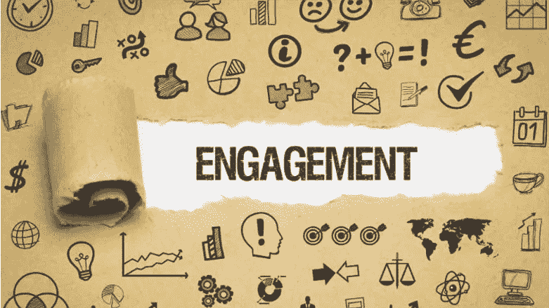
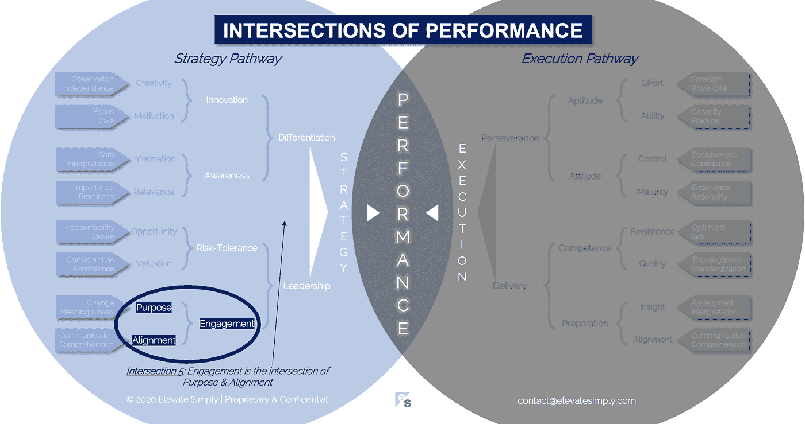

# 参与:目标和联盟的交集

> 原文：<https://medium.datadriveninvestor.com/5-engagement-the-intersection-of-purpose-alignment-953747437c26?source=collection_archive---------9----------------------->

Image from 123rf.com

建立高绩效公司的圣杯是通过组成它的个人的参与来实现的。成功的领导者明白参与的重要性。他们知道如何吸引注意力，创造付出努力的欲望。他们知道如何集中精力，激励人们尽力而为。他们知道如何参与。

研究表明，敬业度具有重要的、已被证明的价值。谷歌一下“员工参与度研究”，你会找到比你想象的更多的相关信息。认识到这一点，下一步就是揭示为什么以及如何产生参与。

**为什么要创造接触？**

与员工敬业度相关的成果是切实可见的。

*   幸福感、健康感和工作满意度的增加会带来…
*   更高，更好的产量和工作质量，这导致…
*   人们希望成为其中一员的更高效的工作场所，这将导致…
*   更好的面向客户的产品、服务和体验，从而带来…
*   更强的公司业绩和对员工有益的环境，这将导致…
*   循环的重复*(显然是简化的快乐路径/理想情况)*

**什么是订婚交集？**

参与是目标和目标的交集*(见下图交集 5)*。拥有敬业员工的公司已经知道如何优化机会、兴奋、安全和动机等变量，这是通过目标和一致性来实现的。

*目的*

有三层目的。公司宗旨…公司存在的原因。团队/部门/部门的目的…团队存在的原因。以及个人的目的…为什么他们的角色存在于公司的团队中。

可追溯性存在于目的层之间。人们希望并需要了解他们如何影响公司并为公司增加价值。从每个人的日常任务到公司战略，再到公司目标，需要有一条清晰的路径。如果个人或团队不知道他们在公司中扮演什么角色，他们的参与度将会很低。他们最终会出于获得薪水的需要而履行自己的职责，而不是想要增加价值。

目的不仅仅是一个目标或目的。它不仅仅是一个愿景或使命宣言。它是目标、目的、愿景/使命陈述的基础。

所有层次的目标都必须简明易懂。如果不是这两者，它将被遗忘和无效。

交叉点 5:参与=目的+一致性

Image by [Brett Simpson](https://medium.com/u/191cf90a65d7?source=post_page-----953747437c26--------------------------------)

*对准*

参与依赖于一致性。重要的是，在所有层面围绕目标保持一致。没有校准，将会有断开和误解，导致一个不受控制的，混乱的环境。协调确保了对为什么和如何的广泛理解。它不要求达成一致，但它假设遵守。

对齐创建了透明性和以更有效的方式从上到下操作的能力。协调是围绕目的的框架和包装，促进组织内和个人之间的行动、凝聚力和协同作用。有了对齐，参与就成为可能，因为它提供了秩序。

调整的目的不是创造负面的限制或界限，而是阐明领导层认为资源的使用和分配最有效的结构。

**领导者能做什么？**

领导者有责任建立参与度。他们设定目的并传达它。他们有意围绕目标和战略建立联盟。这些建立参与度的行动必须首先在高级领导团队中取得成果。

如果高层领导不支持或不相信目的，就没人会支持或相信。如果领导不能围绕将目标转化为战略路线图这样的核心问题达成一致，其他人就不会。

**总结&下一个**

敬业度始于领导团队围绕目标的一致性，并随着其保持和维持目标的能力而继续。只有这样，才能在整个组织中实现参与。

下次我们将考察绩效的第六个交叉点，也就是风险承受能力的交叉点。

*在这一系列文章中，我们探索了*性能*的交叉点，共有 30 个。*绩效的交叉点*框架是基于*[*Brett Simpson*](https://www.linkedin.com/in/brettjsimpson/)*[*董事总经理(简称为*](https://www.linkedin.com/company/elevatesimply/)*)20 多年来作为企业家、顾问和投资者在大大小小的组织中的领导经验和见解。**

***绩效-文章链接的交集***

*1.[绩效:策略的交集&执行](https://medium.com/the-innovation/1-performance-the-intersection-of-strategy-execution-2bf06329f8d4)*

*2.[战略:领导力的交叉点&分化](https://medium.com/the-innovation/2-strategy-the-intersection-of-leadership-differentiation-a568b17731ab)*

*3.[领导:参与的交集&风险承受能力](https://medium.com/the-innovation/3-leadership-the-intersection-of-engagement-risk-tolerance-f8c887e6c1d3)*

*4.[差异化:创新的交叉点&意识](https://medium.com/@brettjsimpson/4-differentiation-the-intersection-of-innovation-awareness-a21d053ecf12)*

*5.[订婚:目的的交集&对齐](https://medium.com/@brettjsimpson/5-engagement-the-intersection-of-purpose-alignment-953747437c26)*

*6.[风险承受能力:机会的交汇点&估值](https://medium.com/@brettjsimpson/6-risk-tolerance-the-intersection-of-opportunity-valuation-29cf4d9a0ac)*

*7.[认知:信息的交集&关联性](https://medium.com/@brettjsimpson/7-awareness-the-intersection-of-information-relevance-f0fd5322bcb7)*

*8.[创新:创造力的交汇点&动机](https://medium.com/@brettjsimpson/8-innovation-the-intersection-of-creativity-motivation-7c1a12e0d5e2)*

*9.[目的:变化的交集&意义的交集](https://medium.com/@brettjsimpson/9-purpose-the-intersection-of-change-meaningfulness-9f12b0153e1)*

*10.[估价:对价的交集&验收](https://medium.com/@brettjsimpson/valuation-the-intersection-of-consideration-acceptance-eebe7b15e763)*

*11.[机会:欲望的交汇&责任](https://medium.com/the-innovation/opportunity-the-intersection-of-desire-accountability-7e81adb1e195)*

*12.[相关性:重要性的交集&及时性](https://medium.com/@brettjsimpson/relevance-the-intersection-of-importance-timeliness-56cc748eb066)*

*13.[信息:数据的交集&解读](https://medium.com/@brettjsimpson/information-the-intersection-of-data-interpretation-62acc94ba8bf)*

*14.[动力:焦点的交汇&驱动](https://medium.com/@brettjsimpson/14-motivation-the-intersection-of-focus-drive-d9ebd3ca9951)*

*15.[创造力:观察的交集&独立性](https://medium.com/@brettjsimpson/15-creativity-the-intersection-of-observation-independence-57f7294acb2b)*

*16.执行力:毅力与交付的交集*(即将推出！)**

*17.交付:准备与能力的交集*(即将推出！)**

*18.毅力:天资与态度的交汇*(即将推出！)**

*19.准备:洞察与对齐的交集*(即将推出！)**

*20.能力:坚持与质量的交汇点*(即将推出！)**

*21.态度:控制与成熟的交汇点*(即将推出！)**

*22.资质:努力和能力的交汇*(即将推出！)**

*23.洞察力:评估与解释的交汇点*(即将推出！)**

*24.质量:彻底性和标准化的交汇点*(即将推出！)**

*25.坚持:乐观与勇气的交汇*(即将推出！)**

*26.成熟:经验与理性的交集*(即将推出！)**

*27.控制:果断与自信的交集*(即将推出！)**

*28.能力:能力与实践的交集*(即将推出！)**

*29.努力:远见和职业道德的交集*(即将推出！)**

*30.对齐:传播与综合的交汇点*(即将推出！)**