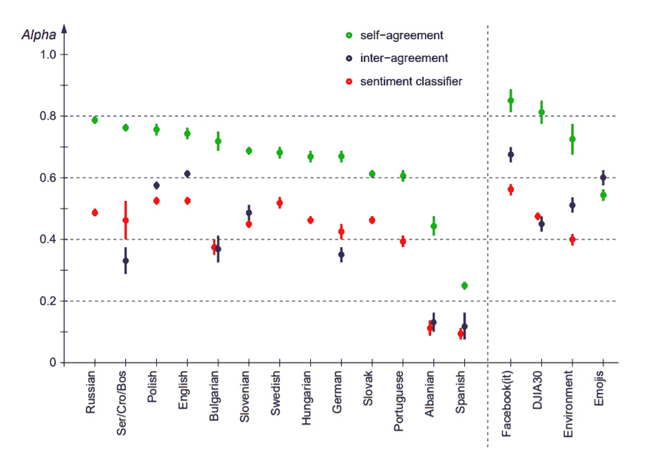
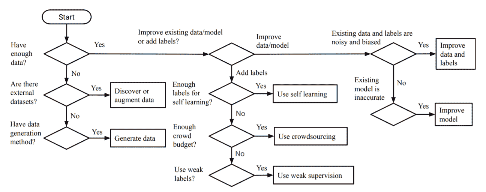
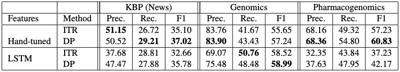
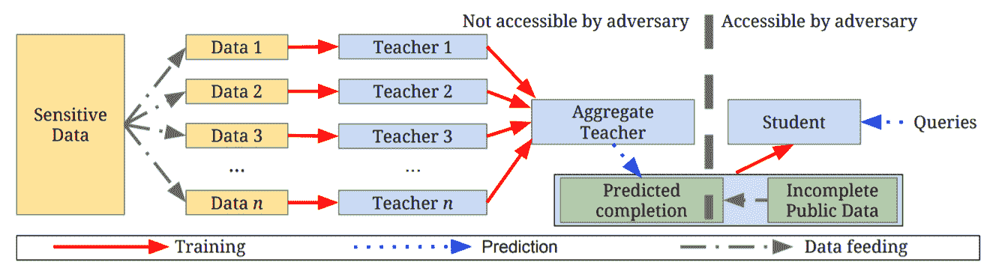
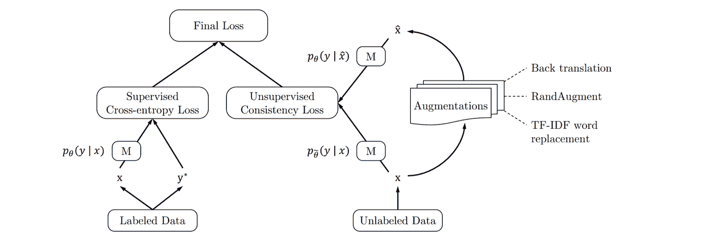

# 5 篇关于人工智能训练数据的重要论文

> 原文：<https://medium.datadriveninvestor.com/5-essential-papers-on-ai-training-data-aba8ea359f79?source=collection_archive---------9----------------------->

许多数据科学家声称他们大约 80%的时间花在数据预处理上，这是有充分理由的；收集、注释和格式化数据是机器学习中至关重要的任务。这篇文章将帮助你理解这些任务的重要性，并向其他研究人员学习方法和技巧。

下面，我们将重点介绍来自知名大学和研究团队的关于各种训练数据主题的学术论文。主题包括[高质量人工注释者](https://lionbridge.ai/articles/5-best-data-collection-companies-for-machine-learning-projects/)的重要性、如何在相对较短的时间内创建大型数据集、安全处理可能包含私人信息的训练数据的方法等等。

# 1.人类注释者有多重要？

本文提供了注释器质量如何极大地影响训练数据，进而影响模型准确性的第一手资料。在这个情感分类项目中，joef Stefan 研究所的研究人员分析了一个用多种语言进行情感注释的大型数据集。有趣的是，该项目的发现表明，顶级分类模型的性能之间没有统计上的重大差异。相反，人类注释者的质量是决定模型准确性的更大因素。

为了评估他们的标注器，团队使用了标注器间协议过程和自我协议过程。在他们的研究中，他们发现虽然自我认同是淘汰表现不佳的注释者的好方法，但是注释者间的认同可以用来衡量任务的客观难度。

**研究论文** : [多语言 Twitter 情感分类:人类注释者的角色](https://arxiv.org/pdf/1602.07563v2.pdf)

**作者/供稿者:** Igor Mozetic、Miha Grcar、Jasmina Smailovic(所有作者均来自 Jozef Stefan 研究所)

**发布/最后更新日期:**2016 年 5 月 5 日

# 2.机器学习的数据收集综述

这篇文章来自韩国科学技术高级研究所的一个研究团队，非常适合希望更好地理解数据收集、管理和注释前景的初学者。此外，本文还介绍和解释了数据获取、数据扩充和数据生成的过程。

对于那些刚接触机器学习的人来说，这篇文章是一个很好的资源，可以帮助你了解许多常用技术，以创建当今在该领域使用的高质量数据集。

**研究论文** : [机器学习的数据收集调查](https://arxiv.org/pdf/1811.03402.pdf)

**作者/供稿者** : Yuji Roh，Geon Heo，Steven Euijong Whang(作者均来自 KAIST)

**发布/最后更新日期:**2019 年 8 月 12 日

# 3.使用弱监管来标记大量数据

对于许多机器学习项目来说，寻找和注释大型数据集需要花费大量的时间。在这篇论文中，斯坦福大学的研究人员提出了一个通过称为“数据编程”的过程自动创建数据集的系统。

上表直接取自论文，显示了使用数据编程(DP)与远程监督 ITR 方法相比的精确度、召回率和 F1 分数。

所提出的系统采用弱监督策略来标记数据的子集。产生的标签和数据可能会有一定程度的噪声。然而，该团队随后通过将训练过程表示为生成模型来消除数据中的噪声，并提出了修改损失函数的方法，以确保它是“噪声感知的”。

**研究论文** : [数据编程:快速创建大型训练集](https://arxiv.org/pdf/1605.07723v3.pdf)

**作者/供稿人:** Alexander Ratner、Christopher De Sa、Sen Wu、Daniel Selsam、Christopher Ré(所有作者均来自斯坦福大学)

**发布/最后更新日期:**2017 年 1 月 8 日

# 4.如何使用半监督知识转移来处理个人身份信息(PII)

来自谷歌和宾夕法尼亚州立大学的研究人员，本文介绍了一种处理敏感数据，如病历和私人用户信息的方法。这种方法被称为教师集合的私人聚合(PATE)，可以应用于任何模型，并能够在 MNIST 和 SVHN 数据集上实现最先进的隐私/效用权衡。

然而，正如数据科学家亚历杭德罗·阿里斯蒂萨巴尔在他的文章中所说，PATE 的一个主要问题是，该框架要求学生模型与教师模型共享数据。在这个过程中，隐私得不到保障。因此，阿里斯蒂萨巴尔提出了一个额外的步骤，对学生模型的数据集进行加密。你可以在他的文章[制作 PATE 双向私有](https://towardsdatascience.com/making-pate-bidirectionally-private-6d060f039227)中读到这个过程，但是请确保你首先阅读了原始的研究论文。

**研究论文** : [从私人训练数据进行深度学习的半监督知识转移](https://arxiv.org/pdf/1610.05755v4.pdf)

**作者/供稿人:**尼古拉斯·帕伯诺(宾夕法尼亚州立大学)、马丁·阿巴迪(谷歌大脑)、乌尔法·厄林松(谷歌)、伊恩·古德菲勒(谷歌大脑)、库纳尔·塔尔瓦(谷歌大脑)

**发布/最后更新日期:**2017 年 3 月 3 日

# 5.用于半监督学习和迁移学习的高级数据扩充

如今，数据科学家面临的最大问题之一是获取训练数据。可以说，深度学习的最大问题之一是，大多数模型需要大量的标记数据，才能以高度的准确性运行。为了帮助解决这些问题，来自谷歌和卡内基梅隆大学的研究人员提出了一个框架，用于在低得多的数据量上训练模型。

该团队建议使用先进的数据增强方法，有效地向半监督学习模型中使用的未标记数据样本添加噪声。令人惊讶的是，这个框架能够取得令人难以置信的结果。该团队表示，在 IMDB 文本分类数据集上，他们的方法仅通过对 20 个标记样本进行训练，就能够胜过最先进的模型。此外，在 CIFAR-10 基准测试中，他们的方法优于所有以前的方法。

**研究论文** : [用于一致性训练的无监督数据增强](https://arxiv.org/pdf/1904.12848v4.pdf)

**作者/撰稿人**:谢启哲 1，2，戴子航 1，2，爱德华·霍维 2，Minh-Thang Luong1，Quoc 诉 Le1(1 谷歌研究，大脑团队，2 卡内基梅隆大学)

**发布/最后更新日期:**2019 年 9 月 30 日

希望这些专注于[训练数据和数据处理](https://lionbridge.ai/training-data-guide/)任务的机器学习论文能帮助你学到一些新的东西，可以应用到你自己的项目中。更多机器学习文章请查看我们下面的头条新闻，请务必[关注我的媒体](https://medium.com/@LimarcA)。

[原创文章](https://www.kdnuggets.com/2020/06/5-essential-papers-ai-training-data.html)经许可转贴。