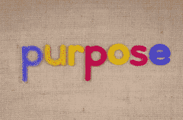
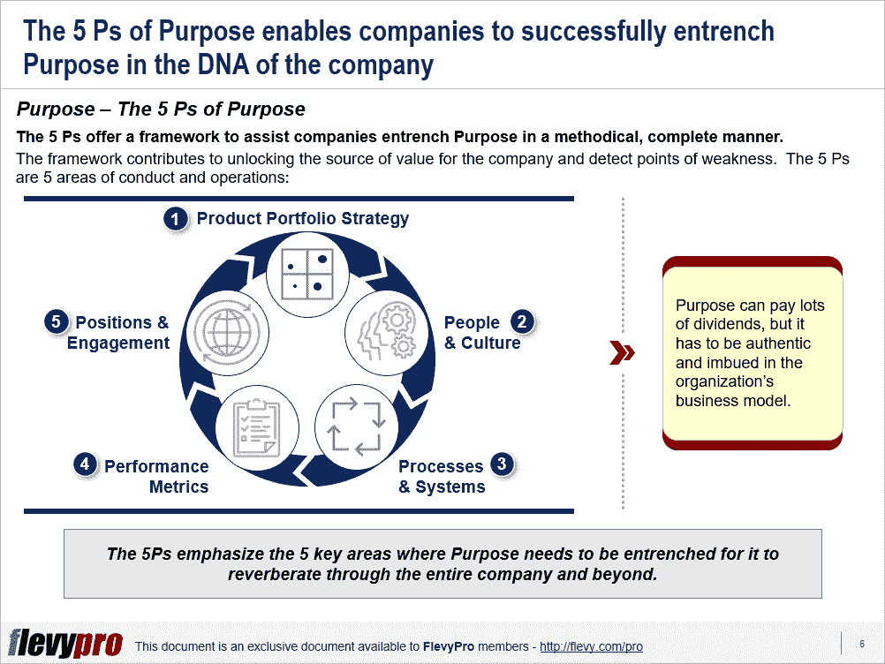

# 5 个重点目标领域

> 原文：<https://medium.datadriveninvestor.com/5-focus-areas-of-purpose-b18e4724983b?source=collection_archive---------3----------------------->

我们大多数人都经历过某些组织的独特性。这些组织脱颖而出，散发着激情和热情。他们的客户对公司以客户为中心的设计感到满意，[的员工参与度很高，投资者和股东为成为其中的一员而感到自豪。不是他们卓越的产品或服务是](https://flevy.com/business-toolkit/employee-engagement)[价值创造的基础](https://flevy.com/browse/stream/value-creation)，而是[目的](https://flevy.com/business-toolkit/purpose)让组织变得独特——他们存在的理由以及由此对世界产生的影响。

利益相关者认同那些真正遵循他们目标的组织。领导层根据目标分配资源。在为公司做决策时，员工将目标放在首位。另一方面，非真实目的可能会因为拒绝利益相关者而损害公司的声誉。

为了做到真诚，目标必须植入公司的 DNA，这可不是一件容易的事。“5 Ps 目标框架”展示了如何成功实现这一目标。5 Ps 框架确定了 5 个重点领域:

1.  **产品组合策略**
2.  **人&文化**
3.  **流程&系统**
4.  **绩效指标**
5.  **位置&啮合**

转变成一个目标驱动的组织有很多好处。5 Ps 框架有助于释放公司的价值来源并发现弱点。目标可以带来丰厚的回报，但它必须是真实的，并渗透到组织的商业模式中。

让我们更深入地研究一下 5p 目标中的第一个 P。

# 产品组合策略

一个组织提供的产品/服务以及最适合目标市场的市场和定位规划的相关模式应该吸收公司的宗旨，以吸引利益相关者。

实现这一目标的第一步必须是使业务组合与公司的目标相一致，即我们需要将目标与我们的[组合战略](https://flevy.com/business-toolkit/portfolio-strategy)相结合。已经存在的公司可能无法重新开始，但它们肯定能够以充满活力和坚定的方式重塑其业务组合。

在第二步中，商业投资组合被填充了符合目的的产品或服务，不符合目的的被剔除。将目的嵌入产品或服务时，需要采取某些关键行动，包括:

*   重新思考产品组合——例如，退出某些产品，推出新产品。
*   根据目的修改定价。
*   根据通用标准重新评估投资组合并测试单个资产的基本原理。

一个典型的例子是 85 年前成立的一家采掘业能源公司，它成功地证明了目标是可以重新设定的。长期从事采掘业务并没有限制该公司重新探索一家能源公司在未来转型环境中的样子。

该公司已经显著改变了它的目标——“为人类和地球重新想象能源。”根据其目标，该公司已从石化业务中剥离，并计划到 2030 年将其遗留的石油和天然气业务减少 40%。相反，该公司将扩大其低碳能源业务，如生物能源、氢气、电动汽车充电业务，目标是到 2050 年成为净零碳排放者。

有兴趣了解更多关于目的框架的 [5 Ps？你可以点击](https://flevy.com/browse/flevypro/5-ps-of-purpose-5454)在 [Flevy 文档市场](https://flevy.com/browse)下载[一个 5 Ps 的可编辑幻灯片。](https://flevy.com/browse/flevypro/5-ps-of-purpose-5454)

# 你在这个框架中找到价值了吗？

您可以从 [FlevyPro 库](https://flevy.com/pro/library)下载关于这个和数百个类似业务框架的深入介绍。 [FlevyPro](https://flevy.com/pro) 受到 1000 名管理顾问和企业高管的信任和使用。有些人不得不说:

> “我的 FlevyPro 订阅为我提供了当今市场上最受欢迎的框架和平台。它们不仅增加了我现有的咨询和辅导产品和服务，还让我跟上了最新的趋势，为我的实践激发了新产品和服务，并以其他解决方案的一小部分时间和金钱教育了我。我强烈推荐 FlevyPro 给任何认真对待成功的顾问。”

*——比尔·布兰森，战略商业建筑师事务所创始人*

> *“作为一家利基战略咨询公司，Flevy 和 FlevyPro 框架和文件是一个持续的参考，帮助我们为客户构建我们的调查结果和建议，并提高他们的清晰度、强度和视觉效果。对我们来说，这是增加我们影响力和价值的宝贵资源。”*

*–Cynertia Consulting 的咨询区域经理 David Coloma*

> *“作为一名独立的成长顾问，FlevyPro 为我提供了一个绝佳的资源，让我能够访问庞大的演示知识库，为我与客户的合作提供支持。就投资回报而言，我从下载的第一个演示文稿中获得的价值是我订阅费用的好几倍！这些资料的质量让我能够打出超出自己体重的水平，这就像是用很小一部分开销就能获得四大咨询公司的资源一样。”*

*–罗德里克·卡梅伦，SGFE 有限公司创始合伙人*

在 [**管理和企业咨询**](https://app.ddichat.com/category/management-and-corporate-consulting) **:** 中安排一个 DDIChat 会话

 [## 专家-管理和企业咨询- DDIChat

### DDIChat 允许个人和企业直接与主题专家交流。它使咨询变得快速…

app.ddichat.com](https://app.ddichat.com/category/management-and-corporate-consulting) 

在这里申请成为 DDIChat 专家[。
与 DDI 合作:【https://datadriveninvestor.com/collaborate】](https://app.ddichat.com/expertsignup)
点击这里订阅 DDIntel [。](https://ddintel.datadriveninvestor.com/)