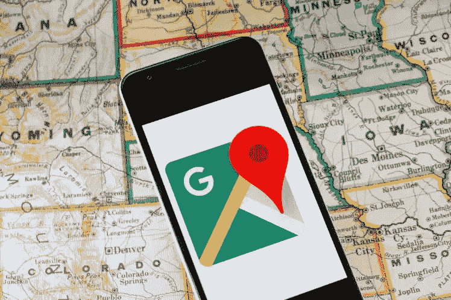
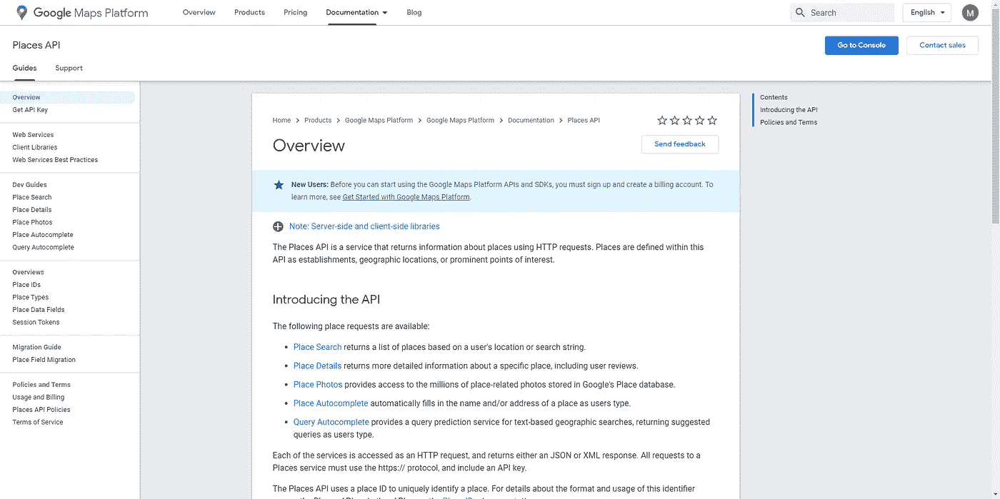
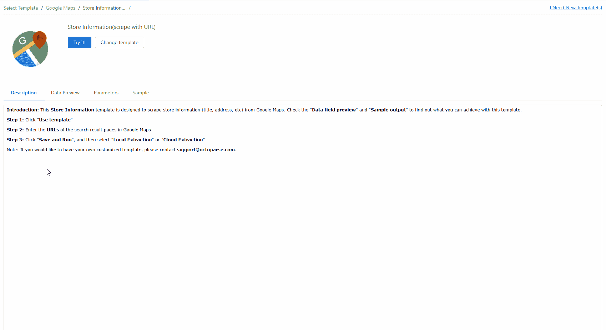
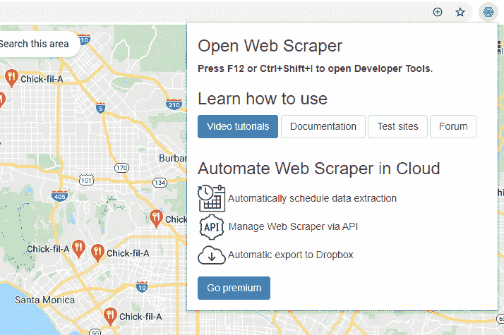

# 5 个免费的谷歌地图数据提取器

> 原文：<https://medium.datadriveninvestor.com/5-free-google-maps-data-extractors-2f3a279ed18b?source=collection_archive---------0----------------------->

从谷歌地图中提取数据的需求巨大，包括地名、评级、地址、电话号码等。一个非常常见的场景是当一个商人想在一个特定的地区开一家新餐馆。他可以从谷歌地图中提取餐馆信息，然后分析结果来制定业务战略。在这里，我想介绍 5 个免费的谷歌地图数据提取器。

5 Free Google Maps Data Extractors

# [谷歌地图 API](https://developers.google.com/places/web-service/intro)

一些网站为他们的用户提供 API 来访问他们的部分数据，如脸书、Instagram、Twitter、亚马逊等。谷歌地图就是其中之一，它为用户提供了 Place API。

要使用 Google Maps Place API，您需要首先设置一个帐户并创建您的 API 密钥。Place API 使用 HTTP 请求返回关于地点的信息。可用的请求包括地点搜索、地点详细信息、地点照片、地点自动完成和查询自动完成。

这种方法采用现收现付的定价模式。虽然它不是免费的，而且有很多数据限制，但这是从谷歌地图获取最新地点数据的最安全的方式。

Google Maps API

# [谷歌地图网页抓取模板](https://www.octoparse.com/blog/big-announcement-web-scraping-template-take-away)

你可能在想:什么是“网页抓取模板”？实际上，这是业界领先的免费数据提取器 [Octoparse](http://www.octoparse.com/) 的一个高级功能。他们建立了几十个模板，覆盖所有流行的网站，这些模板是现成的预格式化爬虫。这是迄今为止数据提取行业中最简单的解决方案。

[Google Maps web scraping template](https://youtu.be/6TWJ2LKGWQk)

使用这个谷歌地图模板，您可以提取地名(不一定是餐馆)、评级、地址、网站、电话号码和营业时间。只需输入你想要搜索的关键词，机器人就会在几分钟内为你获取数据。最棒的是，这个模板对所有人都是完全免费的。

事实上，Octoparse 上还有更多的抓取模板。点击这里查看更多用例:[用于产品研究的 Amazon scraper】，](/how-to-scrape-and-find-the-best-selling-product-on-amazon-39271aa0a43b)[用于情感分析的 Twitter scraper](https://medium.com/dataseries/how-to-extract-data-from-twitter-without-coding-92381e3298b8)。

如果你认为模板不符合你的需求，你可以构建自己的爬虫来提取其他信息。例如，如果你想从谷歌地图中提取地点坐标，你可以查看这个视频。

How to Extract Google Maps Coordinates

Octoparse 中的所有爬虫都可以全天候运行在[云服务器](https://helpcenter.octoparse.com/hc/en-us/articles/360018047092-What-is-Cloud-Extraction-)上，并通过[API](https://helpcenter.octoparse.com/hc/en-us/articles/360028160091-Connect-Octoparse-API-step-by-step)将数据导出为 Excel、JSON、CSV 等多种格式或导出到你自己的数据库中。

# [使用镀铬加长件——刮刀](https://chrome.google.com/webstore/detail/web-scraper/jnhgnonknehpejjnehehllkliplmbmhn)

Web Scraper 是想刮网站的人的热门选择。将它添加到您的 chrome 浏览器中，您就可以开始观看他们的[教程](https://www.webscraper.io/tutorials?utm_source=extension&utm_medium=popup)并学习如何使用它。

与 Octoparse 类似，Web Scraper 也支持云服务、API 集成、IP 轮换、提取项目调度。它在定制数据提取方面非常灵活。然而，你可能需要几个星期来学习如何使用刮刀。即使拿到数据，也只能保存一两个月。此外，对于预算有限的人来说，这是一个相当昂贵的选择。

Web Scraper

**用以上 3 种方法提取谷歌地图数据，用户不需要知道如何编码。如果你是一个非编码者，它们将会是你很好的解决方案。然而，如果你有一些编码经验，并且对你的编程能力有信心，这里有更多的选择供你考虑。**

# [Github 开源项目](https://github.com/)

每个程序员都知道 Github，这是世界领先的软件开发平台。在这个平台上，有许多由全球开发者共享的开源项目，你可以很好地利用它们。由于之前的项目都是由其他开发者创建的，所以你不需要从头开始构建一个 scraper，这为你节省了大量的时间和精力。一个很好的例子就是这个用 Node.js 编写的 [Google Maps 项目。](https://github.com/thiago-js/scraping-google-maps)

这种解决方案的缺点是，即使已经编写了大部分代码，您仍然需要了解基础知识并编写一些代码来成功运行项目。有时，谷歌地图会改变其网站的结构，但代码缺乏维护，这也可能是你提取过程中的一个障碍。

更重要的是，提取的最终结果高度依赖于原始开源项目的质量。有时数据输出可能只是一个. txt 文件。在这种情况下，大规模提取数据是不可行的。

# 利用 Python 框架/库

一些 Python 框架/库，如 [Scrapy](https://scrapy.org/) 和 [Beautiful Soup](https://www.crummy.com/software/BeautifulSoup/bs4/doc/) 也可以帮助构建爬虫和提取谷歌地图数据。对于在数据提取方面有多年实践经验的程序员来说，这是一个很好的解决方案，因为他们可以用这些框架/库构建高度定制的爬虫。然而，对于处于编程生涯早期并且缺乏 web 爬行方面的深厚知识的程序员来说，这是不实际的。

*原载于 2020 年 5 月 12 日*[*http://www . data extraction . io*](http://www.dataextraction.io/?p=549)*。*