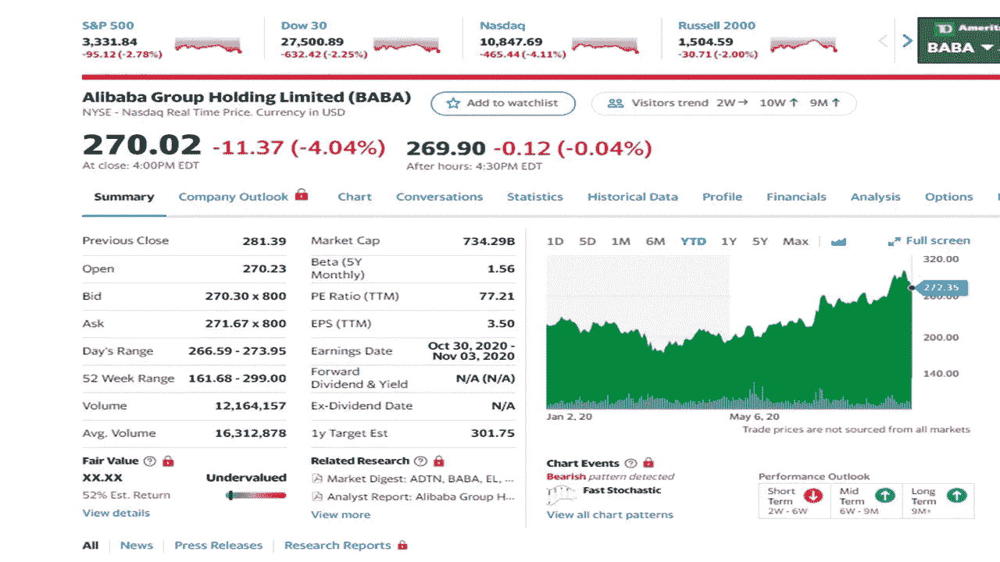
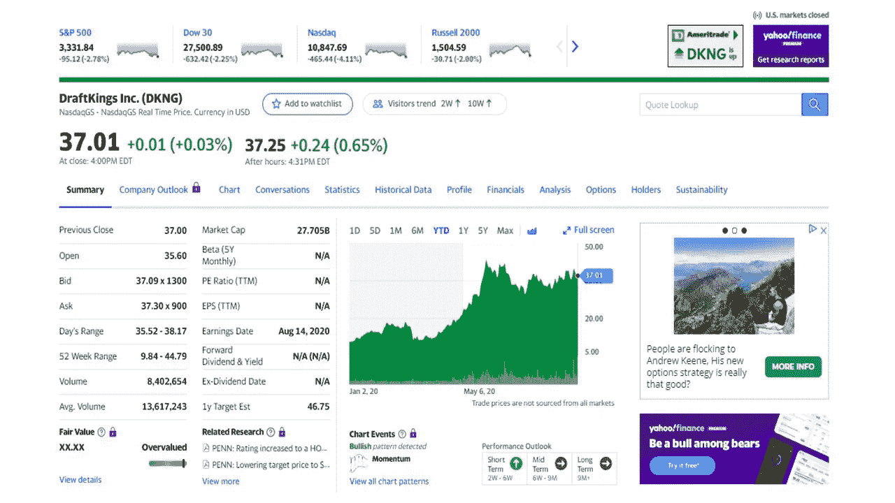
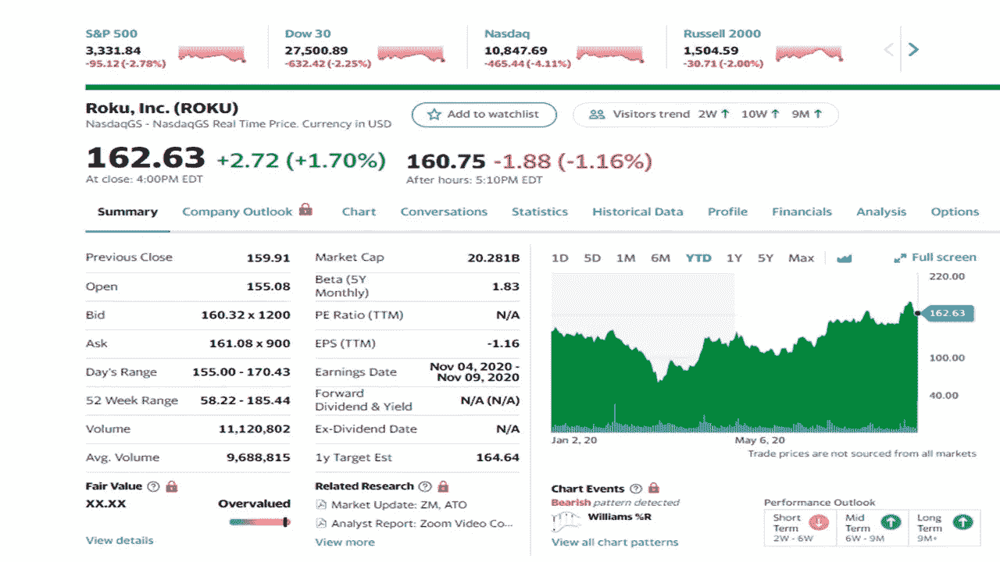
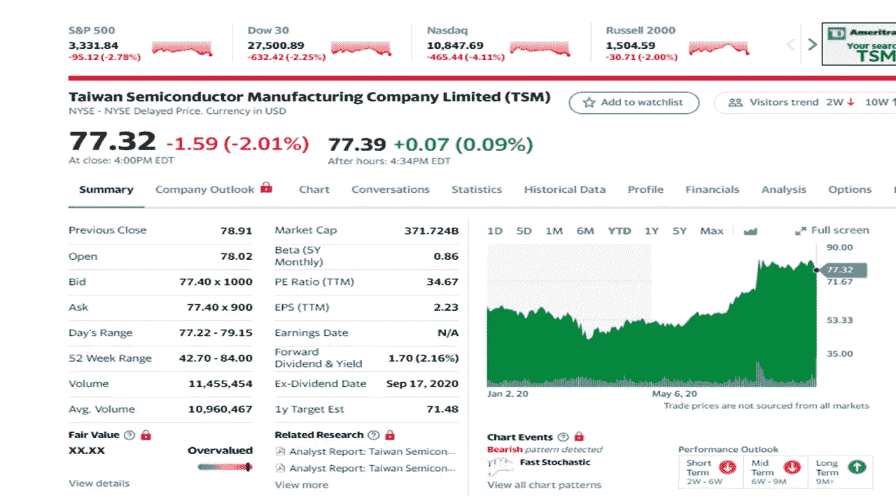

# 你需要知道的五个九月投资的好方法

> 原文：<https://medium.datadriveninvestor.com/5-great-ways-to-invest-in-september-you-need-to-know-4e56ac35131c?source=collection_archive---------23----------------------->

## 2020 年五只股票跑赢大盘

*Photo by* [*Anna Shvets*](https://www.pexels.com/@shvetsa?utm_content=attributionCopyText&utm_medium=referral&utm_source=pexels) *from* [*Pexels*](https://www.pexels.com/photo/woman-in-white-shirt-and-black-blazer-using-silver-macbook-3727458/?utm_content=attributionCopyText&utm_medium=referral&utm_source=pexels)

随着上个月特斯拉和苹果的股票分拆推动一些股票上涨而成为新闻，9 月份股市正在降温。长期来看，股票会表现良好，但预计近期会出现一些波动。

这个月，随着价格稍微下降，这些股票正在降温。

除了一只股票，这些股票都是你可能听说过的知名公司，你可能想投资其中一些。

**所列股票价格为 2020 年 9 月 8 日收盘时的价格。您看到的价格可能与我提供的不同。**

 [## 9 月份你需要知道的 5 大投资方式|数据驱动型投资者

### 阿斯特拉和苹果上个月制造了新闻，他们的股票分割推动一些股票上涨，股市正在降温…

www.datadriveninvestor.com](https://www.datadriveninvestor.com/2020/09/21/5-great-ways-to-invest-in-september-you-need-to-know/) 

# 阿里巴巴集团控股(baba)

Yahoo Finance

阿里巴巴在中国和其他国家提供在线和移动商务业务。阿里巴巴被称为中国的亚马逊。该公司分四个部门运营，[、云计算](https://www.datadriveninvestor.com/glossary/cloud-computing/)、核心商务、数字媒体和娱乐。该公司是一家大型电子商务公司，为零售商、医药和保健产品、餐厅和旅游平台以及在线批发市场全球速卖通提供移动商务平台。阿里巴巴有类似亚马逊的大云计算业务。多年来经济增长一直强劲，投资者认为有很大的上升空间。该公司上个季度的收入增长了 18%。云服务在过去五年平均增长三位数后，上个季度增长了 58%。该公司计划在未来四年内支持超过 10 亿人，并创造超过 1.4 万亿美元的收入。

# 选秀国王(DKNG)

Yahoo Finance

该公司是一家数字体育娱乐和游戏公司。该公司提供体育更新，体育博彩，以及 iGaming 的机会。各州急需资金，参与各种形式的赌博。选秀国王可能是一种选择，并有先发优势，以及众多的合作伙伴。最近，[迈克尔·乔丹](https://finance.yahoo.com/news/michael-jordan-takes-draftkings-equity-123327005.html)成为了董事会顾问，并获得了一笔数额不明的股权。选秀国王队最近接受了 PGA 巡回赛的第一家博彩运营商。该公司与伊利诺伊州的美国职业棒球大联盟和赌场女王 Sportsbook 有合作关系。随着体育重新开放，投注兴趣也将增加。分析师预计今年的收入为 5 亿美元，到 2021 年将增长 51%。收入预计将达到 40 亿美元，其中 25%为现金流。

# Pinterest 公司(PINS)

Yahoo Finance

该公司去年上市，视觉照片和视频平台今年有所增长。该网站允许人们找到食谱、儿童活动、家居和风格设计、旅游目的地等等。Pinterest 最近发布了一份非常乐观的财报。收入增长了 4%,因为利润仍然是负数。今年春天，用户活跃度大幅增长，月活用户达到创纪录的 4.16 亿，比 3.73 亿增长了 39%。据估计，该公司还有很大的增长空间，一些人预计 Pinterest 将达到 7 亿用户。广告对公司来说很好，因为他们为每个用户创造了 3 美元。SNAP 每用户 6 美元，脸书每用户 30 美元。

# 罗库公司

Yahoo Finance

ROKU 及其相关系统作为一个电视平台运行。公司由两部分组成，因为它有一个平台和玩家。该平台允许用户观看电影和电视节目，以及直播体育和音乐。该公司在北美、南美以及英国、法国和爱尔兰等西欧国家提供服务。随着 56%的美国人在家观看电影和节目，视频流今年随着病毒爆发。2019 年，全球流媒体市场规模达到 426 亿美元，预计 2027 年将增长 20%。ROKU 允许用户访问你通常会在网飞、迪士尼+、Hulu、亚马逊 Prime、HBO Go、Vudu、Apple TV、Sling 和 Pandora 上找到的免费流媒体频道。这种新的看电视方式让 ROKU 受益匪浅。ROKU 的账户服务同比增长了 70%，流媒体播放时间增长了 80%。由于健身中心暂时关闭，5 月份健康和健身节目增加了 130%。北美的广告销售额下降，英国也将很快下降。这并没有对 ROKU 造成太大影响，因为他们在 700 亿美元的广告市场中只占 1%。ROKU 在电视市场占有很大份额，增长潜力巨大。

# 台湾半导体制造股份有限公司

Yahoo Finance

这家公司制造和销售集成电路和半导体。他们还提供工程服务、账户管理和客户服务。台湾半导体为北美、欧洲、日本、中国和韩国的客户提供服务。芯片制造商对于传递信息和为设备供电至关重要。台积电是这一领域的领导者。他们为汽车、手机、电脑和家用电器提供硬件。该股今年保持强劲，Q2 销售额总计 100 亿美元，每股收益 78 美分，几乎比去年翻了一番。智能手机占了销售额的一半。云计算芯片也是销售额的一大驱动力，本季度增长了 38%。这占了销售额的三分之一。该公司预计，这一细分市场将在未来几年成为一个重要因素。管理层在第三季度实现了 21%的收入增长，符合分析师的预期。

 [## 8 月份投资的最佳股票

### 2020 年五只股票跑赢大盘

medium.com](https://medium.com/datadriveninvestor/the-best-stocks-to-invest-in-august-75f08ae4c901)  [## 了解两个孩子的投资如何超过数百万美国人

### 遵循这些步骤，你也能做到。

medium.com](https://medium.com/datadriveninvestor/learn-how-2-kids-have-more-invested-than-millions-of-americans-a49d31ff0733) 

**注**:作者之前持有 pin，但在 8 月份以 60%的收益卖掉了股票。自 2017 年 9 月 28 日 ROKU 上市以来，作者十几岁的儿子一直拥有该公司。

**参考文献**:

[雅虎财经](https://finance.yahoo.com/)

[卡伯特财富网](https://cabotwealth.com/)

[**汤姆·汉迪**](https://medium.com/@tomhandy1) 是一位顶尖的金融、投资和[比特币](https://www.datadriveninvestor.com/glossary/bitcoin/)媒体上的作家，也是两个孩子的父亲。他从军队退役，并在几个非营利委员会任职。你可以在推特 [@tomhandy1](https://www.twitter.com/tomhandy1) 上找到他。

本文仅供参考。不应将其视为财务或法律建议。并非所有信息都是准确的。在做出任何重大财务决定之前，请咨询财务专家。

*原载于 2020 年 9 月 21 日 https://www.datadriveninvestor.com**T21*[。](https://www.datadriveninvestor.com/2020/09/21/5-great-ways-to-invest-in-september-you-need-to-know/)

**访问专家视图—** [**订阅 DDI 英特尔**](https://datadriveninvestor.com/ddi-intel)