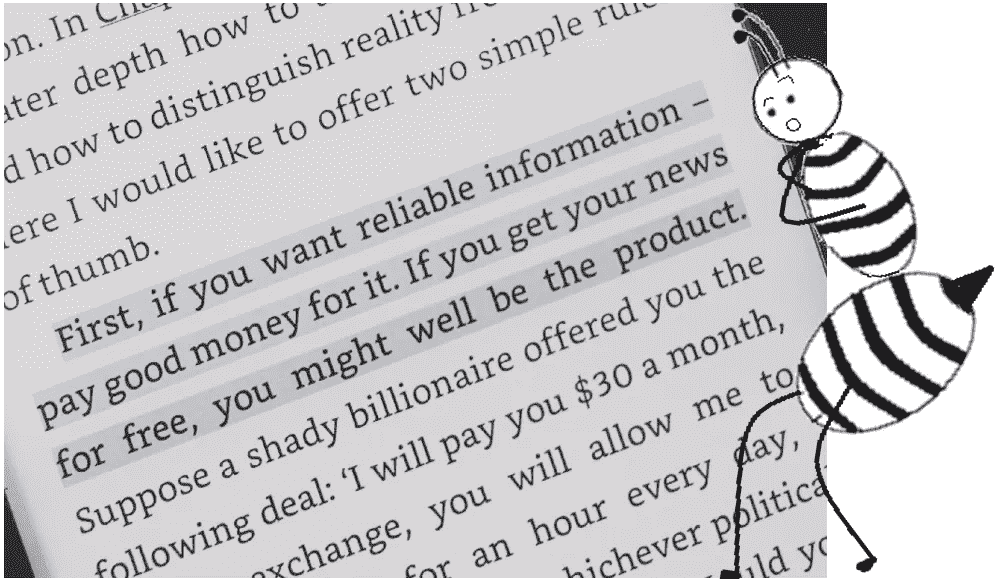

# 5 哈拉里写激动人心的非小说的诀窍

> 原文：<https://medium.datadriveninvestor.com/5-hararis-tricks-for-writing-exciting-non-fiction-a6556476b629?source=collection_archive---------4----------------------->

## 如果你没有读过《智人》，那你就没有读过非小说

Photo by [Mauro Lima](https://unsplash.com/@limamauro23?utm_source=medium&utm_medium=referral) on [Unsplash](https://unsplash.com/?utm_source=medium&utm_medium=referral), Bee by author

如果尤瓦尔·诺亚·哈拉里(Yuval Noah Harari)用纸巾擦脸，然后决定出版它，我会买下它。我敢打赌，其他 1200 万读过他的《智人》的人也会这么做。哈拉里重新定义了非虚构写作的含义和感觉。

当然，还有其他非小说类畅销书作家，如贾雷德·戴蒙德、马尔科姆·格拉德威尔、比尔·布莱森和乔恩·容森也是我的最爱。但我几乎不记得像哈拉里那样贪婪地阅读过那些书，也几乎不记得我已经永远彻底地改变了一种观点。公平地说，智人也卖出了 3 倍多的百万册。

这里是哈拉里作品中一些引人注目的方面，对每个做研究的人都是一个教训。

# 1.文献学

哈拉里的文献最引人注目的方面是他详细而完整的参考书目。他所有的书都有将近 20%的总篇幅用于参考。我很少遇到像哈拉里那样公正对待资料来源的作家。如果你在写非小说类的东西，并且想把自己树立为一个可靠的信息来源，引用，引证，尊重其他作者的作品，并且永远不要剽窃。永远把伦理放在第一位。

# 2.将你的底线限制在一到三个陈述

在你开始写作之前，决定你的书要传达什么信息。想要传达什么？一个新颖的论点(比如哈拉里)？某个理论的证明？从不同的角度举例说明一个特定的论点？如果你在写传记，为什么你想让你的读者读这本书，这本书对他有什么好处？

无论你从上面的列表中提出什么问题，确保你的回答不超过三个陈述。这使你的写作精确，并自动删除所有无聊的部分。围绕这三个观点来组织你的书。前 30%建立想法 1，然后是想法 2，依此类推..最后把他们都绑起来。

哈拉里在他的书的结尾简明扼要地总结了他希望读者从书中得到的东西。这感觉就像是快速翻阅整本书，让我想起他为每一个要点提供的论据。

# 3.事实不是你的故事，推论才是

这就是老生常谈的“跳出框框思考”的由来。佩尔说，比尔·布莱森的作品与哈拉里或格拉德威尔的作品不同之处在于，它们不仅仅是事实的集合。如果你通过人工智能运行这些书，可能至少有 70%的句子会以观点和推论的形式出现。

如果一个人想要事实，他们只会读百科全书。但是你作为一个非小说作家，通过告诉无知的大众你的专家推论，给事实增加了价值。尽管你做了大量的研究，还是要为推理留下足够的空间。对于每一页事实，加上两三个推论。

# 4.不要离题太久

过度编辑是很自然的趋势。你最终会删掉那些感觉重复的东西。如果说我从哈拉里的文章和演讲会中学到了什么，那就是，当重复做得有品味且符合上下文时，陌生人会在一定程度上欣赏重复。

他们没有你了解你的话题。他们没有绞尽脑汁研究每一个细节。所以如果你在这里和那里重复你的底线，它不会伤害你。事实上，这可能会让你的文章看起来更加激烈和引人注目。

# 5.客观一点

区分事实和观点。从传统和信仰中认识科学和研究。想想不同的读者群会有不同的观点。尽可能保持事实和中立。毕竟，科学和研究是不断变化的。你的论点迟早会被推翻。保持谦逊和客观。

希望你喜欢这本书。如果你还没有读完哈拉里所有的书，我强烈建议你认真学习一些。

如果你想和我联系，这是我的[中型](https://sruthi-korlakunta.medium.com/)个人资料，这是我的 [Linkedin](https://www.linkedin.com/in/sruthi-korlakunta-7a5b80121) 。快乐写作！