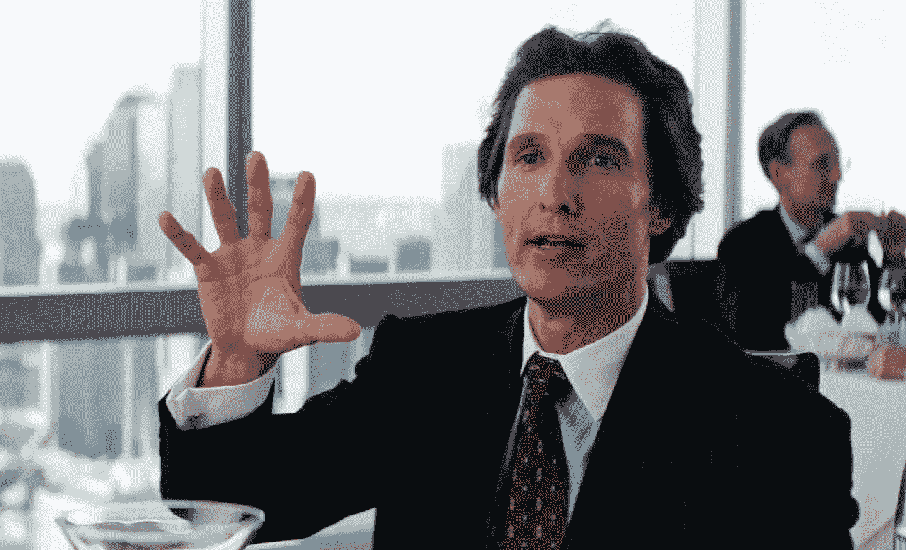

# 5 位对冲基金经理和他们是如何(真的)赚到数十亿美元的

> 原文：<https://medium.datadriveninvestor.com/5-hedge-fund-managers-and-how-they-really-made-their-billions-b3f35d7a2837?source=collection_archive---------3----------------------->

## 不要相信炒作

PARAMOUNT

如果你有一些钱可以投资，并希望长期增长，股市通常被视为一个好去处。即使在 5 年前，投资的障碍数不胜数，普通人也不容易进入这个市场。如今，像罗宾汉、eToro 或 Acorns 这样的应用程序可以极其轻松地用少量资金、很少甚至没有费用，最重要的是，对股市零知识。

这些应用程序可能对用户友好，但市场肯定不是这样。事实是，市场对任何人都不友好。它非常复杂，处于不断的运动中，即使是所谓的“专家”也常常不知道自己在做什么。他们中的许多人在一些交易中运气不错，现在有足够的安全来犯大错误。或者他们破产了，但银行允许他们继续借钱进行再投资，希望会有回报。

在这篇文章中，我们将看看 5 位顶级对冲基金经理是如何赚钱的，并向你展示这不仅仅是知道如何读懂市场。主要是关于一件事:运气。

# 比尔·阿克曼

阿克曼拥有哈佛学院的文学学士学位和哈佛商学院的工商管理硕士学位。他绝不是不努力工作和/或不聪明的人。但从 1992 年到 1995 年，他的投资公司 Gotham Partners 的资产从 0 美元增长到 5 亿美元，主要是通过让其他富人投资他的想法，而不是用他自己的钱。

阿克曼利用 2007 年至 2008 年的金融危机，通过购买信用违约互换并在稍后回售获得了巨额利润。这是他在市场上的第一个大噱头之一。

2004 年，他创建了现在著名的基金 Pershing Square Capital Management，其中 5400 万美元来自他的个人资金和一个商业伙伴。从那以后，他最著名的举动是在康宝莱上损失了 10 亿美元，这家公司被许多人怀疑是一个[庞氏骗局](https://www.investopedia.com/terms/p/ponzischeme.asp)。他的基金从 2014 年到 2018 年一直处于亏损状态，此后他再也没有上过头条。

# **沃伦巴菲特**

长期以来，巴菲特擅长在最佳时机买入。不过最近他的运气越来越差了。但一开始，他的选股也很不错。1951 年，他开始购买保险公司 GEICO 的股票。它做得非常好，他最终买下了整个公司加班。

1960 年，巴菲特找到了 10 名医生，他们愿意每人投资 1 万美元，投资一家风车制造公司。这最终成为了一项伟大的投资，但就像投资者经常做的那样，最初的投资并不是来自他。

1963 年，当美国运通的股票因欺诈丑闻而突然贬值时，巴菲特买了大量股票，因为他知道丑闻是暂时的。当股票价格回升时，他最终获得了巨额利润。

1974 年，股票价格整体大幅下跌。巴菲特的财富缩水了 50%以上，但他继续买入股票，因为他知道一旦经济开始复苏，这些股票会更值钱。

1988 年，他开始购买可口可乐的股票。自那以来，这只股票上涨了 1837%，是巴菲特财富的主要贡献者之一。他从来没有卖过。

# **乔治索罗斯**

索罗斯投资了从他当时工作的公司借来的 10 万美元。再说一遍，不是他自己的钱。他想尝试交易策略，并且非常成功。

1969 年，他创建了一个基金，用他以前的利润投资了 25 万美元，用别人的钱投资了 400 万美元。如果你数学很好，你可以看出他只投入了原始投资的 5%。还是那句话，投资者喜欢先玩别人的钱，再玩自己的。

1970 年，在一系列成功的投资之后，索罗斯创立了索罗斯基金管理公司，并成为其董事长。到 1981 年，该基金已经增长到 4 亿美元，然后亏损了 2 亿美元，然后继续增长。

2013 年，他的基金赚了 55 亿美元，这是自 1973 年以来的 400 亿美元总利润。它被认为是历史上最成功的基金。但它也非常隐秘。

# **保罗·都铎·琼斯**

琼斯在 1980 年成立了他的基金，此前他曾在 EF Hutton & Co(数十年来美国第二大经纪公司)担任商品经纪人。他的第一个客户给了他 3 万美元让他管理。一点一点地，琼斯通过增加其他人的钱来扩大基金。

然后在 1987 年，琼斯在市场上有了他的一个著名的镜头。他预测了 1987 年的黑色星期一。他用自己和客户的钱打赌，很多公司会贬值，这让他获得了 125.9%的丰厚回报，估计赚了 1 亿美元。

琼斯说，他通过将 1987 年的市场与 1929 年崩盘前的市场进行对比，预测到了 1987 年的崩盘。这可能是真的，但你永远无法 100%确定市场的走向。这是不可预测的，这一次可能会发生完全不同的情况。你永远不知道。

# **孙正义**

孙正义本身不是对冲基金经理，但他是市场随机性的一个很好的例子。如今，孙正义的身价约为 300 亿美元。但在 2000 年网络泡沫破裂期间，他成为历史上损失最多的人:大约 700 亿美元。这个记录今天仍然保持着，但市场经历另一次大波动只是时间问题。

孙正义开始向大公司出售电子产品，并通过这些商业活动赚了几百万。他变得非常富有，并幸运地在 1999 年获得了向阿里巴巴投资 2000 万美元的机会，当时这基本上是闻所未闻的。今天，该公司价值 1080 亿美元。

这里还有一个关于孙正义的有趣事实。他的控股公司叫做软银，负债 13 亿美元。然而，孙正义个人在东京拥有价值 4500 万美元的住宅，在加州拥有价值 1.175 亿美元的房产，并为银座的一整栋大楼支付了 3.26 亿美元。当他的公司亏损 13 亿美元时，他怎么能挥霍得起这么多呢？

简单。以 9400 万股该公司股票作为贷款抵押。这基本上意味着带着一家价值 X 的公司的 9400 万股股票去银行，并为此获得 Y 的现金。他能做到这一点，是因为尽管他的公司负债累累，但其股票价值不菲。但是，如果有一天你的 9400 万股股票像 2000 年一样破产了，会发生什么呢？你有大麻烦了。

为什么股票会贬值？因为公司估值往往没有太大意义。事实上，投资者目前正在争论如何评估软银，因为他们不明白这家公司是做什么的。

我真的认为在股票市场投资并获利很容易的假设对很多人来说是危险的。股票市场不是闹着玩的，大多数人都会亏钱。赚钱最好、最安全的方法是通过努力工作和坚持不懈。而不是把钱投入投资组合，随着它的增长而放松。

正如马修·麦康纳在电影《华尔街之狼》中说得好:

> “**没人知道**一只**股票是会横向上涨**、**、**、**还是会转圈。**”

不是你，也不是专家。

**非常感谢阅读！我采访了 50 位生产力专家，为这个项目做了一份 150 多页的指南。这是经过实践检验的建议，来自真正做事的人。** [**在这里免费获得**](https://josephmavericks.com/50people) **。**