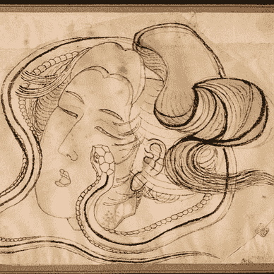

# 这 5 个恼人的特点可能不明显，但是去掉它们会让人们更喜欢你

> 原文：<https://medium.datadriveninvestor.com/5-hidden-traits-that-make-people-instantly-unlikeable-fdec82bb8424?source=collection_archive---------3----------------------->

## 嘿，凯伦，放轻松点，好吗？

Photo by [PENGWHAN](https://www.pexels.com/@pengwhan-869889?utm_content=attributionCopyText&utm_medium=referral&utm_source=pexels) from [Pexels](https://www.pexels.com/photo/boy-and-girl-sitting-on-bench-toy-1767434/?utm_content=attributionCopyText&utm_medium=referral&utm_source=pexels)

你有没有想过如何变得更讨人喜欢？有时候，从**什么不该做**的角度来看待这些问题会有所帮助。

我认为自己情商很高，但我默认了这些不讨人喜欢的特征。例如，就在昨天，我*谦虚地吹嘘*我的草稿文件夹。

> 作家朋友，不知所措:“我有大约 20 篇文章的草稿。”
> 我谦虚地吹嘘道:“我正试图把我的文件夹控制在 100 个以下。”

*值得奉承，对吗？我可以改变。我们可以改变。2017 年，*福布斯* 的[特拉维斯·布拉德伯里根据研究数据精心制作了一份让我们**不讨人喜欢**的九大特质清单。布拉德伯里说，“事实上，讨人喜欢是在你的控制之下，这是一个情商的问题。”](https://www.forbes.com/sites/travisbradberry/2017/01/24/nine-things-that-make-you-unlikeable/?sh=2a383ac78f74)*

调查结果？讨人喜欢并不取决于与生俱来的特征。相反，讨人喜欢是指“精通情商的社交方面。”

***什么是情商？***

> “情商可以最好地描述为监控自己和他人情绪、区分不同情绪并适当标记它们、利用情绪信息指导思维和行为的能力。”— [Kalpana Srivastava，工业精神病学杂志](https://www.ncbi.nlm.nih.gov/pmc/articles/PMC4085815/)

所以，增强你的情商——增强你的可爱度。

# 使我们不讨人喜欢的特征

为什么我们是否被喜欢很重要？是不是应该一笔带过，不闻不问？如果我们想在商界往上爬，想拥有好朋友，或者想擅长人际交往，那就不需要。例如，根据布拉德伯里的研究，只有“2000 个不讨人喜欢的领导者中有 1 个被认为是有效的。”我不喜欢那些赔率。我的人生目标之一是成为一名有效的领导者，所以发展我的可爱指数很重要。

我实话实说。当我开始这项研究时，我不认为任何不讨人喜欢的特质会适用于我。*男孩*，*是我错了*。

布拉德伯里列出了这些不讨人喜欢的特征:

*   谦虚-吹牛
*   太严肃了。
*   没有问足够多的问题。
*   情感劫持。
*   拿出你的手机。
*   留名。
*   八卦。
*   思想封闭。
*   分享太多，太早。

其中一些对我来说并不是什么新闻。

*   **不要说闲话。**常识。
*   **比你更关注我的手机？**是的，这是侮辱。
*   **没有情绪爆发？没有人喜欢被吼或者家具被扔过房间。**
*   **抛名**。听起来像吹牛。在我们认识一个人一段时间后，*是的*。当我们产生第一印象时，*不*。

以下是我注意到的五个隐藏特征，以及专业人士对增加你受欢迎程度的替代行为的见解。

# 1.降名/升一级

同样的，不要参与竞争。当保罗说他在佛罗里达度过了夏天，你说你在墨西哥度过了夏天。当保罗说他遇到了凯文·杜兰特，你说你遇到了勒布朗詹姆斯。当保罗说他坐了一夜的飞机时，你说你飞到了外太空。已经停止了！累死人了。

**重要:**沟通是**而不是**交战。沟通**就是**连接。如果最终，你想告诉你亲近的人你见过的某个名人，那就去吧。不过，不要告诉女服务员你在和她调情。

## 如何改变这一点？

变得脆弱。感兴趣。参与对话，给予和索取。如果必须的话，把它看作一个团队游戏，所有参与者都在同一个团队。这属于吹牛的范畴。可能需要一点时间才能意识到你在做什么。注意谈话中暗示你表现得很傲慢。当你这样做时，请朋友帮忙解释。如果谈话的重点是吹牛，那就可以参与进来。但是不要养成习惯。[梅勒妮·格林伯格](https://www.psychologytoday.com/us/experts/melanie-greenberg-phd)[*今日心理学*](https://www.psychologytoday.com/us/blog/the-mindful-self-express/201109/how-keep-your-cool-competitive-people) 指出，有些人天生更具竞争性。她强调试图将对话从竞争转向合作。格林伯格博士说，有竞争力的人有时会缺乏自尊，这是一种基于稀缺资源模型的背景，容易自恋和反社会，或者可能经常处于竞争环境中，如工作中。

> “试着弄清楚这个人为什么好胜，他们的需求和目标是什么。此外，看看是否有任何共同的目标，你可以用来让他们与你合作，而不是反对你。突出你们共同的价值观和目标”——Melanie Greenberg 博士。

# 2.把生活看得太重。激情和痴迷是有区别的

我现在很想成为一名突破性的作家。你猜怎么着？我的家人对此不太感兴趣。所以，我主要和我认识的与我有共同兴趣的同行作家或朋友和家人谈论这种热情。这是这里的关键。如果你们有共同的爱好，那就聊天吧。如果你不这样做，而且你一直在磨蹭，你的受欢迎程度就会下降。

## 如何改变这一点？

认真一点，热情一点也没问题。但是，如果你如此严肃，被生活中的某些领域所消耗，以至于你不能停下来大笑、喝咖啡或者不去想它就好好聊聊——那就有问题了。试着跳出你的框框，给一部悬疑电影一个机会，或者去潜水，或者去一家新餐馆吃饭，让你的注意力从运行谷歌分析转移开。让你的生活兴趣多样化，这样你就不会让人讨厌。

[盖伊·温奇*心理学博士今日*](https://www.psychologytoday.com/us/blog/the-squeaky-wheel/202009/10-ways-become-more-likable) 对*说找到共同点。人们会与和他们相似或有相似兴趣和观点的人联系在一起，所以当遇到你不太了解的人或第一次见面时，试着找到共同的兴趣、爱好、观点、电影、书籍、表演、音乐或时尚品味、度假目的地或任何可能在你们之间建立结缔组织的东西。”*

# *3.没有积极倾听*

*我们中的一些人在遇到陌生人时会感到紧张，并开始不停地说话，没有让其他人插话的空间，因为如果我们继续说话，那么这场对话可能会感觉进行得很顺利……这就像一个漫长、令人不快、令人紧张的连续句子。其他人试图在通话时同时处理多项任务，比如查看手机更新。*

## *如何改变这一点？*

*作为一个害羞的人，我在这方面有优势。问很多很多问题会让人变得更可爱。这表明你有兴趣了解对方。这表明你不太以自我为中心或自我关注。学会停顿。学会提问。学会倾听。*

*积极倾听是找到共同点，轮流交谈，真正倾听对方在说什么。对他们所说的提出问题有助于显示你的兴趣。你的肢体语言也说明了很多。如果你的笔记本电脑或手机没电了，那说明你没有认真听。*

*温奇博士建议，“提供有力的握手，眼神交流，微笑，以开放的姿势站立或坐着。如前所述，当别人说话时，点头表示你在听他们说话。”*

**

*Photo by [David Brooke Martin](https://unsplash.com/@dbmartin00?utm_source=medium&utm_medium=referral) on [Unsplash](https://unsplash.com?utm_source=medium&utm_medium=referral)*

# *4.僵硬的、不可弯曲的固定在石头上*

*我过去常常在当地的一家咖啡店闲聊一整天。经常在柜台前的是自由主义者、共和党人、民主党人、瑜伽爱好者、大学生、信托基金、中年保健工作者、艺术家、作家等等。我们聊了聊。我们听了。我们知道什么时候同意不同意见。尽管我们的观点经常大相径庭，但我们还是彼此喜欢。这是**真棒**。如果你不能暂停你的怀疑五到十分钟来考虑另一个角度，那会让你很快变得不讨人喜欢。*

## *如何改变这一点？*

*意识到拥有开放的思想并不意味着你在改变你的思想。你的头脑中有容纳对立观点的空间。这样做让生活变得有趣。拥抱对方。*

*根据*今日心理学* 的 LPC、NCC 安德里亚·马修斯(Andrea Matthews)的说法，思想狭隘往往根植于恐惧，*

> *“通常是恐惧让思维封闭。通常，恐惧是基于这样一种想法，即一个人必须是对的，才能变得好。犯错是不安全的。因此，一旦一个想法被抓住，一个人必须抓住它，因为害怕质疑它可能证明自己是错误的，因此是不安全的。”*

*正因为如此，也许值得和治疗师一起探讨为什么正确的**总是优先考虑你。当你克服恐惧的基础时，你可能会发现自己变得更加开放。***

# ***5.把初次见面当成吐词的机会***

***我对此感到内疚——我喜欢早早深入。我喜欢问深刻的个人问题，分享我最私密的想法。你五分钟前遇见某人了吗？现在不是分享你的出生故事、婚外情或最黑暗的家庭秘密的时候。试着等待自我坦白，直到你更了解他们。***

## ***如何改变这一点？***

***慢慢来，我的朋友。我知道你很好奇，你想联系。当你等待的时候它会变得更特别。等等——我们是在谈论性还是讨人喜欢？***

***人们并不总是喜欢马上就进入亲密的情感层面。读懂暗示，慢慢来，知道什么时候不要透露太多。[肖巴·斯里尼瓦森博士和琳达·e·温伯格博士](https://www.psychologytoday.com/us/experts/shoba-sreenivasan-phd-and-linda-e-weinberger-phd)[*今日心理学*](https://www.psychologytoday.com/us/blog/emotional-nourishment/202008/do-you-talk-too-much) 告诫我们，“一个人什么时候会从一个有趣的健谈者和有效的沟通者变成一个用过多的废话挟持他人的无聊饶舌者？”***

> **“[好的倾听者](http://good listeners are perceived positively by others, are better liked, are more likely to be promoted at work, and help others cope with problems (Bodie, 2012).)被他人正面看待，更受喜爱，更有可能在工作中得到提升，并帮助他人解决问题(Bodie，2012)。”**

**医生建议学习更多关于有效倾听的知识，记住缩写 w . a . I . t——我为什么要说话？并练习[共情倾听](https://www.psychologytoday.com/us/blog/encountering-america/201303/its-not-enough-listen)。他们最后的建议是:“考虑监控你的听说比率。如果你说的比听的多，那么你可能说得太多了。”**

**在过去的几年里，我直觉地努力成为一个更好的健谈者。我妈妈指出我会主导谈话。我有时会让她先说话。我倾听并参与其中。我提醒自己，我会有机会的。和我的朋友在一起时，我有意识地观察她的身体暗示，轮流和她交谈，倾听她说的话，并与她说的话产生共鸣。这创造了一种更有意义的关系，让我们更加关心彼此。对我丈夫，我有打断别人的习惯。我正试着不打断别人——这是一个很难打破的习惯。我做的时候他会指出来。我会停止说话，说“继续”，而不是快速结束谈话。随着我努力克服我的谈话焦虑，我相信我的受欢迎程度已经提高了。**

# ****外卖****

> **我训练自己去照亮我性格中讨人喜欢的东西，隐藏和保护那些不那么讨人喜欢的东西。——[**威尔·史密斯**](https://www.brainyquote.com/authors/will-smith-quotes)**

**温奇博士提出，“虽然在一般情况下，我们有可能增加自己的受欢迎程度，但重要的是要记住，我们不可能一直吸引所有人。”**

**我们都有能力在某种程度上提高自己的受欢迎程度。我们都有一些让我们不那么讨人喜欢的个性特征。我从布拉德伯里的《福布斯》名单中了解到，我最不喜欢的特质是谦逊——吹牛和过度分享。现在我可以在它们上面工作了。**

**当我们知道自己在做什么让别人讨厌时，我们可以专注于改变自己的行为。很快，我们就不会得罪那么多人了。我们的可爱指数会上升。**

**我们将有机会成为可爱的领导或老板，可爱的朋友，可爱的同事。我们有这个。**

**我有没有告诉过你，有一次我看到特德·丹森和乌比·戈德堡骑大象，或者有一次我的男朋友把我拉到一个脱衣舞俱乐部，哄我把一美元放进一个脱衣舞女的丁字裤里？哎呀。我还有很长的路要走。**

***你觉得人们的哪些特质不讨人喜欢？你觉得人们身上的哪些特质更有吸引力、更讨人喜欢？***

**

[艾米·布朗·格兰布林](https://aimeegramblin.medium.com/?source=post_page-----fdec82bb8424--------------------------------)** 

## **Aimée Gramblin 的创意和灵感文章**

**[View list](https://aimeegramblin.medium.com/list/ideas-inspiration-articles-by-aimee-gramblin-93de0a5b7bab?source=post_page-----fdec82bb8424--------------------------------)****47 stories**************** [## 通过我的推荐链接加入 Medium-aimée Gramblin

### 作为一个媒体会员，你的会员费的一部分会给你阅读的作家，你可以完全接触到每一个故事…

aimeegramblin.medium.com](https://aimeegramblin.medium.com/membership)**