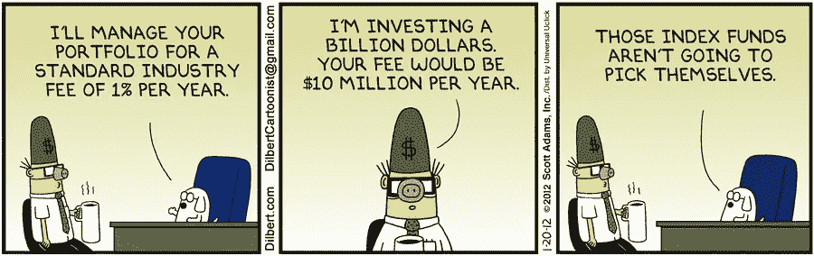
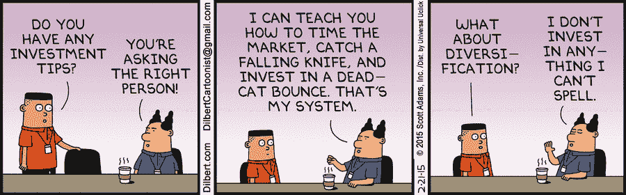
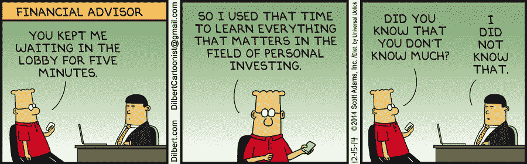
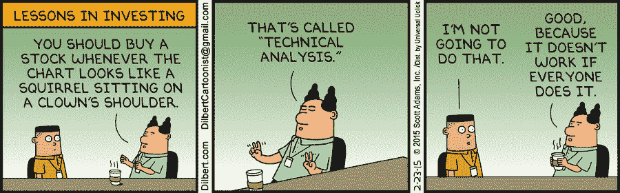

# 5 部关于投资的搞笑而真实的呆伯特漫画

> 原文：<https://medium.datadriveninvestor.com/5-hilarious-yet-true-dilbert-comics-on-investing-27500fb9f7bd?source=collection_archive---------6----------------------->

## 啊，疯狂的投资世界。

Photo by [Denis Agati](https://unsplash.com/@denisagati?utm_source=medium&utm_medium=referral) on [Unsplash](https://unsplash.com?utm_source=medium&utm_medium=referral)

呆伯特是个喜剧天才。他的漫画和滑稽角色受到世界各地许多人的喜爱。

不用说，一点幽默没有坏处，尤其是在当前这个时代。

因此，以下是我在投资和个人理财方面的首选。

# 论投资经理费用

Comic strip from [Dilbert](https://dilbert.com/strip/2012-01-20)

是的，那些活跃的基金经理从你用他们投资的所有费用中拿走一大笔钱。

看着你的回报被一年一年地消耗掉，却很少有额外的回报，而他们很可能用这些钱来支付他们下一次去巴哈马度假的费用。有什么条件？

# 论多元化

Comic strip from [Dilbert](https://dilbert.com/strip/2015-02-21)

没那么复杂…只是不要把所有宝贵的鸡蛋放在一个岌岌可危的篮子里，仅此而已。

# 论财务顾问

Comic strip from [Dilbert](https://dilbert.com/strip/2014-12-15)

他们不仅要你付很多钱，而且你自己也可以免费学到同样的东西！

# 论财务分析

Comic strip from [Dilbert](https://dilbert.com/strip/2015-02-23)

金融“大师”喜欢在股票市场上传授他们掘金的特殊技巧。

他们声称这就是他们所谓的财富的来源。现在，他们可以退出游戏，向想要成为投资者的人收取 5000 美元，并从他们的“5 天超级财富”课程中赚更多的钱。

投资和诚实被高估了，真的。

# 论金融术语

Comic strip from [Dilbert](https://dilbert.com/strip/2008-01-31)

专家和电视上的脱口秀主持人喜欢使用复杂的术语，让他们看起来好像知道他们在谈论什么。

不要被骗了。

十有八九，他们不会。不比你和我多。

如果他们这样做了，他们就不需要在摄像机前跳来跳去谋生了。

想知道简单的投资和构建未来财务的方法吗？正在寻找可以立即采取的行动来继续开始吗？

如果是这样，看看这些见解。他们帮助我在 5 年的时间里被动收入从 0 增加到超过 10 万[T3。](https://medium.com/the-post-grad-survival-guide/how-i-earned-100k-in-passive-income-in-my-20s-5ca86dacea68)

 [## 傻瓜被动投资分步指南

### 你认为管理一个投资组合是困难的、耗时的、专业人士的专利吗？再想想。

medium.com](https://medium.com/makingofamillionaire/the-step-by-step-guide-to-passive-investing-for-dummies-63a45bc940d3)  [## 开始构建你的财务未来的 5 条黄金法则

### 理解并应用这些，给你自己在市场上最大的成功机会

medium.com](https://medium.com/makingofamillionaire/5-golden-rules-to-start-building-your-financial-future-d89ae7460fca)  [## 根据指数基金先驱约翰·博格尔的说法，有 3 种简单得可笑的方法来积累你的财富

### 了解基本知识，避免在股市浪费时间和金钱。

medium.com](https://medium.com/makingofamillionaire/3-ridiculously-simple-ways-to-build-your-wealth-according-to-index-fund-pioneer-john-bogle-47f4b13be6b6) 

*祝你在建立真正的、持久的财富的旅途中好运！*