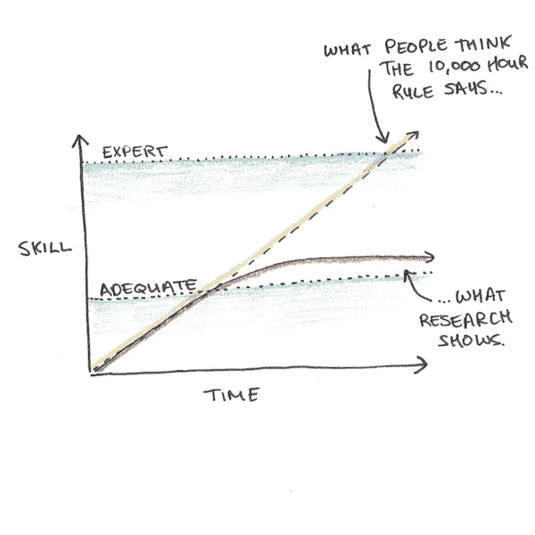
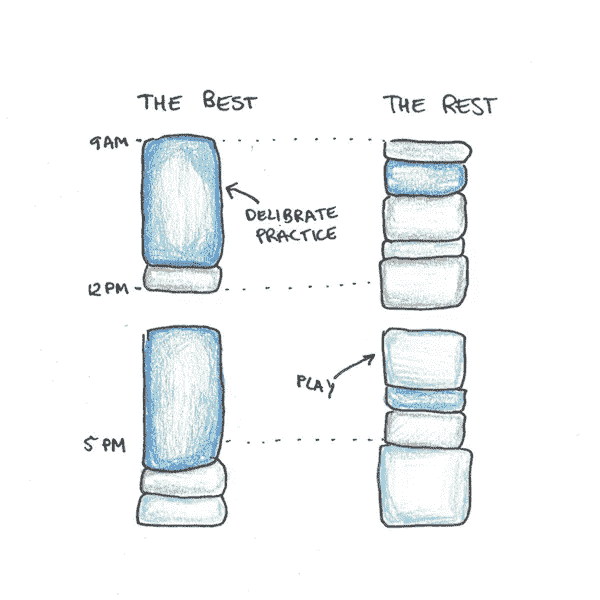
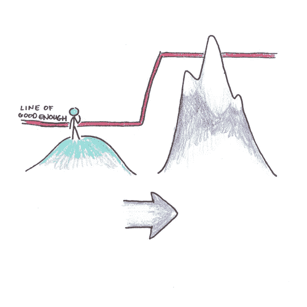
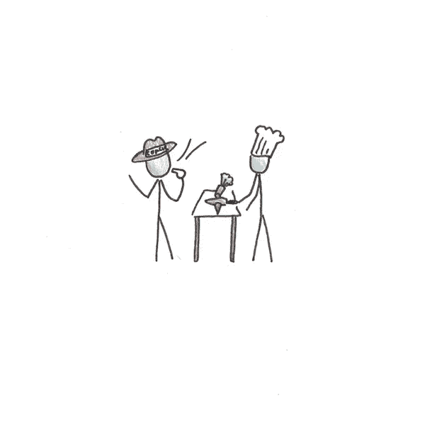
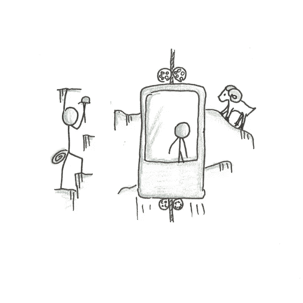
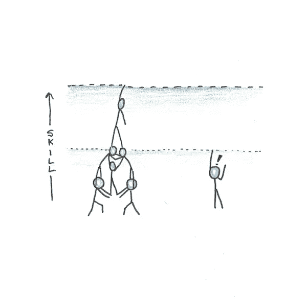
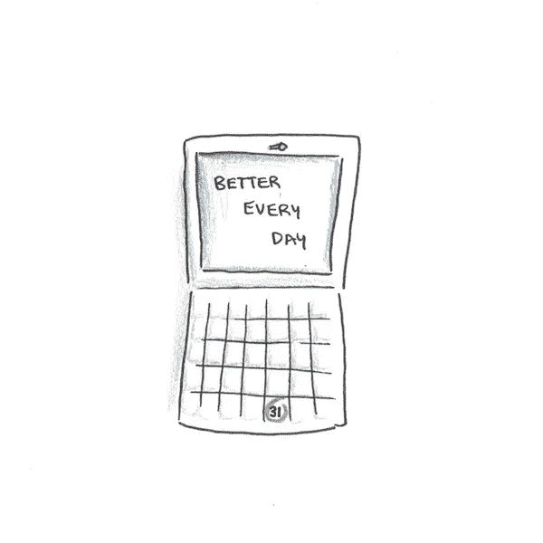

# 5 个让你一直做的事情变得更好的方法

> 原文：<https://medium.datadriveninvestor.com/5-ideas-to-get-better-at-the-things-you-do-every-day-dd47a4ebf4fe?source=collection_archive---------4----------------------->

学习不是研究。学习很重要，但对我们大多数人来说，它只是我们生活的一小部分。如果你不是学生，你可能根本不会学习。

然而，学习支撑着你的一生:

*   **关系**。了解你的伴侣，知道如何沟通。
*   **工作**。伟大的事业来自于擅长稀有而有价值的技能。
*   **健康**。不仅仅是吃什么或什么时候锻炼，而是学会长期坚持。
*   你对生活意义的感觉。我们并非生来就知道如何生活。这需要我们每个人去想清楚。

鉴于学习无处不在，理解它是如何工作的是有意义的。你如何不仅在学术话题上，而且在你每天做的事情上变得更好？

# 排版麻烦:为什么 10，000 小时经常不够

有人可能会反驳说，即使学习无处不在，我们不就是自动学习吗？变得更好的关键是投入工作，对吗？

认为一万小时是专业技能的“规则”的想法总是有些愚蠢。首先，该规则所基于的研究表明，这只是一个平均值，而不是一个固定的数额。第二，这条规则意味着关键是要有充足的时间。事实上，研究显示[与](https://www.researchgate.net/publication/224827585_The_Role_of_Deliberate_Practice_in_the_Acquisition_of_Expert_Performance)正好相反。

在一项技能上花更多的时间并不会导致精通。相反，我们达到了一个舒适的能力水平，却被卡住了。改进是例外，而不是常规。

对专业排字工人的早期研究是导致安德斯·埃里克森形成故意行为的最初证据之一。人们发现，即使有了十多年的经验，他们中的许多人在速度上还是停滞不前。

也许他们已经达到了极限？大多数任务都有速度限制，也许排字工人已经达到了他们的速度？

结果证明这是错误的。给予反馈、培训和财务激励，速度提高了[多达 93%](https://www.tandfonline.com/doi/abs/10.1080/08919402.1922.10532882) 。每天做一件事并不能保证精通，只能保证足够。

# 增长和停滞的区别是什么

爱立信的见解是，实践必须是有意的，以激发改进。

他对小提琴手的研究发现，那些后来成为音乐会表演者的人并没有练习更多，但花在这种刻意练习演奏上的时间比例要高得多。

深思熟虑的练习意味着克服自动性和新的创新，以推动业绩更高。

有意练习的研究起源于数字广度的研究。数字广度是指记住一串数字并重复它们的能力——众所周知，大多数人只能记住 5-9 个数字。

然而，一名参与者经过深思熟虑，成功地将他的数字跨度从[一直提高到 82](https://www.amazon.com/Peak-Secrets-New-Science-Expertise/dp/0544947223/) 。他通过创造将数字转化为跑步术语的记忆策略做到了这一点(参与者是一个认真的跑步者)。

# 怎么才能避免卡住？

你怎样才能真正每天都变得更好，而不是原地打转？

这里有五个简单的建议:

# 1.跳到更具挑战性的环境中。

停滞期的出现是因为当我们的表现足够好时，我们会让它自动发生。这使坏习惯钙化，为改进制造了障碍。

在一个你不再胜任的新环境中增加挑战，是回到快速学习曲线的一个好方法。

# 2.找个教练。

教练一直是刻意练习的核心特征。虽然每个人都有教练，但你仍然可以付费获得高质量的指导和反馈。

如果你预算紧张，非正式地寻求反馈通常也能奏效。关键是成为人们想帮助的那种人。主动谦逊，乐于接受建议。

# 3.突破来自新方法。

改进有两种形式:

1.  做着同样的事情，但是更好。
2.  做不同的事情，以获得新的结果。

重要的是不要忽视后者。没有新的方法，你很容易陷入改进一些过时的东西。

YouTube 是一个不可思议的工具。学习[如何恰当地切碎大蒜](https://www.youtube.com/watch?v=1y5h1pDHhzs)让烹饪对我来说更容易了。但是这种事情我从来没有单独通过实验发现过。

# 4.加入实践社区。

孤立的学习并不是最好的。我们旨在学习他人的经验。

[举个很好的例子，看看俄罗斯方块](https://www.scotthyoung.com/blog/2019/01/03/ultralearning-environments/)。游戏刚出来的时候，玩的是上亿。现在，尽管玩家少了很多，但人们在这方面做得更好了。怎么会？因为他们有一个社区，可以分享方法，互相学习。

# 5.在每次尝试中找到一件你可以做得更好的事情。

刻意练习的核心是将注意力集中在特定的改进领域。在日常生活中，有成千上万的细节决定了结果。不要试图改善一切。瞄准一个你每次都可以提高的特定目标。

*   **烹饪食谱？**如果你能更好地切洋葱会怎么样？
*   **写邮件？**选择一个句子，重写一遍，使其更加清晰。
*   **举重？**你能完善运动的哪一部分？

# 今天的作业:一件你可以做得更好的日常事情

让我们把这些从刻意练习中得到的教训应用到你生活中的一些简单的事情上:

1.  选择一件你每天都做的事情。它可能是写一封电子邮件，叠你的衣服或切菜。
2.  在谷歌上搜索一下你能做得更好的方法。看看有没有专家的教程。
3.  **下次你做这件事的时候，集中精力做得更好一点**。
4.  **在评论中分享你的计划**。

随着时间的推移，小的改进会越来越多。它们也让你做的事情更令人满意——让你在日常工作中表现出一点掌控力，否则你会忽略它。

想要更深入的想法，看看我的六周课程[快速学习](http://rapid-learner-course.com/)。