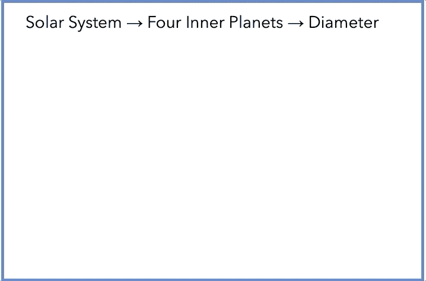
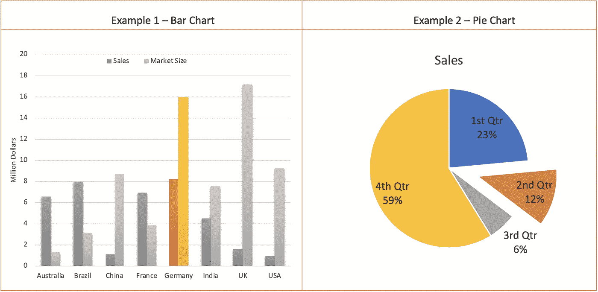
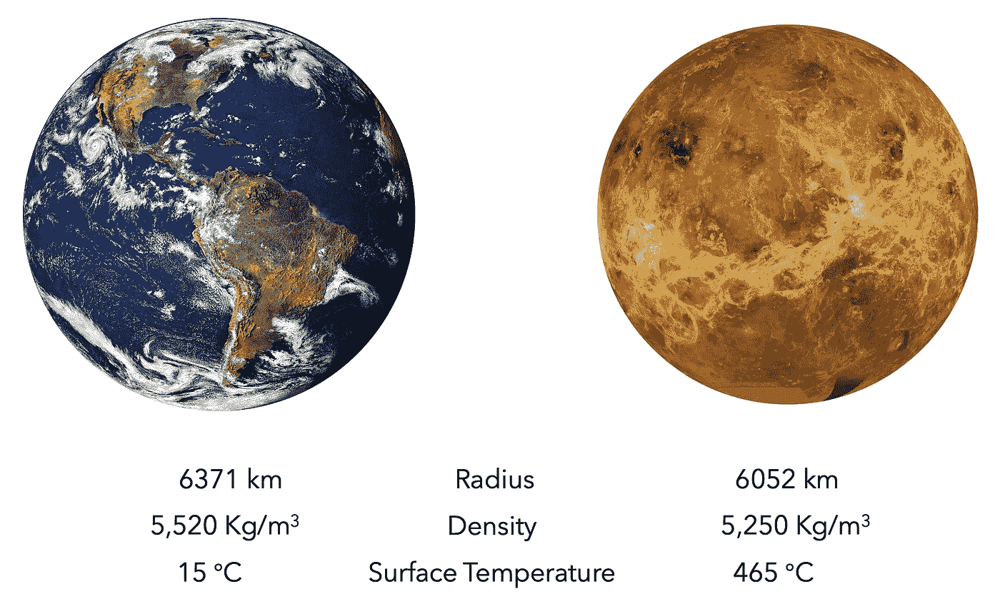
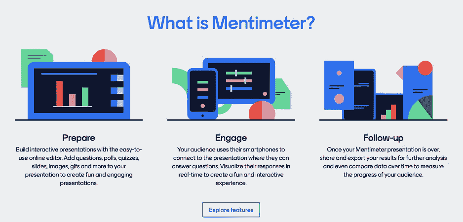

# 帮助你做更好演示的 5 个想法

> 原文：<https://medium.datadriveninvestor.com/5-ideas-to-help-you-deliver-better-presentations-512628aae883?source=collection_archive---------6----------------------->

## 沟通

## #3 让你的观众参与进来

Photo by [Artem Podrez](https://www.pexels.com/@artempodrez?utm_content=attributionCopyText&utm_medium=referral&utm_source=pexels) from [Pexels](https://www.pexels.com/photo/businessman-man-person-woman-5716026/?utm_content=attributionCopyText&utm_medium=referral&utm_source=pexels)

几乎有 5 亿人每天使用 PowerPoint 制作超过 3000 万份演示文稿(T2)。然而，大多数这些演示在几分钟内就被遗忘了。听众在 10 分钟后只能记住[50%的内容，一周后只能记住 10%。](https://jackmalcolm.com/2012/08/how-much-of-your-presentation-will-they-remember/)

演讲是一个机会，可以把你的想法传递给你的听众，让世界变得更好，哪怕只是一点点。

> “……如果你相信这个想法有可能照亮别人的一天，或者改变别人的看法，或者激励别人做一些不同的事情，那么你就拥有了一场真正伟大的演讲的核心要素，它可以成为给他们和我们所有人的礼物”
> 
> 克里斯·安德森

有数百万篇关于设计更好的 PowerPoint 幻灯片的文章，但我们需要明白，我们想要分享的**想法**才是真正的**演示**，幻灯片只是我们的**视觉辅助**。

我们需要带领我们的观众踏上一段旅程，用我们的幻灯片引导他们的注意力，并通过让他们参与来带他们一起兜风。我们不需要展示呆伯特卡通，也不需要讲有趣的笑话。我们对信息的热情应该通过我们的语言和视觉表现出来。

这里有 5 个简单的想法，对我的现场和虚拟演示都有效:

# 1.使用文本动画

我们被告知动画会让人分心，过渡更糟糕。对于沉迷于棋盘和旋转器的孩子来说，这是一个很好的建议，但如果使用正确，动画可以通过分块信息和引导观众的注意力来创造参与度。

人们很难一边读屏幕上的内容，一边听你说话。作为人类，我们的视觉皮层占主导地位，阅读吸引了我们的注意力，削弱了我们的听觉能力。

为了解决这个问题，你需要**成块显示文本**并与你的说话同步。阅读每一个新内容只需要几分之一秒，这样人们就可以很快将注意力转移到你的声音上。此外，在展示下一个项目时，**调暗现有项目符号**有助于直接聚焦。

Image by Author

下面是达到效果的步骤:

 [## 如何使 PowerPoint 中文本的外观变暗

### 当你做演讲时，你想让你的听众每次只关注一个信息，以防止…

www.howtogeek.com](https://www.howtogeek.com/453874/how-to-dim-the-appearance-of-text-in-powerpoint/) 

# 2.突出显示重要数据

我们经常用数据来证实我们的解释，但是屏幕上的图表需要时间来理解。当你的听众努力解读信息并理解它时，他们就不再关注你了。此外，认知超载会降低参与度，人们会去做白日梦。

突出你的论点所必需的数据点可以减少认知负荷。你可以改变想要指出的条的颜色，或者扩展饼图来强调你的观点。

Image by Author

以下是突出显示图表中的列的步骤:

 [## 如何在 PowerPoint 2013 中突出显示图表中的列-免费 PowerPoint 模板

### 柱形图是 PowerPoint 和演示软件中最常见的图形类型之一。他们是…

freepowerpointtemplates.com](https://freepowerpointtemplates.com/article/highlight-columns-graph-powerpoint-2013/) 

对于饼图，您可以使用以下步骤拉出一个切片:

 [## 分解或展开饼图

### 要在不改变基础数据的情况下突出饼图的一部分，您可以拉出单个切片，拉…

support.microsoft.com](https://support.microsoft.com/en-us/office/explode-or-expand-a-pie-chart-63284b67-22ea-4960-ab1e-0a3895af68ce) 

# 3.让观众得出结论

演示文稿是变革的媒介。你要么是在改变观众的知识水平，要么是在改变他们的信仰，要么是在扭转他们的思想。

最好的演示是带领人们踏上一段旅程，让人们期待着目的地。

 [## 定义新冠肺炎时代的“生活”|数据驱动的投资者

### 我和妻子即将进行一个月的自我隔离，以避免感染冠状病毒。我们都 70 多了…

www.datadriveninvestor.com](https://www.datadriveninvestor.com/2020/04/23/defining-life-in-the-time-of-covid-19/) 

你可以温和地引导他们跟你一起走，而不是像指挥者一样指挥观众。当你展示你的信息时，在你说出故事的寓意之前暂停一下，让你的听众猜一猜。你提供的信息应该使结论显而易见。

这是一张幻灯片，通过与地球的比较质疑金星的可居住性:

Images by [WikiImages](https://pixabay.com/users/wikiimages-1897/?utm_source=link-attribution&utm_medium=referral&utm_campaign=image&utm_content=11015) from [Pixabay](https://pixabay.com/?utm_source=link-attribution&utm_medium=referral&utm_campaign=image&utm_content=11015)

你可以拼出金星的表面温度太高，生命无法生存，或者你可以暂停一下**让观众得出同样的结论**。甚至可以请台下的人来回答。

当我们答对一个问题时，我们会感觉很好。我们带着一种温暖而模糊的感觉离开，这种感觉让我们钦佩演讲者并记住结论。

# 4.让你的观众参与进来

提问是获得观众参与的简单方法，但是你会很快意识到只有少数人会和你交流。

学校已经让我们所有人举手都很不舒服，除非我们对自己的答案有 120%的把握。问问题并不重要；正确回答老师的问题是生存。

我们需要一种更好的方式来吸引观众和我们一起玩。谢天谢地，有一些简单的工具可以做到这一点。

你可以试试投票工具，比如 [Mentimeter](https://www.mentimeter.com/) 或者 [Directpoll](https://directpoll.com/) 。创建投票只需几分钟。在演示过程中，您的观众可以使用他们的智能手机或笔记本电脑进行投票。你可以在屏幕上显示很酷的图表，继续你的演讲，吸引观众的注意力。

Screenshot by Author from Directpoll.com & Metimeter.com

# 5.以行动号召结束

演示的目的是带来变化。即使演示是为了分享知识，你留给听众的信息也比他们进来时更多。

> 你的幻灯片不是数据的展示。这是一个故事，一个旨在改变人们想法的故事。如果我不能理解你的观点，你只是给了我数据。请用备忘录来代替。
> 
> ——塞思·戈丁

花最后几分钟总结你的故事，并提出行动号召。你可以要求人们做出决定，接受你的建议，购买你的产品，理解穷人的困境，支持你的事业或你今天热情呈现的众多变化中的任何一个。

# 最后的想法

演讲是一个机会，可以把你的观众带入你的世界，帮助他们通过你的眼睛看世界。让你的激情具有感染力，感染每一个虚拟或亲自加入你的人。

 [## 如何在虚拟演示中避免 PowerPoint 死亡

### 从你的观众那里获得 10 倍参与度的 5 个想法

medium.com](https://medium.com/the-innovation/how-to-avoid-death-by-powerpoint-during-a-virtual-presentation-881def65f881) 

## 获得专家观点— [订阅 DDI 英特尔](https://datadriveninvestor.com/ddi-intel)