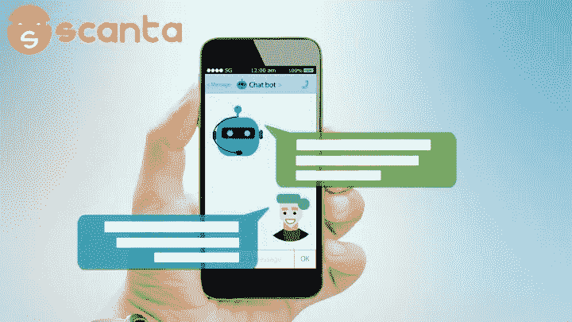
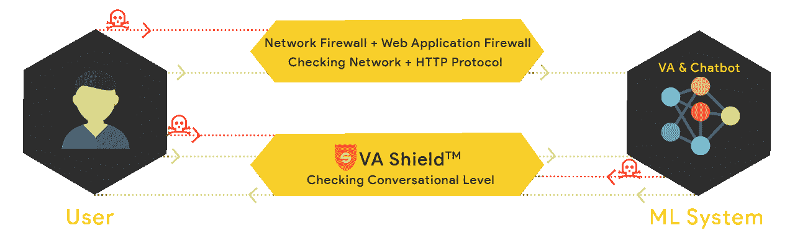
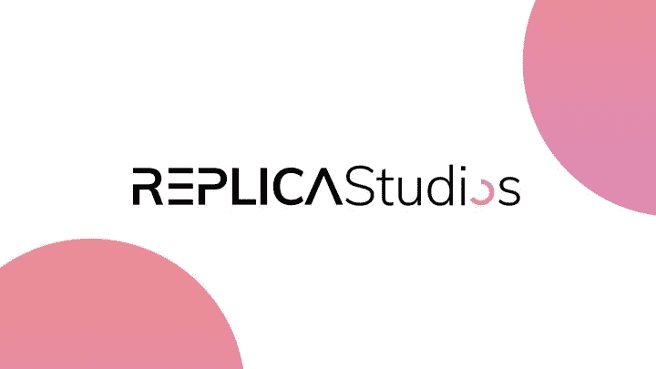
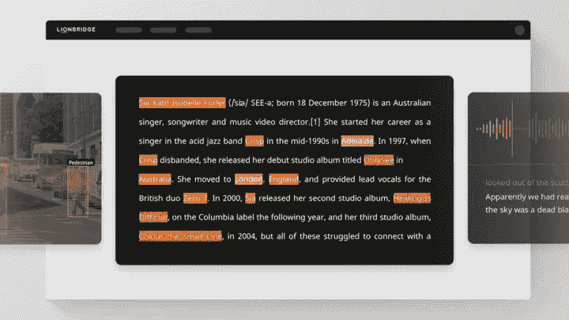
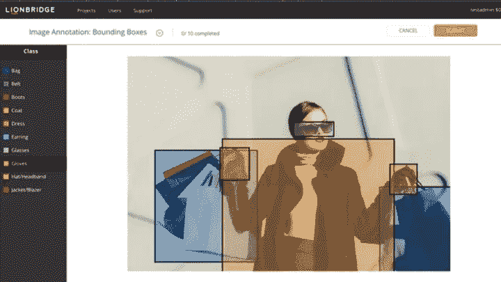

# 你应该知道的 5 家创新型人工智能软件公司

> 原文：<https://medium.datadriveninvestor.com/5-innovative-ai-software-companies-you-should-know-9c967cfc3e90?source=collection_archive---------9----------------------->

随着人工智能经常作为商业界的流行语被抛来抛去，人们经常忘记机器学习是达到目的的一种手段，而不是目的本身。对于大多数公司来说，建立一个人工智能并不是你的真正目标。相反，人工智能的实现可以为你提供实现目标的工具，无论是通过直观的聊天机器人提供更好的客户服务，还是通过合成画外音简化视频制作。

为了帮助揭示机器学习的一些现实应用，本文介绍了五种创新的人工智能软件，你应该在 2020 年全年关注它们。

# 1.斯坎塔

Scanta 是一家人工智能初创公司，有着非常有趣的历史。该公司开始为社交媒体创建增强现实游戏和增强现实软件。在探索频道的这一集《未知探险》中，你可以一瞥他们的一些技术:

尽管他们在 AR 领域有一些有趣的项目，但该公司已经向人工智能行业中一个似乎尚未开发的领域做出了巨大的转变:聊天机器人虚拟助手的高级安全。该公司由 Chaitanya Hiremath 于 2016 年创立，在旧金山运营，在印度设有办事处。

## Scanta 的聊天机器人安全软件:VA 盾

如今，Scanta 的主要服务是保护虚拟助理聊天机器人免受机器学习攻击。他们的解决方案被称为 [VA Shield](https://www.scanta.io/va-shield/) ，“分析进出系统的请求、响应和对话，以提供新的监管层。”

Scanta 的安全服务不同于传统 IT 安全团队提供的安全服务。通常，团队要么没有准备好应对机器学习攻击，要么没有意识到这种漏洞的存在，因此根本没有跟踪它们。但是，聊天机器人的漏洞确实存在。一个著名的例子是 2019 年达美航空公司的[诉讼案](https://www.wsj.com/articles/delta-sues-chatbot-provider-over-2017-breach-11565947801#:~:text=Catherine%20Stupp,-Biography&text=Delta%20Air%20Lines%20Inc.%20is,hacked%20and%20their%20business%20partners.)。达美航空起诉其聊天机器人开发商，称其聊天机器人系统存在漏洞，导致用户机密数据和信用卡信息泄露。

 [## 我们需要的不仅仅是数据:创业公司如何驾驭人工智能|数据驱动的投资者

### 你打开手机，进行眼科检查，发现自己 3-5 年后患老年痴呆症的风险，即使你没有…

www.datadriveninvestor.com](https://www.datadriveninvestor.com/2020/07/19/we-need-a-lot-more-than-data-how-startups-can-harness-ai/) 

随着越来越多的公司开始采用聊天机器人作为其客户服务基础设施的一部分，这些攻击可能会变得更加常见。Scanta 将自己定位为聊天机器人安全服务的行业领导者，但也计划扩展其业务范围，为其他机器学习技术提供安全保护。

# 2.描述

Descript 是一家为内容创作者开发产品的软件公司。该公司由安德鲁·梅森(Groupon 的联合创始人)于 2017 年创立，在旧金山运营。

## Descript 的合成语音人工智能软件

Descript 的主要产品是为播客和视频内容创作者制作的视频和音频编辑软件。然而，该公司在 2019 年收购了来自加拿大蒙特利尔的人工智能初创公司 [Lyrebird](https://www.descript.com/lyrebird) 。Lyrebird 现在作为 Descript 的人工智能研究团队运营，该团队正在研究自动语音转文本和合成语音技术。

合成语音技术是人工智能行业的一个细分领域。然而，合成声音显示了改善视频游戏开发和电影制作的巨大潜力。Lyrebird 是最早涉足合成语音开发的公司之一，因此受到了 Wired 和 Techcrunch 等媒体的关注。

# 3.复制品

Replica 是一家人工智能初创公司，也开发合成语音技术。该公司于 2017 年 12 月由 Shreyas Nivas，Riccardo Grinover 和妮可·马迪拉创立，在澳大利亚和美国运营。在 [2019 年的采访](https://lionbridge.ai/articles/how-synthetic-voice-actors-rival-human-actors-an-interview-with-replica-studios/)中，首席执行官 Shreyas Nivas 表示，他们正在建立“世界声音的市场”，配音演员和普通人可以授权他们的声音用于视频游戏、商业广告、电视节目和任何其他需要画外音的媒体形式。

## 复制品工作室合成语音软件

Replica Studios 是一个行业领先的平台，允许游戏开发者、视频内容创作者和普通大众创建和训练他们自己的合成声音。

从视频游戏开发到电视节目的解说，合成语音技术有许多应用。最有趣和有益的用例之一可能是为患有 ALS 等导致他们失去说话能力的健康疾病的人创建合成声音。通过在他们失去说话能力之前记录他们的声音，我们可以创造一个他们声音的合成副本，用于语音辅助设备。

随着复制品工作室平台的巨大改进和复制品[语音生成 API](https://replicastudios.com/product/api) 的发布，这绝对是一家值得关注的公司。

# 4.清晰视野

Clearview 是当今人工智能行业最臭名昭著的名字之一，是一家为执法部门提供反向人脸图像搜索解决方案的公司。Clearview 使用最先进的面部识别算法扫描目标对象的面部图像，然后在互联网上搜索所有可能与目标图像中的面部特征相匹配的公开图像。该公司由 Hoan Ton-That 和 Richard Schwartz 于 2017 年创立，在纽约市运营。

**Clearview 的面部识别 AI 软件**

Clearview 拥有一个大型面部图像数据库，其中包含通过社交媒体、博客和其他网站公开发布的图像。Clearview 的最终目标是为执法部门提供抓捕罪犯的有力工具。然而，许多人担心这种技术的存在将如何影响隐私法。事实上,《纽约时报》对 Clearview 进行了一次[曝光，并声称该公司可能“终结我们所知的隐私”](https://www.nytimes.com/2020/01/18/technology/clearview-privacy-facial-recognition.html)

幸运的是，GDPR 的法律允许个人控制他们自己的数据，[允许用户从 Clearview 请求他们的个人资料](https://onezero.medium.com/i-got-my-file-from-clearview-ai-and-it-freaked-me-out-33ca28b5d6d4)，如果他们想看的话。希望更多的国家会效仿，颁布类似 GDPR 的私人数据法。

在可预见的未来，Clearview 很可能会成为围绕面部识别伦理的辩论的前沿。任何由此产生的针对该公司的法规或法规缺失都将为未来其他面部识别开发商和初创公司树立先例。

# 5.Lionbridge AI

Lionbridge 是一家全球人工智能培训数据提供商和数据收集公司。该公司利用全球 50 多个办事处和超过 100 万贡献者的社区来创建大规模培训数据。Lionbridge 成立于 1996 年，最初是一家语言服务提供商，并通过在 2019 年 1 月收购 Gengo AI，加强了其在机器学习行业的扩张。

**Lionbridge AI 的数据标注软件**

该公司最近宣布发布 [Lionbridge AI 平台](https://lionbridge.ai/data-annotation-platform/)，这是一款用于图像、视频、音频和文本注释的独立软件。使用该平台，数据科学团队可以上传他们的数据，邀请其他团队成员，并通过协作共同注释他们的数据集。团队还可以跟踪个人贡献者的进度和产出。

被《福布斯》誉为美国最大的雇主之一，这样一家有影响力的公司正在扩大其在人工智能市场的影响力，这是值得注意的事情。如果该公司向人工智能行业的扩张能够复制他们在翻译和本地化方面的成功，他们的数据注释软件可以帮助大大小小的数据科学团队获得高质量的训练数据。

上面只是五家公司创造了人工智能软件，以及帮助数据科学团队建立更好的人工智能的工具。随着每年新的人工智能创业公司进入该行业，有许多公司使用机器学习来创造创新技术。

为了跟上机器学习的所有最新进展，请[在 Medium](https://medium.com/@LimarcA) 上跟随我。

[原创文章](https://www.kdnuggets.com/2020/07/5-innovative-ai-software-companies.html)经许可转贴。

**访问专家视图—** [**订阅 DDI 英特尔**](https://datadriveninvestor.com/ddi-intel)