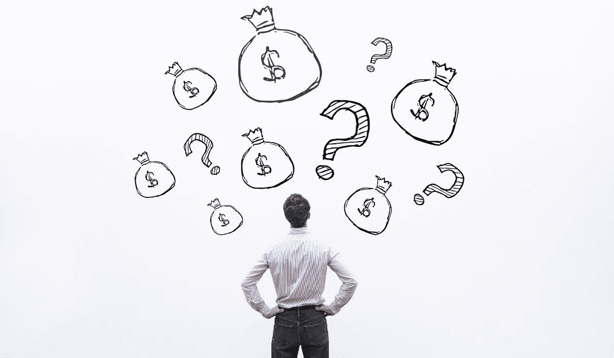

# 要避免的 5 个投资错误

> 原文：<https://medium.datadriveninvestor.com/5-investing-mistakes-to-avoid-5c76ab82f2?source=collection_archive---------1----------------------->

## 减少错误以获得更好的结果

投资是积累财富的最佳方式。你可以赚取稳定的收入，但如果你不投资，你会留下可观的钱。你可以通过投资实现现金流的多种目标。税收保护和升值。

在成功投资的道路上，许多投资者容易犯 5 个常见的错误。其中一些错误是初学者的错误，而一些专家甚至继续犯这些错误。

识别错误并注意到它们是战斗的一部分……所以让我们进入正题，识别投资者常犯的 5 个错误。

# #1:试图把握市场时机

这是投资者最常犯的错误。当你试图为市场计时时，你是在为我们无法预测的事情计时。当然，事情可能已经板上钉钉，但投资者可以从另一个角度看问题。旺盛的贪婪，非理性的恐惧，不准确的信息，以及人群是一些可以在短期内破坏可靠假设的因素。

许多投资者都有把握市场时机的欲望。除非专注于股市是你的全职工作，否则你不应该试图把握市场时机，即使这样，风险也很大。

# #2:不考虑百分比和市值

如果有人告诉我一只股票目前的交易价格是每股 X 美元，我不在乎。

如果亚马逊股价涨到 4000 美元/股，我就不知道这家公司是被高估了还是被低估了。它没有告诉我任何关于公司未来发展的信息。

达到 4000 美元/股将使亚马逊成为一家价值 2 万亿美元的公司。与 Magnite 这样的股票从 16.5 亿美元市值上升到 33 亿美元市值相比，市值从 2 万亿美元上升到 4 万亿美元需要更多的资金。

从回报的角度来看，通常是考虑百分比，而不是收益。假设你有一个 1000 美元的股票投资组合，在下一个交易日赚了 10 美元。

你可能会想，“有什么了不起的。这 10 美元对我来说没有任何意义。”

但是不要把它看作是 10 美元的增长，把它看作是你投资组合的 1%的增长。如果你有同样的投资组合分布，但是你的投资组合中有 100 万美元，而不是 1000 美元，你那天就赚了 100 美元 10K。

这是因为 100 万美元中的 1%是 10K。百分比解释了为什么富人在股票市场越来越富。1000 美元的投资组合增加 10%会产生额外的 100 美元。100 万美元的投资组合增加 10%，就会产生额外的 10 万美元。

百分比和市值远比股票价格重要。股票价格实际上并不能告诉你什么，尤其是现在投资者可以购买零股。价格只对期权交易者重要，因为你需要 100 股才能卖出备兑看涨期权，或者如果你想卖出现金担保看跌期权，你需要足够的资金购买 100 股。

如果你不是期权交易者，股票价格并不重要。专注于能做什么。

# #3:玩别人的游戏

在我发表在 Medium 上的第一篇投资文章中，我谈到了如何找到下一只亚马逊股票。很自然地，人们回头看亚马逊的股票图表，说:“我希望我在早期就进入了那家公司，”现在每个人似乎都在寻找一只回报可能看起来像亚马逊的股票。

 [## 如何找到下一只亚马逊股票

### 亚马逊已经相当成功了。

medium.com](https://medium.com/the-innovation/how-to-find-the-next-amazon-stock-dff0fc3c938a) 

在文章中，我提出了一些你可以用来寻找下一只亚马逊股票的标准。

我提到的寻找下一只亚马逊股票的标准没有给蓝筹股留有余地。

 [## 金钱:冠状病毒疫情期间的投资|数据驱动的投资者

### 在我将近 20 年的金融服务生涯中，我曾经负责监督整个…

www.datadriveninvestor.com](https://www.datadriveninvestor.com/2020/07/29/money-investing-during-the-coronavirus-pandemic/) 

如果你是一个股息投资者，目标是从股息支付中退休，那么根据我的亚马逊股票文章，你不应该弃船投资。

我最近买了一些保诚的股票，因为股票被低估了(P/B 和 P/S 低于 1)，股息率在我建仓时是 6%，他们的股息在 5 年内几乎翻了一番。

我现在 20 多岁，所以我的投资组合中充满了增长型股票，以获得更大的增值，但我也在积累股息收入，以便有一天我可以用它来支付所有的支出。

投资者不断改变他们的想法，但你不能仅仅因为一篇文章或一个金融 YouTuber 如何投资他们的钱而改变你的想法。你可以改变你的策略，但是要读很多文章或者看几个视频，详细说明这两种方法的优缺点。

分红股票提供季度现金流，但你不会看到亚马逊式的增长。如果你买了像苹果或万事达卡那样增长的分红股票，你最终也只能拿到很少的股息。

例如，万事达卡目前的股息率为 0.50%。我宁愿买一只没有收益的成长型股票，把股息股票的钱投入收益率更高的股息股票(即保诚)。

但这只是我的想法。如果你喜欢我的内容，但不同意这种方法，不要遵循我的策略。一天之内，我的钱翻了五倍，但仅仅因为我一次做对了，并不意味着你应该跟着我做每一件事。我投资了让我赔钱的期权(即在错误的时间买了看跌期权)，任何说我没有的人都是骗子，或者说我投资的时间不够长。尤其是如果这些投资者试图建立一个品牌，不谈论他们的损失是符合他们的利益的，因为他们肯定会有损失。

这是一个需要把握的重要真理。沃伦·巴菲特和凯西·伍德在投资方式上截然相反。巴菲特青睐那些被击败且未被重视的廉价公司。凯西青睐估值高得惊人的创新型公司，巴菲特永远不会碰它们。

特斯拉股票约占 ARK Invest 投资组合的 10%。巴菲特绝不会这么做。

这是否会让凯西成为追逐估值高的创新公司的糟糕投资者？巴菲特收购失败公司的欲望，以及在此过程中错过亚马逊和谷歌这样的公司，会让他成为一个糟糕的投资者吗？

如果你看看他们这些年的回报，你就会知道他们都是最好的投资者。他们有不同的方法，相互对比，这很好。

只要知道你的立场，并相应地投资。

# #4:被动投资你的钱

是的，我知道…

你听说过指数基金，可能也投资过。谁没有呢？我自己也有一些指数基金的钱。

但它们不是安全港。当你认为投资是安全的避风港时，你就把自己暴露在危险之中。

在实践中，卖出指数基金并以较低的价格买入是很好的做法，但你也在试图把握市场时机，这是一个关键的错误。

如果你投资指数基金，看看它们。如果你在标准普尔 500 投资，你投资的是一堆僵尸公司和罪恶股票，但只要 FAANG 继续上涨，借贷成本低得难以置信，你就不会注意到这一点。

有些人对原罪股没有意见。奥驰亚提供了接近 9%的高股息收益率，但仍比疫情之前的价格水平低 20%以上。

奥驰亚的股票肯定是牛市，但出于我个人的信念，我永远不会购买个股。

# #5:对短期损失感到恐慌

不断刺痛新手和有经验的投资者的最常见的错误是对短期损失的恐慌。当你的投资出现赤字时，很容易恐慌。卖出股票会导致亏损，但你的投资组合不会再出现亏损。

短期亏损让一些投资者陷入恐惧状态，但你必须记住你当初为什么要买一家公司。巴菲特建议不要购买一只股票，除非你在未来 10 年持有它没有问题。三个月的股票价格停滞或下跌不应该改变你的论点。

当然，如果该公司被发现是一个骗局或基本面发生重大变化，那就另当别论了。

我过去常常在市场下跌时恐慌性抛售股票，错过上涨的机会。然后，我决定买入看跌期权，而不是卖出对我更有利的股票(如果因为股票上涨，看跌期权变成了 0 美元，我仍然持有股票，而不是卖掉它们)。

现在，我把每一次下跌都视为我所相信的公司的买入机会。如果你所信任的公司股价下跌 20%，却没有任何值得注意的消息，这可能是一个很好的买入机会(除非估值在下跌 20%后仍然难以置信)。

在某些时候，你会犯一些这样的错误。这很正常，但你可以停止一次又一次地犯同样的错误，把长远的眼光放在心上。

[***想学习如何投资股市赚钱？确保你订阅了我的 YouTube 频道***](http://bit.ly/2W4ag01)

**访问专家视图—** [**订阅 DDI 英特尔**](https://datadriveninvestor.com/ddi-intel)