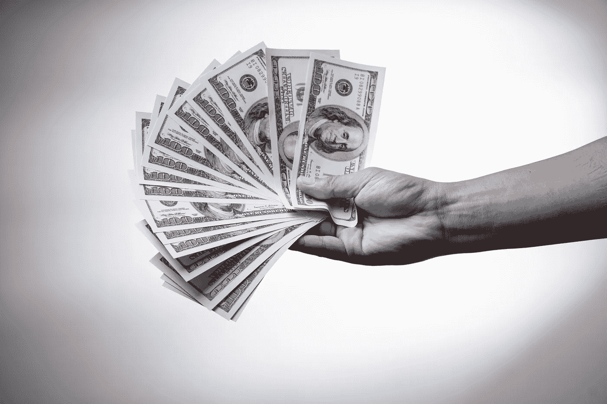

# 沃伦·巴菲特的 5 条投资原则

> 原文：<https://medium.datadriveninvestor.com/5-investing-principles-from-warren-buffett-fc71a4146f9a?source=collection_archive---------4----------------------->

Photo by [金 运](https://unsplash.com/@jinyun?utm_source=unsplash&utm_medium=referral&utm_content=creditCopyText) on [Unsplash](https://unsplash.com/s/photos/money?utm_source=unsplash&utm_medium=referral&utm_content=creditCopyText)

众所周知，沃伦·巴菲特是世界上最好的投资者，他通过分析个人业务和以折扣价购买股票积累了财富。

他的头号策略是分析一家公司，等待合适的时机大举买入并长期持有该股。然而，沃伦·巴菲特说投资并不适合所有人。如果有人没有合适的气质来持有股票度过困难时期，而你受到股价波动的影响，那就不要投资股票！

沃伦还拥有伯克希尔哈撒韦公司。如果你在巴菲特第一次接管伯克希尔哈撒韦公司时投资了 1000 美元，即使在最近的市场崩盘中，你也会赚到 2100 多万美元。

那么沃伦·巴菲特是如何成为世界上最富有的人之一的呢？

这些结果来自于对公司的投资和遵循一系列原则。以下是沃伦·巴菲特投资的 5 个主要原则。

首要也是最重要的原则是“投资自己”。如果你投资自己，没人能从你身上拿走。它不能从通货膨胀中消除，也不能从税收中消除。投资于自己并培养成功的习惯是你一生中必须做出的最重要的决定之一。巴菲特说，你需要观察你在商界钦佩的人，分析他们的习惯和行为，并把它们写下来，以便让它们也成为你的习惯。

沃伦·巴菲特的第二个投资原则是“现金不是好的投资”。这是为什么呢？

按照巴菲特的说法，现金不应该被认为是好的投资，他声称最聪明的做法是退出现金，进入资产。现金不是好的投资，因为你永远不知道这笔钱的价值会发生什么变化。现金不生产任何东西，它会贬值！你需要一些现金作为应急基金，但是当你有现金盈余时，你应该尽快投资。

第三个原则“投资于生产性资产”。

巴菲特向千禧一代建议，他们应该拥有一些增值的东西。人们不应该花时间在东西上打赌，他们不应该投资一件东西，然后期望它会增值，因为其他人会这么想！做出理性的决策和对公司价值的理性计算是成功投资的必经之路。此外，巴菲特说，每当你看完一家你喜欢的公司的年报，并决定投资该公司时，你就不应该再看报价了。您购买的是业务，而不是报价！

第四个原则是“先评估公司”。

沃伦·巴菲特说，每当你打算收购一家公司时，首先你必须仔细阅读他们的年度报告，并试图了解他们的真正价值和价值。沃伦表示，当他管理一家公司时，他首先试图了解他认为该公司的价值是什么，然后他将该价值与该公司的实际股票价格进行比较。基于这一点，如果巴菲特认为以折扣价购买股票是合适的，他就会做出投资决定。此外，巴菲特的建议是留在你的能力范围内。他说，你不需要成为所有方面的专家，你只需要成为某些领域的专家并坚持下去，因为这些领域会带来最大的成功。

最后，他的第五个原则是“玩大的，不要浪费机会”。

当你有机会做某事时，你必须抓住生活中的重大机遇。你需要找出所有的好机会，等待合适的时机参与其中。沃伦·巴菲特说，当你看到股票价格上涨时，你不能随机购买股票来赚钱。在你做出重大投资决定之前，你应该考虑很久。你做出了人生中几个深思熟虑的重大投资决定，这将让你变得富有！