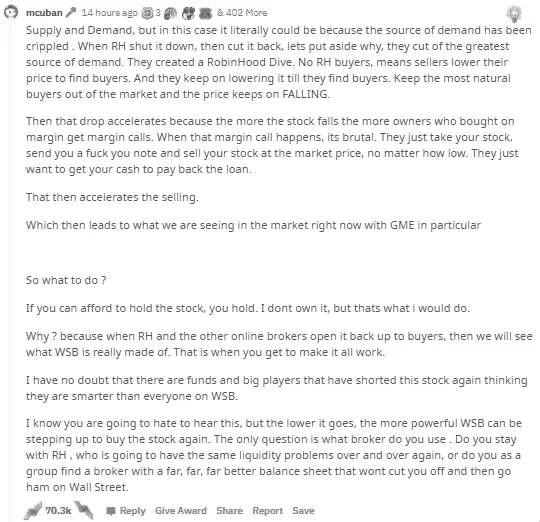

# 马克·库班 Reddit AMA 网站关于 r/WallStreetBets 的 5 个关键要点

> 原文：<https://medium.datadriveninvestor.com/5-investor-takeaways-from-mark-cubans-reddit-ama-on-r-wallstreetbets-73544f72189d?source=collection_archive---------2----------------------->

## 亿万富翁投资者马克·库班就如何应对华尔街向 Reddit 投资者提供了见解

Source: [Mark Cuban 2019 Arizona Tech Innovation Summit / Gage Skidmore](https://www.flickr.com/photos/gageskidmore/47437755551/)

你可能已经听说了，在过去的几周里，一群 Redditors 就 GameStop(GME)与华尔街展开了战争。GameStop 的股票非常不稳定，价格从 1 月初的每股 17 美元涨到上周四的 347 美元。

华尔街一些最大的对冲基金多年来一直押注 GameStop 的股票会下跌。在正常情况下，打赌是有意义的。部门视频游戏零售商 GameStop 多年来一直在财务上苦苦挣扎。在线数字游戏在游戏玩家中的兴起使得 GameStop 的商业模式变得过时。该公司未能适应快速变化的消费者行为，因此销售额逐年下降。

由于最近发生的一系列事件，GameStop 的股票开始定价。很快。[首先，Chewy 的联合创始人 Ryan Cohen 在 1 月初加入了 GameStop 的董事会](https://www.cnn.com/2021/01/27/investing/gamestop-reddit-stock/index.html)，从数字的角度激发了人们对该公司的新信心。

第二，来自 subreddit，r/WallStreetBets 的精明 Redditors 发现 GameStop 是卖空最严重的公司之一。对冲基金疯狂卖空 GameStop。

[卖空是指](https://www.investopedia.com/terms/s/shortselling.asp)“投资者借入一种证券，并在公开市场上卖出，计划稍后以更低的价格买回。”尽管利润丰厚，但卖空的风险也相当大，因为股票可能会突然上涨，导致投资者蒙受巨大损失。“卖空交易的损失风险理论上是无限的，因为任何资产的价格都可能攀升至无穷大。”

来自 WSB 的 Redditors 联合起来拯救公司，互相说服尽可能多地从 GameStop 购买股票。价格上涨，导致卖空者补仓以限制损失，这随后引起了 GameStop 股票的连锁反应。

最初只是几个手头有点闲钱和时间的千禧一代，如今已经演变成一场反对华尔街的大规模革命运动。现在，押注 GameStop 失败的对冲基金现在面临巨大的货币损失，据计算，仅 GameStop 一项几天内就损失了近 130 亿美元[。](https://www.vox.com/recode/2021/2/2/22261097/gamestop-wallstreetbets-short-seller-hedge-funds-losses-robinhood)

然而，在过去一周，卖空者在对抗 WSB 军队方面取得了进展。决心摆脱 GME 的散户投资者，对冲基金使用了肮脏的手段——从充斥着 Redditors 将其购买从 GME 转移到白银的主流新闻，到人为导致 GameStop 的股价大幅下跌。

# 马克·库班

股票市场的狂热引发了许多有影响力和有权力的人的关注——从像亿万富翁对冲基金投资者抱怨 Redditors 缺乏美国消费者新闻与商业频道市场基本面知识的批评家到像 Elon Musk 这样的啦啦队员和像 T2 AOC 和特德·克鲁兹这样的民粹主义政治家。

然而，真正打动 WSB 观众的有影响力的人是[马克·库班](https://medium.com/u/29fd628f3aaa?source=post_page-----73544f72189d--------------------------------)，鲨鱼池的亿万富翁投资者，达拉斯小牛队的老板。周二，马克·库班在 r/WallStreetBets 上发起了一个名为“问我任何问题”的开放式论坛问答形式。这篇帖子很快在 Reddit 上走红。

他不仅参加了 AMA，而且马克·库班还花了整整两个小时回答 WSB 社区的问题。库班回答了涵盖各种不同主题的问题，但真正有帮助的是他鼓励的话语和投资建议。

这里有一个 AMA 的链接。

我被 AMA 追星了。多年来，我一直是 r/WallStreetBets 的潜行者，所以看到马克·库班抽出时间来帮助像我们这样的日常交易者是有意义的。我甚至醒得足够早，以确保我没有错过 AMA 的任何东西。

AMA 完成后，我确定了每个散户投资者在投资华尔街时应该考虑的 5 个要点。

他们在这里:

# 耐心和纪律

为了赢得与华尔街的斗争，散户投资者需要有一双强有力的手——持有股票的手。GameStop 持有者面临的最大威胁是大量恐慌的卖家，他们认为自己已经受够了，决定减少损失，决定撤退，或者那些在获利后离开的人。

一位 Redditor [问](https://www.reddit.com/r/wallstreetbets/comments/lawubt/hey_everyone_its_mark_cuban_jumping_on_to_do_an/glqfe72?utm_source=share&utm_medium=web2x&context=3)“你有什么建议可以让我们成功改变这一切？”

库班[回答](https://www.reddit.com/r/wallstreetbets/comments/lawubt/hey_everyone_its_mark_cuban_jumping_on_to_do_an/glqgybg?utm_source=share&utm_medium=web2x&context=3)“耐心。颠覆从来都不是容易或直线的…如果是，那就坚持下去。如果不是，找出是什么改变了，从中学习并为下一个资产重新加载。一如既往地工作。包括股票在内的资产变动有很多不同的原因。交易股票并不容易。交易密码，NFT，不管是什么，都不容易。这一切都不容易。”

“耐心是一种美德”这句老话在这个时代再贴切不过了。库班认为，颠覆，尤其是在华尔街这样的老牌机构中，需要承诺、纯粹的意志力和克服困难的勇气。

业余投资者需要的最重要的品质之一是耐心。库班不是唯一认识到这一点的亿万富翁投资者。[沃伦·巴菲特评论道](https://www.thestreet.com/thestreet-fisher-investments-investor-opportunity/patience-the-most-underused-investing-skill)“股票市场是一个把钱从没有耐心的人身上转移到有耐心的人身上的装置。”

专业投资者、华尔街的猫和亿万富翁投资者多年来一直在练习耐心——到了完美的地步。不难预测，缺乏投资经验的业余投资者更有可能在金融拉锯战中精神崩溃。事实上，对冲基金正指望它与 GameStop 的情况。

练习耐心。展示纪律性。你可以做到这一点，不要每 5 秒钟看一次你的股票应用程序，当市场变红时，散散步，喘口气，不要感情用事。

# 人数上的优势

到目前为止，在市场补贴方面，大资金总是比小资金有优势。/u/ziz，来自 r/WallStreetBets 的主持人，在 [WSB 的国情咨文](https://www.reddit.com/r/wallstreetbets/comments/lbcruc/wallstreetbets_state_of_the_union/)中说:

> “长期以来，散户投资者一直是桶里的螃蟹。独自面对缓慢而有限的数据、蹩脚的工具、糟糕的执行和糟糕的建议。我们过去常常只能听已经成功的人预先批准的叙述，并希望我们承担责任。我们以前是一群鸭子大小的马。”*—*[*/u/ziz*](https://www.reddit.com/r/wallstreetbets/comments/lbcruc/wallstreetbets_state_of_the_union/?utm_source=share&utm_medium=web2x&context=3)

WSB 及其散户投资者大军已经证明，作为一个单一的集体实体，它有能力推动市场。作为一个新的实力玩家，WSB 社区已经永远改变了投资游戏。

华尔街害怕了。在 AMA，马克·库班说他怀疑许多华尔街分析师和对冲基金的盟友将会从现在开始在留言板上[监控活动](https://www.reddit.com/r/wallstreetbets/comments/lawubt/hey_everyone_its_mark_cuban_jumping_on_to_do_an/glqq1hd?utm_source=share&utm_medium=web2x&context=3)，比如 Reddit。华尔街低估了数字社区的力量。结果代价高昂。

通过作为一个团体联合起来，WSB 社区显示了对抗华尔街的力量，就像一群鱼对抗大白鲨一样。

“是的。WSB 利用了社区的价值。他们把它带给人们，让它自下而上。这其中蕴含着巨大的力量和优势。有时学习的代价很高，”[马克·库班说](https://www.reddit.com/r/wallstreetbets/comments/lawubt/hey_everyone_its_mark_cuban_jumping_on_to_do_an/glqs0mj?utm_source=share&utm_medium=web2x&context=3)。他还对 Redditor 的另一个问题发表了类似的评论，[评论](https://www.reddit.com/r/wallstreetbets/comments/lawubt/hey_everyone_its_mark_cuban_jumping_on_to_do_an/glqk6qs?utm_source=share&utm_medium=web2x&context=3)，“人多力量大。”

在 GME 持有股份的普通投资者必须认识到，只有团结一致，他们才能战胜歌利亚。正如大多数 WSB 的 Redditors 会说的那样，从一部受人喜爱的科幻电影“坚强的类人猿”中获得灵感

# 从你的错误中学习

研究表明“错误比完全没有错误更有助于人们学习信息。”这个原则对股票市场来说绝对正确，马克·库班也同意这一点。他在 Reddit AMA 上说:

> “我刚开始炒股时，学到了一些代价高昂的教训。很痛苦。但是我试着去了解我得到了什么是对的，什么是错的…”—[/u/MC uban](https://www.reddit.com/r/wallstreetbets/comments/lawubt/hey_everyone_its_mark_cuban_jumping_on_to_do_an/glqgclf?utm_source=share&utm_medium=web2x&context=3)

所有的投资者，无论大小，都知道赔钱或亏钱的痛苦。有时，他们会犯错误来纠正痛苦。或者有时候，交易员会因为没有买入一只股票而自责，这只股票最终在几年后价格大幅上涨。

不仅重要的是在股市上取得胜利，而且重要的是考虑损失，反思发生的事情，并在未来避免错误。掌握股市是一个增量的进步之旅。

马克·库班一直是 WSB 社区的热心捍卫者。但他对 WSB 交易员策略的唯一批评是过于依赖罗宾汉。上周四，罗宾汉限制了关键卖空股票的交易，以满足其清算所的要求。该公司手头没有足够的现金来应对增长的需求。结果，业余交易者无法买下 GME 和 AMC，导致股价大幅下跌，逆转了 WSB 社区前几天的收益。

Source: [Reddit / Mark Cuban AMA](https://www.reddit.com/r/wallstreetbets/comments/lawubt/hey_everyone_its_mark_cuban_jumping_on_to_do_an/glqidn6?utm_source=share&utm_medium=web2x&context=3)

但是，马克·库班并没有让评论保持原样，而是向 WSB 社区提供了关于下一步如何协调努力的建议。他帮助交易者区分他们的错误，并提供从错误中学习的见解。

# 从基础做起

在我看来，在 AMA 提出的一个非常好的问题来自/u/Simplyme__。Redditor 问 T1:“嗨，马克！我爱你在鲨鱼池里！我的问题是，你对那些追寻梦想并从头开始的人有什么建议？非常感谢！:-)"

马克·库班的回答是这样的:

> “首先，找一份工作来支付你的账单。得照顾好最基本的。那就去找回来。请记住，这不是在做梦，而是在做”——[/u/MC uban](https://www.reddit.com/r/wallstreetbets/comments/lawubt/hey_everyone_its_mark_cuban_jumping_on_to_do_an/glqfokv?utm_source=share&utm_medium=web2x&context=3)

如果你是一个投资者，我会说你是一个梦想家。你梦想着巨大的收益、大笔的钱和财务自由。但是你很容易沉浸在幻想中，而不去考虑现实情况——你的生活水平。

作为一种策略，仅仅依靠在股票市场大赚一笔的潜力是极其危险的，也是不可持续的，尤其是当你指望它是你唯一的收入来源的时候。马克·库班说，他认为对每个人来说，确保你有一个安全的财务网络是很重要的。获得一份可以帮助支付账单的工作，可以让你更灵活地进入股市，学到更多东西。

在 AMA 上，[马克·库班](https://www.reddit.com/r/wallstreetbets/comments/lawubt/hey_everyone_its_mark_cuban_jumping_on_to_do_an/glqfokv?utm_source=share&utm_medium=web2x&context=3)反复强调，持有你买得起的股票很重要。如果做不到这一点，可能会对一个人的财务状况造成毁灭性的影响，并对他们的心理健康造成严重影响。2008 年金融危机后，一项研究发现，“增加了 6566 起自杀事件……这是股票价值快速下跌的直接后果。”

照顾好你自己。只投资你能承受的损失。

# HODL💎🙌🚀

这无疑是马克·库班 AMA 最重要的一点。钻石毫无疑问。

一位 Redditor 问马克·库班，为什么 GME 经历了艰难的一天，价格暴跌得如此厉害。在解释了罗宾汉通过限制购买 GME 来减少需求后，库班给出了一些建议。

在某个时候，华尔街和对冲基金将会投降。但只有 WSB 持有他们的股票，他们才会投降。

此外，库班还就如何真正向对冲基金施压向社区提供了建议——让你的经纪人多样化。把你的股票留在 Robinhood，但是申请其他交易 App，比如 WeBull 或者 CashApp，把你的股份最大化。他鼓励社区找出那些拥有庞大资产负债表，并在那里大举买入股票的经纪人。

> “挑选资产负债表最强劲的券商。毁掉 RH 的是，他们没有足够的现金来应对账户、保证金贷款和波动性的增长。如果你不能确保他们有一个数万亿美元的资产负债表来应对这种情况，下一家券商也会发生完全相同的事情”“ [/u/mcuban](https://www.reddit.com/r/wallstreetbets/comments/lawubt/hey_everyone_its_mark_cuban_jumping_on_to_do_an/glqqzx6?utm_source=share&utm_medium=web2x&context=3)

一些 WSB Redditors 指出，富达等券商从压榨 GME 中获益，并拥有强劲的资产负债表。这些经纪人将是对抗华尔街的绝佳工具，因为他们是被卖空股票的主要机构持有者。简而言之，马克·库班是说社区需要申请富达账户。守住防线。

# 行动号召

本周早些时候，GME 的股价经历了残酷的一天损失，作为一名业余投资者，预计它会感到挫败和沮丧。马克·库班鼓舞人心的 AMA 给了我继续战斗所急需的信心和动力。

上一次压价是这样的[2008 年大众](https://www.autoweek.com/news/industry-news/a35340727/heres-how-the-gamestop-short-squeeze-is-like-the-vw-squeeze-of-2008/)保时捷。但是正如[马克·库班](https://www.reddit.com/r/wallstreetbets/comments/lawubt/hey_everyone_its_mark_cuban_jumping_on_to_do_an/glqldnc?utm_source=share&utm_medium=web2x&context=3)所说，那是两个集团之间的争斗，是有钱人之间的争斗，而不是小人物之间的争斗。这场由 Reddit 领导的反对大型金融机构的运动是一个历史性的时刻。这是如此具有历史意义，以至于[网飞已经签署了一项协议](https://www.cnet.com/news/netflix-is-already-making-a-wallstreetbetsgamestop-movie/)来制作一部关于华尔街赌博/GameStop 现象的电影。

马克·库班的 AMA 为我们提供了很好的见解和启示。作为散户投资者，我们有责任理解发生了什么，并按照他的建议去做。只有这样，我们才能推动金融机构的结构性变革。

*成为* [*中等会员每月只需 5 美元*](https://quyma.medium.com/membership) *来支持 Quy 和其他成千上万的作家。*