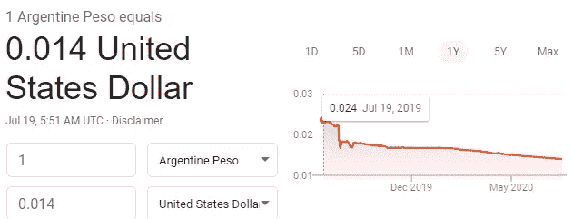

# 了解我们货币体系的 5 个关键概念

> 原文：<https://medium.datadriveninvestor.com/5-key-concepts-to-understand-about-our-monetary-system-fe38d0446974?source=collection_archive---------9----------------------->

## 经济

## 未来几年的重要知识

Photo by [Jp Valery](https://unsplash.com/@jpvalery?utm_source=medium&utm_medium=referral) on [Unsplash](https://unsplash.com?utm_source=medium&utm_medium=referral)

随着我们在 2008 年的上一次经济危机和现在的 2020 年产生的大量刺激，我们发现自己负债累累。当然，没有简单的方法可以摆脱我们所处的困境，我们将在未来几年讨论潜在的解决方案。到处都会有围绕增税、在已经实施的基础上出台更多刺激措施以及通货膨胀的讨论。

这些术语和概念花了我一些时间去理解，对于一个刚刚开始学习的人来说，它们肯定不容易理解。在进入兔子洞之前，也很难找到一个好的起点，因为对话会变得更加复杂。

因此，首先，我想强调几个关键概念，我认为这些概念将为那些希望在当前社会中参与金钱对话的人提供良好的基础。

 [## 对有商业头脑的投资者有用的行为经济学概念|数据驱动的投资者

### 在美国企业界，高斯统计，对我们周围世界的确定性解释，以及理性…

www.datadriveninvestor.com](https://www.datadriveninvestor.com/2020/07/09/helpful-behavioral-economics-concepts-for-the-business-minded/) 

# 量化宽松(QE)

这是“**印钞**的花哨说法。在美国，只有一个实体有权这么做，那就是美联储(美联储)。人们可能想知道钱从哪里来，而快速而诚实的答案却不在哪里。它是从无到有的概念。

这乍一看似乎很可怕，但理论上，有办法阻止我们滥用这一点，破坏整个系统。

# 债务

你可能以前听说过“美国国债”，但并不真正知道它们是什么或如何运作的。美国国债是美国借钱的机制。

以量化宽松为例，美联储用印出来的钱购买这些债券，这些钱通过美国财政部最终到了政府手里。外国实体也可以购买大量美国国债，最近的例子是中国。

这些债券是有利率的，美国必须偿还给持有美国国债的人。这笔债务必须通过税收来偿还。

# 通货膨胀

通货膨胀是一个大多数人已经熟悉的概念。通货膨胀代表了典型的公共支出的价格上涨。这传统上是用 [CPI](https://www.investopedia.com/terms/c/consumerpriceindex.asp) 来衡量的。

尽管我们理解通货膨胀的定义，但理解通货膨胀在今天的环境中所起的作用是非常重要的，因为美联储向我们的系统注入了如此多的资金，债务也在增加。

虽然我们认为通货膨胀是不好的(没有人希望东西涨价)，但鉴于我们的环境，这是不可避免的。由于美国债务的增加(截至撰写本文时已达到 26 万亿)，我们需要增加税收来偿还债务。我们可以预期未来工资会增长，而不是大幅提高税率，为了支持工资增长，公司将会以更高的成本出售其产品和服务。

# 恶性通货膨胀

恶性通货膨胀听起来像是通货膨胀的一种极端形式。这可能以几种方式发生。

如果我们欠那些持有我们债券的人很多钱，而经济没有像我们希望的那样通过通货膨胀增长，我们可能无法偿还债务。这将导致美元的全球降级，反映出人们对我们的货币体系和经济失去信心。

这实际上发生在阿根廷。他们错过了 2019 年的一笔债务支付，阿根廷比索的购买力几乎是一年前的一半。

# 通货紧缩

通货紧缩与通货膨胀相反。所有东西都变得更便宜。这可能是由许多因素造成的，需求不足、生产率提高或货币供应量减少。

理论上，这是好的，因为其他一切都是中性的。谁不希望所有的东西都更便宜呢，对吧？

唯一的问题是，当我们有很大的债务负担时(像现在这样)，通货紧缩将不允许我们满足还款的要求，我们将因此面临金融危机的风险。

在我们目前所处的沉重债务时期，你会看到这些概念被频繁讨论，因为人们继续对经济进行投机。理解这些概念会让你在个人财务和投资方面做出更好的决定。

如果你喜欢读这篇文章，也可以随时查看我在 https://bryology.substack.com/[的时事通讯](https://bryology.substack.com/)

**访问专家视图—** [**订阅 DDI 英特尔**](https://datadriveninvestor.com/ddi-intel)