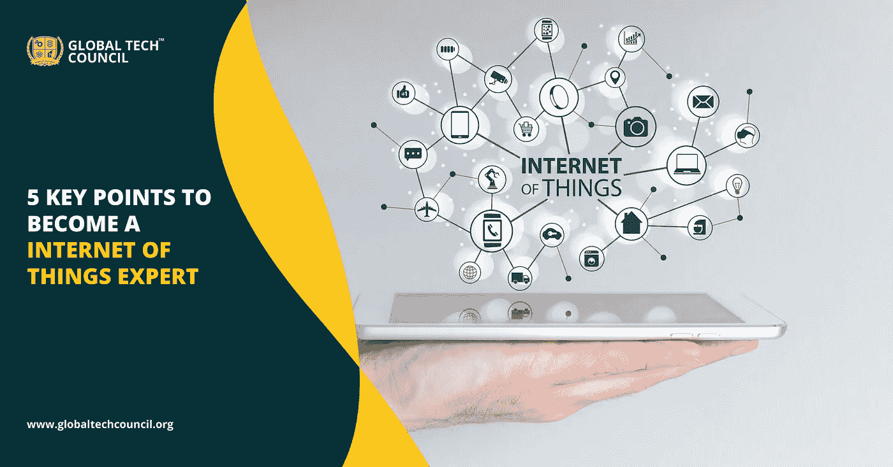

# 成为物联网专家的 5 个关键点

> 原文：<https://medium.datadriveninvestor.com/5-key-points-to-become-a-internet-of-things-expert-c635f16f728b?source=collection_archive---------14----------------------->

互联设备已经成为我们生活的一部分，从智能手机到智能电视，你可以找到物联网在你生活中的相关性。根据 Gartner 的数据，我们预计到 2020 年底将有 200 亿台联网设备，预计到 2025 年这一数字将达到 416 亿台。有了如此惊人的数字，将会出现对专业人士的需求，他们可以将这项技术运用到当前的商业形式中。你可能会发现几家公司正在投资 [**物联网培训**](https://www.globaltechcouncil.org/internet-of-things/certified-iot-expert/?utm_source=Article%20Submission&utm_medium=Off%20Page%20Activities&utm_campaign=GTC%20(2020)) 项目。他们正在积极招聘物联网开发人员。唯一的原因是物联网将统治市场。所以，如果你必须成为一名物联网开发人员并精通这项技术，你需要学习更多的技能。在这篇博客中，我们将讨论这些技巧。

## **让我们开始吧:**

**1。** **嵌入式软件开发**——你首先需要学习的技能之一就是嵌入式软件开发。端点物联网设备的工作是融合硬件和软件组件的功能。所有智能设备都有嵌入式处理器，使机器能够执行任务。因此，需要具备嵌入式软件专业知识的物联网开发人员。

**2。** **关于编程语言的知识**——我们列表中的另一项技能是编程语言。尽管计算语言的使用有限，但人们需要知道 C 是必不可少的。它不需要太多的处理能力，并确保更快的性能。你要知道 C 没有 ibject 0 or ended 的能力，所以你需要学习 C++这样更高级的语言。它用于处理器。最近，像 Java SE Embedded 和 Java ME Embedded 这样的其他语言已经受到嵌入式工程师的欢迎。如果你也需要成为一名专家 IOT 工程师，你必须学习这些编程语言。如果你加入任何物联网认证计划，他们会教你这些语言。

您需要掌握的另一项技能是 GIPO(通用输入输出)和 I2C(内部集成电路),后者用于在连接的设备和微控制器之间建立通信。

**3。** **字段网关**——下一个进入我们列表的是字段网关。它有助于在物联网和云物联网系统之间建立联系。它的任务是从连接的设备上收集数据，对其进行处理，然后将其发送到云端进行进一步处理和存储。这一切都是用 C++完成的。

**4。** **数据分析-** 如果你愿意成为一名物联网工程师或者 [**物联网开发者**](https://www.globaltechcouncil.org/internet-of-things/certified-internet-of-things-iot-developer/?utm_source=Article%20Submission&utm_medium=Off%20Page%20Activities&utm_campaign=GTC%20(2020)) ，那么你必须具备数据分析方面的专业知识。雇主正在寻找能够帮助实施数据分析技术以更好地分析数据的物联网开发人员。物联网工程师的工作是:

*   批处理并行处理-一批数据已经存储了一段时间，然后使用这些数据对设备进行处理。
*   数据可视化——物联网工程师对数据分析的需求是可视化数据并从中得出推论。
*   复杂数据的处理-物联网处理数据，作为其工作的一部分，物联网工程师需要处理大量复杂的数据。物联网工程师可以用 Apache Spark Streaming，你可以用 Java 或者 Scala 写。
*   机器学习实现——作为物联网工程师，要求你了解机器学习。实现机器学习需要掌握的语言有 Python、Java 和 R。

**5。** **Web 和移动用户应用-** Web 和移动应用允许用户与物联网交互。后端 web 应用程序是使用。NET 和 PHP。虽然移动应用用于控制物联网，因此物联网开发人员需要了解移动应用开发。所有这些都将有助于互联设备的无缝运行。

声称物联网将统治未来并定义行业不会有错，如果你希望成为物联网开发人员，那么关于物联网及其允许技能的知识是必不可少的。各种物联网认证课程将帮助你深入了解物联网。

## **结论**

当我们谈论物联网的影响部分时，你可以在我们生活的不同方面找到它的用途，从我们在家里使用的小型咖啡机到智能城市的概念，所有这些都在物联网上发挥作用。所有这些都为物联网开发者创造了不断增长的需求。

 [## 供应链:物联网如何传递真相|数据驱动的投资者

### 现代供应链行业依靠一套极其强大的工具来满足客户需求…

www.datadriveninvestor.com](https://www.datadriveninvestor.com/2020/07/20/supp-lie-chain-how-iot-is-delivering-truth/) 

全球技术委员会现在提供在线 [**物联网认证课程**](https://www.globaltechcouncil.org/internet-of-things-certification/?utm_source=Article%20Submission&utm_medium=Off%20Page%20Activities&utm_campaign=GTC%20(2020)) 。本课程包含物联网及其相关概念的所有细节。无论您是想学习实现部分，还是想了解这项技术的概念，这个认证计划都将为您提供完整的细节。

有关物联网课程及其应用的更多信息，请立即联系全球技术委员会。

**访问专家视图—** [**订阅 DDI 英特尔**](https://datadriveninvestor.com/ddi-intel)