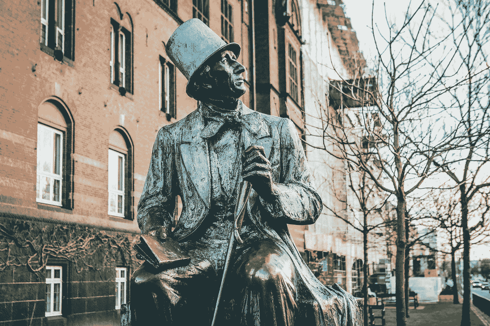

# 汉斯·克里斯蒂安·安德森和他的故事《皇帝的新装》给我们上的 5 堂领导力课

> 原文：<https://medium.datadriveninvestor.com/5-leadership-lessons-from-hans-christian-anderson-and-his-story-the-emperors-new-clothes-2c7010d0e925?source=collection_archive---------4----------------------->

> “如果你的行为激励其他人去梦想更多，学习更多，做更多，成为更多，你就是一个领导者。”约翰·昆西·亚当斯

Photo by [Nick Karvounis](https://unsplash.com/@nickkarvounis?utm_source=medium&utm_medium=referral) on [Unsplash](https://unsplash.com?utm_source=medium&utm_medium=referral)

汉斯·克里斯蒂安·安德森(生于 1805 年 4 月 2 日，丹麦欧登塞，卒于 1875 年 8 月 4 日，罗利盖德)被认为是最伟大的作家之一。

他是众多戏剧、游记、小说和诗歌的作者，他的全部作品估计有近 4000 件。许多人最记得他的童话故事，每个故事都有一个道德故事要讲。

安德森知道如何让他的角色栩栩如生，就像任何一部好的现代皮克斯电影一样，这个故事不仅仅是给孩子们看的。他的童话故事通过他的故事编织了他们的魔法，并通过幽默和创新向成年人讲述了一个潜在的道德故事。

《皇帝的新衣》是一个不可思议的短篇故事，对你与他人的互动进行了有力而有益的自我反思。

# 皇帝的新衣

这个故事讲述了两个人打算欺骗一个皇帝。这两个骗子假装是织布工，向一个骄傲的领导人许诺一套漂亮的新衣服。告诉他他的新衣服对那些不称职的人来说是看不见的，然而，这两个骗子根本没有做衣服。

 [## 数据驱动始于数据素养|数据驱动的投资者

### 光是听到“数据”这个词就令人生畏。老实说，只有 21%的全球员工对自己的工作充满信心

www.datadriveninvestor.com](https://www.datadriveninvestor.com/2020/03/22/data-driven-starts-with-data-literacy/) 

当皇帝穿着不存在的衣服在他的臣民面前游行时，没有人敢说他们没有看到任何衣服。

> "最后，一个孩子哭了出来。"
> 
> “但是他什么也没穿！”

# 1.服务型领导

服务型领导主要关注人民及其所属社区的发展和福祉。

皇帝的故事讲述了他的城市是一个快乐的城市，每天都有许多游客来，但这导致皇帝自满，他不关心他的人民。

> 仆人型领导分享他们的权力，并把他人的需要放在第一位。
> 
> 帮助人们尽可能地发展和表现。

# 2.领导者的身份

当一个领导者的身份在一个可能失败或成功的产品或想法中被发现时，这可能会导致倦怠和不信任他人为你的愿景做出贡献。

> 首席执行官看到了绝佳的机会，但如果他们不允许其他人去实现，那么你就可以阻止你的高技能员工取得成果。

你不能总是有什么和如何。让你的员工成为你旅程的一部分。

一个有效的领导者会创造一个激励的环境。

# 3.创造合适的环境

领导者必须为创新和增长营造合适的环境。为了与员工和利益相关者进行坦诚的对话，领导者必须认可并奖励那些直言不讳的人。

领导者还必须接受所有员工对其结果的反馈，而不仅仅是同事的反馈。一个好的领导者不会因为意见不合而受到威胁，并鼓励公开而不报复，从而为企业获得最好的结果。

# **4。领导者需要自我意识**

我们都有自己的长处和短处，即使是最好的领导者。

领导者需要有自知之明，了解自己的弱点和需要他人帮助的地方。

不管你有多聪明，一个有效的领导者知道他们的局限性以及何时寻求帮助。

 [## 分布式领导如何帮助释放区块链的潜力？

### 试着不要成为一个成功的人，而是试着成为一个有价值的人。~阿尔伯特·爱因斯坦

medium.com](https://medium.com/datadriveninvestor/how-could-distributed-leadership-help-unlock-the-blockchain-potential-8b5b53434169) 

# 5.好的领导是谦逊的

领导者需要身边有合适的人。皇帝的新衣讲述了他的领导人如何去检查织工，因为他们工作，但即使他们不敢说什么，害怕他们会失去他们的位置。

> “我知道我不傻，”那人想，“所以一定是我配不上我的好意。太奇怪了。不过，我不能让任何人发现。”所以他称赞他没有看到的材料。
> 
> 他宣称他对漂亮的颜色和精致的图案非常满意。
> 
> 对皇帝，他说，“它让我着迷。”

优秀的领导者知道他们需要其他人——导师和他们可以信任的人。知己，你可以向他们寻求专家的建议或提供另一种观点，最终获得你可能不知道的专业知识。

# 最后

一个优秀的领导者知道什么时候该说“我错了，让我们重新开始，继续前进”。

> 皇帝颤抖着，因为他怀疑他们是对的。但他想，“游行必须继续。”因此，当他的贵族们高高举起根本不存在的火车时，他比以往任何时候都更加自豪地走着。

你从这个童话中还学到了什么？请随时对您的想法发表评论。

*如果你喜欢这篇文章，请在这里查看我的其他见解***或者关注我的* [*推特*](https://twitter.com/e_nicleoid) *！**

*注意安全，伙计们！*

*埃米莉*

* [## 与火星金星蔻驰艾米丽一起释放你最大的潜力

### 火星金星蔻驰艾米丽提供生活，关系和商业辅导，以帮助你释放你最大的潜力和…

www.marsvenuscoachemily.com](https://www.marsvenuscoachemily.com/)*