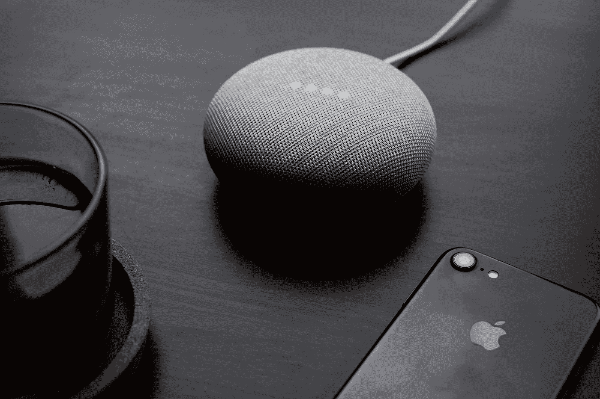

# 2020 年的 5 大领先内容营销趋势

> 原文：<https://medium.datadriveninvestor.com/5-leading-content-marketing-trends-in-2020-dc8d0c6a4b04?source=collection_archive---------26----------------------->

## 增加你的范围！

Photo by [Nikita Kachanovsky](https://unsplash.com/@nkachanovskyyy?utm_source=medium&utm_medium=referral) on [Unsplash](https://unsplash.com?utm_source=medium&utm_medium=referral)

我们已经度过了 2020 年年中，由于新冠肺炎带来了如此多的混乱，一切都几乎戏剧性地崩溃了。尽管如此，我们也看到了在线市场的繁荣，因为许多企业都在追赶这一趋势。

**内容营销的趋势**。

内容营销包括创建和分享视频、博客、帖子等内容，以促进或激发人们对产品或品牌的兴趣。著名作家兼企业家塞思·戈丁(Seth Godin)表示，这是“仅存的营销手段”。到今年年底，内容营销将得到改善，内容分发将发生巨大变化。那么，这些趋势将走向何方，它将如何惠及市场？你应该寻找什么样的趋势？

**让我们找到答案。**

# 1.视频和直播流

Photo by [Jakob Owens](https://unsplash.com/@jakobowens1?utm_source=medium&utm_medium=referral) on [Unsplash](https://unsplash.com?utm_source=medium&utm_medium=referral)

视频营销早在电视商业化的时候就已经存在了。这是最吸引人的内容，每天有近 10 亿次观看。品牌正在利用视频来推广和营销他们的产品，以增加社交媒体渠道的参与度。

今天，直播被证明是非常有效和有前途的。事实证明，现场网络研讨会是数码产品最有效的转化方式。视频没有局限性；视频是一种全面的商业方法。调查发现，50%的消费者希望看视频而不是图片或博客。

所有的社交媒体平台都扮演着非常重要的角色，因为它们有助于从根本上扩大视频的覆盖范围。有许多社交媒体平台，几乎所有的平台都提供一些广告类别选项。你也可以利用视频中的行动号召按钮，因为用户会觉得它们更方便。

在你的邮件标题中提到“ **video** ”这个词可以提高 19%的打开率。买家表示，视频有助于他们做出购买决定。

有无穷无尽的选择，你可以选择制作一个高质量的视频。在你的品牌广告中加入视频可以显著增加销售额。

# 2.互动内容

Photo by [Austin Distel](https://unsplash.com/@austindistel?utm_source=medium&utm_medium=referral) on [Unsplash](https://unsplash.com?utm_source=medium&utm_medium=referral)

用户在你的网站上花的时间越多，他们转化的可能性就越大。让他们参与进来的最好方法是在你的网站上引入互动内容。测验、交互式信息图、交互式登录页面、演示等。是最受欢迎的互动内容。

如今，参与比信息更重要；互动内容让用户参与其中。随着技术每年都在发展，竞争也呈指数级增长，互动内容使品牌脱颖而出。

81%的营销人员认为互动内容比静态内容更能吸引眼球。顶级营销人员将这种类型的内容放在他们的漏斗顶部，以推动更多的流量。从好的方面来看，它也被证明是有效的，因为观众的参与度增加了 66%。

# 3.用户生成内容(UGC)

Photo by [Marvin Meyer](https://unsplash.com/@marvelous?utm_source=medium&utm_medium=referral) on [Unsplash](https://unsplash.com?utm_source=medium&utm_medium=referral)

用户生成的内容包括视频、图片、评论等内容。评论是一切的主旨，内容是用户产生的，而不是品牌产生的。品牌通常在他们的社交媒体手柄或网站上分享这一点。

UGC 有助于提高真实性和用户之间的信任。消费者倾向于查看用户生成的内容，而不是品牌本身生成的内容。

购买决策严重依赖 UGC。85%的人认为 UGC 对他们的购买选择有很大影响。这一切都归结为一件事，大的；为你的品牌创造欲望。之前使用过你的品牌的用户是产生意识创造欲望的最好方式。

如今，几乎每个品牌都利用 Instagram，并让消费者为其创建内容。原创性被保留，荣誉总是给予创作者。在你的网站上一个简单的评论页面可以增加 2.5 倍的销售额。

# 4.语音搜索

Photo by [Dan Farrell](https://unsplash.com/@farreal?utm_source=medium&utm_medium=referral) on [Unsplash](https://unsplash.com?utm_source=medium&utm_medium=referral)

这项技术发展如此之快，今天使用的语音命令技术也是如此。语音技术的可能性是无限的。随着这一趋势的发展，语音搜索正变得非常重要。很明显，为什么你的品牌应该采取基于语音搜索的策略。

语音搜索技术正在出现，并将继续出现。这将改变搜索引擎优化的方式，因为它旨在改善客户体验。使用语音搜索优化的内容来增加网站的流量，可以让你在比赛和时间中保持领先。

像 Google Home 和亚马逊 Echo 这样的语音助手是最先进的。随着他们的引入，我们与互联网互动的方式发生了变化，这意味着网页将不得不改变优化技术。

此外，今天我们的智能手机中也有虚拟助手，如谷歌助手和 Siri。几乎每个人都在用它们进行搜索。多年来，谷歌已经将其单词识别率从不到 80%提高到了 90%以上。这只是表明策略将不得不改变，而这一次，方法将主要取决于人们日常使用的语言。

语音搜索不仅适用于企业，还将极大地提升用户体验。如果你能提供更好的体验，那么你就拥有了一个终身客户。

# 5.人工智能

Photo by [Photos Hobby](https://unsplash.com/@photoshobby?utm_source=medium&utm_medium=referral) on [Unsplash](https://unsplash.com?utm_source=medium&utm_medium=referral)

人工智能用于具有人类界面并对人类情绪/感觉做出反应的机器。至于营销趋势，人工智能被大量用作聊天机器人，可以立即响应客户的查询，有助于增加客户体验。

由于人工智能仍在兴起，企业可以在开发的初级阶段获得许多优势。它更有可能与语音助手集成在一起。

开发过程中最困难的一步是诱导机器的思维能力。但无可争议的是，它将显著推动自动化。

目前，企业应该在营销策略中实施聊天机器人、电子邮件自动回复、基于用户偏好的列表等额外服务。实现这些将使他们走在曲线的前面，并且它也将被证明是非常有效的。

*感谢您的阅读。*