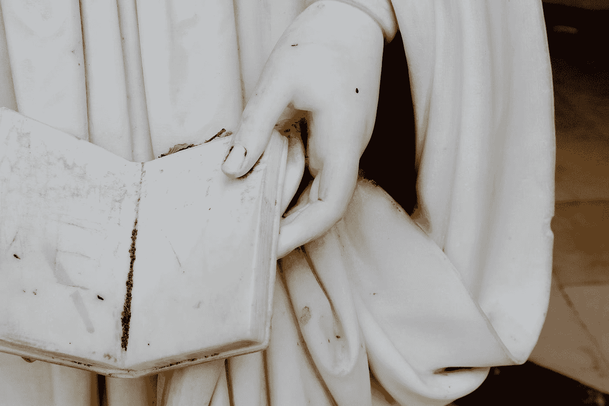

# 超级成功者给那些寻求人生成功的人上的 5 课

> 原文：<https://medium.datadriveninvestor.com/5-lessons-from-super-achievers-for-those-who-seek-success-in-life-dbb956b57b11?source=collection_archive---------5----------------------->

Photo by [Fleur](https://unsplash.com/@yer_a_wizard?utm_source=medium&utm_medium=referral) on [Unsplash](https://unsplash.com?utm_source=medium&utm_medium=referral)

在你的个人生活中，有没有什么事情是你想实现但还没能做到的？

它是你内心深处燃烧的东西吗？也许你对此感到害怕，或者你已经尝试过，但失败得很惨。

想一想这个问题。

也许你现在正在经历这个过程。

当我们面对更重要的机会时，我们很容易害怕，并寻找方法来避免冒险的痛苦。

我真诚地认为，成功是一场心态游戏，也就是说，80%是通过你的思维方式和信念实现的，另外 20%是机制、你做的事情、技能等等。

各行各业都有取得成功的人，比你我资源少或者机会少的人。

现在，我从成功人士身上注意到了一些特征，这些特征帮助他们在生活中取得了巨大的成功。我指的不仅仅是钱，还有健康和快乐。

以下是其中的一些特征:

## 1-在人群中脱颖而出

最伟大的广告文案之一尤金·施瓦茨说得好:“在一个美丽的世界里，丑陋脱颖而出。”

如果你想脱颖而出，达到新的高度，你需要乐于与众不同。

人们可能认为你古怪、疯狂、自私或傲慢，这没什么；不要因为与众不同而感到羞耻。这就是你的独特之处。如果你对自己的皮肤有信心，对自己的想法和欲望有信心，并坚持做好每一件事，那是最好的。

我们需要能够做我们过去没有做过的事情。这可能会让我们质疑自己并感到不舒服，这有时很难处理。

在美丽的世界里做丑陋的东西，不要害怕在人群中脱颖而出。

 [## 成功创新者的三个基本特征|数据驱动型投资者

### 在过去，领导原则是通过伟大指挥官的例子被含蓄地描述和传授的…

www.datadriveninvestor.com](https://www.datadriveninvestor.com/2020/09/10/the-three-essential-traits-of-successful-innovators/) 

## 2-坚持不懈

我爱马云和埃隆马斯克的故事；这些人展示了真正的坚持意味着什么。

阿里巴巴创始人马云被肯德基和三所大学拒之门外，把英语作为第二语言学习，第一次互联网创业惨败。埃隆·马斯克(Elon Musk)也是如此，他把所有的财富都投入到他的三家公司，以至于他不得不借钱吃饭和付房租。

你需要拥抱拒绝和失败，并知道这是生活的一部分，不仅是在商业领域，而是在你生活的所有领域。

如果你试图减肥，不要因为经过两个月的努力，你可能看不到你想要的结果这个简单的事实而气馁。事情需要时间来积累；没有什么来得又快又容易。

我们大多数人在第一次尝试时很快就放弃了，即使我们说我们对此“充满热情”。我知道我们讨厌失望、浪费时间和金钱以及意识到我们最初的计划行不通的感觉。

如果你知道如何处理这些情况，吸取经验，转移到下一个，或者再试一次，你就永远不会失败。随着时间的推移，努力和勤奋会复合。

记住，即使你失败得很惨，有些人也会希望他们拥有那些机会和你拥有的时间。

没有什么会是容易的，但这是值得的。任何成功者都经历过同样的挣扎；任何值得拥有的东西都来之不易。

## 3-缺乏谦逊

事实是，每个人都有起点，即使是像杰夫·贝索斯、沃伦巴菲特和埃隆马斯克这样的人；他们不是天生的亿万富翁，也不了解他们的领域。他们只是接受了他们需要学习更多的事实。

你看，许多人试图表明他们生活得很好，他们什么都知道，这是缺乏谦逊，是一个大错误。

谦逊是知道自己并非无所不知的事实。

你不需要一开始就看起来像个专家；就连伟大的苏格拉底自己也承认，“有一件事只有我知道，那就是我一无所知。”

听着，我明白了:没人想看起来毫无头绪；每个人都想变得好看。有时候甚至很难承认自己对几个话题一无所知。

一些最杰出的企业家已经足够谦虚，接受他们并非无所不知，并愿意向他人学习。

以埃隆·马斯克为例。当我在读他的传记时，有一件事引起了我的注意。当他创办 SpaceX 时，他做了大量阅读来了解火箭；他还向工程师们问了一些关于零件和火箭工作原理的问题。

看，仅仅因为他是首席执行官并不意味着他什么都知道；他总是愿意学习，而且是通过提问来学习。

有一句西班牙语是这样说的:

“告诉我你吹嘘什么，我就告诉你你缺少什么。”

用西班牙语听起来更好，但重点是这样的:人们倾向于炫耀他们不知道的东西。卑微的人不倾向于这样做；他们接受它，并努力学习。他们经常指出自己的弱点和正在改进的地方。

所以要足够谦虚，开始你的提升之旅。

## 4-你宁愿反对建议，也不愿接受建议

这是失败的公式。

有时我们的自我会妨碍我们。这是危险的，因为它会扼杀你的个人成长，阻止你提升自己。

我们通常不愿意承认自己错了，或者我们正在做的事情没有起作用。我们总是希望自己是对的。

与其争论，不如敞开心扉。如果你不这样做，你就输了，你就正式失明了。但是如果你敞开心扉提出建议并接受自己的错误，你就给了自己另一个变得更好的机会。

记住成功的系统:尝试某事->获得反馈和结果->从反馈和结果中学习->再次尝试->成功。

我不是说你应该总是接受每个人的反馈，因为即使这样，你也需要小心，但至少对你认为拥有知识的人更加开放。

## 5-你不相信这是可能的

听着，我明白，我知道当你试图做一些你从未实现的事情时是什么感觉。你很难相信这是可能的，即使你看到别人在做这件事。

但事实是，我们经常高估自己的能力。当你站起来尝试的时候，你会从失败中吸取教训，最终走向成功。不要让对失败的恐惧或不了解一切的不确定性阻止了你。

如果你创造了无情的自我信念，那将是最好的，而你只有通过对你的目标采取行动才能获得这种信念；你是唯一能让事情成为可能的人，因为没有人会为你做这件事。

所以你必须培养自信，相信这个过程。

要恢复一切:

*   在人群中脱颖而出。
*   足够坚持
*   谦虚一点
*   听取建议
*   相信是可能的

> 成功是个糟糕的老师。它诱使聪明人认为他们不会输。比尔·盖茨。

如果你有任何建议，请发微博给我

你可能也喜欢阅读:

[清晰的重要性:打造成功的简约方式](https://medium.com/datadriveninvestor/the-importance-of-clarity-the-minimalist-way-to-build-success-fa16a727de97)

[斯多葛主义和成功是对立的吗？](https://medium.com/datadriveninvestor/stoic-and-success-is-one-opposite-to-the-other-d2eda0b13be2)

[斯多葛派对爱情的看法](https://medium.com/@Stoiccopy/stoic-thoughts-on-love-65cb7c6bfd94)

[战胜焦虑的坚忍方法](https://medium.com/@Stoiccopy/the-stoic-way-to-beat-anxiety-fa55b3f52343)

[亚历山大大帝:领导力五课](https://medium.com/datadriveninvestor/alexander-the-great-5-lessons-on-leadership-f9bd38469dd0)

[睡前应该做的 7 件事](https://medium.com/@Stoiccopy/7-things-you-should-do-before-going-to-bed-40733f058fb1)

## 访问专家视图— [订阅 DDI 英特尔](https://datadriveninvestor.com/ddi-intel)