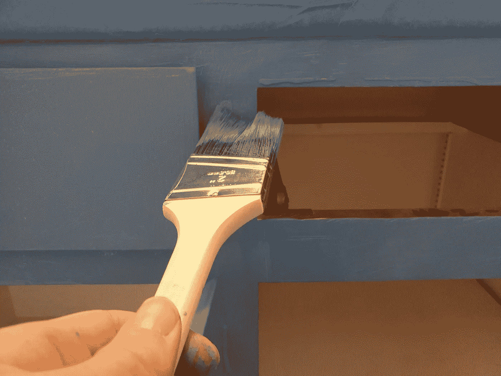

# 从粉刷墙壁中学到的 5 条人生经验

> 原文：<https://medium.datadriveninvestor.com/5-life-lessons-learned-from-painting-a-wall-7ce324747a31?source=collection_archive---------7----------------------->

## 放肆，失败，油漆线，以及跳过“坯布”的快乐

Photo courtesy the author.

绘画可以令人奇怪地沉思。不仅仅是创造性的、艺术性的那种——我发现功利主义的房屋绘画也是沉思的。即使作为一个租房者，我也总是在每一个我称之为家的公寓或居住空间里至少画一面强调墙。

最近，作为正在进行的 DIY 改造的一部分，我更进一步，粉刷了整个房间的所有墙壁、装饰和其他功能(还有一个鸡舍，但那是另一回事)。

这个过程让我想到了我喜欢的作家在 Medium 上给我上的几堂课——以及一些关于商业和生活的一般性思考和教训。

以下是我在粉刷墙壁时学到的五条人生经验。

## 没人会看到你的油漆线

当你粉刷墙壁时，你会花很多时间琢磨微小的细节。你总是试图在墙的底部画一条完美的线条，在你不能移动的东西周围画画，在不画天花板的情况下画墙的顶部，等等。

当你花几个小时琢磨这些小细节时，很容易就能发现所有你犯错误的地方。也许你的线条没有你想要的那么清晰，或者你在踢脚板上溅了一点油漆。因为你是画这幅画的人，所以这些小错误或不完美在此刻会显得巨大而重要。

然而，问题是——没有其他人注意到这些事情。当客人走进房间时，他们不会爬上梯子，戴上老花镜，检查你墙上的油漆线是否完全笔直。他们会专注于你面前巨大的彩色墙壁，欣赏你的装饰选择，惊叹你房间里所有美丽的自然光。你如何画装饰的细节一点也不重要。

这让我想起蒂姆·丹宁在一篇关于不要害怕发表你的媒介故事的文章中写的建议。

 [## 阻止你发表作品的 11 个不良写作习惯

### 为什么频繁发表文章和不过度思考过程是成为作家的关键

medium.com](https://medium.com/better-marketing/11-bad-writing-habits-preventing-you-from-publishing-your-work-f41534b0397d) 

蒂姆谈到作家如何关注他们作品中的小问题。这篇文章的结构/论点够好吗？会不会有人发现一些不完美，把我变成迷因？我的编辑会怎么想？

没人会注意到你的油漆线。正如蒂姆在文章中指出的，没有人会对你的文章或其他创造性工作的每个方面进行微观分析。他们专注于你分享的大想法，他们将从你的写作中学到什么，以及他们如何将你的经验应用到他们自己的生活中。

你应该始终专注于做好自己的工作，无论是写文章还是粉刷浴室。但是做你最好的工作和做 T2 完美的工作是有区别的。一直等到工作完美无缺，这是一种永不完成任何事情的必然方式。如果你花大量时间试图达到完美，你就不会把时间花在对你的观众真正重要的事情上。

所以，丢掉恐惧，发表(或绘画)吧。

## 没有正确的方法

如果你是一个业余画家，你可能会认为有一些正确的方法来粉刷房间。由于每个人都有不同的方法，所以在互联网上搜索会使这个过程看起来难以置信地令人难以置信。YouTube 上的教程往往复杂而矛盾，DIY 文章往往充满了行话和内幕笑话，让整个过程看起来很神秘。

但是事情是这样的——粉刷房间、经营企业、写文章或做任何其他创造性的事情，没有一种“正确的方式”来做事。例如，当我和新程序员一起工作时，他们经常担心他们的代码不够好。他们觉得自己在偷工减料，大公司的成功程序员必须写出漂亮的、维护良好的、与他们自己的代码完全不同的代码。

然而，当我看着大公司的主要项目的代码时，它往往和个人、早期职业程序员创造的代码一样混乱、纠结和不完美。大公司的程序员和其他人一样编码——他们从堆栈溢出中复制并粘贴东西，[拼凑组装](https://insight.ieeeusa.org/articles/backscatter-need-a-kluge/)，编写意大利面条式的代码来处理遗留系统，等等(这是我不久将在 [*调试器*](https://debugger.medium.com/)——敬请期待)。

这里有一篇来自 [Venture For America](https://medium.com/u/1a952564c12a?source=post_page-----7ce324747a31--------------------------------) 的精彩文章，讲述了在初创公司和大公司工作的区别。他们指出，差异主要在于管理结构，而不是你每天实际做什么的细节。

 [## 在一家初创公司工作与在一家大型老牌公司工作:会发生什么

### ups。唐斯。谷歌搜索通往胜利之路的重要性。

medium.com](https://medium.com/office-hours/working-at-a-startup-vs-working-at-a-large-established-company-what-to-expect-d1b5e21a420) 

同样，粉刷墙壁也没有“正确的方法”。一旦你开始油漆，你会开始注意到上一次油漆工作的不完美之处。我的浴室粉刷得很专业，但仍有一些地方是前任油漆工漏掉的，让一些油漆滴下来，或者做得不够完美。

专业人士在他们的领域有更多的经验，通常可以更快更有效地做事。但是他们很少知道一些“正确的方法”来做他们的工作，这对初学者来说是不可理解的。尤其是如果你刚刚开始一项创造性的追求(比如编码、写作或 DIY 翻新)，不要再寻找“正确的方法”，而是专注于寻找一个适合你的过程。

## 有时候，你必须一头扎进去

一般来说，有两种方法来粉刷墙壁的边缘。你可以用油漆工胶带小心翼翼地把墙上不想刷的部分遮掉，然后随意地刷上墙的其余部分，而不必担心过于精确。或者你可以跳过胶带，一头扎进去，使用一个叫做[【切入】](https://www.thespruce.com/how-to-cut-in-interior-trim-paint-1822824#:~:text=Involving%20only%20a%20steady%20hand,tape%20or%20painter's%20masking%20film.)的过程，小心翼翼地沿着墙壁边缘画上去，不做任何遮盖。

新手画师大多选择蒙版。但这可能是一个错误。屏蔽需要大量的时间。在你拿起刷子之前，你已经花了几个小时在墙上贴蓝色胶带。掩盖往往会隐藏问题，使问题更难解决。有时候颜料会偷偷藏在你的胶带下面。你粉刷完墙壁，让油漆变干，撕下你花了几个小时贴的胶带，却发现胶带下面有难看的污点，现在已经干了，很难去除。

有了切入，你就可以一头扎进去开始画画了。如果你犯了一个错误，这也是显而易见的，因为它没有隐藏在胶带下。可以马上修好，继续走下去。切入*感觉*风险更大，因为你必须精确。但实际上，风险可以更小。你会犯更多的错误——尤其是在开始的时候——但是你也能立即改正它们。你也不会在准备工作上浪费太多时间。

生意往往也是这样。在开始实施一个新想法之前，你可以花几个月的时间来制定一个复杂的商业计划。提前制定这个计划——就像遮住一堵墙——感觉既安全又有效。

但它实际上可能对你不利。你可以花几个月的时间制定一个计划，执行它，然后发现你最初的目标或想法有问题，这使得整个过程毫无价值。或者你可以浪费太多的时间去计划，当你还在做电子表格的时候，别人来了，并执行了你的想法。

*精益创业*方法——现已有十年历史——是一种商业战略，强调直接投入到商业挑战中，不断迭代和改进，边走边学。 [SPEC INDIA](https://medium.com/u/600b2d6b7eca?source=post_page-----7ce324747a31--------------------------------) 在*创业:*有一个很棒的总结

 [## 深入了解精益创业:10 分钟概述

### “精益启动方法不是关于成本，而是关于速度”——Eric Ries

medium.com](https://medium.com/swlh/a-look-inside-lean-startup-an-overview-in-10-minutes-1579188bd526) 

有点像插队。您可以预先节省大量时间。你可能会犯更多的错误，但你会立即从中吸取教训，并积极调整业务，直到找到最佳模式。

从我自己的经验来看——无论是在经营公司还是粉刷墙壁的时候——我发现某种计划/执行(或者掩饰/切入)的结合通常是最好的方法。你的业务的一些元素需要被计划，就像一些墙的特征需要被掩盖一样。

但在这两种情况下，我发现直接投入通常更好(最终风险也更小)。

## 选择你自己的颜色

根据 *Opendoor* 的说法，粉刷你的家可以带来高达 107%的投资回报[。但是应该选择什么颜色呢？为了获得最大回报，该公司建议使用“浅褐色、棕褐色、金色、灰色和“灰色”——灰色和浅褐色的混合色。”](https://www.opendoor.com/w/blog/paint-colors-that-boost-home-value)

我发现仅仅存在一种叫做“灰色”的颜色就有点令人沮丧。我总是把我的主色调墙涂成鲜艳、饱和的颜色，因为我喜欢鲜艳、饱和的颜色。在我最近的 DIY 改造项目中，我把一套旧橱柜从单调的白色换成了单调的蓝色。

在任何创造性的追求中(特别是如果你是一个作家或内容制作人)，看看什么对其他创作者有效(或赚钱)，然后尝试复制它是很有诱惑力的。这类似于你在粉刷墙壁时选择本色——你在走一条老路，做一个“安全”的选择。

但是最好的房间和最好的内容并不安全。它们充满个性和生命，是创造它们的人的生动写照。如果你在粉刷一面墙——或者创作一件作品——不要害怕把你自己注入到这个项目中，让它成为你喜欢、重视和感受的反映。

在 Medium 上，Shannon Ashley 做了一项令人敬畏的工作，毫无歉意地创造了反映她真实感受和声音的内容。她因此获得了巨大的成功。

## 信念至关重要

开始一个新的翻新项目——尤其是你以前没有做过的项目——需要一定的勇气。你必须相信你能够完成这个项目——或者如果你在过程中搞砸了什么，至少可以优雅地恢复过来。

在每一个新项目中，都有一个时刻，这种信念受到考验。你站在你的梳妆台上，手里拿着一面从墙上拆下来的 60 磅重的建筑镜子，这样你就可以在镜子后面画画了，并且想着“嗯，我希望我能举起这个！”

如果你坚持下去，你几乎总能度过难关。即使你掉了镜子，你也可以清理碎片。然而，坚持需要一定的信念，相信事情会好起来的，相信你能处理好任何事情。

这种信念/放肆让我想起了安吉拉·拉什布鲁克的一篇关于展望最佳情况的文章。

 [## 我的治疗师说想想最好的情况

### 当疫情来袭时，我最大的恐惧就是丢掉工作。我努力去想其他的事情，但是我的脑子一直…

link.medium.com](https://link.medium.com/yHhuboLaEcb) 

这篇文章本身并不是关于积极的。更多的是当你开始做新的事情时，考虑可能的结果范围，选择最积极的一个，同时承认并接受你可能是错的，这没关系。

你仍然可以有怀疑和不确定。但是如果你有疑虑和不确定性，你最好关注(或者花同样的时间)最好的结果，而不是最坏的结果。拉什布鲁克指出，真正的结果可能会介于两者之间。

这是一个微妙的思维转变，但却是一个强大的转变，尤其是当你倾向于灾难化的时候。在考虑一个新的翻新项目或开始一项业务时，考虑它可能比你计划的要好的所有方面，而不仅仅是它可能失败的方面。

如果你参与任何形式的创造性追求，你可能在任何地方都能找到课程。可能是在静修时，在淋浴时，甚至是在粉刷浴室墙壁时。

**访问专家视图—** [**订阅 DDI 英特尔**](https://datadriveninvestor.com/ddi-intel)