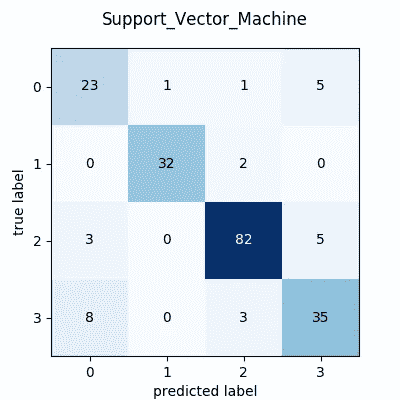
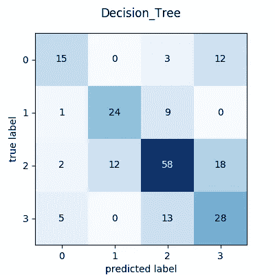

# 你必须知道的 5 个机器学习分类器

> 原文：<https://medium.datadriveninvestor.com/5-machine-learning-classifiers-you-must-know-925655c75e02?source=collection_archive---------8----------------------->

机器学习之旅的最终目的地是达到这样一个阶段，即可以在迄今为止没有人尝试过的数据集或你自己的数据上应用学到的技术。换句话说，就是解决一个尚未解决的新问题。 **MNIST** 和**爱丽丝**的数据很好，但对于刚刚开始的旅程来说是好的。但是我们应该使用什么数据集呢？从现实世界的问题中获取实际数据可能是昂贵的，有时甚至是不可行的，然而，我们可以使用像 **Numpy** 这样的工具轻松地“创建”或“模拟”数据。

在本文中，我们将为 6 个科目的 1000 名学生(您可以轻松地更改数字)创建一个考试结果数据集，范围为 1 到 100(使用 **Numpy 随机选择)。随机)。如果学生在某一科目上的分数低于 33 分，则被视为不及格；如果有两门或两门以上的科目不及格，则被视为总体不及格。我们用“0”表示失败，用“1”标签表示通过。现在，我们已经为二元分类准备好了数据集，我们希望我们的分类器能够学习一些复杂的规则。**

现在，对于多级分类，如果学生的总分分别低于 33 %、高于 60 %、介于 60%和 45 %之间以及介于 45%和 33 %之间，我们会将学生分为 0、1、2 和 3 四类。

我们使用来自 **Scikit-Learn** 的以下五个分类器来完成分类任务。

1.支持向量机

2.逻辑回归

3.朴素贝叶斯

4.决策图表

5.k-最近邻

分类器的性能用混淆矩阵来衡量。

每个分类器都有自己的理论，我们在这里不讨论，但是你可以使用下面给出的参考资料。请注意，我们上面列出的五种算法也可以用于回归目的，我们在这里省略了神经网络，因为它需要更多的代码行来实现。

# 1.创建数据

注意，我们将使用以下两个库 **Numpy** 和 **Pandas** 来创建数据。我们使用 Pandas 数据框架来存储和操作数据。

```
import numpy as np
import pandas as pddef get_exam_data ():
    # create marks for six subjects in the range 0-50
    subjects =      ["Hindi","English","Science","Maths","History","Geograpgy"] # set the seed 
    np.random.seed(seed=167)
    # set the marks randomly
    marks = np.random.randint(100, size=(1000,6)) df = pd.DataFrame(data=marks, columns=subjects)
    df['Total'] =  df[subjects].sum(axis=1) # this is to find whether the student is failed or passed
    # in a subject 

    df1 = df.copy()
    # set the result fail is marks in a subject < 17 for s in subjects:
       df1[s] =[1 if i > 33 else 0 for i in  df[s].tolist()] # get the total 
    df1['Results'] =  df1[subjects].sum(axis=1)
    # declare the result fail (0) if fail in more than 2 subjects df['Results'] = df1['Results'].apply(lambda x : 0 if x <=4 else 1) # get the divison :  1  for > 60 %, 2 for > 45 % and < 60 %, 3 for  < 45 % and > 33 %, # 0 for < 33 % df['Div'] = [1 if i > 360  else 2 if i < 360 and i > 270
     else 3 if i < 270 and i > 198 else 0 for i in df['Total'].tolist() ] # return the result data frame
    return df
```

请注意，仅通过复制和粘贴程序将无法编译，因此要么在粘贴后编辑它，要么从这里的[下载原始程序。](https://github.com/jayanti-prasad/ml-projects/blob/master/exam-results/data_sim.py)

对上述函数的调用程序非常简单:

```
if __name__ == “__main__”:
   df = get_exam_data ()
   df.to_csv(“results.csv”)
```

现在，我们已经创建了写在 csv 文件中的数据，我们可以使用该文件进行分类。

数据的前几行如下:


你可以在这里从[获得完整的数据文件。](https://github.com/jayanti-prasad/ml-projects/blob/master/exam-results/results.csv)

# 2.分类

首先，我们导入所需的库:

```
import sys
import pandas as pd
import numpy as np
import matplotlib.pyplot as plt
from sklearn.model_selection import train_test_split
from sklearn.metrics import confusion_matrix
from sklearn import svm
from sklearn import tree
from sklearn.linear_model import LogisticRegression
from sklearn.naive_bayes import GaussianNB
from sklearn import neighbor
```

现在我们给五个不同的分类器五个函数如下。

```
# 1\. This is for Support Vector Machinesdef svm_clf (x_train, y_train):
    print(“SVM Classifier”)
    #clf = svm.LinearSVC()
    #clf = svm.SVC(kernel=’rbf’)
    clf = svm.SVC(kernel=’poly’, degree=8)
    clf.fit(x_train, y_train)
    return clf# 2\. This is for Logistic Regressiondef logistic_clf (x_train, x_test):
    print(“Logistic Classifier”)
    clf = LogisticRegression(C=1e5)
    clf.fit(x_train, y_train)
    return clf#3\. This is for Naive Bayes

def naive_bayes (x_train, x_test):
    print(“Naive Bayes Classifier”)
    clf = GaussianNB()
    clf.fit(x_train, y_train)
    return clf#4\. This is for Decision Treedef tree_clf (x_train, y_train):
    print(“Decision Tree Classifier”)
    clf = tree.DecisionTreeClassifier(criterion=’entropy’)
    clf.fit(x_train, y_train)
    return clf# 5\. This is knn classifierdef knn_clf (x_train, y_train):
    print(“KNN Classifier”)
    n_neighbors = 15
    clf = neighbors.KNeighborsClassifier(n_neighbors,    weights=’uniform’) clf.fit(x_train, y_train) return clf
```

请注意，您可能需要编辑程序，以确保遵循 python 缩进规则，否则您可以从这里的[直接下载代码。](https://github.com/jayanti-prasad/ml-projects/blob/master/exam-results/classifier.py)

主要程序如下:

```
if __name__ == “__main__”: # Read the data file from sys.argv please change it if you wish 
  df = pd.read_csv(sys.argv[1])
  print(“Input data frame:”, df.shape)
  print(“Columns:”, df.columns)
  data = df.to_numpy()
  X = data[:,1:7] # for binary set
  #Y = data[:,8] # for multi-class
  Y = data[:,9] x_train, x_test, y_train, y_test \
    = train_test_split(X, Y, test_size=0.20, random_state=42) models = [svm_clf, logistic_clf, naive_bayes, tree_clf, knn_clf] conf_mat = [] # Let us iterate over all the five classifiers 
  for m in models:
     clf = m(x_train, y_train) # Now make the prediction 
     y_hat = clf.predict(x_test) # Create the confusion matrix from the 
     # true value and predicted ones
     cm = confusion_matrix(y_test, y_hat)
     print(“Confusion matrix:\n”, cm)
     print(“========”)
```

# 3.准确(性)

我们可以根据混淆矩阵来报告分类器的准确性，混淆矩阵基本上告诉我们有多少个 0 被预测为 0，有多少个 1 被预测为 0，有多少个 1 被预测为 1。

对于二进制情况，我们得到以下混淆矩阵:


对于多类情况，我们得到以下混淆矩阵:



# 4.结论:

在本文中，我们讨论了在 **Scikit-learn** 中为 1000 名学生的模拟考试分数数据集实现的五种不同的分类器。我们可以看到，即使使用默认的参数设置，我们也可以得到相当令人满意的结果。但是，可以通过调整超参数来改善结果。

如果你发现这篇文章请喜欢(鼓掌！)&分享，如果有意见，在这里张贴或邮件给我。你可以从[这里得到完整的代码。](https://github.com/jayanti-prasad/ml-projects/tree/master/exam-results)

# **5。参考文献:**

[支持向量机](https://scikit-learn.org/stable/modules/svm.html)

[最近邻分类](https://scikit-learn.org/stable/auto_examples/neighbors/plot_classification.html#)

[逻辑回归](https://scikit-learn.org/stable/modules/generated/sklearn.linear_model.LogisticRegression.html)

[决策树](https://scikit-learn.org/stable/modules/generated/sklearn.tree.DecisionTreeClassifier.html)

[朴素贝叶斯](https://scikit-learn.org/stable/modules/naive_bayes.html)

[考试成绩数据](https://github.com/jayanti-prasad/ml-projects/tree/master/exam-results)