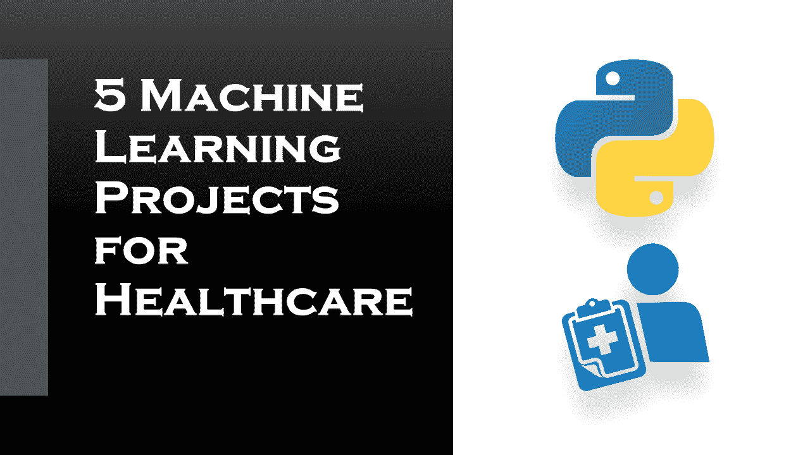

# 面向医疗保健的 5 个机器学习项目

> 原文：<https://medium.datadriveninvestor.com/5-machine-learning-projects-for-healthcare-bbd0eac57b4a?source=collection_archive---------0----------------------->

## 关于医疗保健的机器学习项目得到解决和解释。

电子存储的[医学成像](https://en.wikipedia.org/wiki/Medical_imaging)数据非常丰富，机器学习算法可以输入这种类型的数据集，以检测和发现模式和异常。在本文中，我将向您介绍五个面向医疗保健的机器学习项目。

机器和算法可以解释成像数据，就像训练有素的放射科医生可以识别皮肤上的可疑斑点、病变、肿瘤和大脑出血一样。因此，使用机器学习工具和平台来帮助放射科医生将呈指数级增长。

# 面向医疗保健的机器学习项目

机器学习在世界各地的许多领域都有应用。医疗保健行业也不例外。机器学习可以在预测运动障碍、心脏病、癌症、肺病等疾病的存在/不存在方面发挥关键作用。

如果提前预测，这些信息可以为医生提供重要的信息，然后医生可以为每个患者量身定制诊断和治疗。现在让我们来看看一些医疗保健的机器学习项目。

## 心脏病预测:

在这里，你将了解心脏病的新的可能性。这种机器学习模型的结果将以百分比的形式提供心脏病发生的几率。

 [## 基于机器学习的心脏病预测

### 心脏病描述了一系列影响心脏的情况。心脏病范围内的疾病包括…

thecleverprogrammer.com](https://thecleverprogrammer.com/2020/05/20/heart-disease-prediction-with-machine-learning/) 

## 皮肤癌分类:

皮肤癌是美国最常见的疾病之一。据报道，这一年美国有多达 400 万人死于皮肤癌。在这里，您将学习如何使用机器学习创建皮肤癌分类模型。

这是一个巨大的数字，真的有 400 万人死于皮肤癌。就像所有这些人都快死了，但是这些病例中的一半或者更多，在疾病的早期没有去看医生，而这本来是可以预防的。

 [## 基于机器学习的皮肤癌分类

### 这就是机器学习算法在皮肤癌分类中的作用。正如我前面提到的皮肤…

thecleverprogrammer.com](https://thecleverprogrammer.com/2020/06/29/skin-cancer-classification-with-machine-learning/) 

## 肺部分割:

肺部分割是机器学习在医疗保健中最有用的任务之一。肺部 CT 图像分割是肺部图像分析所必需的初始步骤，它是提供准确的肺部 CT 图像分析如肺癌检测的初步步骤。

Dicom 是医学成像中事实上的存储库。这些文件包含大量元数据。该分析像素大小/粗糙度因分析而异，这会对 CNN 方法的性能产生不利影响。

 [## 基于机器学习的肺部分割

### 在这篇文章中，我将向您介绍机器学习在医疗保健中的应用。我将向您展示我们如何能够…

thecleverprogrammer.com](https://thecleverprogrammer.com/2020/09/06/lung-segmentation-with-machine-learning/) 

## 预测糖尿病:

根据疾病控制和预防中心的数据，目前大约七分之一的美国成年人患有糖尿病。但到 2050 年，这一比例可能会飙升至三分之一。考虑到这一点，我们将在这里学习:学会使用机器学习来帮助我们预测糖尿病。

 [## 用机器学习预测糖尿病

### 根据疾病控制和预防中心的报告，在美国大约七分之一的成年人…

thecleverprogrammer.com](https://thecleverprogrammer.com/2020/07/13/predict-diabetes-with-machine-learning/) 

## 联系人跟踪:

接触者追踪是公共卫生部门用来帮助阻止传染病(如新冠肺炎病毒)在社区内传播的过程。一旦一个人冠状病毒呈阳性，识别出其他可能被确诊患者感染的人是非常重要的。

为了确定受感染的人，当局跟踪在过去 14 天里诊断出的病人的活动。这个过程称为联系跟踪。根据国家和地方当局的不同，可以通过手动方法或数字方法来搜索联系人。

 [## 基于机器学习的接触追踪

### 接触追踪是公共卫生部门用来帮助阻止传染病传播的过程，例如…

thecleverprogrammer.com](https://thecleverprogrammer.com/2020/08/20/contact-tracing-with-machine-learning/) 

我希望你喜欢这篇关于医疗保健机器学习项目的文章。欢迎在下面的评论区提出你有价值的问题。