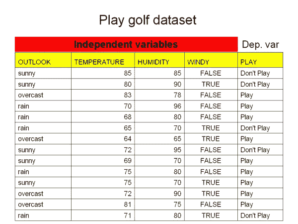
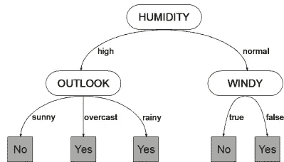
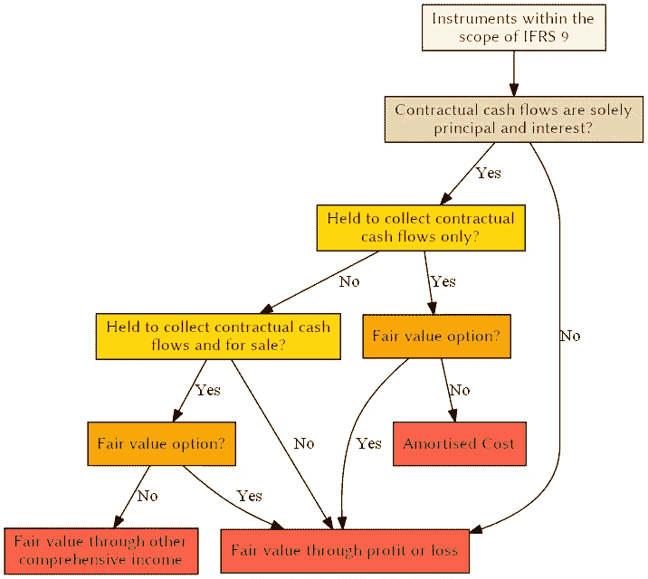
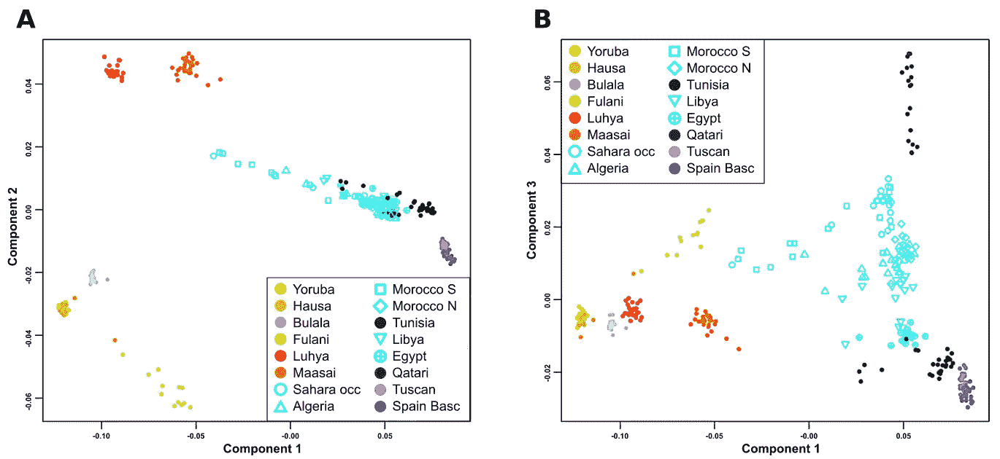

# 机器学习中知识表示的 5 种主要类型

> 原文：<https://medium.datadriveninvestor.com/5-main-types-of-knowledge-representation-in-machine-learning-5aebcbeeff42?source=collection_archive---------6----------------------->

Photo by [Kuma Kum](https://unsplash.com/@kumakum?utm_source=medium&utm_medium=referral) on [Unsplash](https://unsplash.com?utm_source=medium&utm_medium=referral)

这里有许多不同的方式来表示机器学习可以发现的模式，每种方式都规定了可以用来从数据中推断输出结构的技术类型。

一旦您理解了输出是如何表示的，您就已经朝着理解它是如何生成的方向前进了一大步。

在本文中，我将讨论主要的表示类型:

# **决策表**

Decision Table Example

表示机器学习的输出的最简单、最基本的方式是使它与输入相同。

# **决策树**

Decision Tree Example

对于从一组独立实例中学习的问题，分而治之的方法自然会导致一种称为*决策树的表示风格。*

# **分类规则**

classification rules example

分类规则是决策树的一种流行替代方法。

规则的*前件、*或前提条件是一系列测试，就像决策树中节点处的测试一样，而*后件、*或结论给出了适用于该规则所涵盖的实例的一个或多个类，或者可能给出了类的概率分布。

 [## 金融中的机器学习|数据驱动的投资者

### 在我们讲述一些机器学习金融应用之前，我们先来了解一下什么是机器学习。机器…

www.datadriveninvestor.com](https://www.datadriveninvestor.com/2019/02/08/machine-learning-in-finance/) 

# **关联规则**

关联规则实际上与分类规则没有什么不同，只是它们可以预测任何属性，而不仅仅是类，这也给了它们预测属性组合的自由。

为了减少产生的规则的数量，在几个规则相关的情况下，只向用户呈现最强的规则是有意义的。

例如，对于天气数据，我们可以提取以下规则:

> 如果温度=凉爽，那么湿度=正常

# **有例外的规则**

回到分类规则，一个自然的扩展是允许它们有*异常。*

然后，可以通过表达现有规则的例外来对规则集进行增量修改，而不是重新设计整个规则集。

与其改变现有规则中的测试，不如咨询专家来解释为什么新实例违反了现有规则，得到的解释只能用于扩展相关规则。

# **集群**

Clusters Example

当学习了聚类而不是分类器时，输出采用图表的形式，显示实例如何落入聚类。

在最简单的情况下，这涉及到将一个集群编号与每个实例相关联，这可以通过在二维空间中布置实例并划分空间以显示每个集群来描述。

# 结论

知识表示是经典人工智能中的一个关键主题，由 Brachman 和 Levesque 编辑的一系列综合论文很好地代表了这一主题。

我提到了处理不同规则之间冲突的问题。

做这件事的各种方法，称为*冲突解决策略，*已经被开发用于基于规则的编程系统。

这些在基于规则编程的书籍中有所描述，比如 Brownstown 的书。