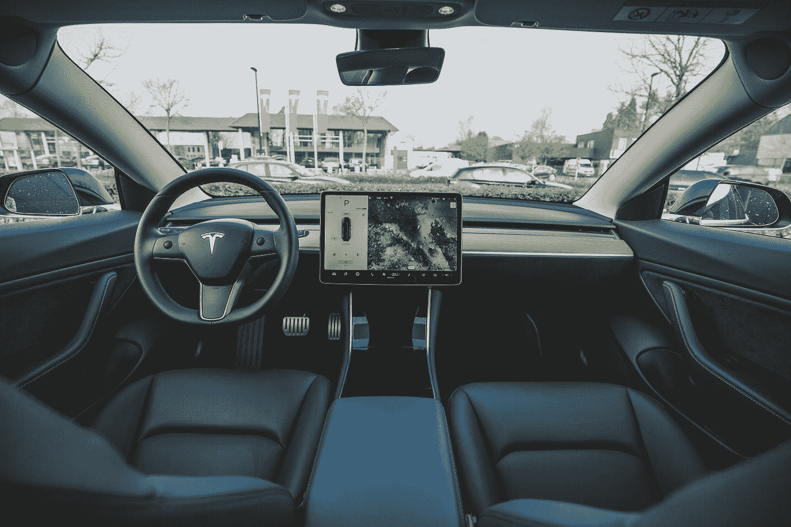
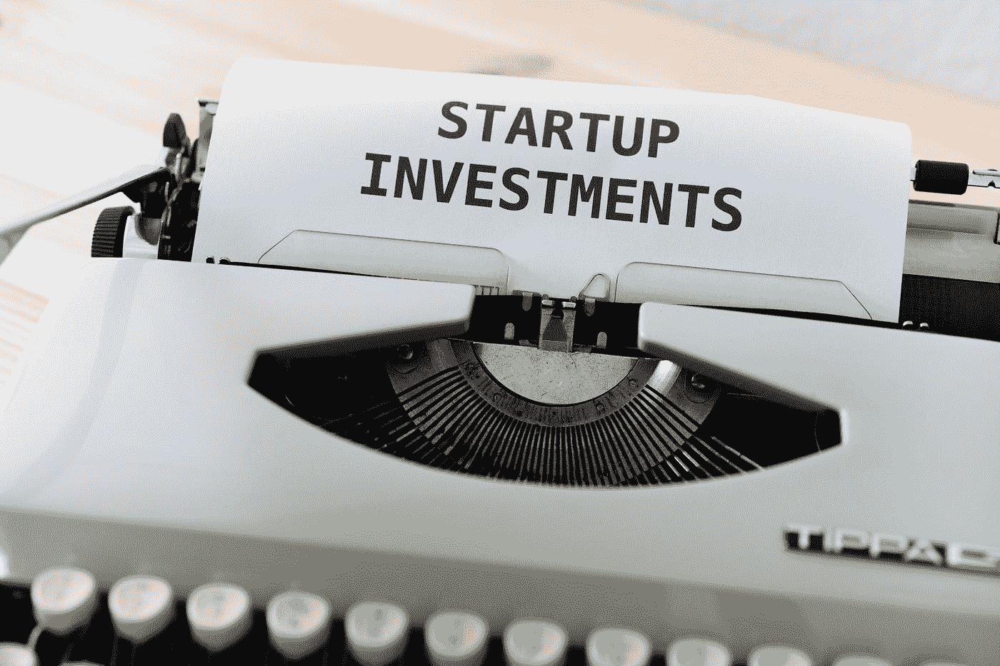
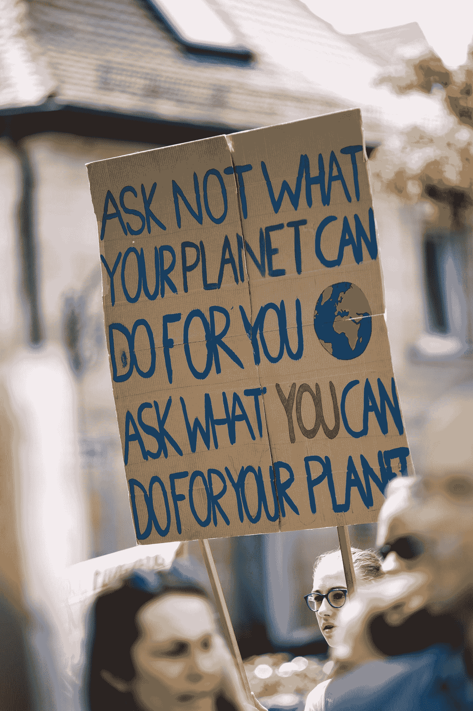

# 5 大颠覆性产业——顶级“拯救地球”技术。

> 原文：<https://medium.datadriveninvestor.com/5-major-disruptive-industries-the-top-saving-the-planet-technologies-ba0710326cca?source=collection_archive---------4----------------------->

## 他们做什么，他们将如何主宰未来

Photo by [Victor Garcia](https://unsplash.com/@victor_g?utm_source=medium&utm_medium=referral) on [Unsplash](https://unsplash.com?utm_source=medium&utm_medium=referral)

弗拉纳根生平第一次去了第五大道。建筑物很高，他看不见天空。马车从他身边匆匆而过。里面的商人们看上去都在盯着对方，抽着他们的大烟。

回到家，年轻的弗拉纳根通常闻到美丽的大草原上无限的鲜花，但在大苹果，马粪的味道令人作呕。他不得不把一条明目张胆的围巾贴近鼻子，不让自己在众人面前呕吐。

他仍然是静止的，这就是那个疯狂世界的魅力。

他的父亲告诉他，他会找到机器，所以弗拉纳根试图看到一些不同于马和马车的东西。人们快速走过，轻轻戳了他一下，但他一动不动地呆了将近 10 分钟。

16 个小时的火车旅行不会阻止这位年轻的发明家实现他来到这个大城市的目标。

突然，有什么东西反射了阳光。朝着他的方向发光的东西。就像在一场奇迹般的运动中，弗拉纳根感到脖子后面一阵刺痛。他的胃翻了个身。泪水充满了他的眼睛。他应付不了他们。他第一次看到了他父亲告诉他的已经存在的东西。他不相信，直到那一天，那一小时，那一时刻。

一种带轮子的机器，它像火车一样冒烟，但在大城市运送小团体的人。

汽油和皮革的气味迷惑了这位年轻的发明家。但它就在那里。就在他面前。一个美丽的女人在丈夫的帮助下从机器上走下来，这台机器被他们称为“汽车”。

像笨重的扶手椅一样建造的座椅非常突出，金色的把手和北欧木质方向盘也是如此。

现在弗拉纳根相信未来将会彻底改变。他父亲是对的。

13 年后，在纽约市，弗拉纳根抱着他 4 岁的儿子，告诉他的父亲:

> 这正是我 13 年前所在的地方，爸爸。这是我第一次看到汽车。看看它，现在！没有马，没有令人作呕的粪便味。没有泥浆和水坑。都很干净漂亮。13 年了，一切都变了。这可能就是技术的力量，就像你经常对我说的那样。弗拉纳根

Photo by [Jez Timms](https://unsplash.com/@jeztimms?utm_source=medium&utm_medium=referral) on [Unsplash](https://unsplash.com?utm_source=medium&utm_medium=referral)

# 技术的目的不是迷惑大脑，而是为身体服务

你必须回到 19 世纪晚期才能看到三个平台同时发展。当时:电力、电话和内燃机。

在接下来的 50 年里，我们经历了蓬勃发展的经济和非常低的通货膨胀率。

这就是颠覆性创新“突然”出现时的作用。

托尼·塞巴在他的一次演讲中解释得比任何人都好。

T 公司聘请麦肯锡公司预测 2000 年手机的使用情况。

他们的 15 年预测是 90 万用户。然而，实际数字是 1.09 亿用户。

它们相差 120 倍。

所以问题是:

> 为什么聪明组织中的聪明人总是无法预测或引领技术变革？

预测**技术融合**太难了。也就是说，你需要让不同技术的确切领域在同一时间汇聚到同一点。

技术融合使得智能手机成为可能。为什么？

不同的技术发展到将一个又大又重的设备转变成一个袖珍设备，在那里你可以存储你的银行账户，你的照片，你的视频，几乎所有的东西。

随着**计算能力**的增加和成本处于通货紧缩曲线。随着**数据存储器**增加其容量并降低生产成本。随着**数字成像**的最大化以及通货紧缩成本曲线。

触摸屏技术、电池成本生产、传感器、全球定位系统和许多其他技术设备都符合摩尔定律。

随着产量的增加，通货紧缩运动使得手机革命成为现实。

Photo by [Bram Van Oost](https://unsplash.com/@ort?utm_source=medium&utm_medium=referral) on [Unsplash](https://unsplash.com?utm_source=medium&utm_medium=referral)

# 只是开车而已。这不是思考。

特斯拉即将彻底改变一个刚刚起步的行业。

通过建立一家以 [**垂直整合**](https://bit.ly/2J9gcQi) 为主要原则的公司，埃隆·马斯克即将彻底改变汽车行业。

然而，它也将启动机器人出租车行业，采用自动驾驶汽车技术。

> 当一家公司控制了生产一种产品或服务的几个生产步骤时，就出现了纵向一体化。换句话说，纵向一体化包括购买和将以前外包的部分生产或销售过程内部化。-投资媒体

马斯克通过改进新工厂的制造技术，将垂直整合推向了极致。随着特斯拉在德克萨斯州奥斯汀和德国柏林建设新的 Giga 工厂，该公司也在工厂建设中采用垂直整合的方式。速度更快，成本更低。

 [## 《星际迷航发现》中的 3 项真正可怕的技术|数据驱动投资者

### 2017 年，随着《星际迷航:发现》的上映，星际迷航积极重返银幕。这个节目…

www.datadriveninvestor.com](https://www.datadriveninvestor.com/2020/05/16/3-real-scary-technologies-in-star-trek-discovery/) 

这就是埃隆赢得比赛的地方！

这不仅是第一个真正对汽车行业产生影响的全电动汽车制造商，而且特别是因为他垂直整合了一些将改变我们所知世界的新平台。含义:

*   机器人技术；
*   能量储存；
*   人工智能。

Photo by [Markus Winkler](https://unsplash.com/@markuswinkler?utm_source=medium&utm_medium=referral) on [Unsplash](https://unsplash.com?utm_source=medium&utm_medium=referral)

# 今天有人坐在树荫下，因为很久以前有人种了一棵树

2019 年， [Ark Invest](https://bit.ly/31kIEVg) 的首席执行官凯西·伍德(Cathy Wood)接受了[的采访](https://bit.ly/3lhaetm)，在采访中，她非常清楚地解释了什么是跨越行业、地域和市场的 5 个平台，但最重要的是，它们相互融合，产生了一场新的创新革命。这些是:

*   DNA 测序；
*   机器人技术；
*   能量储存；
*   人工智能；
*   区块链技术。

在传统的资产公司，比如共同基金，不可能考虑向媒体开放研究知识。这是国家机密。

凯茜·伍德打破了这个概念，她创建了一个投资基金，分享方舟投资公司在社交媒体领域的每一个新趋势和研究。

Ark Investment 在 Youtube 上做月度报告，他们发布年度播客，介绍研究重点中的新想法。

因此，即使是以这种特殊的文化方式作为资产管理者，凯茜也打破了行业的*现状*。

只有在特斯拉被纳入 S&P500 之后，世界其他投资基金才在 2014 年开始追捧新的 reality Ark Investment。

在庞大的共同基金世界里，很多事情将会改变。先锋集团的创始人，金融界最受尊敬的人之一，杰克·博格尔结束了他的一生，帮助宏观经济格局发生了又一次重大转变。

我很荣幸地阅读了 Bogle 的书《坚持到底》,深刻理解了共同基金在金融业务中的重要性。

然而，海啸即将来临，货币体系将会有 180 度的大转弯。

像杰克·博格尔和沃伦·巴菲特这样的人太老了，他们可能不会在这里看到它，但考虑到他们光荣的历程，他们应该得到目睹这一变化的特权。

Photo by [Markus Spiske](https://unsplash.com/@markusspiske?utm_source=medium&utm_medium=referral) on [Unsplash](https://unsplash.com?utm_source=medium&utm_medium=referral)

# 任何足够先进的技术都有别于魔法

我认为我们有幸生活在一个深刻变革的时代。

在接下来的 30 年里，我们将面临许多深刻的变化，无论是在我们从一个地方搬到另一个地方的方式上，还是在我们使用我们的钱或我们的工作报酬的方式上。

服务成本将继续以通货紧缩曲线的形式发展。很大一部分人不需要工作，因为技术会取代很多工作。新的和未出生的工作将会出现。

数以百万计的微小但意义深远的工具将会从所有的新产业中被创造出来以解决全球变暖，使用更少的化石燃料，这样这个后工业革命的时代将会被更清洁和更健康的产业所取代。

我们肯定会指望新的学科，在这个精确的时刻，开发更有效和生态友好的方式来满足人类的需求。这些学科是:

*   深度学习(使用大量数据编写自身的软件)；
*   数字钱包(作为金融界的生态系统出现)；
*   加密货币(从货币体系中分离出来的新经济)；
*   电池成本临界点(电池成本下降等待无止境的应用)；
*   自主出租车网络(每英里成本大幅下降)；
*   下一代 DNA 测序(基因组研究完全紧缩)；
*   CRISPR 基因组编辑用于人类医疗保健(直接解决疾病的根本原因)。

# 结论

我相信我们的城市将会被所有这些正在兴起的新技术彻底改变。无碳城市，更环保，更少噪音。

我真的相信新一代的发明家、企业家和投资者将会与工业革命带来的所有坏事做斗争。

这些年轻的男女将冒着金钱和时间的风险投资在这些破坏性的环境中来拯救地球。

这种变化现在是不可阻挡的。

而这些对大家来说都是好消息！

> 没有变化就不可能有进步；而那些不能改变自己想法的人，什么也改变不了。乔治·萧伯纳

谢谢你，

努诺

## 访问专家视图— [订阅 DDI 英特尔](https://datadriveninvestor.com/ddi-intel)