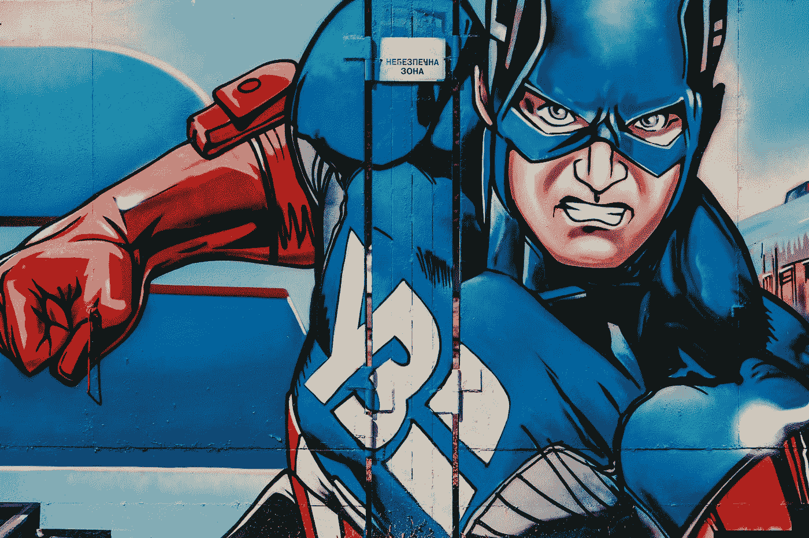

# 5 个微小的步骤将永远杀死消极情绪

> 原文：<https://medium.datadriveninvestor.com/5-micro-steps-that-will-slay-negativity-for-good-b5be6f8aae31?source=collection_archive---------25----------------------->

Photo by [Melody Jacob](https://unsplash.com/@melodyjacob1?utm_source=medium&utm_medium=referral) on [Unsplash](https://unsplash.com?utm_source=medium&utm_medium=referral)

## 轻松产生不可阻挡的动力

你是你自己最大的敌人。放下你自己。认为自己做不到。有人告诉你振作起来会让事情变得更糟。

我去过那里。但我找到了改变模式的方法。

你需要的是真实、简单的具体步骤，在消极情绪增长之前将其粉碎。这比你想象的要容易。

# 解开钩子

在他的书《信心差距》中，拉斯·哈里斯博士谈到了如何摆脱消极思想。就像一条鱼叼走了美味的食物而无法逃脱一样，我们的大脑喜欢接受批评。

通过自言自语，你可以承认这一点，并像格温妮丝·帕特洛(Gwyneth Paltrow)那样*有意识地分开*。

假设你有一个做大笔交易的机会，而你内心的批评者说:*“看看其他人都在做什么，如果你搞砸了，他们会意识到你是个骗子，”*你可以这样回答:

“谢谢你表现出自我怀疑。我看到你在那里，试图阻止我自信地这样做。你可以靠边站，因为我已经考虑过了。这是正确的举措。”

 [## 如何管理优秀的团队和你自己|数据驱动的投资者

### Janice Presser 博士是团队科学及其基础理论的先驱实践者。老生常谈就是说她…

www.datadriveninvestor.com](https://www.datadriveninvestor.com/2020/05/26/how-to-manage-great-teams-and-yourself/) 

> 为什么唯一的自我对话是无益的？用解钩反击。

Photo by [Kyaw Tun](https://unsplash.com/@kyawthutun?utm_source=medium&utm_medium=referral) on [Unsplash](https://unsplash.com?utm_source=medium&utm_medium=referral)

# 前进

许多自助建议会告诉你，没有什么是一成不变的。如果你不前进，你就在后退。这太苛刻了，会导致你给自己施加压力，产生负罪感。

相反，专注于向前迈出任何一步，不管多小。

打一个客户登记电话比不打电话要好。好的，你的每日目标是 5，所以朝着它努力吧。不要自责，也不要打电话。

 [## “比”的非凡力量

### 两个字让你不断进步，即使在困难的时候。

medium.com](https://medium.com/illumination/the-extraordinary-power-of-better-than-7887eb1b2182) 

我们让一个领域的消极思想影响了我们在另一个领域的表现。更糟糕的是，我们不会让反面——来自我们生活另一部分的积极——转移到其他人身上。

如果工作进展不顺利，但你刚刚做了一次很棒的锻炼，从中获得信心。然后在工作中向前迈一小步。写一份待办事项清单。在那封棘手的邮件的 5 分钟内完成一份草稿。

至少你已经开始了。

> ***朝着正确的方向迈出的一小步，仍然是朝着正确的方向迈出的一步。***

Photo by [Nick Fewings](https://unsplash.com/@jannerboy62?utm_source=medium&utm_medium=referral) on [Unsplash](https://unsplash.com?utm_source=medium&utm_medium=referral)

# 分化你的朋友

听起来很阴险，但是很天才。如果你开始对自己感到沮丧或担心某个特定的问题，向朋友寻求帮助。但是给他们不同的角色。

选择一个朋友作为你“抱怨”/“发泄”的朋友。对他们的角色要开诚布公，在他们需要的时候提供同样的服务。

当你说话，你呻吟，你发泄，他们*听着*。他们同情。他们不建议或试图解决任何问题。

再选一个朋友做实践顾问。他们试图帮助你*解决问题，并提供直接帮助。*

选择另一个朋友作为逃亡者。和他们在一起，你可以谈论任何事情，除了你生活中的问题。回忆、开玩笑、谈论体育或电影。

你看这是怎么回事。这就像建立自己的消极破坏朋友复仇者联盟，都有不同的超能力。

Photo by [Марьян Блан | @marjanblan](https://unsplash.com/@marjan_blan?utm_source=medium&utm_medium=referral) on [Unsplash](https://unsplash.com?utm_source=medium&utm_medium=referral)

# 制造骚乱

你正在读这篇文章。你知道有很多自助的方法。这个地方到处都是。因此，选择一篇文章，选择一种技术，并尝试它。

写日记、感恩、冥想——凡是你能想到的，都在这里。试试看。除了试一试，别无他求。有用吗？太好了。如果没有，不要担心，还有很多其他的事情可以尝试。

> ***开始一件事很有趣，感觉像是一个新的开始——这两种属性都是强大的消极挤压器。***

# 更像秘鲁人

我总是喜欢在最后投出一个弧线球。在秘鲁，认为最好的和希望好的结果是国民心理的一部分。

当秘鲁足球队获得 2018 年世界杯参赛资格时——这是自 1982 年以来的第一次——整个家庭都花了毕生的积蓄来参加。他们带着真正的希望和对胜利的期待去旅行。

Photo by [Thomas Serer](https://unsplash.com/@jesusance?utm_source=medium&utm_medium=referral) on [Unsplash](https://unsplash.com?utm_source=medium&utm_medium=referral)

不现实？一点点。

积极？**肯定**。

Mandeep Rai 博士在她的《价值观指南》一书中这样解释道:

> “这种与生俱来的积极性从何而来？秘鲁的土著文化很强，超过四分之一的人口仍然是土著人。作为一名与众不同的秘鲁人，他们感到自豪，并相信这种文化能给世界带来什么。”

你分明是*你*。

在这个星球上没有人拥有你独特的属性、性格和经验。

> 对自己的意义以及你能为这个世界做些什么充满自豪和信念。

消极影响我们所有人。这是生活的一部分。就像人行道上的杂草，时不时会冒出无益的想法。

这是无法避免的。

但是有了挤压技巧，你可以控制消极，为积极、成长和更好的生活留出空间。

## 访问专家视图— [订阅 DDI 英特尔](https://datadriveninvestor.com/ddi-intel)