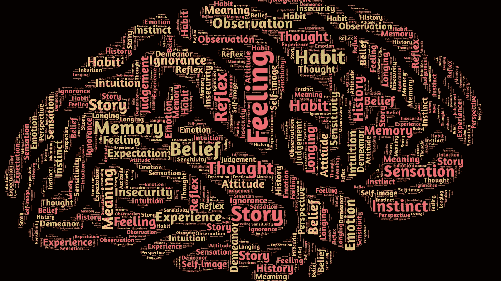
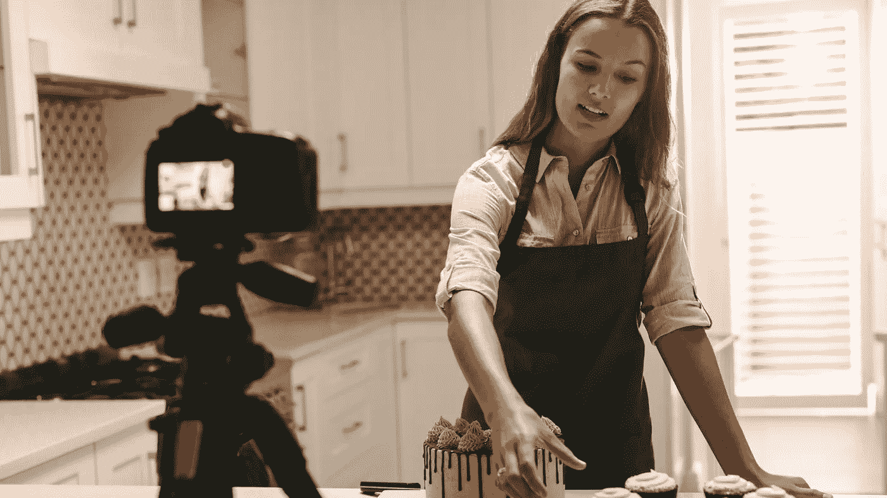

# 带你从贫穷走向富裕的 5 种心态

> 原文：<https://medium.datadriveninvestor.com/5-mindsets-that-take-you-from-poor-to-rich-19d3fcac9eb5?source=collection_archive---------12----------------------->

## 财务独立

## 心态很重要

> “不管你认为你能，还是你认为你不能——你都是对的。”
> 
> ― **亨利·福特**

封锁前，我在酒吧遇到了一个老朋友。我几十年没见他了。

我们点了饮料，我问，“自从我们上次见面后，你的生活怎么样？”

他开始抱怨他的婚姻。不太顺利。他说他的工作很烂，但他需要它来养家。“如果他完成了学业，”他说，“并获得硕士学位，他会比现在多赚 3 倍的钱。”

他说了又说，最后说道:“要是我中了彩票就好了。”

晚会很快就结束了。我开始思考为什么有些人变得富有，而有些人却一直贫穷，即使他们拥有同样的环境和机会。

区别大多是心态。

# 是什么心态？

心态是我们生活、自身和环境中预先设定的一套信念。我们都有。即使你不能用语言表达你的心态是什么，它仍然无意识地在那里。

心态是一个过滤器，它将我们环境的复杂性减少到可消化的部分。它翻转现实，引导我们的思维过程在现实世界中表现行动。

财务思维是我们对金钱的看法。正如亨利·福特已经说过的——如果我们相信富人是邪恶的，我们就会成为我们所相信的人。邪恶是不好的。我们很可能很难变得富有。

这是一生的使命

*   自己的目标，
*   识别冲突的心态，并
*   取而代之的是更好的服务，以最好的方式帮助我们实现目标。

这里有 5 个例子可以帮助你变得富有。

# 储蓄和投资比消费更重要。

> “不要把消费后剩下的钱存起来；而是把省下来的钱花掉。”
> ― **沃伦·巴菲特**

营销帮助人们了解满足他们需求的可能性。在当今世界，我们不断受到商业广告的冲击。

尤其是社交媒体，很多时候卖给我们一个虚假的世界。你还记得那些快乐、健康、穿着得体的人在便宜的度假目的地自拍的照片吗？大部分是假的。

它们展示了人们所认为的富裕生活的样子。现实并没有表现出来。许多富人过着节俭的生活。看看沃伦·巴菲特；他仍然住在奥哈马的房子里。他在 1958 年以 3.15 万美元的价格买下了它——按今天的购买力计算，大约相当于 28 万美元。

富人宁愿存钱和投资，也不愿花钱。

## 如何适应它:

*   无论你什么时候买东西，但在储蓄账户或标准普尔 500 交易所交易基金上花同样多的钱
*   当你的银行账户没钱的时候，停止买东西。
*   等到下一次薪水到来。
*   不要动你的投资和储蓄账户。

# 很少随大流

> “随大流的人通常不会比大众走得更远。独自行走的人很可能会发现自己身处前人未曾到过的地方。”
> 
> 艾伦·阿什利·皮特

世界人口的 99.5%的净资产不到 100 万美元。世界上只有 0.5%的人口拥有超过 100 万美元。

如果你做每个人都做的事，你就会得到每个人都得到的东西。

没什么。

当有人设定了致富的目标时，看看跟随人群的统计数据——这是一个错误的举动。

行动计划必须符合目标。如果你想积累财富，就不要随大流。

**如何应用:**

*   看看你周围的人
*   意识到你很可能也是一样的
*   问问自己:“这是我 10 年后想成为的人吗？”
*   如果答案是否定的:“去网上找和你想成为的人差不多的人。”

而是这样做:

# 你是和你相处时间最长的 5 个人的平均值。

> “给我看你的朋友，我就给你看你的未来。”马克·安布罗斯

励志演说家吉米·罗恩在标题中创造了这句谚语。

如果你的目标是经济独立，那么让你的周围都是富人。

我知道找一群亿万富翁一起出去玩不容易。他们很可能不会等在拐角处，请你加入他们的亿万富翁团伙。

但这是一个很好的想法。沃伦·巴菲特，比尔·盖茨，杰夫·贝索斯邀请你成为亿万富翁之一。十亿人共享，十亿人共享。

## 如何实施:

*   在你走向财务自由的路上，你一定不能马上离开你的世界。开始寻找比你富有一点的人。
*   请想办法和他们谈谈。一旦你拥有了他们所拥有的，找到下一个比你拥有更多的人。
*   我创建了[播客](https://beginnersmind.buzzsprout.com/)来采访成功的投资者和企业家。大多数人喜欢推销自己和他们的公司。
*   阅读亿万富翁或真正富有的人写的书。许多人分享了他们的见解和重要知识。
*   阅读媒体出版物[“成为百万富翁”](https://medium.com/makingofamillionaire)

# 停止消费社交媒体，开始创造

> “电话没有好坏之分，它们只是被发明来为人类服务的没有生命的机器，然而人类却以其永恒的愚蠢将这种交流奇迹变成了心理自杀。”
> ― **Abhijit Naskar，** [**技术的福音**](https://www.goodreads.com/work/quotes/75472123)

纳斯卡先生说得很有戏剧性。

我没看得那么透彻。德西穆斯·朱尼厄斯·尤维纳利斯已经说过，“面包和游戏。”

我相信两者都是我们人类的两种内在需求。吃饭自娱是人之常情。社交媒体为我们所有人打开了娱乐世界。

 [## 成功人生的 25 种自我提升方式|数据驱动的投资者

### “我活得越久，学到的就越多。学的越多，体会的越多，知道的越少。”―米切尔·莱格兰德时间到…

www.datadriveninvestor.com](https://www.datadriveninvestor.com/2019/03/12/25-self-improvement-ways-for-a-successful-life/) 

1993 年以前，要想成为一名艺人，每个人都需要在公司里往上爬。今天这相当容易。

学习一项技能，并在社交媒体上展示。成为创造者。

那就更好了。在 1980 年，一个创作者需要已经达到一定的熟练程度才能赚到足够多的钱。由于社交媒体的存在，每个人都可以记录变得熟练的过程。

这是我第一次从加里·维纳查克那里听到的建议。记录你的旅程。

最棒的是，在 2020 年，一些平台会向创作者支付真金白银，比如 Medium 或 Youtube。

## 如何应用:

*   定义你喜欢的活动
*   学习或提高这方面的技能
*   在社交媒体平台上记录下来
*   努力提高你的技能，而不是浏览社交媒体。

# 我的失败是我的责任。

> "承担责任……责备是淹没许多梦想和关系的水."
> 
> ―史蒂夫·马拉波利

责怪别人，责怪环境就是放弃权力。当我没钱的时候，我可以做两件事:

指责我们的社会，指责税收制度，指责政客，一个我为之浪费了所有金钱的女人，并找到数百万其他理由来证明为什么每个人都强迫我没有钱。

或者

我可以承认我没有钱，并意识到我所拥有的一切都是我自己的决定。努力找出哪些决定在我走向财务独立的道路上误导了我。消除那些糟糕的决定，用更好的代替它们。

这就是我在问责制和责任这两个词中所看到的。

**如何实现:**

*   开始观察你的思维过程。
*   开始观察你说的话。
*   每当你遇到“因为……”这样的句子。我没有钱”或“如果我的老板没有解雇我就好了…”或者类似的，坐下来写下准确的句子
*   然后用一种积极的方式重写这个句子，引导你走向财务自由的目标。
*   比如:“因为父母穷，我没钱。”其实没什么帮助。我会这样写:“目前，我没有钱。为了改变这种状况，我会每天坐下来写 5 份求职申请。”

> “注意你的思想，它们会变成你的话语；注意你的言辞，它们会成为你的行动；注意你的行动，它们会成为你的习惯；注意你的习惯，它们会成为你的性格；注意你的性格，它会成为你的命运。”
> 
> ― **老子**

这就像老子几千年前就说过的。这一切都始于我们如何思考。我们认为我们会得到什么。

如果你想改变你的财务生活，先从改变你的想法开始。这不需要花很多钱。

**更多关于理财素养的故事:** [**点击此处**](https://christian-soschner.medium.com/17-great-stories-on-financial-literacy-4c7cbe5dbb10)

如果你喜欢这篇文章，请在我的其他频道关注我。

自 1999 年以来，我是各行各业公司的执行官、顾问和教练。我专攻企业发展和金融。从种子轮到 IPO 级别。我从 2006 年开始关注生命科学。

# 读者:

 [## 成长和目标:独立

### 什么是成长心态？卡罗尔·德韦克在她的书《心态:成功的新心理学》中写道:“(在成长中…

ecampusontario.pressbooks.pub](https://ecampusontario.pressbooks.pub/growthandgoalsindependent/chapter/what-is-a-mindset/) 

[https://your money line . com/whats-financial-mindset #:~:text = A % 20 financial % 20 mindset % 20 is % 20a，financial % 20 problems % 20 is % 20 _ _ _ _ _ _ _ _ _ s % 20 fault '](https://yourmoneyline.com/whats-financial-mindset#:~:text=A%20financial%20mindset%20is%20a,financial%20problems%20are%20_______'s%20fault')。

 [## 沃伦·巴菲特最节俭的五个习惯

### 试图存更多的钱，还清债务，充分利用你的钱？你可能想尝试像亿万富翁一样生活…

www.businessinsider.com](https://www.businessinsider.com/5-of-warren-buffetts-most-frugal-habits-2017-5?r=DE&IR=T)  [## 随大流的人通常不会比大众走得更远

### 亲爱的报价调查员:以下报价已记入阿尔伯特爱因斯坦和张贴在脸书和各种…

quoteinvestigator.com](https://quoteinvestigator.com/2012/10/18/follows-crowd/) 

[https://www . business insider . com/Jim-rohn-you-the-average of the-five-spend-time-2012-7？r = DE&IR = T #:~:text = David % 20P % 20 brown % 20 motivative % 20 speaker，the % 20 average % 20 of % 20 all % 20 outcomes](https://www.businessinsider.com/jim-rohn-youre-the-average-of-the-five-people-you-spend-the-most-time-with-2012-7?r=DE&IR=T#:~:text=David%20P%20Brown%20Motivational%20speaker,the%20average%20of%20all%20outcomes)。

 [## 尤维纳利斯

### 德西穆斯·朱尼厄斯·尤维纳利斯([ˈdɛkɪmʊs ˈjuːnɪ.ʊs jʊwɛˈnaːlɪs])，在英语中被称为尤维纳利斯(JOO-vən-əl)，是一个罗马人…

en.wikipedia.org](https://en.wikipedia.org/wiki/Juvenal) 

## 访问专家视图— [订阅 DDI 英特尔](https://datadriveninvestor.com/ddi-intel)