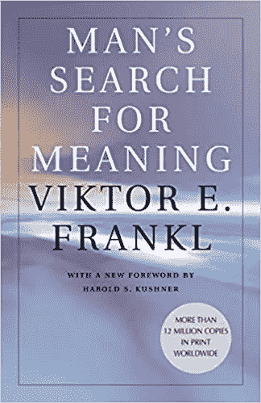
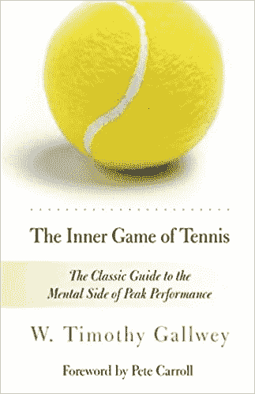
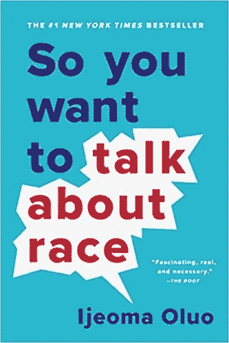
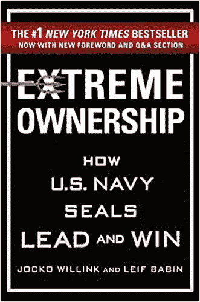

# 2020 年我读过的最有影响力的 5 本书

> 原文：<https://medium.datadriveninvestor.com/5-most-influential-books-i-read-in-2020-5b44acaab72e?source=collection_archive---------19----------------------->

以及其他 49 篇书评

Photo by [Susan Yin](https://unsplash.com/@syinq?utm_source=medium&utm_medium=referral) on [Unsplash](https://unsplash.com?utm_source=medium&utm_medium=referral)

2020 年初，我设定了阅读 12 本书的目标。我认为每月一本书是不合理的。

如果我知道我们将要度过的这一年，我会把我的阅读目标翻两番。由于正常的义务已经耗尽，我被分配了充足的时间来阅读。

结果是 54 本书。在所有的书中，我筛选出了今年最有影响力的五本书。虽然我非常喜欢我的前五本书，但我也相信这些书对任何想要阅读它们的人都非常有益。

一旦你看完了排名前五的书，请随意查看我今年读过的所有其他书的简要回顾。

我们开始吧！

# 1.[原子习惯](https://www.amazon.com/Atomic-Habits-Proven-Build-Break/dp/0735211299)作者詹姆斯·克利尔

我要说的是——每个人都应该读这本书。顾名思义，这是一本关于习惯的书。但远不止如此。

James Clear 从复利的角度解释了习惯的重要性。每天的一个小举动，经过长时间的积累，会变成巨大的变化。他还分解了一个习惯的不同组成部分，以及如何养成(或打破)一个习惯。

市场上的大多数自我发展书籍都因没有提供任何可操作的建议而受到批评。不像其他类型，原子习惯提供了无数的工具来改善你的生活。

这是我全年读过的最有影响力的书。读吧！

# 2.维克多·弗兰克尔著[人类对意义的探索](https://www.amazon.com/Mans-Search-Meaning-Viktor-Frankl/dp/0807014273/ref=sr_1_1?crid=33ZKNT2Z3KBM9&dchild=1&keywords=man%27s+search+for+meaning&qid=1608590889&s=books&sprefix=man%27s+searc%2Cstripbooks%2C162&sr=1-1)

如果你看完弗兰克尔的心理学巨著不质疑你的人生，我作为一个人来质疑你。

弗兰克尔是二战期间生活在集中营的数百万犹太人之一。战前，弗兰克尔是一名住在奥地利的训练有素的心理学家。他在战争中幸存下来，并于 1946 年出版了这本书。

弗兰克尔从心理学的角度讨论了集中营的生活。囚犯的心理构成是怎样的？生存下来需要什么样的心态？在难以想象的苦难中，生命的意义是什么？

这绝不是一本轻松的读物，但它会让你对自己的人生进行深刻的思考。

# 3.[网球的内心游戏](https://www.amazon.com/Inner-Game-Tennis-Classic-Performance/dp/0679778314)作者:w .蒂莫西·盖尔威

一本关于网球的书，真的吗？

你不必是网球运动员也能欣赏这本书。如果你对最高水平的表演感兴趣，或者想指导某人，这本书正适合你。冠军橄榄球教练皮特·卡罗尔为这本书写了序言。这应该告诉你一些事情。

Gallwey 从心理角度分析了多年的网球教练生涯。主题包括视觉化，思想如何与身体互动，以及让你的思想正确参加比赛的关键。

表演心理学是一个不断发展的领域，这本书是最好的之一。我希望我 10 年前就读过这本书，但迟读总比不读好。

# 4.[所以你想谈谈 Ijeoma Oluo 的《种族》](https://www.amazon.com/You-Want-Talk-About-Race/dp/1580056776)

2020 年的一个定义性主题是呼吁社会正义，因为警察对非洲裔美国人的暴行数不胜数。整个夏天，《纽约时报》和亚马逊推荐了大量关于种族和社会公正的书籍。

在我读过的书中，你想谈论种族是最好的。为什么？不是大学教授写的。奥卢开门见山。这感觉就像一场[真实的谈话](https://www.urbandictionary.com/define.php?term=Real%20Talk)对话。没有绒毛或学术术语。

奥卢的风格感觉像是朋友之间关于种族话题的深度对话。概念，如交叉，平权行动，模范少数民族神话，和微观侵略进行了讨论。

无论你是否认同奥卢的信仰，这都是一本发人深省的读物，它将挑战你的信仰。

# 5.[极端所有权](https://www.amazon.com/Extreme-Ownership-U-S-Navy-SEALs/dp/1250067057)作者蒋伟文·威林克&叶小开·巴宾

当前海豹突击队员告诉你责任和所有权时，你会相信他们。

威灵克和巴宾分解了 2006 年左右伊拉克战争的具体任务。这本书的目的是教授有效的领导力。没有比通过生死故事更好的地方来理解如何领导人们了。领导者——在这种情况下，是海豹突击队的指挥官——不仅负责执行最高级别的任务，还负责确保他们部队的安全。

有了这么多的信息，威灵克和巴宾教育他们的读者关于防盗计划、优先排序、确保沟通渠道畅通和决策的重要性。

这是任何想要领导一群人的人的必读之作。

# 2020 年我读过的每本书的超级简评

以下是我今年读过的所有其他类型书籍的简要回顾。尽情享受吧！

*** *注意——任何粗体字的书我都强烈推荐**。任何不是粗体的书我都会推荐，但前提是你已经读过粗体的。

# 商业/领导力

[**零比一**](https://www.amazon.com/Zero-One-Notes-Startups-Future/dp/0804139296) **作者彼得·泰尔&布莱克·马斯特斯** —为任何有抱负的企业家讨论的伟大概念。泰尔将成就伟大事业的要素简化成易于理解的组成部分。

苏世民——如果你想知道一个亿万富翁自我陶醉于他一生中所有的伟大成就是什么样的，请阅读这本书。我们明白了。你捐了钱给耶鲁并且有很棒的想法。有一些有趣的生活教训，但太多的“我是这个星球上最聪明的人。”

格兰特·卡尔多内的 10X 法则——大目标，大梦想。卡尔多内就是设定 10 倍于你想象的目标，10 倍于你想象的努力工作，并在你生活的几乎所有方面实施 10 倍法则。他本可以只说比其他人更努力工作，然后就此打住。

罗伯特·清崎的《富爸爸穷爸爸》——清崎强调停止消费，开始投资的概念。易于阅读，是让你的钱为你工作的好提醒。

[**极端所有权**](https://www.amazon.com/Extreme-Ownership-U-S-Navy-SEALs/dp/1250183863/ref=sr_1_1?crid=2GI5PBKFHX182&dchild=1&keywords=extreme+ownership&qid=1608765366&s=books&sprefix=extreme+ownership%2Cstripbooks%2C158&sr=1-1) **作者蒋伟文·威林克&叶小开·巴宾——参见第五本书**

罗伯特·格林(Robert Greene)的《权力的 48 条法则》(The 48 Laws of Power)——说这本书有争议是一种保守的说法(它已经在[的一些监狱被禁止](https://www.seattletimes.com/nation-world/utah-state-prison-bans-just-2-books-both-on-manipulation/))。格林介绍了 48 种获得、维持和延续权力的不同策略。一些有趣的想法，但对于 2000 年前的帝国皇帝来说会有用得多。至少[一些说唱歌手欣赏这本书](https://www.latimes.com/archives/la-xpm-2006-jul-12-et-48laws12-story.html)。

# 辅导

迈克·沙舍夫斯基——沙舍夫斯基，更为人熟知的名字是蔻驰·K，是有史以来最伟大的篮球教练之一。如果说这本书有什么启示的话，那就是与你领导的每个人建立牢固关系的重要性。这本书充满了关于蔻驰·K 如何与他的球员联系的轶事。我向所有篮球迷推荐这本书。

Urban Meyer——Meyer 曾指导过两个不同的大学橄榄球项目获得全国冠军。他在书中大部分时间都在讨论问责制在他的项目中的重要性。坚实的教练书。

迪恩·史密斯的《卡罗莱纳之路》——我对这本书有点失望，因为我一直很崇拜迪恩·史密斯，他是北卡罗来纳大学教堂山分校篮球项目背后的人。这本书试图将法院的教训应用到执行董事会。这使得这本书比必要的要长。有好的教训，但你必须挖掘它们。

****作者比尔·沃尔什—** 这是我今年读过的所有教练书籍中最好的一本，原因很简单。谈到教练，比尔·沃尔什非常诚实。他承认教练对他的健康造成了精神上的伤害。许多伟大的原则，但你质疑取得成功的成本。**

******科比·布莱恩特**——走进 21 世纪最伟大的运动员之一的内心。用他自己的话来说，科比布莱恩特提供了关于他的准备，竞争意愿和遗产的方法。不管你对科比的看法如何，他成为最好球员的动力是毋庸置疑的。****

# ****社会科学****

****贝弗利·塔图姆的《为什么所有的黑人孩子都坐在自助餐厅里》——这本书不仅仅是它吸引人的名字。塔图姆深入研究了种族动态。这本书篇幅过长，尽管关于混血经历的部分非常值得一读。****

****罗宾·迪安杰罗的《白色的脆弱》——这本书的独特之处在于迪安杰罗深入探究了种族主义背后的心理学。我很欣赏花在个人主义和集体主义并置上的时间，这是我们关于种族理解的许多问题的原因。****

****[**所以你要谈谈种族**](https://www.amazon.com/You-Want-Talk-About-Race/dp/1580056776) **由 ijoema Oluo——见书#4******

****克里斯托弗·阿肯(Christopher Achen)拉里·巴特尔(Larry Bartels)的《现实主义者的民主》(Democracy For realistics)[——读完这本书后，我仍然相信民主，但这是一次侥幸的脱险。阿亨和巴特尔提供了无数关于为什么美国公民不能理性选举总统领导人的研究。这本书最难的部分是适应学术密度。如果你不能理解整本书，读一下导言，你就会明白要点了。](https://www.amazon.com/Democracy-Realists-Elections-Responsive-Government/dp/0691178240/ref=sr_1_1?crid=1RXD7Z9UJFU3B&dchild=1&keywords=democracy+for+realists+by+christopher+achen+and+larry+bartels&qid=1608824569&s=books&sprefix=democracy+for+re%2Cstripbooks%2C160&sr=1-1)****

****[**与陌生人交谈**](https://www.amazon.com/Talking-Strangers-Should-about-People/dp/0316478520/ref=sr_1_2?crid=262JW70955I5T&dchild=1&keywords=talking+to+strangers+malcolm+gladwell&qid=1608826869&s=books&sprefix=talking+to+strangers%2Cstripbooks%2C158&sr=1-2) **马尔科姆·格拉德威尔—** 格拉德威尔用他高超的讲故事技巧解释了为什么我们对人的第一印象很糟糕。他花时间讨论阿曼达·诺克斯的案件，中央情报局的失误，和宾夕法尼亚圣足球丑闻，并把它们编织在一起，形成一个关于第一印象的危险的理论。对于任何想提高社交能力的人来说，这是一本重要的读物。此外，这是马尔科姆·格拉德威尔，所以你真的不会错。****

# ****心理学****

****[**在赌注中思考**](https://www.amazon.com/Thinking-Bets-Making-Smarter-Decisions/dp/0735216371/ref=sr_1_1?crid=6MO7TPRE96C6&dchild=1&keywords=thinking+in+bets+annie+duke&qid=1608825643&sprefix=thinking+in+bets%2Caps%2C159&sr=8-1) **作者安妮·杜克—** 杜克是前世界扑克冠军玩家转行顾问。这本书是关于决策和博弈论的。你不需要理解扑克是如何工作的来欣赏这本书。这是一本非常棒的书，适合任何想要磨练决策技巧的人。****

****[**网球的内在游戏**](https://www.amazon.com/Inner-Game-Tennis-Classic-Performance/dp/0679778314/ref=sr_1_1?crid=298Q07EGEQHXU&dchild=1&keywords=the+inner+game+of+tennis+by+w.+timothy+gallwey&qid=1609016264&s=books&sprefix=the+inner+game+of+%2Cstripbooks%2C156&sr=1-1) **作者 w .蒂莫西·盖尔威—** 参见第三本书****

****乔纳森·海特的《幸福假说》****——很少有书能够结合东西方哲学来理解幸福的途径和意义。这本书做到了。********

******吉姆·阿弗里莫的《冠军的心》——阿弗里莫是一名职业运动心理学家，他训练了无数的奥林匹克运动员。这本书有很多鼓舞人心的话，但没有什么太大的突破。******

******欧内斯特·贝克尔的《否认死亡》——贝克尔在去世前几个月写了这本书。他讨论了人类为了过上有意义的生活而告诉自己的谎言。这不是那种能照亮你一天的书，但如果你对心理学的阴暗面情有独钟，这本书会很有意思。******

**********丹尼尔·吉尔伯特—** 向任何人强烈推荐这本书。吉尔伯特用幽默和智慧来研究为什么人类在回忆过去的经历和预测未来的感受方面如此糟糕。这些缺点的结果是我们无法知道什么最终会让我们快乐。********

****[**人类对意义的追寻**](https://www.amazon.com/Mans-Search-Meaning-Viktor-Frankl/dp/0807014273/ref=sr_1_1?crid=5X5F1IN0S8TE&dchild=1&keywords=man%27s+search+for+meaning+by+viktor+frankl&qid=1609016286&s=books&sprefix=man%27s+searc%2Cstripbooks%2C166&sr=1-1) **作者维克多·弗兰克尔—** 参见第二本书****

****罗伯特·恰尔迪尼——这本书是营销 101。恰尔迪尼提供了一个影响人们购买任何产品或想法的路线图。章节致力于概念，如稀缺，社会证明，权威，和互惠。如果你是销售人员或营销人员，这是必读的。****

****布琳·布朗·布朗的《不完美的礼物》是心理学界的真实性女王。她的讨论重点是展示脆弱性对实现真实性的重要性。一本好书，如果你对自己感到沮丧，需要一个快速振作起来。****

****[**高尔夫不是完美的游戏**](https://www.amazon.com/Golf-Not-Game-Perfect-Rotella/dp/0743492471/ref=sr_1_1?crid=16RWUY9JXZA9Q&dchild=1&keywords=golf+is+not+a+game+for+perfect&qid=1608997148&s=books&sprefix=golf+is+not+a+gam%2Cstripbooks%2C154&sr=1-1) **鲍勃·罗泰拉**——呼吁所有高尔夫球手阅读这本书。Rotella 提供了一个顶级高尔夫球手背后的心理学。每次我去上课，我都会看这本书上的笔记。****

# ****哲学****

****[**障碍是前进的道路**](https://www.amazon.com/Obstacle-Way-Timeless-Turning-Triumph/dp/1591846358) **作者瑞安·哈乐黛—** 这是一本适合任何面临困难的人的完美书籍。《假日》向读者揭示了历史人物一生中遭遇的无数苦难。你会准备好迎接你面前的每一个障碍。****

****[**静止是关键**](https://www.amazon.com/Stillness-Key-Ryan-Holiday/dp/0525538585) **瑞安·哈乐黛**——哈乐黛写的又一经典。他从斯多葛派哲学中汲取教训，并将它们融入我们的日常生活。主题是如何在我们周围的疯狂中达到静止/宁静。****

********马可·奥勒留著—** 这本书收集了罗马帝国最后一位伟大领袖马可·奥勒留的私人想法和日记条目。基于奥勒留思考的智慧和成熟，你会希望今天有更多的领导人像他一样思考。虽然奥勒留不是传统意义上的哲学家，但他的私人日记是所有哲学中最著名的文献之一。******

****弗里德里希·尼采的《论道德谱系》——如果你在寻找悲观主义的健康剂量，尼采就是你要找的人。当谈到宗教的缺点时，这本书感觉像尼采永无止境的咆哮。他还质疑人类赖以生存的道德起源。有趣的东西。****

****艾克哈特·托尔的《现在的力量》——这个教训贯穿始终；活在当下。Tolle 设法用 37 种不同的方式传递同样的信息。****

****[卖掉法拉利的和尚](https://www.amazon.com/Monk-Who-Sold-His-Ferrari/dp/0062515675/ref=sr_1_1?crid=2XLZ1KJL8QDNM&dchild=1&keywords=the+monk+who+sold+his+ferrari+by+robin+sharma&qid=1608928481&s=books&sprefix=the+monk+who+sold%2Cstripbooks%2C160&sr=1-1)作者罗宾·夏尔马——这是一个可爱的寓言，讲述了一个炙手可热的律师抛下他“成功而富有的生活”去当和尚的故事。这位从律师变成僧侣的人回到家乡，从他的僧侣实践中给他的西方朋友上课。俗气的情节线，但值得一读，如果你有心情一个俗气的寓言。****

# ****回忆录****

****[**鞋狗**](https://www.amazon.com/Shoe-Dog-Memoir-Creator-Nike/dp/1501135929/ref=sr_1_1?crid=14UGAIX6VR6OC&dchild=1&keywords=shoe+dog+phil+knight&qid=1608929423&s=books&sprefix=shoe+dog%2Cstripbooks%2C160&sr=1-1) **菲尔·奈特—** 我们认为耐克是世界顶级品牌之一。菲尔·奈特建立今天的品牌有多难？一旦你读完他的回忆录，你就会意识到耐克侥幸活了下来。对任何有抱负的企业家来说，这是一本极好的读物。****

****Tara west over[**教育**](https://www.amazon.com/Educated-Memoir-Tara-Westover/dp/0399590501/ref=sr_1_1?crid=3M5ZXPC4NQD4T&dchild=1&keywords=educated+by+tara+westover&qid=1608929014&s=books&sprefix=educated%2Cstripbooks%2C167&sr=1-1)**——**鼓舞人心，充满力量。对于这本书我不知道还有什么好说的。Westover 讨论了她荒谬的童年以及教育如何改变了她的生活。****

****[**伤不了我**](https://www.amazon.com/Cant-Hurt-Me-Master-Clean/dp/1544507852/ref=sr_1_1?crid=26361UJ7IGQQL&dchild=1&keywords=can%27t+hurt+me&qid=1608929136&s=books&sprefix=can%27t+hurt%2Cstripbooks%2C170&sr=1-1) **作者大卫·高金斯** —看完这篇文章，你会有动力跑过一堵砖墙(请不要)。Goggins 回顾了他的一生，从一个极度肥胖的人到海豹突击队队员再到耐力运动员。这家伙是头野兽。任何渴望最大限度发挥自身潜能的人都应该看看高金的故事。****

****[**我是马拉拉**](https://www.amazon.com/Am-Malala-Stood-Education-Taliban/dp/0316322423/ref=sr_1_2?crid=36D6CQXB6KVDL&dchild=1&keywords=i+am+malala&qid=1608929332&s=books&sprefix=i+am+mal%2Cstripbooks%2C172&sr=1-2) **马拉拉·优素福·扎伊**——尤萨法兹讲述了她在塔利班控制的巴基斯坦长大的生活。她最为人所知的是被塔利班射杀的女孩，但这本书只有一小部分是关于那次事件的。马拉拉认为教育是所有男孩和女孩都应该享有的人权。对任何具有全球意识的公民来说都是很好的读物。****

****米歇尔·奥巴马——米歇尔·奥巴马讨论了在芝加哥长大的生活，以及在公司阶梯上攀登的雄心勃勃的生活，只是为了实现她对公共服务的真正召唤。哦，她随随便便成了美国第一位黑人第一夫人。她的故事有些部分拖拖拉拉，但总的来说很值得一读。****

****安妮·弗兰克写的《一个年轻女孩的日记》**——是安妮·弗兰克。这是她的私人日记。鼓舞人心，深刻，但令人心碎。还需要我多说吗？******

# ******自我发展******

******杰伊·谢蒂的《像和尚一样思考》——谢蒂将和尚的教导融入到西方观众中。使这本书合法的是，谢蒂作为一个佛教僧侣在印度生活了 3 年。使这本书不合法的是作者/有影响力的人对谢蒂的无数指控，指控他剽窃他人的言论并据为己有。很遗憾，因为我喜欢这本书。不管谁说了什么，都有很多好的内容。******

******[**原子习惯**](https://www.amazon.com/Atomic-Habits-Proven-Build-Break/dp/0735211299/ref=sr_1_1?crid=2R8IZPE1759B0&dchild=1&keywords=atomic+habits+james+clear&qid=1609015143&s=books&sprefix=atmoic+habits%2Cstripbooks%2C273&sr=1-1) **作者詹姆斯·明—参见本书#1********

****大卫·爱泼斯坦的 [**范围**](https://www.amazon.com/Range-Generalists-Triumph-Specialized-World/dp/0735214484)**—**这本书讲述了为什么多面手在专注于专业化的世界里茁壮成长。爱泼斯坦违背自己的意愿，承认当有更好的选择时，有时放弃是一个好的选择。这本书最让我欣赏的是你在别处得不到的大量非传统建议。****

****克里斯托弗·j·沃思(Christopher j . Wirth)&克里斯·怀尔德伯格(Chris Wilderberg)的《积极部落》(The Positivity Tribe)**——这是一个关于高中生以及在青少年斗争中保持积极态度的重要性的寓言。快速简单的阅读。强烈推荐给年轻人。******

****乔丹·b·彼得森的《生活的 12 条规则》——让我们开始吧。彼得森可以说是这个星球上最两极分化和最具争议的学术/思想领袖。我尊重他在伦理道德方面的教导。他对性别的观点是他陷入困境的原因。基督教爱他。世俗进步人士讨厌他。你是法官。****

****精神强大的人不做的 13 件事艾米·莫林(Amy Morin)著——我欣赏告诉人们不要做什么而不是总是告诉人们该做什么的书。这本书充满了陈词滥调。阅读不会有坏处，但对那些经历自我挫败思想的人最有用。****

****唐·米盖尔·鲁伊斯****四大协议——空前经典。米格尔·鲁伊斯为你的生活提供了四条人生经验。他让这本书简洁明了——内容丰富，一针见血。********

****Shad Helmstetter 的《自言自语时该说些什么》——这都是关于积极的自言自语。这看起来有点傻，但是 Helmstetter 提供了具体的、可操作的项目来改善你与自己对话的方式。****

****[**加里·查普曼的 5 种爱情语言**](https://www.amazon.com/Love-Languages-Secret-that-Lasts/dp/080241270X/ref=sr_1_2?crid=20YT4CMSSBIT2&dchild=1&keywords=the+5+love+languages+gary+chapman&qid=1608996761&s=books&sprefix=the+5+love+lan%2Cstripbooks%2C162&sr=1-2)**—**不要让标题中的“爱”吓到你。如果你打算改善你生活中的任何关系(浪漫的或柏拉图式的)，这是一本必读的书。查普曼分析了人们喜欢接受爱的五种不同方式。五种爱情语言的概念众所周知，但很少有人读过这本书。让我们改变这一点。****

# ****历史****

****[**历史的教训**](https://www.amazon.com/Lessons-History-Will-Durant/dp/143914995X/ref=sr_1_1?crid=3L68UGHOM7T59&dchild=1&keywords=the+lessons+of+history+by+will+and+ariel+durant&qid=1608999426&s=books&sprefix=the+lessos+of+history%2Cstripbooks%2C160&sr=1-1) **作者威尔&阿里尔·杜兰特——**如果你想用 102 页的篇幅了解这个世界，就去读这本书。探索资本主义和社会主义，贵族和民主，宗教和世俗之间的二分法。****

****[**智人**](https://www.amazon.com/Sapiens-Humankind-Yuval-Noah-Harari/dp/0062316117/ref=sr_1_1?crid=1PS97A4PKHG2C&dchild=1&keywords=sapiens&qid=1608999448&s=books&sprefix=sapiens%2Cstripbooks%2C177&sr=1-1) **尤瓦尔·诺亚·哈拉里—** 一本空前经典的书。谁知道学习历史会如此有趣？我不认为自己是一个历史爱好者，但在完成这本书后，我离历史爱好者又近了一步。****

# ****多方面的****

****[**微小美好的事物**](https://www.amazon.com/Tiny-Beautiful-Things-Advice-Sugar/dp/0307949338/ref=sr_1_1?crid=26RWCK5VKQE05&dchild=1&keywords=tiny+beautiful+things+by+cheryl+strayed&qid=1609015421&s=books&sprefix=tiny+beautif%2Cstripbooks%2C151&sr=1-1) **由谢丽尔误入—** 成为你最好的自我治疗师。这本书收集了从悲剧到关系问题的人们的匿名信。《迷失》就如何应对这些困难的情况提供了建议。充满了机智和幽默，是一个非凡的作家和一个深刻的同情人类。****

****史蒂文·普雷斯菲尔德 [**艺术之战**](https://www.amazon.com/War-Art-Through-Creative-Battles/dp/1936891026/ref=sr_1_2?crid=KL54Y82ZLSP&dchild=1&keywords=the+war+of+art+by+steven+pressfield&qid=1608997588&s=books&sprefix=the+war+of+art%2Cstripbooks%2C161&sr=1-2)**—**不要与*艺术之战*混淆。用这部经典作品挖掘你内心的创造力。普雷斯菲尔德解释说，我们都有创造性的果汁。挖掘我们创造力的方法是战胜我们都经历过的“阻力”。精彩的阅读可以激发你最大的创造力。****

****大卫·爱泼斯坦的《运动基因》——有没有想过为什么肯尼亚和埃塞尔比亚能培养出世界上最好的长跑运动员？爱泼斯坦回答了这个问题，以及本书中关于运动表现背后的科学/生物学的许多其他问题。引人入胜的读物，尤其是对那些喜欢长跑的人来说。****

****[**孤独的反义词**](https://www.amazon.com/Opposite-Loneliness-Marina-Keegan/dp/147113962X/ref=sr_1_1?crid=3F4Y25E91ZP8J&dchild=1&keywords=the+opposite+of+loneliness&qid=1608998441&s=books&sprefix=the+opposite+of+%2Cstripbooks%2C171&sr=1-1) **作者玛丽娜·基冈—** 基冈从耶鲁毕业不到两周就悲惨地死于车祸。剩下的就是她那些会让你感动的短篇小说集。基冈触及了死亡、生命的目的和爱。难以置信的作家。****

****丹·比特纳的《蓝色地带》——蓝色地带是世界上人们寿命最长的地方。Buettner 研究了四个“蓝色区域”,并确定了为什么这些社区的人寿命最长。这本书在锻炼和饮食方面有很大的收获，但也许过于强调轶事故事。****

******喜欢这篇文章吗？订阅**[**Life Tweak**](https://lifetweakblog.com/about/)**有新内容发布时得到通知。******

******访问专家视图—** [**订阅 DDI 英特尔**](https://datadriveninvestor.com/ddi-intel)****