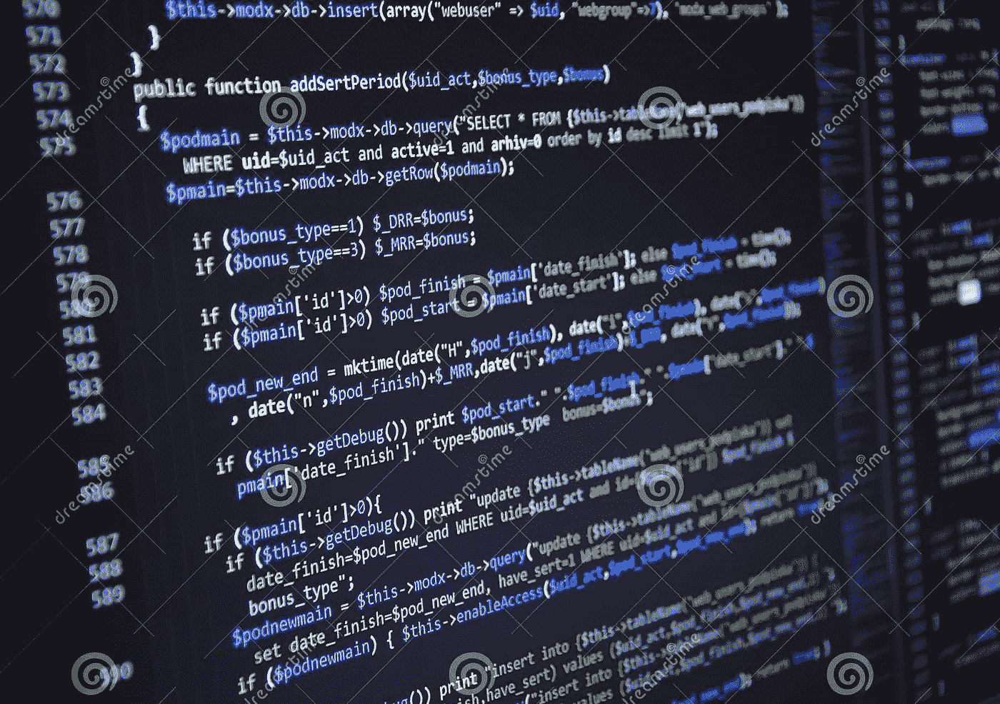

# 关于编码的 5 个误区

> 原文：<https://medium.datadriveninvestor.com/5-myths-about-coding-2bf2d11c42a4?source=collection_archive---------5----------------------->

> “人们不在乎你说什么，他们在乎你建什么。”马克·扎克伯格

神秘的代码行，当被放入机器时，奇迹就发生了。显然，编码可以是魔术，因为它给你打开技术大门的钥匙，但当你掌握了编码或计算机程序的基本原理，它就不再是魔术，而是一门艺术。是的，它更像是一门艺术，而不是科学。编码可以用来将你的想法或创意转化为应用。仍然在这个技术繁荣的时代，许多人仅仅因为一些误解而对进入编码领域犹豫不决。这并不意味着每个人都应该学习或热爱编码。这取决于你的兴趣和激情。无论在哪个领域，追随你的激情都很重要。在这里，我们揭穿了一些关于编码的常见神话，这些神话可能阻止了许多人尝试这一学科。试一试，看看这是不是你喜欢的。试一试也没什么损失。

# **1。编码是关于记忆语法或编程语言的**

许多人认为一个人的编码能力与他所知道的编程语言的数量成正比。诸如“2020 年学习哪种编程语言最好？”或者“哪个是好职业最好的？”源于这种误解。尽管有些语言比其他语言更适合实现某种思想，但所有语言的基础都是一样的。编码与记忆无关。没有一个开发人员知道他正在使用的语言的全部语法。毕竟，如果互联网上有语法，那学习语法还有什么意义呢？Google 和 stackoverflow 是程序员最好的朋友。不需要记忆语法，经过不断的练习，最常用的语法会牢牢地印在你的脑海里。编码是关于学习编程的基本概念，例如变量、数据类型、条件、循环、面向对象的概念等等。编码就是使用这些概念和逻辑来解决问题。这就像一场开卷考试，你有书中的公式或定律，但你必须知道去哪里看。同样，你拥有整个互联网，当你知道在哪里搜索时，你就拥有了它。如果你想把用户给定的两个数字相加，编码员就用这些概念编写一个程序，指令计算机执行这个操作。学会了基础，你就可以在一周内学会任何语言。但是编码不是关于你知道多少种语言，而是关于学会想出一个问题的解决方案。

# 2.编码很难

当你试图走出舒适区时，没有什么是容易的。这适用于一切。编码并不容易，但也没那么难。当你开始学习时，可能会有点困难，但当你通过学习曲线时，就会变得容易得多。慢慢学，慢慢来。没有什么是一夜之间发生的。这需要时间，一旦你学会了基本原则，你就能掌握节奏。

# 3.编码是天才或书呆子的事

事实上，没有什么比得上天才。天才是主观的，当人们提到天才时，他们指的是在他的领域里是专家的人。是啊，人们误解了天才专家。如果你擅长数学，人们会称你为天才，如果你擅长物理，无论是体育还是任何领域，一个在他的领域内的专家被人们认为是天才。顺便说一句，没有必要有高智商，否则编码不是天才的专利。编码更多的是关于决心、耐心和开发人员之间的合作，共同创造创新的东西。正如爱因斯坦所说“并不是我很聪明，只是我能更长久地面对问题。”

# 4.编码很无聊

不，从来没有。当你掌握了基本原理，并成功实施和看到结果时，它会让人上瘾。你会忘记时间。当你得到它的精髓时，你可以用它来代替网飞，电影或连续剧。许多人认为这很无聊，因为他们错误地认为编码就是坐着写一长串代码。那听起来真的很无聊。但在现实中，没有一个编码员会坐上几个小时去编码。开发中的大部分时间花在思考和制定问题的解决方案或将问题分解成更小的组件，然后分析并找到解决问题的方法。当你最终看到自己的代码如你所愿地运行时，那种感觉是无法形容的。你会渴望更多。

# 5.编码没有创造性

有一种误解，认为编码是日常工作或者都是技术性的，只是技术学习或者应用技术。如果你在这样一个不能发挥你创造力的岗位上工作，编码可能会变成例行公事。但多数人不是这样的。仅仅因为在教室里从黑板上抄课文很无聊，并不意味着写作没有创造性。大多数作家都很有创造力，并且正在从事创造性的工作。对于编码人员也是一样。仅仅因为一些公司让你做无聊的编码工作，并不意味着编码没有创造性。大多数程序员都很有创造力，并且在做创造性的工作。我认为当你写一个故事时，你必须设定情节、人物和其他有趣的细节，同样，当开发一个应用程序时，你必须设定设计、模块和功能。你可以完全自由地根据自己的风格混合或操作应用程序，这很有趣。

比起学习数学或其他 STEM 科目，编码更类似于写作和口语。当你写小说、诗歌或公开演讲时，没有记忆，而是一套概念，你可以自由地运用自己的风格来传达你的想法。编码做同样的事情，它给你自由通过应用程序或程序或其他任何东西来表达你的想法