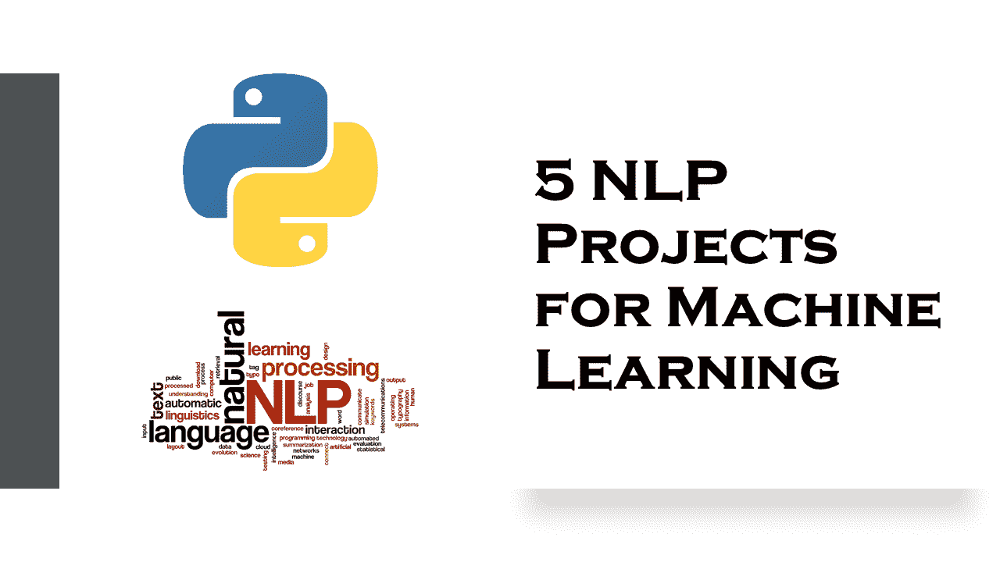

# 机器学习的 5 个 NLP 项目

> 原文：<https://medium.datadriveninvestor.com/5-nlp-projects-for-machine-learning-72d3234381d4?source=collection_archive---------2----------------------->

使用 Python 解决和解释了 5 个机器学习的自然语言项目。

自然语言处理(NLP)包括开发能够理解人类语言的应用程序和服务。NLP 的一些实际例子是语音识别，例如，Google 语音搜索、理解内容或分析情感等。在本文中，我将带您了解一些对机器学习非常有用的 NLP 项目。

# NLP 项目

## 其他语言的 NLP

自然语言处理(NLP)是机器学习中处理语言的一项伟大任务。然而，你一定见过在 NLP 的任务中，每个人只用英语工作。那么我们的其他语言呢。在这里，您将学习如何使用机器学习为其他语言实现 NLP。 [**多见**](https://thecleverprogrammer.com/2020/09/09/nlp-for-other-languages-with-machine-learning/) 。

## 命名实体识别(NER)

命名实体是指任何真实世界的物体，比如一个人、一个地方、任何组织、任何有名字的产品。比如——“我叫阿曼，我和一个机器学习训练员”。在这个句子中，名称“Aman”、领域或主题“机器学习”和职业“培训师”是命名实体。在机器学习中，命名实体识别(NER)是自然语言处理的一项任务，用于识别某段文本中的命名实体。 [**见全图**](https://thecleverprogrammer.com/2020/08/04/named-entity-recognition-ner/) 。

## 使用 Python 翻译

你曾经尝试过用谷歌翻译任何文本吗？当我过去学习德语时，谷歌在我的作业中给了我很大的帮助，这样做既简单又有帮助。你知道谷歌是怎么做到的吗？谷歌开发人员已经创建了一个 API 来完成这一切。现在，如果你想用 Python 翻译呢？Python 是一种简单明了的通用编程语言，它为几乎所有的任务提供了包。 [**参见如何使用 python**](https://thecleverprogrammer.com/2020/08/10/translate-using-python/) 翻译语言。

## WhatsApp 群聊分析

所以我是一个名为“数据科学社区”的 WhatsApp 小组的成员，最近我想探索这个小组的聊天并对它做一些分析。如果你不知道如何从任何聊天中提取信息，那么只需打开任何聊天，点击上面的 3 个点，选择更多，然后选择探索聊天，并通过任何方式分享，最可取的是您的电子邮件。 [**参见如何分析 WhatsApp 与 NLP** 的聊天记录](https://thecleverprogrammer.com/2020/08/06/whatsapp-group-chat-analysis/)。

## 用 NLP 构建聊天机器人

Python 提供了一个非常有用的库，称为 NLTK，可以用它来用 python 构建一个聊天机器人应用程序。聊天机器人是一种计算机程序，它被设计成能与人互动。聊天机器人被设计成根据用户的询问和对话来回复用户。如果你认为聊天机器人是一项新技术，那你就错了。第一个聊天机器人 Eliza 是由 Joseph Weizenbaum 于 1966 年在麻省理工学院的人工智能实验室建造的，旨在模仿人类对话。 [**学习如何使用 NLP**](https://thecleverprogrammer.com/2020/05/17/build-your-own-chatbot-with-python/) 创建聊天机器人。

我希望你喜欢这篇关于机器学习的 NLP 项目的文章。以上所有 NLP 项目都用 [Python](https://www.python.org/) 的实现来解释。欢迎在下面的评论区提出你有价值的问题。