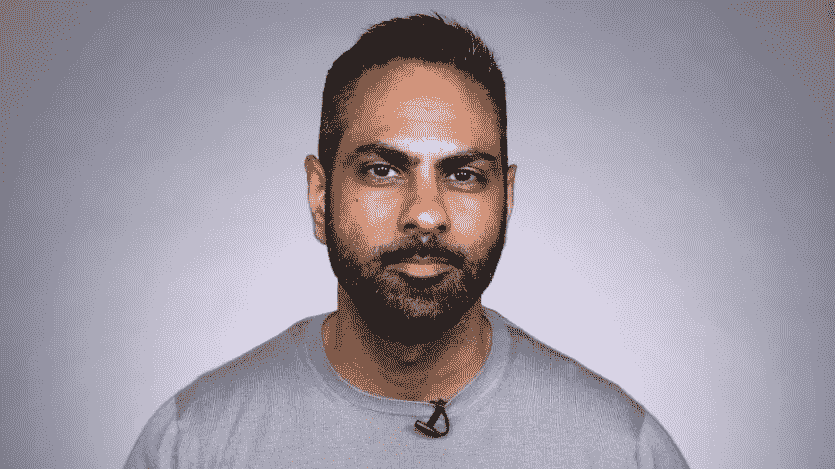
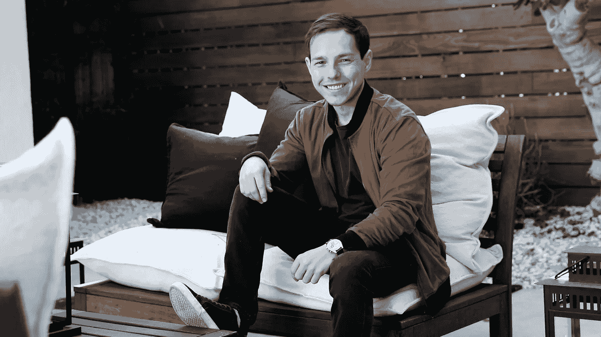
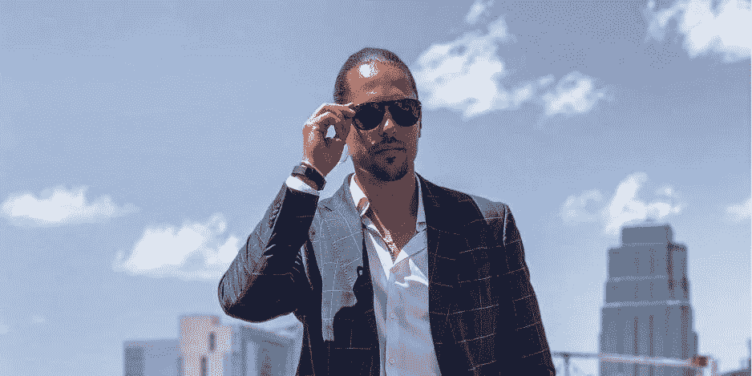
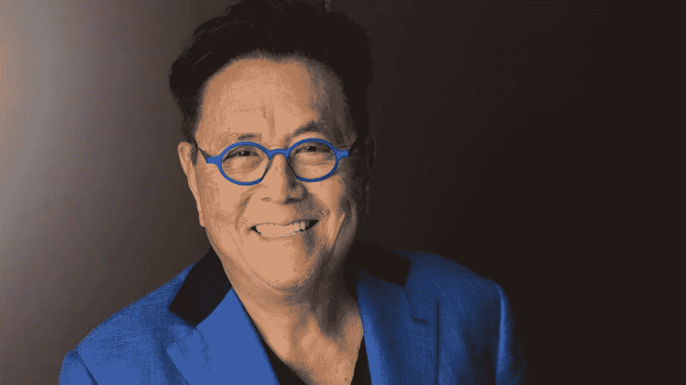
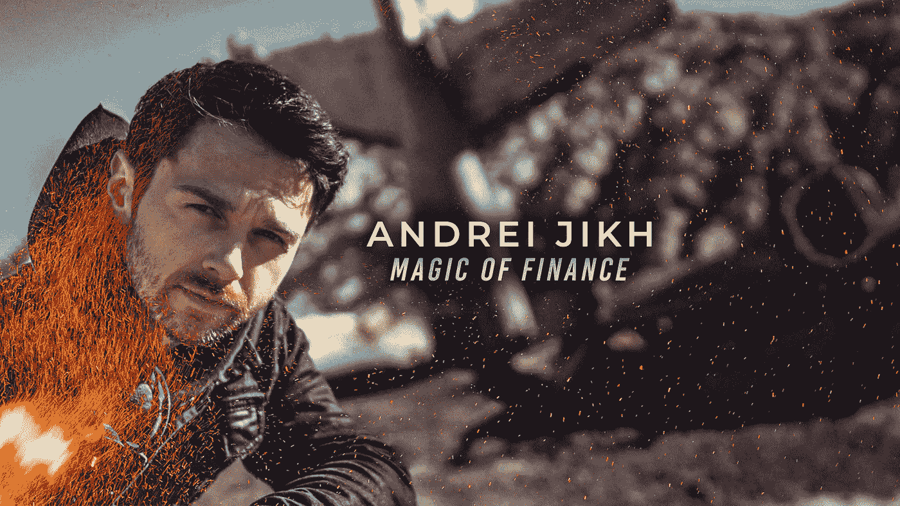

# 5 个能让你变得富有的个人理财影响者

> 原文：<https://medium.datadriveninvestor.com/5-personal-finance-influencers-who-can-help-make-you-wealthy-aa65da65a1af?source=collection_archive---------5----------------------->

我们追随“有影响力的人”，在健身、饮食和时尚等方面获得灵感和指导，但我们往往会忘记了解个人理财和投资的最新动态。这些有影响力的人分享关于个人理财的教育(和娱乐)内容，而不是耍花招或推销“快速致富”计划。

# 拉米特·塞西

Ramit Sethi 是一名美国个人理财顾问和企业家。他是《纽约时报》*畅销书 [***我会教你变得富有***](https://amzn.to/2FMdtKk) *，*GrowthLab.com 的主人，[IWillTeachYouToBeRich.com 的主人](https://www.iwillteachyoutoberich.com/blog/)的作者。*

*Sethi 通过采用长期和全面的方法来管理您的资金，帮助人们理顺财务并变得富有。*

*塞西最大的原则之一是，你应该在能带给你快乐的事情上多花钱，在不能带给你快乐的事情上少花钱。这可能意味着租一个更便宜的公寓，在食物上花更少的钱，这样你就可以更多地旅行和看世界。*

> *"在你喜欢的东西上挥霍，在你不喜欢的东西上无情地削减开支。"*
> 
> *― **Ramit Sethi，** [**我会教你变得富有**](https://amzn.to/2FMdtKk)*

*[***在 Instagram 上关注 Ramit Sethi***](https://www.instagram.com/ramit/)*

# *格雷厄姆·斯蒂芬*

**

*Graham Stephan 是一名美国房地产经纪人，也是 YouTube 上的名人，他最出名的作品是关于实现财务独立、投资金钱和投资房地产的视频。*

*他创建了自己的 YouTube 频道，分享他在房地产行业的经验，并为人们提供开始投资所需的知识。Stephan 目前在他的主要 YouTube 频道上有超过 220 万订户。*

* [## 我们需要现在就开始在教育中教授个人理财|数据驱动的投资者

### 如果这场危机教会了我们什么的话，那就是似乎没有人知道我们的金融市场发生了什么…

www.datadriveninvestor.com](https://www.datadriveninvestor.com/2019/11/26/we-need-to-start-teaching-personal-finance-in-education-now/) 

除了在 YouTube 上分享内容之外，Graham Stephan 还拥有多处租赁房产，并在北美四处演讲，教授新投资者如何购买房地产。斯蒂芬最近推出了房地产代理学院，该学院涵盖了许多与他的 YouTube 频道相同的主题，但更加详细和深入。

> “不要用你没有的钱去买你买不起的东西，去打动你不喜欢的人。”
> 
> — **格雷厄姆·斯蒂芬**，*为什么我是一个财务极简主义者*

[***在 Instagram 上关注 Graham Stephan***](https://www.instagram.com/gpstephan/)* 

# *哈里森·奎因*

**

***哈里森·奎因**是一名财务顾问和连续创业者，专注于为创业者、职业运动员和其他年轻专业人士提供整体财务规划。奎因也是 HDQ 财富的创始人和管理合伙人。他推动公司的方向和增长，同时与客户合作，帮助制定和坚持定制的财务计划。*

*在进入金融行业之前，奎因花时间从事房地产工作，管理夜总会，创办商业无人机摄影公司，并作为模特在世界各地工作。奎因利用这一广泛的经验来帮助各行各业的人理顺财务。*

*哈里森最重要的信息之一是改变我们看待退休的方式。传统的储蓄 30-40 年并在 65 岁退休的方法对许多人不再适用。哈里森知道企业家和职业运动员有独特的财务需求，可能需要采取不同的方法来实现财务独立。*

> *“这是一种微妙的平衡，一方面不做爱，另一方面又太在乎伤害。我对我的生意、我的客户、我的家人和我的朋友投入了这么多，但其他的一切似乎都没有什么分量。如果你不是我生活中积极的一部分，同时改善你自己的生活，你很可能是我不必要的一部分。”*
> 
> *—哈里森·奎因*

*[***在 Instagram 上关注哈里森·奎因***](https://www.instagram.com/harrisondquinn/)*

# *罗伯特·清崎*

**

*罗伯特·清崎是一位企业家、教育家和投资者，他认为世界需要更多能够创造就业机会的企业家。罗伯特清崎也是有史以来排名第一的个人理财书籍— [***富爸爸穷爸爸***](https://amzn.to/34vneXS) 的作者。在《富爸爸穷爸爸》中，清崎解释了“富有心态”和“贫穷心态”的区别，以及人们看待金钱的不同方式。*

*清崎通过书籍、视频和播客向人们提供个人理财和商业建议。*

> *我们去学校学习努力工作赚钱。我写书，创造产品，教人们如何让钱为他们努力工作。”*
> 
> **—罗伯特·清崎**

*[***在 Instagram 上关注罗伯特清崎***](https://www.instagram.com/therealkiyosaki/)*

# *安德烈·吉赫*

**

*Andrei Jikh 是一个制作关于个人理财、投资和“理财极简主义”视频的 YouTuber 视频网站。他的 YouTube 频道目前有 85.5 万订户。在 YouTube 之前，Andrei 已经出现在许多在线、电视和电影出版物中，如史蒂夫·哈维、GoPro、Nat Geo 的大脑游戏、iTunes & NBC。*

> *“我就像哈利·波特——如果他是一个财务极简主义者，玩纸牌魔术，担心钱。”*
> 
> *安德烈·吉赫*

*[***在 Instagram 上关注安德烈·吉赫***](https://www.instagram.com/andreijikh/)*

***访问专家视图—** [**订阅 DDI 英特尔**](https://datadriveninvestor.com/ddi-intel)*