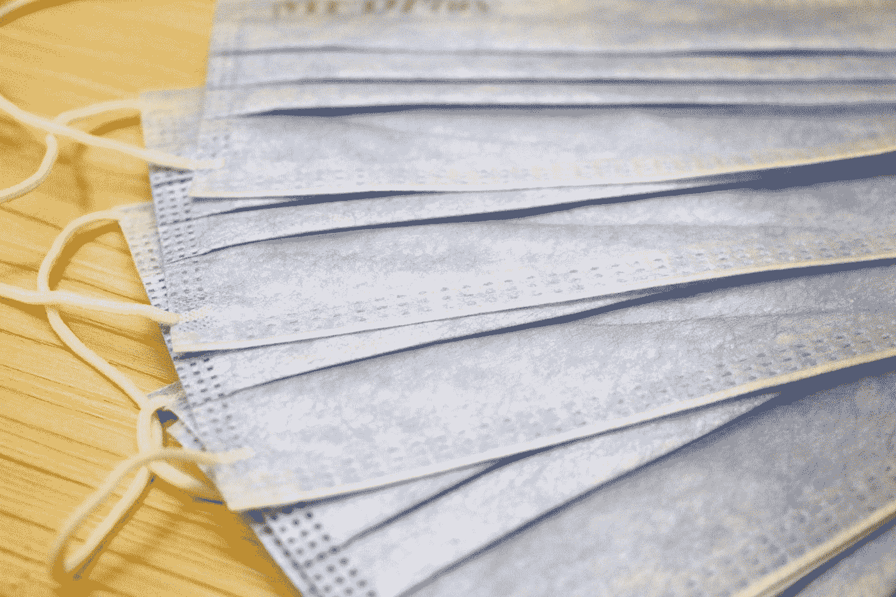

# 从冠状病毒爆发中我们可以学到的 5 条个人理财经验

> 原文：<https://medium.datadriveninvestor.com/5-personal-finance-lessons-we-can-learn-from-the-coronavirus-outbreak-d783b70532d3?source=collection_archive---------23----------------------->

## 个人理财

## 在目前的情况下如何管理你的钱

Photo by [Macau Photo Agency](https://unsplash.com/@macauphotoagency?utm_source=medium&utm_medium=referral) on [Unsplash](https://unsplash.com?utm_source=medium&utm_medium=referral)

我一直在考虑是否应该写一篇关于冠状病毒或新冠肺炎的文章。当我现在写这篇文章的时候，事情似乎每天都在变得更糟，一些国家的病例增加了一倍，处于封锁状态，并关闭了边境。

我讨厌在已经拥挤的情况下再增加噪音。这并不是说人们对现在的一切不感到困惑和担忧。

但是这个疫情有一个方面我一直在关注，自从它在中国武汉刚刚开始的时候。由于我生活在一个以中国为其最大贸易伙伴的国家，我看到了该地区市场如何开始呈现出下降趋势，尽管华尔街的每个人仍在享受牛市。

 [## 外汇投资如何帮助偿还债务|数据驱动的投资者

### 外汇是对外汇市场的投资，不同国家的货币在外汇市场上进行兑换

www.datadriveninvestor.com](https://www.datadriveninvestor.com/2019/02/13/how-forex-investment-helps-to-repay-your-debts/) 

我想知道冠状病毒会如何破坏我们的经济，以及它会如何影响我们个人的财务状况。

在过去的几周里，我的担心似乎开始成为现实。我们已经看到一些中断已经发生，从来自中国的[供应链中断](https://hbr.org/2020/02/how-coronavirus-could-impact-the-global-supply-chain-by-mid-march?ab=hero-subleft-1)到[股市崩盘](https://www.washingtonpost.com/us-policy/2020/03/12/markets-stocks-today-coronavirus/)。

我忍不住记下了什么样的财务策略可以帮助我们度过这个疫情。

## 1.拥有一笔应急基金不会比现在更重要

不管是不是冠状病毒，拥有应急基金永远是个人理财的第一建议。在开始其他类型的金融投资之前，它与“摆脱债务”作为首要任务竞争。

如果有什么不同的话，冠状病毒有助于强调应急基金的重要性。当我们真的无法预测我们的生活、工作、健康等下一步会发生什么时，应急基金可以在不确定的时候给你安全感。

专家建议用三个月的生活费作为应急基金。有的争论半年到一年。如果你有受抚养者(如孩子)，就更多。应急基金必须是流动的。需要的时候应该能马上拿到。

## 2.投资的关键仍然是多样化

2008 年经济衰退发生时，我还是一个刚出生的孩子。我从未亲身经历过它的严重性以及它如何影响许多人的生活。

因此，随着即将到来的可能由冠状病毒引起的衰退，我即将经历我作为一个成熟成年人的第一次重大经济事件。

冠状病毒在投资方面教给我们的第一件事是，始终分散投资是多么重要。没有所谓的安全港。上周，黄金价格经历了自 1983 年以来最大的周跌幅。债券是我最喜欢的规避风险的投资之一，其收益率为负 2%以上。而且不要谈股权(简直是灾难)。

“不要把鸡蛋放在一个篮子里”这句古老的格言在现在看来再正确不过了。通过分散投资，你可以降低整体资产因市场崩溃而过度贬值的风险。这也有助于避免随之而来的压力和其他情绪影响。

在决定把你的血汗钱放在哪里时，看看各种各样的机会总是值得的。此外，定期调整投资组合以适应当前的经济形势也很重要。

## 3.有额外的收入来源会有所帮助

随着我们经济中的所有干扰，我们中的一些人可能会面临不幸的情况，如减薪、[无薪假](https://www.scmp.com/news/hong-kong/transport/article/3052519/more-25000-cathay-pacific-employees-take-unpaid-leave)，以及企业主客户的减少。

这表明不仅从一只以上的鸡身上获取鸡蛋是多么重要。许多人瞄准多种收入来源，以此来获得更多的钱。但本质上，从冠状病毒的角度来看，当你不能做你的主要工作时，它仍然有一个收入流。

在这种情况下，有一份被动收入也是有用的。任何需要很少或不需要维护的收入流都将真正有所帮助，例如在最糟糕的情况下，当你不幸感染了病毒，根本无法工作。

## 4.预算/优先化总是一个值得保持的习惯

由于冠状病毒，许多人可能会经历收入下降和意外支出，现在我们别无选择，只能真正思考什么是重要的，什么是不重要的。

你管理开支的能力将会受到考验。在资源有限的时候，留心你如何花钱是一个习惯，你会感谢自己练习了一段时间。

## 5.即使在看似悲观的时候，也有机会

冠状病毒也为我们提供了几个金融机会。一个例子是股票市场。现在股票很便宜。有一场我们多年未见的大拍卖正在进行。根据冠状病毒的情况如何发展，价格甚至会变得更便宜。这可能是你囤积一些并在经济复苏时获得巨额利润的时候了。

当然，当世界处于恐慌状态，持有现金似乎是最明智的事情时，这不是一件容易的事情。

但是对于那些应用以上四点的人来说，从有一个应急基金来管理他们的开支，他们会有所准备。他们会少些恐惧。因此，他们很容易清醒地看到形势，甚至在这个看似悲观的时期发现机会。

## 但是我们当中有多少人没有做好准备呢？我们现在能做什么？

你可能还没有应急基金。而且有多种收入来源也不是一朝一夕能做到的。你可能会把 70%的资产投入股票，等等。

**但是你总是可以开始预算并优先考虑你的开销**。我认为首先要从这一点开始。不要在网上订购衣服(封锁期间你不得不呆在家里，你将有很多时间浏览网上购物网站)，列出并计划你可以储备的基本需求。计划也有助于确定我们实际需要多少，所以没有人会不负责任地囤积卫生纸而不考虑其他人。

**此外，不要在封锁期间大吃网飞，学习一项新技能**。要有多种收入来源，你需要多种多样的知识和技能来支持你的努力。你也可以磨练一个被遗忘的爱好，磨砺一个现有的静物，或者做你的副业。目前，有大量的空闲时间。

如果你把鸡蛋放在一个篮子里。我发现这篇文章对股市崩盘时该怎么做很有帮助。然而，每个人的投资组合是不同的。因此，我的总体建议是做你觉得舒服的事情，做你认为最好的事情。