# 5 只制药股努力压垮新冠肺炎

> 原文：<https://medium.datadriveninvestor.com/5-pharma-stocks-working-to-crush-covid-19-eecec6c83add?source=collection_archive---------26----------------------->

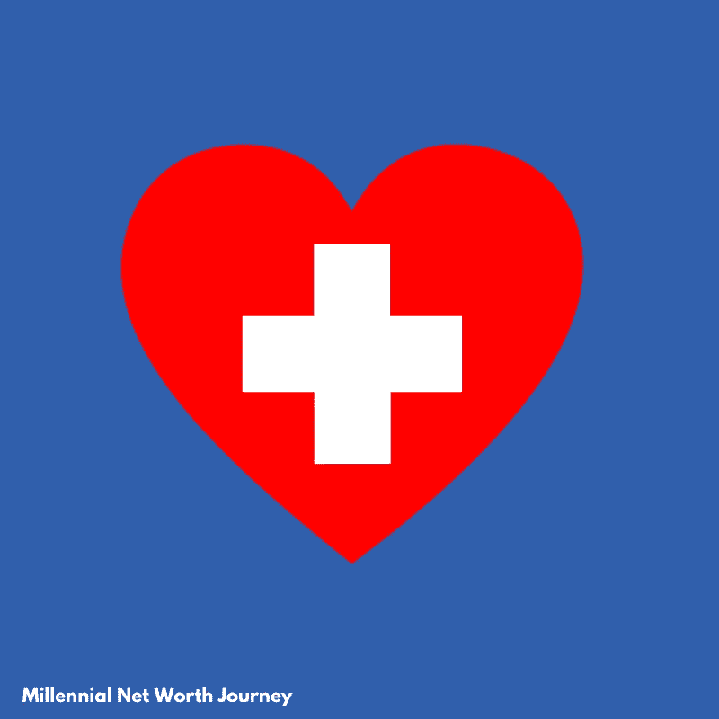

Image is Authors own created with Canva.

随着新冠肺炎·疫情对医疗保健和制药行业的关注，我认为进一步研究这些股票会很有意思。

我将要写的这些公司处于用他们的药物、产品和设备对抗疫情冠状病毒的最前沿。

这些股票的有趣之处不仅仅在于它们正在研究冠状病毒的疫苗或治疗方法；他们提供能够实现有效医疗保健的产品。

他们处于一个独特的位置，可以从几个角度解决这个问题。

# 强生公司

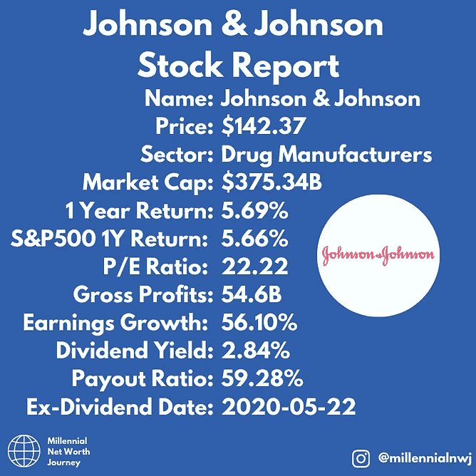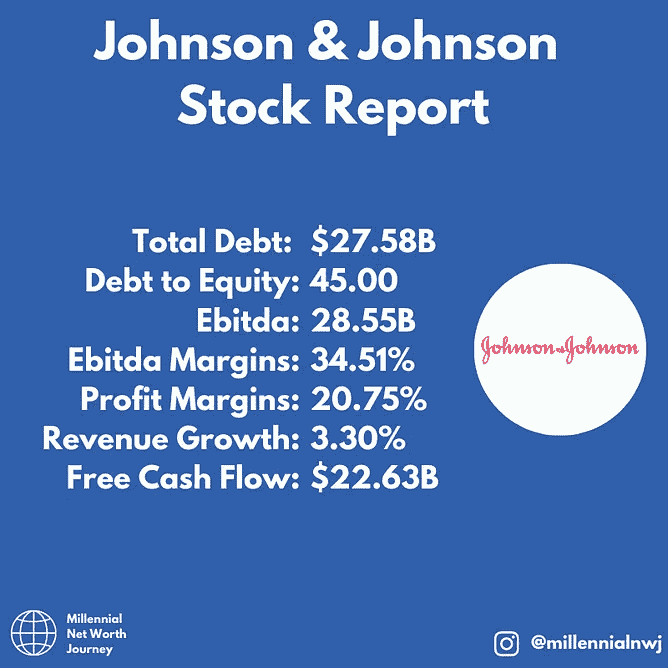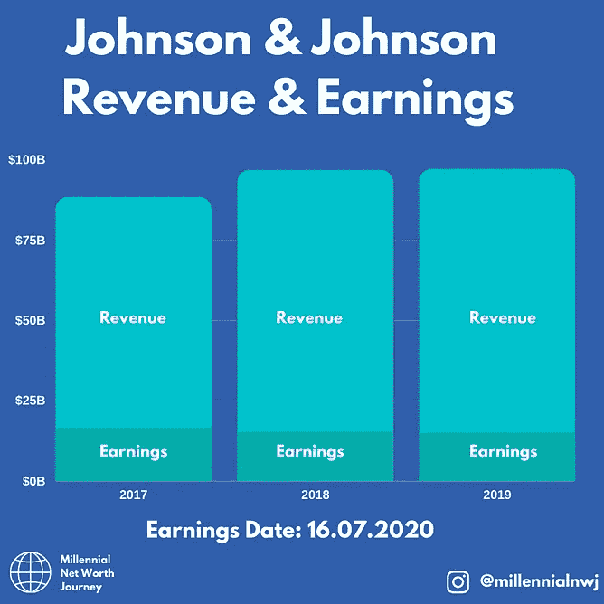

[Images from @millennialnwj on Instagram.](http://www.instagram.com/millennialnwj)

我们从市值最大的强生公司开始。

强生公司在全球范围内研发、生产和销售医疗保健领域的各种产品。它分为三个部分:消费品、药品和医疗器械。

 [## 商业无国界:如何走向全球？数据驱动的投资者

### 首先，你要形成你的主要目标。例如，寻找投资，固定你的市场…

www.datadriveninvestor.com](https://www.datadriveninvestor.com/2020/07/14/business-without-borders-how-to-go-global/) 

从公司的基本面来看，他们似乎健康状况良好。他们将在几天后发布下一期收益，他们正在研发新冠肺炎疫苗。如果这种疫苗的第二阶段临床试验数据是积极的，这可能会大大促进他们的销售和声誉。

# 默克公司

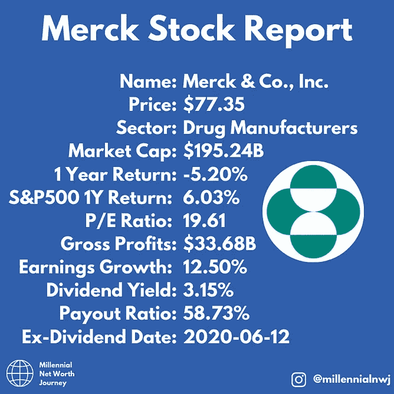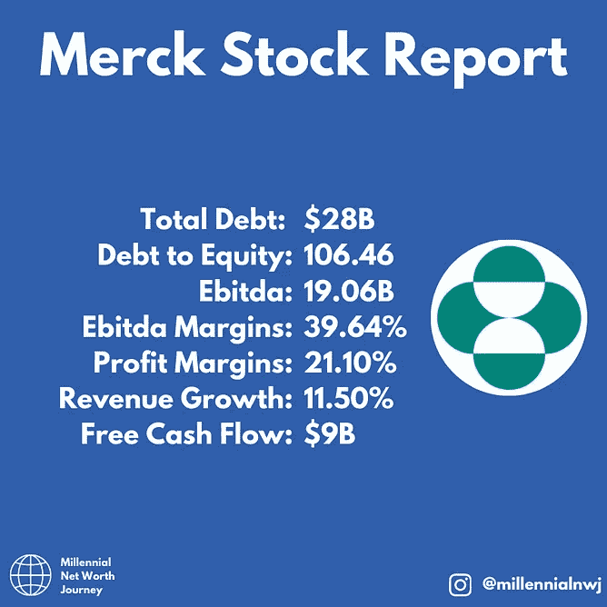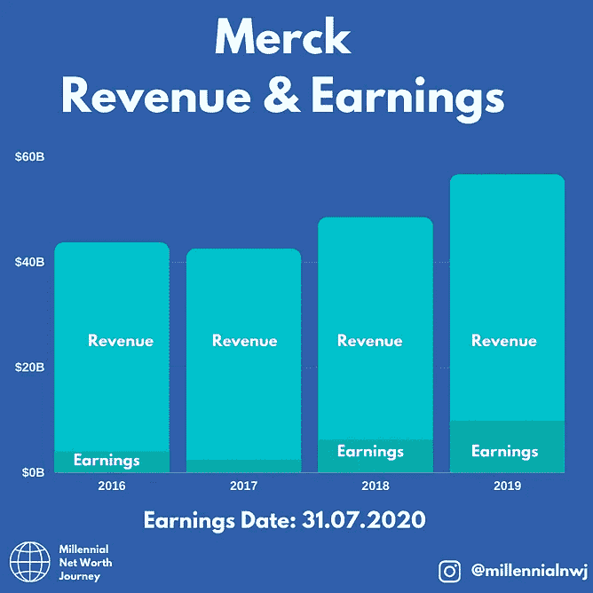

[Images from @millennialnwj on Instagram.](http://www.instagram.com/millennialnwj)

我们医药股综述的下一个是默克公司。默克在全球范围内提供医疗保健解决方案。该公司提供心血管疾病、二型糖尿病、慢性丙型肝炎病毒、HIV-1 感染的治疗和预防药物。

尽管今年股价较大盘下跌，但该公司的基本面依然强劲。股息率相对稳定，公司产生的利润也很可观。该公司正在研制两种而不是一种新冠肺炎疫苗。它正计划收购一家专门研究病毒的生物技术公司，以进一步增强其在这一领域的专业知识。

默克令人印象深刻的是，它不仅仅提供药物和推动疫苗，它还提供开展这项研究所需的化学品和设备，并为世界各地的实验室和医院提供库存。

虽然这只是一个轶事，但我与默克公司有很多合作，他们在科学领域是一家非常有能力的公司，每天都在提供高质量的产品。

# 辉瑞

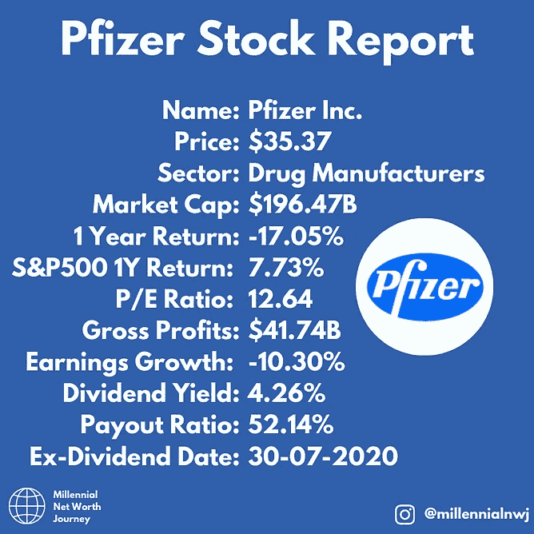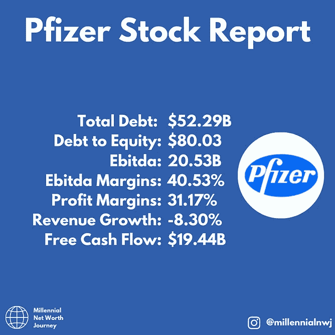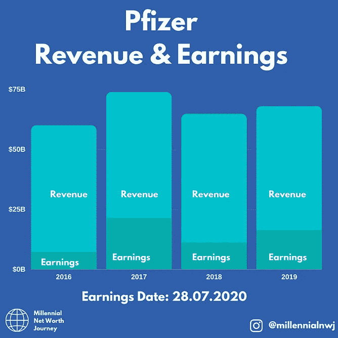

[Images from @millennialnwj on Instagram.](http://www.instagram.com/millennialnwj)

辉瑞在全球范围内开发、制造和销售医疗保健产品。它提供各种治疗领域的药物和疫苗。

从公司的基本面来看，由于不确定性，价格方面受到了一点打击。不过，股息收益率仍然健康，派息率和自由现金流看起来也非常健康。

辉瑞公司正集中其巨大的资源为新冠肺炎制造疫苗。它目前正在开发一种 RNA 疫苗，并显示出积极的早期结果。事实上如此积极，以至于英国政府和美国政府分别获得了 9000 万剂疫苗和 6 亿剂疫苗。消息公布后，股价上涨了 4%。

# 伊莱·莉莉

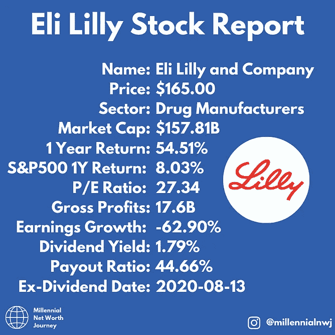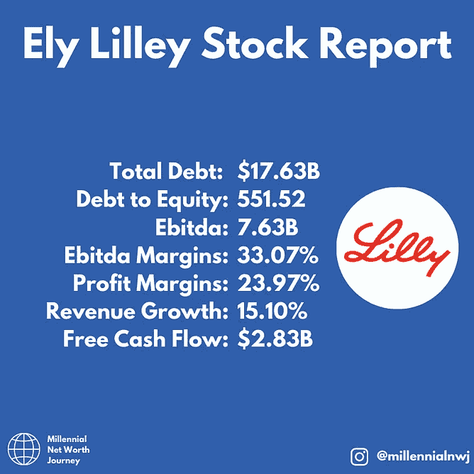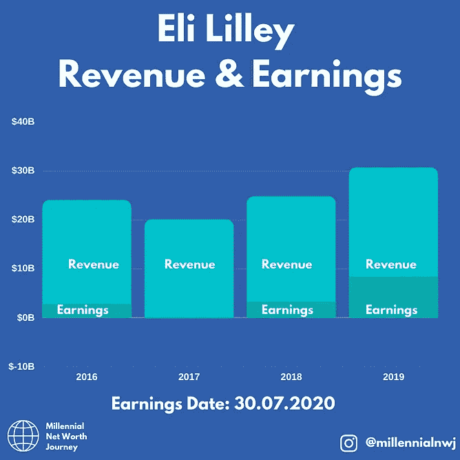

[Images from @millennialnwj on Instagram.](http://www.instagram.com/millennialnwj)

接下来，在我们的制药股综述是礼来，谁是一家公司，发现，开发，制造和营销全球医药产品。他们追求困扰我们生活的大问题，如癌症和糖尿病。

虽然该公司的基本面有一些警告信号，但在经历了一些磕磕绊绊之后，该公司去年恢复了强劲的收益。

礼来公司正从各个角度攻击冠状病毒疫情。它正在进行测试，研究治疗方法和药物。

# 艾伯维

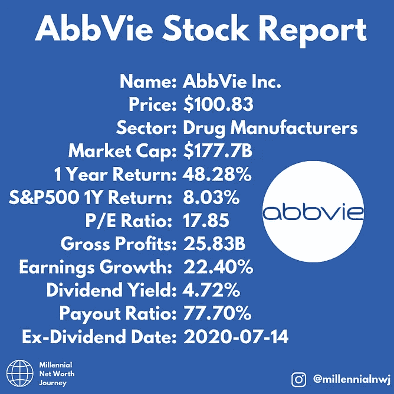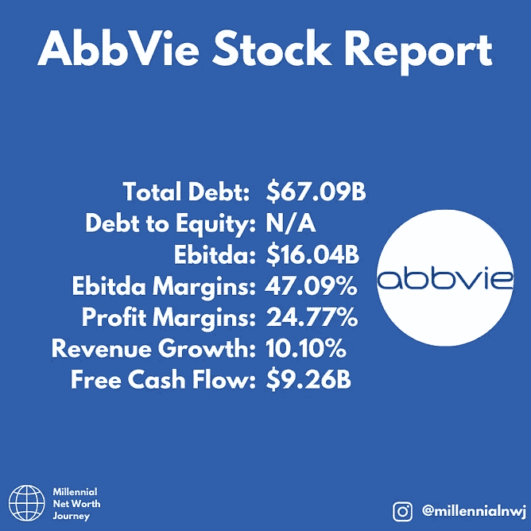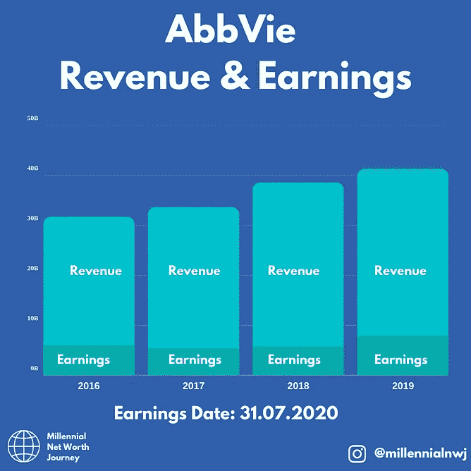

[Images from @millennialnwj on Instagram.](http://www.instagram.com/millennialnwj)

最后，在我们的制药股中，致力于压制冠状病毒的是艾伯维。

该公司的基本面看起来相当不错，过去一年的回报不错，收益和收入稳定且不断增加。

该公司是股息贵族，去年设法将其股息支付增加了 10%。收益率也达到了健康的 4.72%。在我们的下一篇文章中，我们将会涵盖你投资 1000 美元到这只股票所得到的金额。

艾伯维正致力于冠状病毒问题的测试和治疗方面。它有能力解决这个问题，过去一年股价的上涨可能是因为它在 2019 年公布了可观的收益，以及它如何有效地管理冠状病毒疫情。

## 最后

在所有这些公司中，辉瑞看起来是目前的领跑者。它在开发疫苗的过程中走得最远，并从英国和美国获得了两笔大订单。

但是有了这种新型疫苗，他们可能仍然无法实现创造有效疫苗的最终目标。这些公司中的任何一家，或者可能没有任何一家，能够率先实现这一目标。

我昨天分享了一个机会。我想补充的是我昨天写的一篇文章，这支股票为所有制药公司提供了进行这项研究所需的化学品，使它们成为一项有吸引力的投资。点击这里查看这篇文章:

 [## 这种“平台”股票如何受益于新冠肺炎

### 上周，我谈到了“平台”股票，以及它们如何进行伟大的投资。本周我有一个特别的…

medium.com](https://medium.com/datadriveninvestor/how-this-platform-stock-benefits-from-covid-19-1bf23d585657) 

他们刚刚公布的每股收益为 3.46 美元，比疫情分析师的预期高出 1 美元。

如果你喜欢这篇文章，请考虑注册我的邮件列表，这样你就可以及时了解我的最新文章:

 [## 时事通讯注册—千禧净值之旅

### 注册我们的邮件列表，了解我们最新的帖子和深入的投资新闻和分析。我们…

millennialnetworthjourney.com](http://millennialnetworthjourney.com/newsletter-sign-up/) 

## 访问专家视图— [订阅 DDI 英特尔](https://datadriveninvestor.com/ddi-intel)