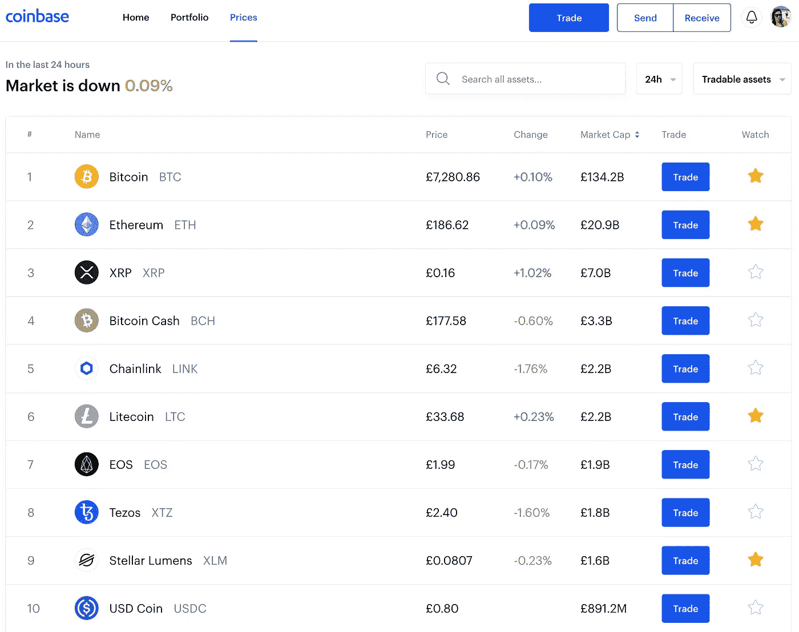

# 5 个平台作为非专家，您现在就可以开始交易加密货币

> 原文：<https://medium.datadriveninvestor.com/5-platforms-you-can-start-trading-cryptocurrency-today-as-a-non-expert-2fd6ceb763b6?source=collection_archive---------12----------------------->

你对密码好奇吗？下面是你开始交易加密货币最简单的方法:

# 1.Etoro

2007 年在以色列特拉维夫成立。Etoro 是一个交易平台，包括证券交易所和其他投资资产之上的加密货币。它在广告和营销方面的努力也非常引人注目。

## 费用

*   提取费用 5 美元

## 制品

*   [eToro 钱包](https://www.etoro.com/crypto/wallet/):数字货币账户
*   [eToro 平台](https://www.etoro.com/):数字货币交易

# 2.比特币基地

2012 年成立于加州旧金山。比特币基地提供混合钱包和交易平台，专为加密货币交易体验的易用性而设计。它支持各种各样的加密货币，你可以开始交易，开始投资小至 1 美元。

## 费用

*   0.90 美元起的买入/卖出交易

## 制品

*   [比特币基地](https://www.coinbase.com/):集成交易平台的钱包
*   [比特币基地赚取](https://www.coinbase.com/earn):学习&赚取程序，赚取免费加密货币

# 3.革命报

从 2017 年起，Revolut 的客户可以在他们的移动应用程序上买卖加密货币。除了交易普通货币，你现在可以用 Revolut 交易有限的加密货币。目前持有比特币、以太、莱特币、Ripple、比特币现金、恒星。

## 费用

*   汇率 2.5%

## 制品

 [## 购买比特币、莱特币和以太币

### Revolut 介绍了最简单快捷的方式购买，持有和交换比特币，以太和莱特币在最好的…

www.revolut.com](https://www.revolut.com/exchange-cryptocurrency) 

# 4.Blockchain.com

Logo by [Blockchain.com](http://Blockchain.com)

成立于 2013 年，总部位于伦敦。Blockchain.com 是最受欢迎的加密钱包和交易平台之一，背后有维珍等许多知名风险投资。你可以通过他们的应用程序下载并立即开始交易，iOS 和 Android 都有。它们有两个不同的特征:

## 费用

*   买入 0.02% — 0.14%
*   卖出 0.05% — 0.24%

## 制品

*   [区块链钱包](https://www.blockchain.com/):数字货币账户
*   [区块链交易所](https://exchange.blockchain.com/):数字货币交易

# 5.硬币罐

2013 年成立于澳大利亚墨尔本。这家有趣的初创公司还提供新兴的加密货币借记卡服务。

## 费用

*   买入和卖出 1%

## 制品

*   [CoinJar](https://www.coinjar.com/) :数字货币账户
*   [硬币罐交易所](https://exchange.coinjar.com/):数字货币交易
*   [CoinJar 刷卡](https://www.coinjar.com/au/swipe):加密货币&比特币借记卡澳洲

除了本文中提到的费用之外，还有一些跨平台的其他费用，这些费用因地点和支付方式而异。

## 声明:一般来说投资和加密货币都有很大的风险。请做你自己的研究，这不是一个财务建议。