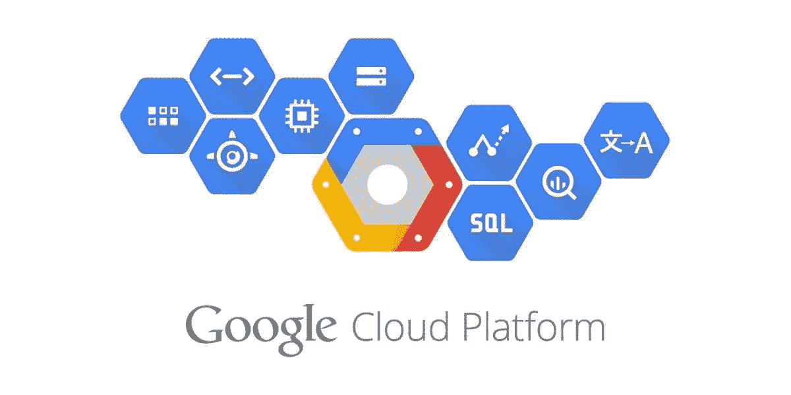
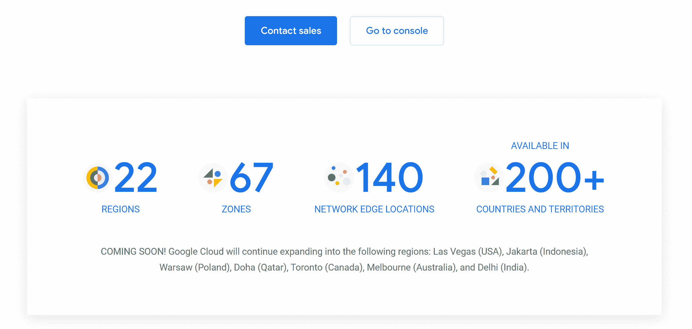
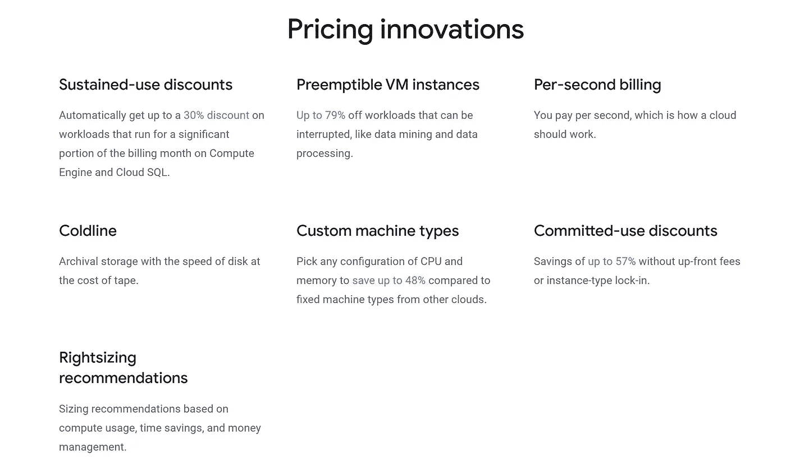
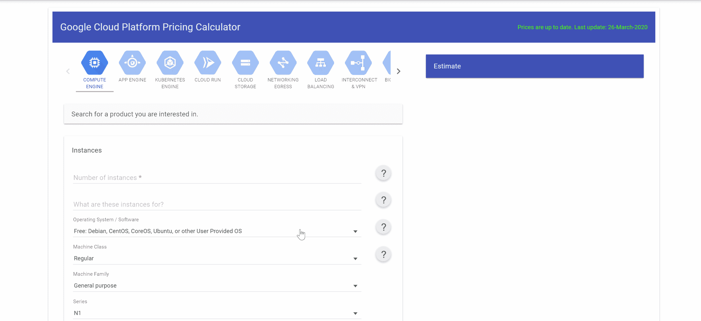
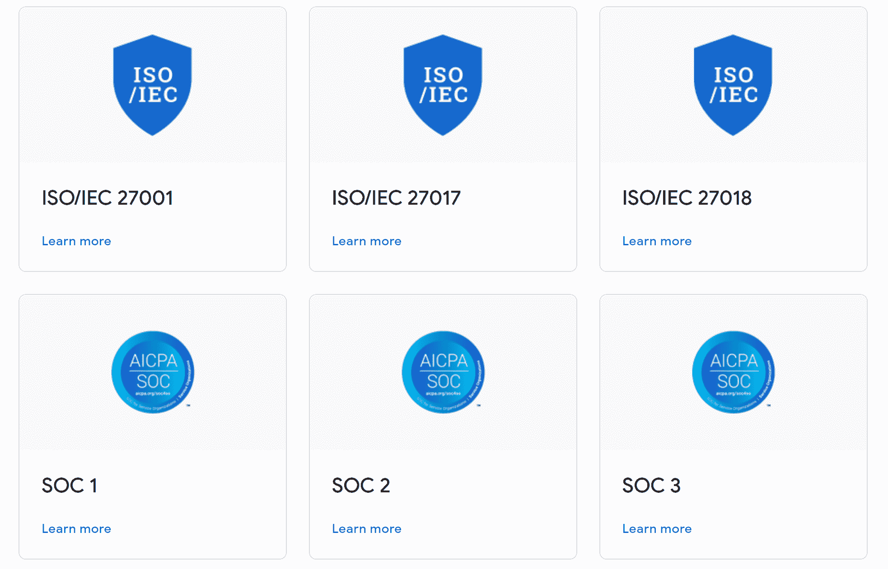
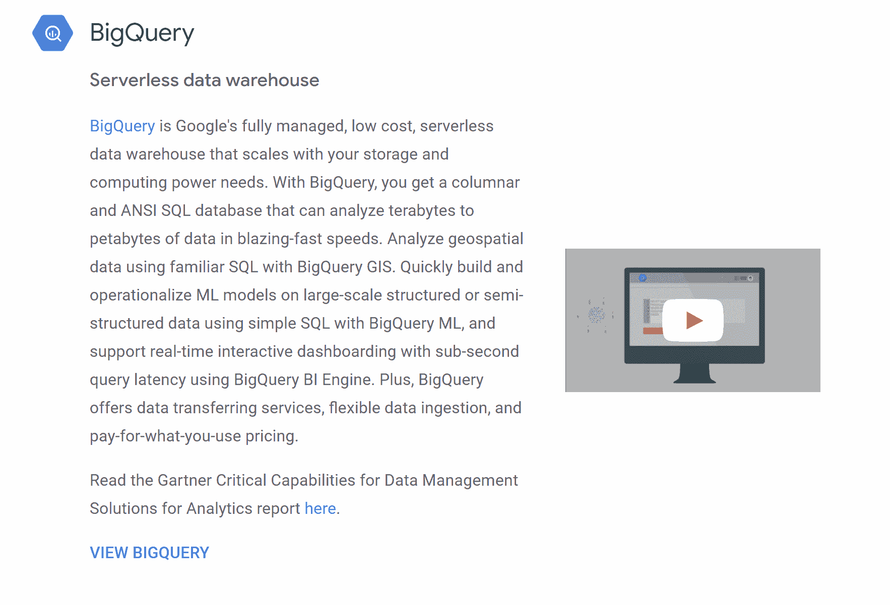

# 云计算|了解谷歌云平台— GCP

> 原文：<https://medium.datadriveninvestor.com/5-points-you-should-know-to-start-using-google-cloud-platform-faaaec31a421?source=collection_archive---------4----------------------->

## 了解谷歌云平台并马上开始使用它的全面指南！！

最近几天，我遇到了许多需要 GCP 经验的数据分析师职位。让我们试着理解谷歌云平台(GCP)意味着什么，以及为什么许多企业对它有很高的需求。

Google Image by techrepublic

> GCP 是一套运行在谷歌自己的基础设施上的服务，可以购买或租用时间。

谷歌正在全球范围内提供服务，22 个地区有 67 个区域，140 个网络边缘位置，GCP 服务目前在 200 多个国家和地区提供。您可以在下图中看到，当前可用的区域显示为蓝色，未来宣布的区域显示为白色。

[https://cloud.google.com/about/locations#network](https://cloud.google.com/about/locations#network)

现在，我总是认为看一看云的实际样子很有趣，因为即使作为客户，我们也通过工具和端点与服务进行交互，**当然，这种基础架构的底层是物理数据中心和服务器**。不同的是，当你搬到 GCP 时，你不再管理他们，而是谷歌。看一看他们的数据中心实际上是什么样子真的很令人着迷。

[https://www.google.com/about/datacenters/gallery/](https://www.google.com/about/datacenters/gallery/)

谷歌多年来一直在自己的全球基础设施上创建和运行服务，搬到 GCP 让你有机会利用他们的经验。有趣的是，由于 GCP 和其他主要供应商如 Azure、AWS 和 Alibaba 之间在云服务方面的激烈竞争。提供的服务越来越多。因此，与 GCP 或任何云合作的一个方面是始终查阅供应商文档，因为云和云服务产品是一个快速变化的目标。

# 1.节省时间和金钱

*   云服务让您更快地进入市场
*   谷歌以其快捷的服务而闻名
*   可扩展的服务为开发人员和开发者节省了时间
*   自动使用折扣意味着更少的定价管理

[https://cloud.google.com/pricing](https://cloud.google.com/pricing)

## GCP 定价计算器

这个价格计算器使用起来非常简单。在下图中，您可以看到，我在这里选择了云存储，我可以根据存储类别简单地选择一个区域。现在，我可以单击我的估计，然后它会告诉我估计的成本是多少。因此，这是一个非常简单但功能强大的工具，当您开始使用云时，您会希望了解并使用它。

[https://cloud.google.com/products/calculator](https://cloud.google.com/products/calculator)

# 2.自动缩放

*   默认通常是自动缩放
*   资源通常不会耗尽
*   缩放必须由用户管理

GCP 的另一个特点是自动扩展，因为它不同于许多其他云供应商。对于许多服务，默认情况下是自动缩放，这也是不同的，因此您需要注意这一点。当您根据您拥有的帐户类型或组织帐户打开帐户时，您的帐户上确实设置了配额，每种帐户类型都有配额，例如，特定实例大小的虚拟机数量等。

因此，根据您的使用情况，您可能需要与 Google 合作，为非常大或巨大的工作负载提高您的默认服务[配额](https://cloud.google.com/compute/quotas)。你需要监测和关注，这样你就不会感到惊讶，甚至我所说的休克法案。例如，在一些 GCP 流行的服务中，比如 BigQuery，这是一种无服务器的 SQL，有一些相当大的默认资源限制，用户可能会提出相当大的账单。

# 3.服从

如果用户对他们的项目有合规或监管要求，请查阅谷歌文档的[合规页面](https://cloud.google.com/security/compliance/)，该页面会频繁更新。在下图中，您可以看到 GCP 满足的各种类型的合规性，此处显示了特定项目所需的相关信息。

[https://cloud.google.com/security/compliance/offerings](https://cloud.google.com/security/compliance/offerings)

# 4.服务类别

多年来，观察 GCP 服务业的增长一直很有趣。七年前，GCP 上几乎没有什么服务。例如，谷歌应用引擎是首批服务之一。快进到现在，GCP 已经与所有主要的云供应商实现了服务平价，这真的很令人兴奋，因为它为用户提供了客户选择。

GCP Service categories

[https://cloud.google.com/products/big-data](https://cloud.google.com/products/big-data)

# 5.工具和库

让我们花点时间考虑一下工具和库:

*   谷歌工具
*   第三方工具
*   控制台和图形用户界面
*   命令行
*   谷歌 API

谷歌提供了许多工具，主要是大多数用户在使用这些工具。在某些生产情况下，通常需要使用用户使用的集成供应商提供的第三方工具。除了这些工具，Google 还为其大部分服务提供编程 API。还有许多通用的编程语言，当你在生产中工作时，你可以使用最适合你的编程语言。

所以在这个页面上，你会看到谷歌创建的各种开发工具的链接。谷歌有一个针对 GCP 的组织性[知识库](https://github.com/GoogleCloudPlatform)，这个组织中有许多有用的知识库，我在这里找到了很多样本。因此，当与 GCP 一起工作时，可以在 GitHub 上的组织库中找到许多有用的脚本和示例。

# 资源

 [## 云计算服务|谷歌云

### 下一个谷歌云。谷歌云下一个 20 年:数字连接。加入我们的谷歌云下一个 20:数字连接，一个…

cloud.google.com](https://cloud.google.com/) 

【https://github.com/GoogleCloudPlatform 