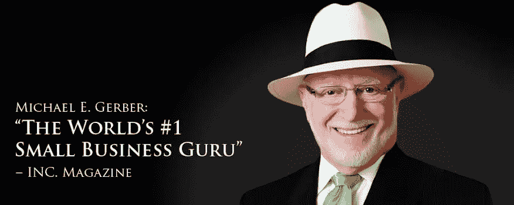

# 我从迈克尔·E·葛伯的《电子神话》一书中学到了 5 条强有力的商业经验

> 原文：<https://medium.datadriveninvestor.com/5-powerful-business-lessons-i-have-learnt-from-the-book-e-myth-by-michael-e-gerber-728bdcbe8f59?source=collection_archive---------4----------------------->

## 对我的商业生涯产生巨大影响的书籍之一是《电子神话》这本书。今天，我想和你们分享我从这本书中学到的五个有力的教训。

Image: Google.com

他的书《电子神话》是关于，为什么最小的企业都不行？我强烈推荐阅读这本书。因为迈克尔用非常独特的视角写了这本书。解释一个新的商人或企业家开始创业所需要的一切。

> “伟大的人和其他所有人的区别在于，伟大的人是主动创造自己的生活，而其他所有人都是被自己的生活所创造，被动地等着看生活接下来带他们去哪里。两者的区别是活得充实，只是存在。”
> 
> 迈克尔·E·格伯，电子神话。

# **卖不关张**

在葛伯的书中，“大多数销售人员认为销售是结束，但销售是开始。”我不同意大多数人不知道如何沟通，少数人知道，如何销售？几乎没人知道，怎么接近？大多数销售人员通过与许多人交谈、发送预约、做演示、谈论即将结束的功能和优势来思考。但那不是关闭，那只是打开。

销售是直到我处理潜在客户的承诺。许多销售人员害怕或害怕要求销售或金钱。他们不知道如何处理异议。他们不知道该怎么办？卖不成交。直到我关闭潜在客户，他们签字，给我他们的信用卡，或者直到他们说“是的”，什么都不会发生。

如果有人想和我做生意，我可以做 99%的工作，但如果我不做那百分之一。那么，这就是重要的百分之一。这让世界变得不同，这些都不重要了。

# 做你的生意

迈克尔·葛伯谈到了如何在你的企业中工作，而不仅仅是在你的企业中。起初，当我学到这一课时，我不知道这是什么意思。我是一个非常年轻的企业家，我没有经验，在业务上工作很困惑，而不是在业务上。那是什么意思？这仅仅意味着我必须把我的生意当成产品。如果这是一个产品，我必须问自己这个问题。

什么时候能完成？想想吧。企业建成后是什么样子的？是的，商业是动态的，它一直在变化。最终目标是什么？你的退出计划是什么？即使你从来没有打算出售业务，但当它完成时，而不是仅仅在战壕里做它和完成它会是什么样子。

我们在这里建什么？最终产品是什么样的？如果我想让我的生意变得更有价值，我必须建立它来出售，即使我从来没有打算卖掉它。那是什么意思？这意味着我在做生意。我在做事情，但我同时也在研究系统、流程和程序，以完成这些事情，而不仅仅是做。这也意味着我不想成为我业务的瓶颈。如果所有的事情都在我的脑子里，而我是唯一一个可以为我的事业做任何事情的人。它不会增长，这就是迈克尔所说的不仅仅是在我的生意上。

# **业务需要戴三顶帽子**

第三课一个企业需要我戴三顶不同的帽子。我是企业家、创新者、梦想家，然后我们有一个专注于流程和系统的经理。然后我有一个技术人员专注于，如何做得更好？如何更好的做技术工作？

企业家关注未来，我们可以去哪里。一个管理者关注过去需要做什么。什么在过去奏效了？我们怎么能继续这样做呢？一个技术人员专注于现在，我需要输出什么文件？所以一个成功的企业需要我同时戴上这三顶帽子。最终，我会引进更多的技术人员和管理人员。作为一名企业家，我专注于有远见的工作，着眼于大局。

我不会被本质细节所束缚或困扰。我不会一夜之间到达那里，但是我需要把它放在我面前。因为我需要知道那是我要去的地方，那是我想去的地方。有远见的人成为真正的企业家。

# **大多数企业家实际上并不是企业家**

不知道企业家怎么拼怎么办？我知道我知道如何拼写特斯拉这就是 e-myth 的意思。这是一个关于企业家神话的故事，大多数企业家都是患有企业家精神疾病的技术人员。这是非常深刻的，因为我擅长我所做的，我有一定的技能，我有一定的经验。我可以建立一个更好的企业，一个捕鼠器，我做了什么？我去那里开始做生意。

管道工可以开管道公司。会计师可以开会计师事务所。这是同样的想法，他们非常擅长技术工作，他们是患有创业癫痫的技术人员。他们没有意识到的是他们缺少商业技能。怎样才能让企业运转起来？哪些是商业技能呢？领导市场、筹集资金、建立团队、谈判的能力。这些都是商业技能。

这些不是知道的技术技能。如何做这项工作？这并不意味着你知道如何创业。比如如果你知道，怎么开车？这并不意味着你知道它是如何工作的，如何发动引擎或制造一辆汽车，这是完全不同的技能。

# **在系统上而不是在人员上建立业务**

在这本书里，迈克尔谈到了把你的事业建立在系统上，而不是人。那是什么意思？人们来来去去，所以我不应该围绕某些个人来建立业务。我想围绕某个角色来构建。我想把它建立在人们可以来来去去的系统上。他们仍然会运行系统，换句话说，我的重点是建立系统，并带来合适的人来运行系统。

以麦当劳为例，格柏在他的书中一直使用一个例子。麦当劳它是一台机器它是一个特许经营的原型我走进芝加哥、温哥华或日本的一家麦当劳。我点了汉堡和薯条，它们尝起来和星巴克一样，为什么？因为这是一个每个人都要经历训练的系统，这是他们的商业系统。为什么麦当劳的特许经营权是有价值的？这是一个可复制的系统。我知道许多餐馆做的汉堡包比麦当劳更好。但他们中有多少人建立了像麦当劳这样的企业？

这就是商业系统的力量。所以问问你自己，没有我，我如何建立一个可以运作的企业。没错，如果没有我，我怎么能建立企业呢？你如何建立系统？如何构建可扩展和可复制的东西？你如何花更多的时间在你的事业上，而不仅仅是在创业初期？是的，我大部分时间都在工作。最终，我花了大部分时间在业务上，很少甚至没有时间在业务上。

理查德·詹姆斯或莫里斯·詹姆斯不会去麦当劳做汉堡或奶昔。他专注于麦当劳的业务，而不是制作汉堡。这是两件非常独特的事情。我在我的公司里所做的是，我结合了很多来自 e-myth 和现代技术的原则，创建了一个远程团队和社交媒体杠杆。我教企业家的是，“如何建立一个可扩展的、不受疫情影响的、不受经济衰退影响的企业？”我称之为聪明的生意，这是首字母缩写词 S-M-A-R-T。