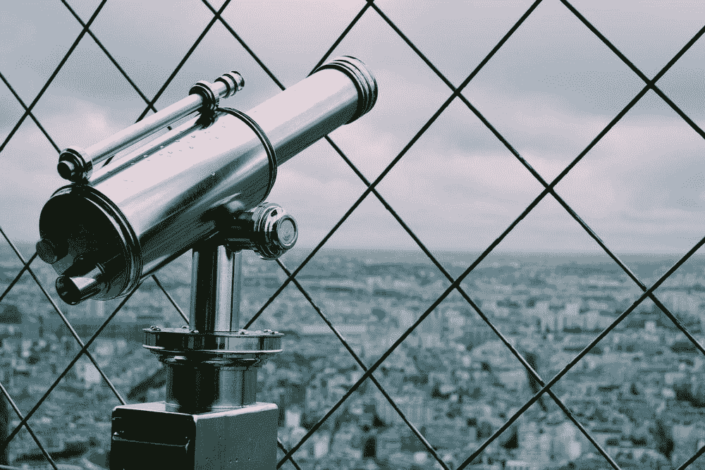
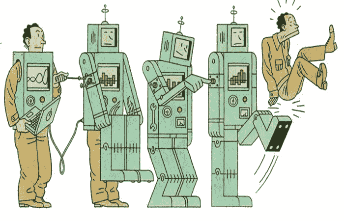

# 5 对未来的预测

> 原文：<https://medium.datadriveninvestor.com/5-predictions-for-the-future-9624f4debc4c?source=collection_archive---------16----------------------->

## 基于今天的重要观察

Photo credit: [Amy-Leigh Barnard](https://unsplash.com/@amyb99) in [Unsplash](https://unsplash.com/)

> "即使没有把握也能预见，这比完全不预见要好得多. "
> 
> —亨利·庞加莱

今天世界上有几条线索指向未来。对于敏锐的观察者来说，这些线索经常是持久的和相当明显的。

过去，预测未来是占卜师和先知的领域。一个灾难性的预言往往可以避免安抚一个神或其他必要的牺牲和产品。

 [## 商业无国界:如何走向全球？数据驱动的投资者

### 首先，你要形成你的主要目标。例如，寻找投资，固定你的市场…

www.datadriveninvestor.com](https://www.datadriveninvestor.com/2020/07/14/business-without-borders-how-to-go-global/) 

在现代社会，预测未来有许多新的名称——预测、估计、推测。它仍然是拥有神奇技能的人的领域——科学、金融和技术。然而，安抚众神可能不像以前那么容易了。

# 能源的未来

结果出来了，化石燃料出来了。能源的未来更绿色、更清洁、更环保。

然而，不要指望石油和天然气行业在短期到中期内会在钻机上大幅跳水。可再生能源价格、发电和供电基础设施以及应用技术都需要时间才能完全进入市场。在那之前，预计能源行业将转向依赖天然气——更清洁的 T2 化石燃料——来支持未来几十年的能源需求。

除了能源之外，输送能源的方式也在朝着更加分散化的模式发展。本地发电结构以较低的成本消除了电网约束，并使多种电力矢量的整合更加容易。

地方政府将继续依靠监管的推动以及可用的公共和私人资金来源来决定能源转型的速度。

# 货币的未来

与仅仅 12 个月前相比，今天的世界经济似乎不可思议地不稳定。

新冠肺炎疫情严重削弱了全球几个国家的经济。(来自中国的提示:对企业开放固然很好，但当大多数生活在美国的消费者申请失业时，这种胜利不可避免地是短暂的。)

加密货币和区块链技术已经吸引了全世界金融专业人士的注意力。比特币是新美元吗？智能合约会取代对跨境托管和验证服务的需求吗？

*时间会证明一切。*

但是，这些卡片表明了对货币的可替代性、流动性和灵活性的需求。区块链似乎是寻求可行的数字货币模式过程中缺失的一环——这意味着现金更容易跟踪、追踪和在世界各地移动。考虑投资 [TrumpCoin](https://www.trumpcoin.com/) 的时机可能已经成熟。或者是不那么倾向白人至上的[硬币](http://www.potcoin.com/)。

# 工作的未来

未来的工作更快、更智能、更便宜，还配有电池组。自动化、人工智能和自动化是这个游戏的名字。

在不太遥远的未来——事实上，现在就在发生——人类将需要依靠更复杂的功能才能在社会中更有价值。涉及医疗保健、领导力/管理、计算机编程、数据科学的职业将最安全地脱离自动化。

除了趋向于机械的劳动力构成，工作地点已经被新冠肺炎不可逆转地改变了。此外，年轻一代工人对更大灵活性的渴望也推动了零工经济的发展。

这就要求未来的员工足够精通技术，以适应远程工作或在现实世界的任何地方工作。小隔间办公室居住者的时代即将结束——不用说，预计很少有人会参加悼念活动。

总之，当你步入未来时，工作的**地点**，工作的**性质**和工作的**面貌**都会有显著的变化。

# 旅行的未来

埃隆·马斯克的 Space X 将组织未来的太阳系周末旅行。然而，回到地球表面，旅行将会看到一些重大的剧变。

几个国际机场成了鬼城，这是为了阻止新冠肺炎病毒的传播而实施的全球旅行禁令造成的。此外，目前全球对减少温室气体污染的立场无助于缓解航空业和旅游业的困境。

虚拟现实可以提供多种机会，让你在舒适的客厅里游览遥远的异国目的地。想:[准备好的玩家一](https://www.youtube.com/watch?v=e4-Ecosl73Q)。

对旅游业和全球酒店业的影响同样可怕。

然而，每个灾难中都存在机会，这是业内人士创新和提升其价值主张以适应时代变化的独特时机。或者慢慢变得无关紧要。

# 种族关系的未来

全球疫情、经济崩溃和民众骚乱的完美风暴，让人们的注意力从全球西方转移到了东方和南方。

我敢说，人们越来越意识到，美国和欧洲社会并非没有严重的道德和客观错误。尽管欧洲继续在亚洲和非洲失去立足之地，但反美主义仍在抬头。

很难想象现状会卷土重来。已经通过了一项法案来审查美国的治安结构。在全球范围内，个人正在评估他们在支撑结构性不平等体系中的作用。看起来真的很美！

与此同时，在南半球…

加纳在 2019 年举办了[回归年](https://en.wikipedia.org/wiki/Year_of_Return,_Ghana_2019)活动，旨在欢迎世界任何地方的黑人重新定居非洲大陆。政府提供一揽子搬迁援助和获得公民身份的途径。

在世界的另一边，美国奇怪地关注着[驱逐国际学生](https://www.theguardian.com/commentisfree/2020/jul/09/us-colleges-international-students-ice-deportation)，他们每年为美国经济注入 450 亿美元。欧洲同样倾向于驱逐移民和寻求庇护者，不管他们有什么独特的危险或经历。

作为全球南部的一名游牧公民，我只能希望当前的动荡能给这一地区的国家领导人带来更强的推动力。需要继续努力和加大投资，以改善世界各地公民的机会。

那么，一个人如何对待预言呢？

我们要么庆祝你即将到来的好运，要么祈祷和安抚来避免你即将到来的死亡。

第三个选择是对所有的预言持保留态度。带着新的自信走向未来，你有能力规划自己的道路。

幸运向勇敢者微笑。

## 访问专家视图— [订阅 DDI 英特尔](https://datadriveninvestor.com/ddi-intel)