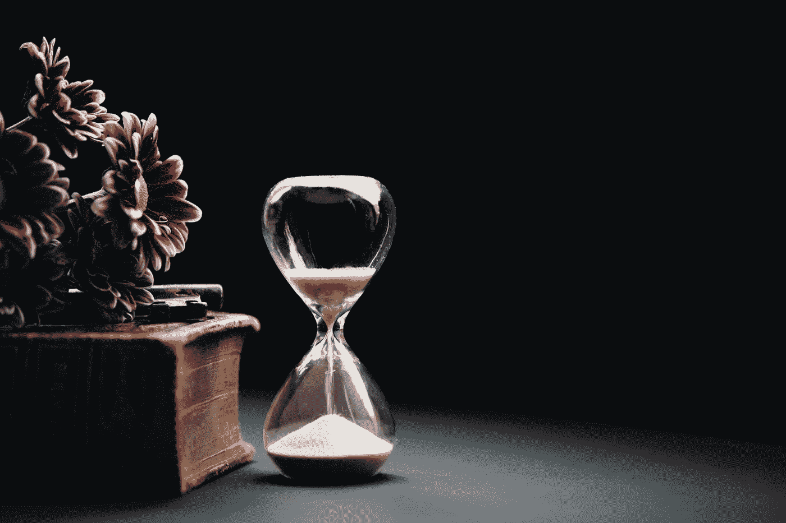

# 让你的财务生活更轻松的 5 条理财原则

> 原文：<https://medium.datadriveninvestor.com/5-principles-of-money-that-would-make-your-financial-life-easier-3a30b50b1b06?source=collection_archive---------22----------------------->

## 有了适当的知识，你可以实现你想要的财务自由

Photo by [Austin Distel](https://unsplash.com/@austindistel?utm_source=medium&utm_medium=referral) on [Unsplash](https://unsplash.com?utm_source=medium&utm_medium=referral)

对我们大多数人来说，2020 年并不轻松。许多人失去了工作，申请破产，更多的事情发生了。

然而，有些人赚了很多钱，比他们一生中从未赚过的还要多，新的亿万富翁加入了榜单，埃隆·马斯克甚至登上了最富有的人的榜首。

*有没有想过为什么这些好事只发生在他们身上，而不是你？*

答案很简单，**他们知道你不知道的原理**。他们知道如何利用*不利局面*为自己谋利，而不是惊慌失措。

下面是 5 个最重要的原则，你必须知道，让你的财务规划更容易。

# 钱确实长在树上

Photo by [Micheile Henderson](https://unsplash.com/@micheile?utm_source=medium&utm_medium=referral) on [Unsplash](https://unsplash.com?utm_source=medium&utm_medium=referral)

我敢肯定，你们大多数人所学的恰恰相反。我也是。但是用你的时间来换取金钱在一生中是不可能的。

> 你必须有一棵树，当你不工作或不能工作时，它能给你钱。

每个人都有退休的计划，但是如果你没有足够的钱，退休有什么用呢？

> 今天有人坐在树荫下，因为很久以前有人种了一棵树。
> —沃伦·巴菲特

但是，种一棵树并不像看起来那么简单。你必须找到营养丰富的土壤来播种。然后你必须在适当的时间给植物浇水来照顾它。你需要确保杂草不会破坏你的植物，否则，它可能不会长到你为之种植的那棵树上。

> 那么我们在这里指的是什么树呢？
> 
> **是投资。**

**营养丰富的土壤**简称**潜力丰富的公司**(以股市为例)。你的**种子**是你辛苦挣来的**积蓄**，定期**浇水**是指你在合适的时间投资**到公司的**钱，对很多人来说，是**每月一小口。******

一旦你的投资在相当长的时间内复利，10-20 年，你将开始看到结果。

> 那棵树会在你需要的时候为你提供果实。

所以下次有人告诉你钱不会长在树上，你知道该怎么说。

# 花费没有限制

Photo by [Andrea Piacquadio](https://www.pexels.com/@olly?utm_content=attributionCopyText&utm_medium=referral&utm_source=pexels) from [Pexels](https://www.pexels.com/photo/happy-woman-shopping-online-at-home-3769747/?utm_content=attributionCopyText&utm_medium=referral&utm_source=pexels)

如果你认为尽管你的收入增加了，但你的支出会保持不变，那么我的朋友，你可能错了，否则，你将需要大量的奉献和纪律，这不是很有效，至少对你的情绪健康来说是这样。你知道我的意思，对吧？

所以经常有人建议你先投资，然后花剩下的钱。

这将自动迫使你坚持预算，而不需要你强迫自己。

> 不要把消费后剩下的存起来，而是把储蓄后剩下的花掉。
> —沃伦·巴菲特

> 对于那些在思考的人来说，“这可能吗？”如果埃隆·马斯克可以每天用 1 美元生活，你可以轻松地用每月 1000 美元的东西生活几年。

我并不是说你过着节俭的生活，尽管如果你能这样过几年对你是有好处的。**过你想过的生活，享受生活，但要确保你获得足够的资产**，可以在退休后支付给你，为此，你需要足够自律，坚持预算。

# 你的不安全感会让你精疲力尽

Photo by [Andrea Piacquadio](https://www.pexels.com/@olly?utm_content=attributionCopyText&utm_medium=referral&utm_source=pexels) from [Pexels](https://www.pexels.com/photo/woman-holding-black-wallet-3768145/?utm_content=attributionCopyText&utm_medium=referral&utm_source=pexels)

人们买一辆昂贵的汽车，搬到更大的房子，买最新的 iPhone，做许多这样的事情只是为了满足他们的不安全感。

他们认为这是他们被社会接受的方式。

那些昂贵的东西会让你在一两周内感觉良好，但之后，事情就变得正常了，那件昂贵的东西似乎不再让你兴奋，但**你的不安全感永远不会结束。而这种永无止境的循环让你一直穷下去。**

> 我们从小就一直在经历这种影响，但几乎没有注意到它。

如果你在寻求接受，那么与其满足你的不安全感，不如学会有效地管理你的情绪。有很多书可以帮助你阅读。

> 最好投资一本书，而不是花钱来满足你的不安全感。

我并不是说你不应该买一辆昂贵的汽车，但要确保你不会为了满足自己的不安全感而买。

# 巨大的财富转移发生在危机期间

Photo by [Burak K](https://www.pexels.com/@weekendplayer?utm_content=attributionCopyText&utm_medium=referral&utm_source=pexels) from [Pexels](https://www.pexels.com/photo/space-grey-ipad-air-with-graph-on-brown-wooden-table-187041/?utm_content=attributionCopyText&utm_medium=referral&utm_source=pexels)

在经济危机期间，失业率非常高，许多人失业，甚至无家可归。

然而，一些人开始过于积极地投资，并在危机后变得更加富有。感谢他们的"*机会基金，他们为这种情况维持。*

> *如果你准备好抓住机会，在危机中你有可能一夜成名。如果没有，你仍然会设法带走很多。*

*网络泡沫时期，杰伊·沃克在不到一年的时间里成为亿万富翁。虽然他的财富不可持续，但他设法保留了数亿美元。*

> *要成为亿万富翁，你必须运气好。—马克·库班*

*马克·库班的这些话是有原因的。如果没有 1998 年的金融危机，他不可能成为亿万富翁。*

*因此，不要在金融危机中惊慌失措，而是要理解这个系统是如何运作的，研究过去的危机，并准备好在危机中抓住机会。*

# *财富的积累是逐渐发生的*

**

*Photo by [Nathan Dumlao](https://unsplash.com/@nate_dumlao?utm_source=medium&utm_medium=referral) on [Unsplash](https://unsplash.com?utm_source=medium&utm_medium=referral)*

> *你不可能在一夜之间增长你的财富，就像你不可能在一夜之间长出一棵树。*

*凭借复利的力量，你每月只需投资 500 美元到标准普尔 500 指数基金(考虑到它的年平均回报率为 10%-11%)，就能成为百万富翁。*

***越早开始投资越好。**难怪沃伦·巴菲特在 11 岁就开始了他的投资之旅。*

> *如果你足够善良，你甚至可以让你的孙辈在知道钱是什么的时候成为百万富翁。*

# *外卖食品*

1.  *金钱确实会以投资的形式长在树上。*
2.  *首先，储蓄，然后消费。*
3.  *不要缺乏安全感，而是要学会有效管理自己的情绪。*
4.  *时刻准备抓住机会，尤其是在危机时刻。*
5.  *财富的积累是逐渐发生的。*

*所以这是你必须知道的 5 个最重要的理财原则。希望你觉得有用。*

*感谢阅读！！*