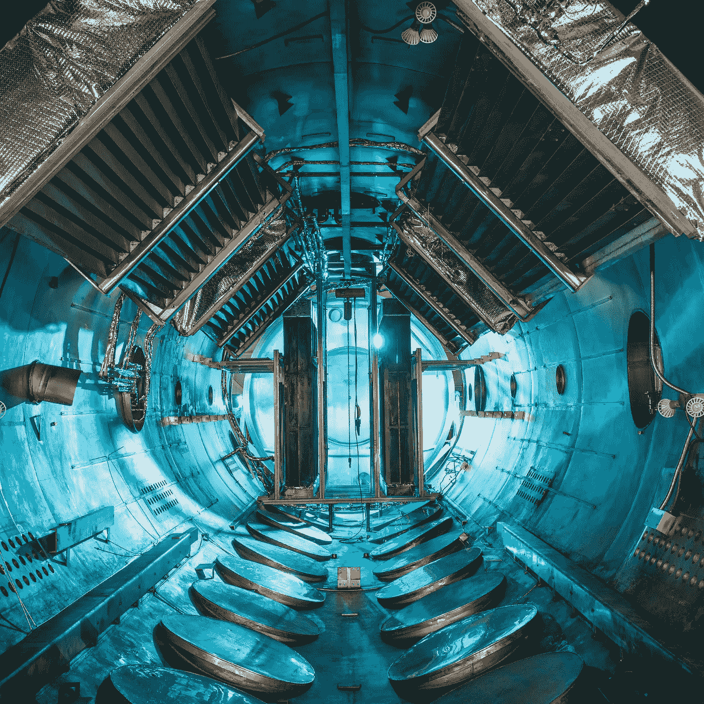

# 现代百万富翁投资的 5 项有前途的技术

> 原文：<https://medium.datadriveninvestor.com/5-promising-technologies-in-which-modern-millionaires-invest-dac8799be058?source=collection_archive---------3----------------------->

## 从绿色能源到永生

Photo by [NASA](https://unsplash.com/@nasa?utm_source=unsplash&utm_medium=referral&utm_content=creditCopyText) on [Unsplash](https://unsplash.com/s/photos/technology?utm_source=unsplash&utm_medium=referral&utm_content=creditCopyText)

# 1.可再生能源

环保技术越来越吸引投资者。例如，一群亿万富翁，包括比尔·盖茨、杰夫·贝索斯、马云、迈克尔·彭博和理查德·布兰森，成立了突破能源风险投资公司。其目的是确保地球上的每个人都有良好的生活水平(包括电力、健康食品、舒适的住房和交通)，而不会加剧气候变化。

该基金选择能够每年减少至少 0.5 亿吨全球温室气体排放的公司。科学和“填补空白”方面的可行性也很重要。后者意味着，该基金更有可能投资于绿色能源领域，而这些领域仍未得到充分开发。

到目前为止，突破能源风险投资公司已经投资了 14 家公司，处理电力储存系统，地热发电和聚变能源。

 [## 2019 年即将改变世界的技术|数据驱动的投资者

### 很难想象一项技术会像去年的区块链一样受到如此多的关注，但是……

www.datadriveninvestor.com](https://www.datadriveninvestor.com/2019/01/17/the-technologies-poised-to-change-the-world-in-2019/) 

# 2.太空飞行

企业家埃隆·马斯克(Elon Musk)和理查德·布兰森(Richard Branson)积极投资太空技术开发，并拥有自己的公司从事该行业的开发。SpaceX Musk 和维珍银河·布兰森热衷于让人类在地球之外定居的梦想成为现实。

被认为是世界首富的亚马逊 CEO 杰夫·贝索斯不会为他们辩护。他创立了航空航天公司蓝色起源。2019 年，它被列入美国宇航局选择为登月开发和生产原型航天器的名单。

# 3.人工智能

**对于硅谷企业家**，这是最常见的投资领域之一。例如，马克·扎克伯格(Mark Zuckerberg)和埃隆·马斯克(Elon Musk)以及其他投资者向 Vicarious 投资了 4000 万美元，Vicarious 是一家旨在创造人工通用智能(或 AGI)并教会机器人如何训练的公司。

亿万富翁马克·库班投资于语音识别技术。现在，几乎所有的消费电子产品制造商都希望在他们的产品中嵌入语音启动功能，投资者认为这个领域非常有前途。“语音激活将改变消费电子产品，”Kyuban 说，“我认为所有没有语音或触摸启动的设备都将随着时间的推移而消失。”

> 他不仅投资于亚马逊，亚马逊本身也在语音技术的开发方面投入了大量资金，他还投资于小型初创企业。

Kyuban 说，在消费电子展上，他特别关注后者。“我看着来自世界各地的小公司的展台，”这位企业家说，“那些只有一张桌子的公司通常拥有最有趣的技术。”

# 4.生物技术

临近老年的意识使许多人想到健康。当你非常富有时，你不仅可以参加体育运动，合理饮食，还可以投资购买延缓衰老的新药。并在此过程中获得丰厚的利润。

生物技术是一个非常有前途的投资领域，贝佐斯和盖茨这样的风险资本家和巨头都投资于此。例如，彭博新闻社的创始人迈克尔·彭博投资开发微生物疗法。理查德·布兰森是按需医生应用程序的一部分，通过它你可以远程咨询专家。比尔·盖茨是银杏生物公司的一员，该公司专门设计微生物。贝宝彼得·泰尔的创始人——免疫疾病药物的创始人。

Photo by [Paul Frenzel](https://unsplash.com/@paulfrenzel?utm_source=unsplash&utm_medium=referral&utm_content=creditCopyText) on [Unsplash](https://unsplash.com/s/photos/technology?utm_source=unsplash&utm_medium=referral&utm_content=creditCopyText)

# 5.寿命延长

今天，意识的数字化是永生最有可能的选择。科学家们正在寻找实现它的方法，百万富翁们也在积极投资这样的项目。

也许就像 DNA 可以储存数字数据一样，通过人造 DNA 来储存数字数据。为此，零和单位被编码为蛋白质序列(A，T，C，D)并合成为 DNA 分子。这种分子储存在试管中，可以在特殊设备上解密。

> 有了这项技术，你可以把互联网上的所有信息都装进一只鞋盒子里。

当然，将意识加载到计算机中是相反的过程。但是，我们已经能够将数字技术和自然现象结合起来，这个事实听起来很有希望。未来学家和发明家雷·库兹韦尔(Ray Kurzweil)认为，“我们将越来越失去生物本性，直到非生物部分成为主导，生物部分失去其重要性。”

此外，百万富翁们还对另一种延长寿命的可能选择感兴趣。在此期间，尸体被冷却至 196 ℃，然后可以无限期保存。理论上，人死后可以立即冷冻身体，在未来医疗技术更加完善，我们可以治疗致命疾病的时候复苏。

到目前为止，我们没有机会复活解冻的身体，但许多人都很乐观。例如，美国人体冷冻研究所主任丹尼斯·科瓦尔斯基称冷冻过程为“带你去未来的救护车”