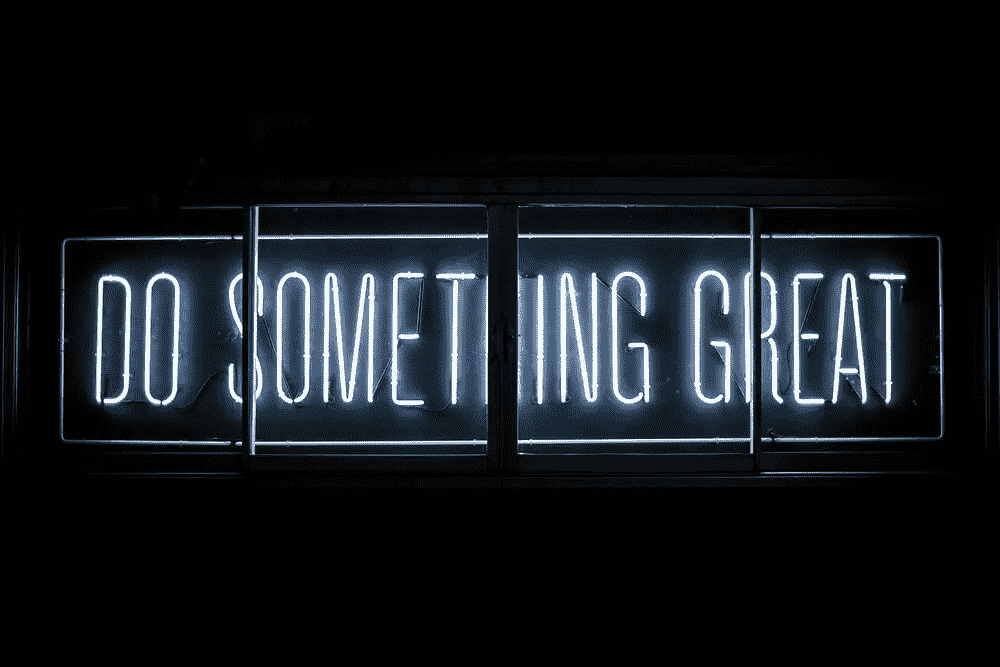
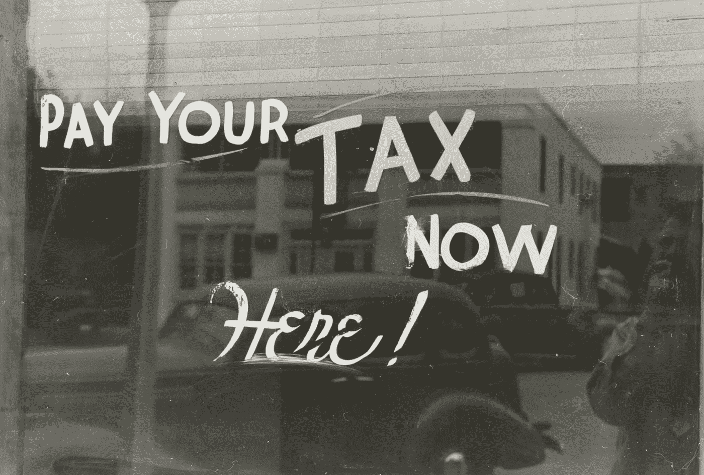

# 做出更好财务决策的 5 个问题

> 原文：<https://medium.datadriveninvestor.com/5-questions-for-making-better-financial-decisions-52c34247dabd?source=collection_archive---------12----------------------->

Photo by [Greg Rakozy](https://unsplash.com/@grakozy?utm_source=unsplash&utm_medium=referral&utm_content=creditCopyText) on [Unsplash](https://unsplash.com/s/photos/intelligence?utm_source=unsplash&utm_medium=referral&utm_content=creditCopyText)

## 多做点。多留着。活得更好。

你有没有想过，有些人是如何做出如此伟大的财务决策，而有些人似乎在每一个机会面前都步履蹒跚？

你真的知道如何区分一个好的财务决策和一个不太好的财务决策吗？

你能想象在你的生活中拥有一个做出更好的财务决策的框架会有多有用吗？

具有讽刺意味的是，在大多数情况下，像你我这样的人实际上根本没有做出财务决策。相反，他们只是简单地遵循“阻力最小的路径”，做“群体”告诉他们最好的事情。

我们正被引向的道路铺得如此之好，以至于我们甚至不知道我们有不同的选择。相反，我们把它视为自动反应或“给予”而不是决定。

这条“轻松之路”通常看起来像是向一家公司赞助的个人退休帐户、401(k)或其他股票市场工具捐款，而没有太多考虑它将如何影响他们未来的流动性、心态或税收。

在其他情况下，财务自动驾驶意味着试图尽快还清抵押贷款或学生贷款债务，而不了解该决定的“利弊”。

更糟糕的是，阻力最小的途径可能看起来像是仅仅因为朋友或亲戚的要求，就给他们钱进行“投资”或创业。

这不是你的主意，这是别人的主意，但对你来说，没有任何更深入的调查，说“是”比说“不是”更容易…所以你做了。

我已经看够了这种容易说“是”的投资，却不知道不应该如此轻率地对待它们。

如果有更好的方法呢？

一种思考金钱的方式，这样你就可以持续不断地朝着你的目标前进，并保护自己免受可能抹去多年辛勤工作和储蓄的错误决定的影响？

绕过自动下滑滑向无意识的、偶然的投资。

答案是响亮的“是”，但可能不是你想的那样。

做出好决策的关键与你选择的工具或产品关系不大，而与你为什么做出选择关系更大。

工具的好坏取决于使用它们的人，所以做出好的决策就是要选择适合自己的工具和策略！

当你意识到你可以创造你自己的选择，你不需要只是接受这个世界提供给你的，这是一个重大的转变。你不再是别人奉献的奴隶，所以你可以打造自己的道路！

这种知识会给你力量，最终会让你成为自己的船长，不管风向如何！

在你进入任何投资或储蓄工具之前，这里有几个问题要问。如果你花时间对自己诚实，你可能会发现世界上大多数选择对你来说都不理想。

 [## 投资区块链前要问的三个简单问题(也是一个困难的问题)|数据…

### 现在是了解区块链的最佳时机。不同货币之间的增长率，比如…

www.datadriveninvestor.com](https://www.datadriveninvestor.com/2020/03/12/three-simple-questions-and-one-difficult-one-to-ask-before-investing-in-a-blockchain/) 

这其实是个好消息…

因为你将能够专注于什么是最好的，而不会被其他人推行的其他选择分散注意力。一旦你体验了从一个想法或机会到另一个想法或机会的自由，你就再也不会回头了。

# 做出更好财务决策的 5 个关键问题:

这种金融工具能增加我的信心，增强我的思维吗？还是会把我推向恐惧、怀疑或匮乏？

你的自信和心态是你最重要的属性。拥有一个丰富、乐观的心态，你会做得更好！这包括你的商业和职业决策、人际关系、健康和财务状况。因此，做出让你的心态保持最佳状态的决定至关重要。

更进一步说，如果某件事让你赚了钱，但在这个过程中你感觉更糟或更害怕，这值得吗？绝对不行！

在我看来，钱的全部意义在于提高你的生活质量。因此，如果一项投资降低了我的生活质量，我认为这是一项糟糕的投资……即使它在这个过程中赚了更多的钱。

Photo by [Clark Tibbs](https://unsplash.com/@clarktibbs?utm_source=unsplash&utm_medium=referral&utm_content=creditCopyText) on [Unsplash](https://unsplash.com/s/photos/success?utm_source=unsplash&utm_medium=referral&utm_content=creditCopyText)

**2)我对机会或金融工具了解多少？**

如果你不明白你把钱投在哪里，你成功的几率会低很多。我看到太多的人把钱投入到他们根本不了解的投资、产品或业务中。

对我来说，这似乎很疯狂！

为什么要把一生的积蓄放在一个你不了解的地方？你如此努力地工作挣钱，所以尽可能地保护它是必要的。因此，了解一个金融工具或机会如何运作是投资前的先决条件。

最后一点，如果你不懂某样东西，但想投资它，那么你的第一笔“投资”应该是接受战略、产品或业务方面的教育。

**3)我能在多大程度上控制这辆车？**

如果你无法控制自己的投资方向，那么如果投资/工具不起作用，你会怎么做？你能把钱取出来吗？你能帮助改善投资或工具的结果吗？

再说一次，如果你对你的钱没有控制权，那么你成功的机会比你有知识和控制权的时候要低。(不言而喻，如果你不理解一项投资，那么你也无法真正控制其结果)

Photo by [Nick Gardner](https://unsplash.com/@gardnermt?utm_source=unsplash&utm_medium=referral&utm_content=creditCopyText) on [Unsplash](https://unsplash.com/s/photos/key?utm_source=unsplash&utm_medium=referral&utm_content=creditCopyText)

对我来说，这种金融工具有多灵活？

我们都知道市场会起起落落，经济正以惊人的速度变化，因此适应新变化的能力至关重要。即使是世界上最聪明的人也不知道 5 年或 10 年后会发生什么，所以你怎么知道呢？

无论经济和个人情况如何，比如受伤、生病或个人问题，保持资金的流动性或灵活性都可以让你有最大的机会保持低风险和最大化盈利。

例如，许多人在 21 世纪初“投资”快速偿还房屋抵押贷款。不幸的是，当 2008 年抵押贷款危机爆发时，这些人持有大量房屋净值，但现金很少。对于那些失去工作、无力支付账单的人来说，股权没有帮助。他们中的许多人失去了他们的房子和所有额外的钱，他们“投资”到加速回报，因为他们不能得到他们的股权。

最终他们失去了房子和“投资”,因为他们没有灵活性。

**5)我的钱被优化用于税收效率了吗？**

税收很可能是你生活中最大的一笔支出，所以你能做的任何合法的减少纳税的事情都是至关重要的。你没有缴税的每一块钱都等同于赚了新的一块钱，你赚得越多，税收策略就变得越重要。

考虑税收优势(或陷阱)涉及你的金钱决策是一个游戏规则的改变者。例如，在免税的汽车里增加钱可以让你在生活中得到的钱的数量有很大的不同。许多投资工具似乎通过允许你推迟缴税来帮助你缴税，但如果最终缴税时税收更高或你的收入更高，这些“优势”可能实际上对你不利，而不是对你有利。

没有人确切知道税收会发生什么，但从长远来看，做出有意识的决定要比“随波逐流”好得多。

# 大多数人正在做的事情(那不起作用)…

我遇到的大多数人都没有考虑这 5 个问题，这影响了他们的结果。但这还不是最糟糕的部分…

更糟糕的是，他们没有意识到他们付出了多少“看不见的”成本。**看不见的成本是指你做了一个让你损失利润的决定，但你却不知道。**例如，如果某人在一项投资中获得 6%的收益，但本来可以获得 10%的收益，那么看不见的成本就是 4%(我们称之为机会成本)。

有许多类型的看不见的成本可以蚕食你的钱，包括:多缴的税，错过的储蓄收益，波动的短期(和长期)成本，由于缺乏流动性造成的损失或错过的机会，由于财务不确定性造成的糟糕的业务或个人决策，等等…

下次你开始考虑如何储蓄、保护或增值你的钱时，一定要考虑这 5 个问题。如果你对自己诚实，他们可能会帮助你做出更好的财务决策。

财务决策很重要，因为它们几乎影响到你生活各个方面。所以这些不仅仅是财务决定，这些是生活方式的决定，应该被如此对待！

# 准备好学习终极金融“黑客”了吗？

从今天开始，学会“破解”财务确定性。遵循它的教导，你的生活将会发生巨大的变化。

[点击这里查看……](https://derickf9771b.clickfunnels.com/wwrd-book-offer5l0eez5m)

*喜欢你正在读的书吗？我也有一个 YouTube 频道，你可以* [***点击这里***](https://www.youtube.com/channel/UCizOCPJqijbE1y2o2ANSCag?sub_confirmation=1) *了解更多精彩内容！*