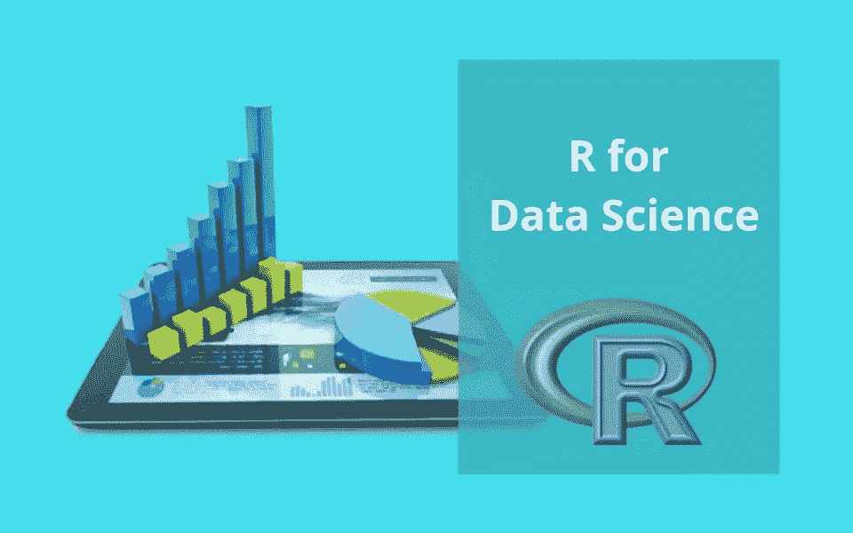

# 为数据科学选择 R 的 5 个理由

> 原文：<https://medium.datadriveninvestor.com/5-reasons-to-choose-r-for-data-science-a2041ed02ce5?source=collection_archive---------8----------------------->

# 为什么你应该学习 R？

那些开始研究数据科学的人面临一些潜在的问题，比如他们应该从哪种编程语言开始，以及哪种语言会给他们的时间和金钱投机带来最好的回报。

有这么多的编程语言，你可以选择，但问题是，哪种语言最适合你？每一种编程语言都有自己的优势，有如此多的可供选择的语言让我们感到困惑。

人们利用 Python、R、SAS，这种情况还会没完没了地继续下去。这些语言的范围很广。你可以选择其中的任何一个，但是请相信我，其中一些是辅助工具，你一年中可能用不了多少次。

这个想法让我们感到失望，如果我们花费时间和金钱去学习一种语言，而这种语言在很久以前就不会对我们有所帮助。

 [## 数据科学和软件工程哪个更有前途？数据驱动的投资者

### 大约一个月前，当我坐在咖啡馆里为一个客户开发网站时，我发现了这个女人…

www.datadriveninvestor.com](https://www.datadriveninvestor.com/2019/01/23/which-is-more-promising-data-science-or-software-engineering/) 

这些问题出现在每个人的脑海中，然后，我们开始寻找一些帮助，这就是今天你们在这里的原因。不要担心，我会给你最好的建议，这是由这个领域的许多顶级专家指导的。 [**让我们看看 R 将如何帮助你实现你的数据科学梦想。**](https://techvidvan.com/tutorials/r-tutorial/)

## 但是为什么要以 R 开头呢？

所以你应该从编程语言“ **R** ”开始。r 语言有其自身的优势，是编程领域最受推崇、最知名的语言。

你可以理解为什么 R 是最适合你的编程语言。以下是一些有助于我们推荐的优势和理由:

## 1.流行和广泛使用的语言:

正如大量研究表明的那样，人们发现 R 是最常用和最著名的编程语言。这是一种广泛使用的语言。

正如 O'Reilly Media 在 2014 年所做的一项综述所指出的，我们发现世界各地的大部分数据科学家都在使用 R 语言，他们还发现 R 语言是数据科学家使用最多的编程语言。

r 被证明是数据科学中使用最广泛的语言。通常使用 r 是因为它在数据分析和统计计算中易于使用。

这种语言是在 90 年代中期创造的，从那时起，它越来越受欢迎。为了改进 R 的 UI，已经做了无限的努力。随着时间的推移，r 变得越来越占主导地位，原因是它包含了强大的软件包。

## 2.易于编码:

在 r 语言中有大量的统计和图形技术，它是一种借助扩充和函数的可扩展语言。r 社区很受欢迎，因为它在软件包方面是一个巨大的、动态的承诺。

有许多标准函数是用 R 语言编写的，这使得客户端使用起来更加简单。R 语言的编码风格非常简单。当你使用它时，你会发现 r 中的编码是多么简单。

你需要专注于数据科学的三个部分

**1。数据操作，**

**2。数据可视化，**

**3。统计学。**

这是您需要关注的 3 个中心专业领域。

## 3.惊人的公司正在使用 R:

世界上最强大的组织都在使用 r。你可能正在考虑这些令人难以置信的组织的名称，但请不要着急，你不必考虑这些令人惊叹的著名组织的名称。我们将向你披露这些名称，它们是**谷歌、脸书、微软、美国银行、福特、优步、TechCrunch、**和 **Trulia** 等等。

你应该知道这些名字或组织。最初的三个是巨大的技术。组织。脸书和谷歌是在尖端经济中承担重要工作的两个组织。

[***你必须知道的 R 的 9 个真实世界用例！！***](https://techvidvan.com/tutorials/r-applications/)

## 4.数据操作非常简单:

如果你从事数据科学的工作，在这一点上，你可以理解数据科学中的大部分工作是数据操作。数据科学家投入大量精力来处理数据，最终，我们可以说数据科学最重要的部分是将数据整理成您需要的形状。

借助 R 中的包，你可以有效地做到这一点，这个包叫做 Dplyr 包。你会发现 r 拥有最好的数据管理工具。

## 5.无需支付任何订阅费用:

正如你可能知道的，它是一个开源软件，这就是你不需要支付任何会员费的原因。它是开源的，因为它得到了开发它的社区的支持。

有许多编程语言是昂贵的，向你收取会员费，但你不需要为会员费支付一分钱。这是它受欢迎的另一个原因。个人可以像从事其他活动一样，无需付费就能使用它。

## 尾注:

这是使用 R 编程语言的一些优点。在任何情况下，我们应该声明，这些不是利用 R 的唯一优点和意义，还有更多。

无论如何，它绝不是你应该学习的唯一的编程语言，因为事实上，对于每一类问题都没有理想的工具。在 R 之后，你需要熟悉更多的语言，但它是最好的编程语言。在学习 R 之后，你可以使用一些不同的语言，比如 Python 和 D3。