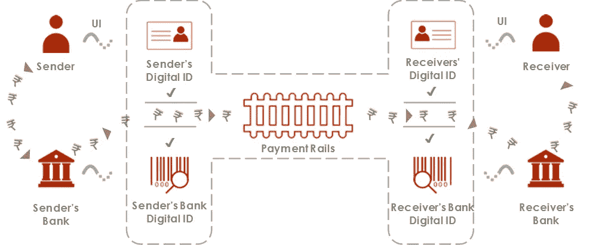

# 分散云架构的 5 个理由。

> 原文：<https://medium.datadriveninvestor.com/5-reasons-to-decentralize-your-cloud-architecture-1c6d6c2db10a?source=collection_archive---------23----------------------->

考虑走区块链路线的真正原因。

自从黑客马拉松的组织者嗅到了区块链的气味，他们就对它着迷了。区块链是一项伟大的技术，但你不需要基于区块链的宠物店——很可能。但是分散管理是有正当理由的，今天我们将讨论这些理由。

Photo by [Pascal Bernardon](https://unsplash.com/@pbernardon?utm_source=medium&utm_medium=referral) on [Unsplash](https://unsplash.com?utm_source=medium&utm_medium=referral)

区块链有许多不同的类型，但我们将坚持企业、金融科技和开发用例。让我们明确一下区块链技术到底是什么:它是一个计算机网络，运行一些代码将它们连接在一起，存储数据，并持续存储数据。这是区块链技术的鸟瞰解释。区块链有公立和私立之分。术语 private 和 permissioned 在企业范围内略有不同，但为了便于讨论，我们不会区分它们。

私有区块链是一组节点(计算机的别称),它们互相认识，或者以某种方式互相信任。这些区块链由喜欢为结算、财务或其他目的保留共享分类帐的组织使用。他们简化了供应链的流程。

公共区块链在这里是一个不同的球赛。公共区块链之间的计算机彼此不认识，因此必须对每一个新的交易达成共识。验证一个节点有激励:当你验证时，交易被添加到链中，你得到一些(通常)钱。如果你正在开发一个应用程序(像 Twitter 克隆但去中心化)或金融科技服务(像比特币)，那么使用公共区块链。

尽管如此，我们将讨论分散您的云架构的 5 个原因，但老实说，您可以使用纸笔，这将是一个解决实际旧时代分类账笨拙的好办法(这通常是会计呆子使用的笔记本，嘘！).

# **1。安全性:你不能篡改数据。**

我是一名黑客，我*真的*讨厌你的香蕉运输公司，伙计。因此，我决定侵入您的集中式云架构，可能由您的实习生(我曾经是实习生)托管在 AWS 上，以某种方式提取您的凭据，并通过过度报告香蕉来破坏您的系统。你不会知道你迷失在一些美好的时光里。

Mr, Robot is ❤

现在考虑同样的场景，我是一个黑客，回到它。仍然憎恨你的香蕉公司，那是你的错，你种了可怕的香蕉。但你这次放权了。我以某种方式侵入了你部署的链条，并试图改变你卖出的香蕉数量的价值。嘣，我做不到，除非我获得 51%的网络控制权，这是一大堆工作。作为一个自封的虚构黑客，我现在很难过。

“Bro, why would you have enterprise Blockchains at a banana company man?”

现在，这并不是说许可的区块链是安全的，可以抵御风、雨和太阳——如果任何东西靠电力运行，它可以被黑客攻击。我说的被黑，是指妥协。糟糕的许可政策、未定义的智能合同、脆弱的加密技术，可能真的是任何东西——但一个实施良好的区块链解决方案，无论是许可的还是公开的，都比集中式服务更难篡改。

# 2.无缝交易:这是我们之间的秘密。

你在俱乐部度过了一个美好的夜晚，正准备回家，你喝得烂醉如泥，但很负责任，所以你打电话给优步送你回家。优步来了，你们来到 pad，然后拿出手机通过 Venmo，AAAA 付款，你的付款被拒绝。你的司机在等着，他要去接另一个乘客，你最好快点。这种情况很常见，想象一下同样的事情:“在杂货店排队，后面跟着一个凯伦。”。嗯，不用了，谢谢。

Photo by [Macau Photo Agency](https://unsplash.com/@macauphotoagency?utm_source=medium&utm_medium=referral) on [Unsplash](https://unsplash.com?utm_source=medium&utm_medium=referral)

如果您将财务数据转换为加密数据(假设您的优步驱动程序也接受加密数据)，会发生以下情况:

注意，这需要时间，因为比特币还不是一种著名的支付方式。在你的电子商务商店、实体店或任何地方设置加密支付只需几分钟。当然，加密支付存在一些问题，主要是缺乏一个关于加密的商业用途的健全的法律框架，但等待 5-10 年，这真的真的会得到解决。除此之外，在应用程序使用区块链的情况下，您可以在链上结算您的交易，这使得数据处理更加简化。如果你正在开发一个 dApp，激励你的客户比你想象的要容易，典型的例子:【cent.co。

# **3。无信任无摩擦:无中心 boss**

为什么支付入口会失败？要回答这个问题，我们必须看看支付门户是如何工作的。这里有一个快速图表可以帮助你:

Source: Unknown

它的“支付轨道”部分由数百个分类账组成，这些分类账被更改以纳入您的支付，由于超时、停机等原因，任何服务器链接相关分类账的任何一点出现故障，都意味着您的交易失败。这些系统是由像你我这样的开发人员编写的，可能更好，使用(大部分)遗留代码。失败是常见的，我很惊讶 MITM 的攻击不是，但它们是脆弱的(参考文献。[https://threat post . com/banking-apps-found-vulnerable-to-mitm-attacks/129105/](https://threatpost.com/banking-apps-found-vulnerable-to-mitm-attacks/129105/)。

现在比特币基于区块链技术工作，这意味着如果你给我 0.5 BTC，你就在与我交易，直接向网络广播，从地址 X 到地址 y 发生了交易

没有中间人，没有冗长的总账交易。你付钱，我得到它。一些矿工将验证交易。在私有链上，这意味着您可以使用一些自动化代码来结算链上的交易——甚至更好。

缺乏中央权威也意味着你有控制权。网络中的所有节点都是平等的。

# 4.透明交易:违反直觉的优势

乍一看，这似乎违反了第二点的直觉。但是请记住，交易可以使用公钥匿名。现在，这些并不是 100%安全的，但是你可以使用工具匿名。使用比特币地址很难搞清楚谁是谁，但并非不可能。但它确实介于两种用途之间，因为没有中间人会使用你的数据。这对私人连锁店来说很好，但对公共连锁店来说就不那么好了。这取决于你，你是否能接受这一切。在金融科技领域，这可能是一个问题，但在几乎所有其他场景中，我想不出有什么问题与此相关！

# **5。减少基础设施成本:欺骗中间人**

维护一个服务器是昂贵的，部署你的 dApp 到以太坊主网上就不是了。基础设施的成本掌握在用户手中:重视去中心化的用户。在一定程度上降低了您的成本。

Photo by [Christina @ wocintechchat.com](https://unsplash.com/@wocintechchat?utm_source=medium&utm_medium=referral) on [Unsplash](https://unsplash.com?utm_source=medium&utm_medium=referral)

# 什么时候不用区块链

每个区块链爱好者都会忘记这一部分，但这里有几个不使用基于区块链的解决方案的理由。

1.  **你对你目前的系统感到满意**:这是显而易见的。
2.  **你想要即时交易，即使是微交易**:共识让它变得更慢。
3.  你重视节点间的保密性。

区块链不仅仅是比特币。供应链、密码、社交网络——它会通过悄悄补充来破坏所有的东西。你已经准备好了，欢迎第三次网络技术浪潮！