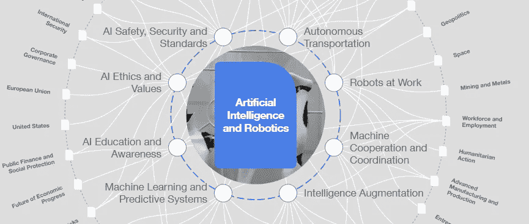
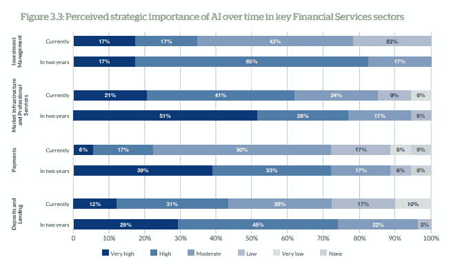
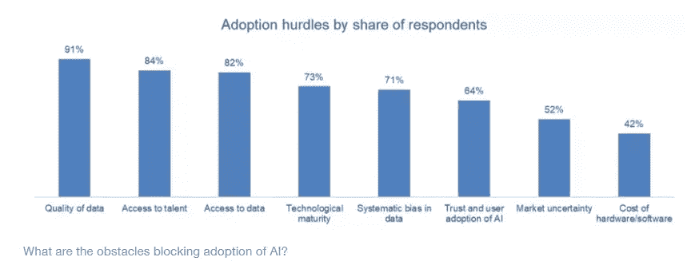
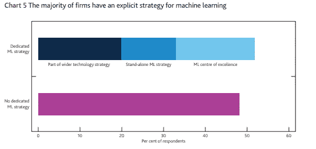
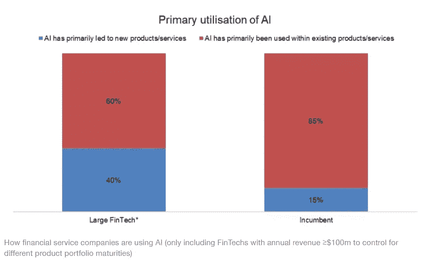
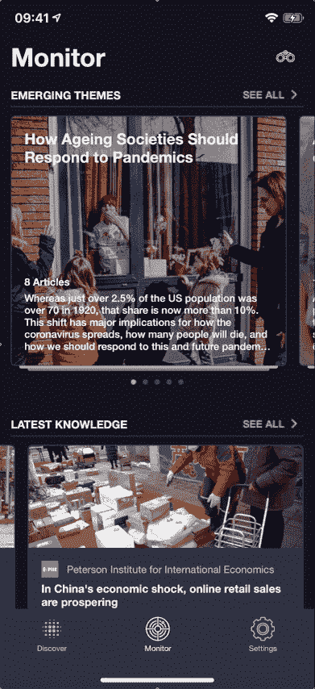

# 人工智能和金融是天作之合的 5 个理由

> 原文：<https://medium.datadriveninvestor.com/5-reasons-why-ai-and-finance-are-a-match-made-in-heaven-427198de42c3?source=collection_archive---------9----------------------->

*与*[*Nadia Abouayoub*](https://www.linkedin.com/in/nadiaabouayoub/)*[*创始人 AIFINAI*](https://www.aifinai.com/) *和* [*世界经济论坛的数字成员*](https://www.weforum.org/)*

*人工智能(AI)将会影响许多部门和行业。与其他行业相比，金融部门已经证明自己是人工智能的早期采用者。所以 AI 和机器学习在金融方面的应用是数不胜数的。交易员、财富经理、保险公司和银行家可能以某种形式很好地意识到了这一点。*

*由于人工智能的基础是从数据中学习，因此它非常适合记录对业务至关重要的金融部门。它还在需要智能、分析和清晰思维的领域建立了自动化。像 f [金融服务聊天机器人](https://wotnot.io/financial-chatbot/)这样的应用确实证明了自己是提高客户满意度的有力工具，也是企业无可匹敌的资源，帮助他们节省了大量时间和金钱。*

**

*Artificial Intelligence [“Transformation Map”](https://intelligence.weforum.org/topics/a1Gb0000000pTDREA2?tab=publications)*

*根据世界经济论坛完成的一项研究，人工智能正在改变金融机构从数据中产生和使用洞察力的方式。反过来，这推动了新形式的商业模式创新，重塑了竞争环境和劳动力，产生了新的风险动态，并对企业和决策者提出了新的挑战。*

*我们的数字成员 Nadia Abouayoub 是人工智能和金融领域的领先专家，目前正在开发一个教育平台，以阐述人工智能如何融入金融领域。我和她谈了这个领域是如何发展的，以及我们需要记住的一些误解和局限性。*

* [## 金融行业如何受益于机器学习发展和人工智能|数据驱动的投资者

### 在快速变化的金融世界中做出正确的决定并抓住机会可以让你的…

www.datadriveninvestor.com](https://www.datadriveninvestor.com/2020/07/28/how-finance-sector-can-benefit-by-machine-learning-development-and-ai/) 

# ***1。人工智能将是未来金融的关键部分。***

在第四次工业革命中，人工智能是将颠覆和塑造我们的工业和社会的关键技术之一。我们的社会正面临着前所未有的挑战，这些挑战影响着我们的经济、环境和福利。为了解决这些问题，我们需要处理和分析与之相关的数据。转向新技术来理解数据、识别模式和预测潜在结果可以让我们有能力面对困难的挑战。

[Global AI in Finance success survey](http://www3.weforum.org/docs/WEF_AI_in_Financial_Services_Survey.pdf)

金融和货币生态系统，像其他行业一样，正在采用新技术。监管机构已经认识到这种破坏的影响，并公布了他们对金融机构的建议，特别是关于人工智能和其他新技术将如何影响我们行业的治理。我们在成熟的银行中看到许多关于使用人工智能的计划，以帮助他们分析和理解市场，做出决策，并从不断增加的数据中提取信息。另一个现象是越来越多的金融服务初创公司将人工智能作为其商业模式的一部分。

# 2.我们需要为这将导致的混乱做好准备。

从宏观层面来看，首先要关注的进步是公司的颠覆和新数字技术的整合。如前所述，公司必须适应，许多公司正在经历数字化转型。转型的成功将取决于公司如何将人工智能和新技术纳入其商业战略和商业模式。

公司有不同的技术成熟度，每一种适应都应该符合公司的商业模式。除了适应之外，我们还需要让员工为当前和未来的发展做好准备。

[How AI is shaping Financial Services](https://www.weforum.org/agenda/2020/02/how-ai-is-shaping-financial-services/)

在微观层面上，自然语言处理和算法计算将是数据管理的关键。不能忽视数据的有效性和准确性，需要建立有效的流程，以确保数据集的采购和维护效率，同时优化数据质量。此外，新场景对算法的影响、事件的因果关系及其对预测模型的影响将对金融业产生巨大影响。

# 3.技术和伦理上的限制将决定这个领域发展的速度。

大多数关于人工智能的误解源于缺乏教育和意识。通过了解 AI 及其局限性，组织将能够设计更现实的实施计划，并确保其项目的成功。不幸的是，目前，许多统计数据显示，AI 项目的失败率很高。这些不仅会对公司产生重大的财务影响，还会对未来的潜在实施产生负面影响。

此外，整合人工智能模型依赖于大量的数据。为了确保结果的准确性，模型必须解决容量、速度和多样性的限制。数据限制是一个关键问题。数据缺失、数据质量差、数据缺乏会限制机器学习开发标准，正如[英格兰银行](https://www.bankofengland.co.uk/-/media/boe/files/report/2019/machine-learning-in-uk-financial-services.pdf?la=en&hash=F8CA6EE7A5A9E0CB182F5D568E033F0EB2D21246)所规定的。

[Bank of England Report](https://www.bankofengland.co.uk/-/media/boe/files/report/2019/machine-learning-in-uk-financial-services.pdf?la=en&hash=F8CA6EE7A5A9E0CB182F5D568E033F0EB2D21246)

除了技术限制，还有其他潜在的问题需要考虑。有各种各样的原则已经建立，以帮助人工智能的使用。公司可以创建自己的一套规则，也可以参考经合组织、欧盟或其他机构的一些预定义规则。在内部治理中，确保人工智能项目在道德上得到实施至关重要。

# **4*。模型的可信度至关重要。***

与人工智能和金融相关的一个重要问题是人工智能模型的稳健性。这需要应用到所用算法的性质，以及对数据的深刻理解。还必须确保安全和可解释的执行，特别是在金融部门，以确保透明度。

[How AI is shaping Financial Services](https://www.weforum.org/agenda/2020/02/how-ai-is-shaping-financial-services/)

人工智能模型缺乏鲁棒性限制了算法的适应性和可扩展性，是项目失败的一个参数。为了实现健壮的解决方案，我们应该关注于成功地实现有弹性的、可伸缩的和适应性强的模型。所有这些参数结合起来将有助于我们提高模型的可信度，开发值得信赖的人工智能。

# **5。信息将提供竞争优势。**

在这个数据量呈指数级增长的信息和数据时代，知识和洞察力对所有行业都至关重要。在金融服务领域，信息有助于理解影响行业的所有参数，以及管理、理解和处理数据的能力。

> 为了保持竞争力并有效地管理风险，公司正在寻找通过识别模式来帮助他们建立对数据的深刻理解的技术。

人工智能模型正被用来帮助数据讲述它的故事。基于信息和人工智能的解决方案，目的是确保决策过程是公平和准确的。从信息中提取数据是不够的；我们还需要确保我们能够保证数据的准确性，以及模型的透明度。

# **像战略情报这样的工具将是获得竞争优势的关键。**

战略平台通过收集跨行业和社会现象的关键影响参数，帮助缩短洞察时间。通过将不同的元素整合到转换图中，它有助于我们了解参数之间的关系及其对我们行业的影响。例如，我们可以看到治理的变化，一个行业中的特定中断，如何影响市场。

Nadia 发现的另一个有益的特性是可以通过 transformation map 可视化行业间的交互。它让我们能够分析可能扰乱行业的风险和挑战。通过转换图，信息的收集可以促进决策。* **

*[Strategic Intelligence](https://intelligence.weforum.org/) 是一个在线数字平台，帮助个人和组织解读全球复杂性加速带来的潜在影响，同时抵制正在传播的误导和不可靠信息。战略情报工具有助于您了解全球力量并做出更明智的决策。*

*要探索战略情报，请访问 intelligence.weforum.org 的[或在 iOS、Play 或华为商店中搜索*战略智商*。](https://intelligence.weforum.org/)*

***加入世界经济论坛的数字会员社区来监督这些问题，更多** [**这里**](https://digital-members.weforum.org/intelligence) **。***

***访问专家视图—** [**订阅 DDI 英特尔**](https://datadriveninvestor.com/ddi-intel)*