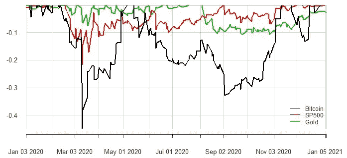

# 比特币尚未准备好成为主流资产的 5 个原因

> 原文：<https://medium.datadriveninvestor.com/5-reasons-why-bitcoin-isnt-ready-to-be-a-mainstream-asset-57dea0c5ad04?source=collection_archive---------3----------------------->

## 挑战其接受度的障碍

Photo by [Tim Marshall](https://unsplash.com/@timmarshall?utm_source=medium&utm_medium=referral) on [Unsplash](https://unsplash.com?utm_source=medium&utm_medium=referral)

随着比特币的价格飙升至又一个历史新高，随着经验丰富的对冲基金投资者表示对配置比特币持开放态度，而摩根大通(JP Morgan)提出的长期预测高达 146，000 美元(T2，T3)，加密热潮真正扎根。尽管比特币在 2020 年的反弹中重新燃起了热情，但它作为主流资产的接受程度不仅仅取决于投机和叙事。要被视为一种主流资产(与股票、债券和外汇等资产同等)，加密货币需要通过机构投资者的审查，这些投资者包括养老基金、捐赠基金、主权财富基金和资产顾问等，因为他们是资本的真正守护者。

这些受托人管理或建议全球价值数万亿美元的多资产类别投资组合，其中投资立场的战略变化会对市场格局产生显著影响。最近的例子包括被动投资、私募股权和 ESG 投资。在机构投资者能够认真对待加密货币作为一种可投资资产类别之前，有相当多的挑战需要解决。

1.  **波动**

Rolling 1 year annualized volatility, Source Data: St Louis FRED

比特币在其相对较短的生命周期中一直极其不稳定。按滚动年率计算，其波动性是黄金和股票等其他资产的数倍。投资者经常使用回报波动性作为总风险的衡量标准，这意味着即使是很小的比特币配置也可能对整体投资组合风险产生大得多的影响，从而难以开始有意义的配置。

**2。估值的潜在基本面驱动因素**

投资者通常在做出投资决定之前，使用估值框架来帮助判断资产是高估还是低估。支撑比特币基本价值的驱动因素尚不清楚，因此确定其“公允价值”极其困难。尽管已经进行了一些尝试，如使用梅特卡夫定律，但它们不同于机构投资中普遍接受的贴现现金流和风险溢价方法。比特币的低收益率只会加剧这个问题。底线是，无法对比特币进行估值让投资变得更加困难。

**3。作为对冲的有效性**

市场评论员最近指出，由于比特币与法定货币分离，它可以替代黄金作为价值储存手段。这一属性意味着它可能被用来分散美元疲软、通货膨胀和风险事件。虽然乍一看可能有道理，但有两个关键点偏离了这一叙述。首先，比特币基本价值的驱动因素仍然是可疑的，因此很难确定它与有效对冲所需的关键经济和金融变量之间的预期关系。第二，从经验上来看，比特币并没有显示出与上述任何一种资产存在持续的有意义的相关性，如下所示:

Rolling 1 year correlation, Inflation is US BEI 5Y, USD index is USD index vs major trade partners. Source data: St Louis FRED

如果有什么不同的话，在 Q1 2020 年的提款事件后，与股票的相关性飙升，这表明未来可能是增长资产的糟糕对冲。此外，如果我们看一下 2020 年资产缩水的比较，比特币在 3 月份的抛售中遭受的缩水是标准普尔 500 的两倍多。

drawdowns of assets in 2020/2021\. Source Data: St Louis FRED

**4。受到投机和泡沫行为的刺激**

在“叙事经济学”中，诺贝尔经济学奖得主罗伯特·希勒(Robert Shiller)指出，当比特币爱好者面对他时，他经常要求他们解释一些技术核心的技术概念，如默克尔树或椭圆曲线数字签名算法，之后他通常会面对茫然的目光。他继续假设，人们购买比特币的原因是为了参与一些新的和令人兴奋的事情，因为他们购买了这个故事。这段话完美地总结了投机诱导购买比特币的现状，因为价格在一个月内翻了一番后仍在继续飙升。这种行为让人想起其他狂热，比如郁金香和南海泡沫。

**5。规定**

比特币交易的匿名性和不可逆性意味着它是促进非法交易的理想选择。这只是政府和央行寻求监管加密货币的原因之一。然而，正是这一特点使得任何此类法规的执行都极其困难。尽管如此，许多机构投资者仍然担心与监管机构发生冲突。

# 那么这意味着什么呢？

比特币和加密货币背后的技术优势是显而易见的，像 R3CEV 这样的公司，一个由道富银行、瑞银和高盛等知名传统金融机构组成的财团，已经占据了研究和倡导区块链融入金融体系的前沿。然而，比特币作为一种**金融资产**的角色仍不明朗，因为其波动性、缺乏稳健的估值框架和未来监管都对其接受度构成严重挑战。

**免责声明** : **本帖纯属个人观点和看法的表达。它不代表任何建议。**