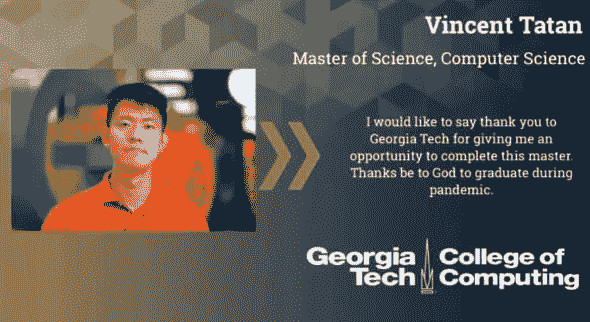
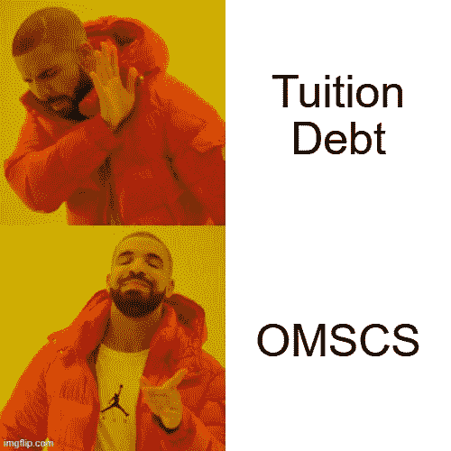
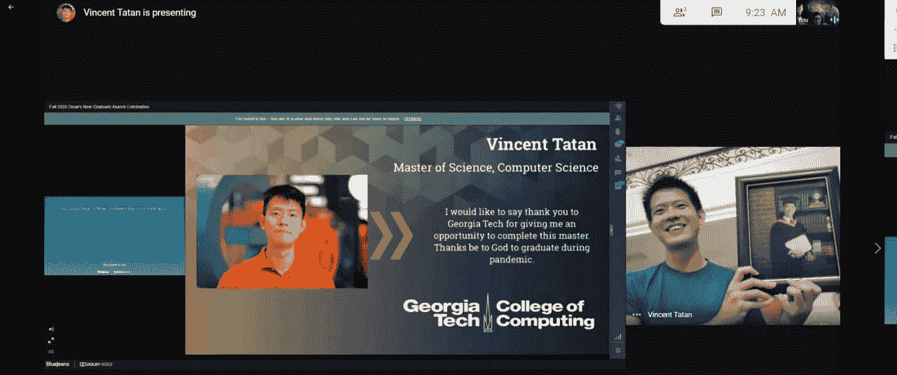

# 我喜欢带在线大师学习数据科学的 5 个原因

> 原文：<https://medium.datadriveninvestor.com/5-reasons-why-i-enjoy-taking-online-masters-to-learn-data-science-bba05eb5641c?source=collection_archive---------2----------------------->

## 我给有抱负的数据专业人士的建议是

## 为什么你也应该…

Online graduation ([Unsplash](https://unsplash.com/photos/cPWUODAvXjk))

> 我想学习并转向数据科学和机器学习
> 
> 我想接受高等教育，但负担不起高昂的学费

# 在线硕士学位的普及

似乎在疫情期间，人们已经重新考虑了他们的职业决策，并决定进入数据科学作为流行的选择。有太多的在线课程和微型证书，我收到了许多关于攻读计算机科学在线硕士学位的问题。

由于我一周前刚刚毕业，我想冒昧地分享一下我参加 OMSCS 的经历，以及为什么你也应该喜欢它。

*声明:除了分享我自己的经历和想法，这篇文章没有任何目的。它提供了一个初步的画面，以鼓励你开始或比较你的学习之旅。*

Snippets of my Graduation Profile

# 你为什么要参加 OMSCS

如果你还在考虑是要读硕士还是参加新兵训练营，我建议你看看这个视频。

> 恭喜你，当你继续阅读这篇文章的时候，你正在考虑获得一个研究生学位？但为什么是网上？为什么选择 OMSCS？

## 原因 1:你想要高度认可的硕士学位

[omsc 承诺](http://omscs.gatech.edu/prospective-students/faq)与在校毕业生同等学位证。这意味着作为一名 OMSCS 毕业生，你的毕业证书将会是“计算机科学硕士”,与校内项目的毕业生完全一样。

一开始，这引起了巨大的轩然大波，抱怨在线学生的质量会拖累排名。

但基于[最新里程碑](https://iblnews.org/georgia-techs-omscs-program-surpasses-a-milestone-10000-students-enrolled/)，其实是相反的。

> 佐治亚理工学院在网络安全教育方面排名全国第一，在美国新闻世界的计算机科学方面排名第五
> 
> ([来源](https://omscs.gatech.edu/news/cybersecurity-computer-science-take-top-spots-national-rankings))

此外，在疫情期间，佐治亚理工学院的 OMSCS 项目超越了一个新的里程碑: [10，000 名学生注册，扩大了佐治亚理工学院认证的 STEM 人才增长](https://iblnews.org/georgia-techs-omscs-program-surpasses-a-milestone-10000-students-enrolled/)。

## 原因 2:你想避免过高的学费。

Generated by Author

OMSCS 的整个项目要花费 [7000 美元。相比之下，](https://omscs.gatech.edu/prospective-students/faq)[在线优步网站 Ken Jee 分享了他获得 DS 研究生学位的经历，这让他负债 15 万美元](https://www.youtube.com/watch?v=domVw8isGOI)。

对我来说，OMSCS 为我节省教育费用提供了一个负担得起的解决方案。

## 原因 3:你想要高质量的教育

当我第一次加入 OMSCS 时，我真的很怀疑在线硕士学位的质量。但是毕业后，我没有后悔我的决定，因为:

**课程质量高**。正如他们所记录的那样，大多数模块都是由最好的讲师教授的，甚至包括教导我们机器学习和强化学习的院长查尔斯·伊斯贝尔(Charles Isbell)。

我也参加了 David Joyner(OMS cs 的执行董事)的所有课程，他的教学结构是最好的，对我来说非常清楚。

> 如果你在第四排，第五排，第 27 排，你就像一个在线的人一样离我很近，对吗？你并没有真正得到面对面的交流——当被问及在线和现场学生的平等时，查尔斯·伊斯贝尔( [youtube](https://www.youtube.com/watch?v=6xNpquytdzw) )

作业质量很高。作为 OMSCS 的学生，我们可以像在校园里一样获得相同的作业，我认为这是值得的。

例如，[在基于知识的人工智能](http://omscs.gatech.edu/cs-7637-knowledge-based-artificial-intelligence-cognitive-systems)中，我的第一个任务是构建一个学习代理，它可以使用图像和语言输入进行[瑞文渐进矩阵智商测试](https://www.123test.com/raven-s-progressive-matrices-test/)。这很有挑战性，但实现了我在课堂上学到的许多概念。

**结论**:不得不说 OMSCS 拥有我见过的最好的在线教程质量之一。每个学生都能够以很少的代价获得与物理学生相似的体验和益处。一句忠告是，研究课程提供，并连接到它给你带来的价值。

## 原因 4:你想要一个灵活的非全日制硕士学位

Meme generated by author

做 OMSCS 逼着我一边学习一边工作。它教会了我如何很好地管理我的时间和空间。对我来说，OMSCS 的优势是灵活的时间和空间使用的自由。

**灵活掌握时间**:omsc 允许你在开学日期和截止日期之间的任何时间上课、考试和布置作业。

这对我很有效，因为我总是把早上的时间作为我的注意力集中时间。这种灵活性是大多数在校研究生学位所不具备的，因为我需要上夜校来计划我的时间表，并在我注意力最集中的时候完成作业。

 [## 一瞬间学会数据科学！？数据驱动的投资者

### 在我之前的职业生涯中，我是一名训练有素的古典钢琴家。还记得那些声称你可以…

www.datadriveninvestor.com](https://www.datadriveninvestor.com/2020/07/23/learn-data-science-in-a-flash/) 

空间的灵活性:由于你可能无法接触到校园的物理空间，这就为你应该在哪里学习打开了大门。

对我来说，我总是利用我的办公室空间工作和做任务，而在家里放松，所以我可以在最少的通勤和干扰下批量工作和学习。

## 理由五:未来的教育就是现在

OMSCS 让我对未来的教育有了新的认识，所有的课程、考试和合作都在网上进行。

在疫情期间，许多研究生院都争先恐后地将课程放到网上。可悲的是，在某些情况下，这意味着为了速度而牺牲质量。我的一个朋友今年年初读了研究生，她觉得她付出的比她得到的教育价值要多。

因此，我很高兴能把 OMSCS 作为我的研究生课程，因为课程的质量保持不变。在整个在线互动过程中，我还和一些同事交了朋友，并在论坛上进行合作。

# 为什么你不应该参加 OMSCS

咻！为了使这次讨论更加平衡，我也想唱反调。如果出现以下情况，您不应服用 OMSCS:

*   **你不喜欢结构化的课程，更喜欢亲自动手做自己的项目:**硕士学位最大的好处是，它为你提供了一个关于某个主题和方向的良好的结构化学习。OMSCS 的专业化(例如:交互智能和机器学习)会给你一幅关于你应该如何开始学习这个主题的图画。然而，如果你有自己的个人项目来学习分析，这也同样很好。
*   **你在 omsc 之外还有很多任务:**一般来说，omsc 每周需要[20-30 小时的任务](https://medium.com/@mohamedameen93/omscs-course-plan-3f75750377bd)，这取决于你所选课程的难度。如果你参加 OMSCS，你需要明智地权衡你的优先事项。
*   你很容易变得孤独:因为你没有和其他学生见面，孤独在 OMSCS 中是一个很大的问题。对我来说，我非常幸运能和[阿尔伯特·宾基](https://medium.com/u/fcf6ad08f12d?source=post_page-----bba05eb5641c--------------------------------)和[拉农·西姆](https://medium.com/u/3b62f7285717?source=post_page-----bba05eb5641c--------------------------------)一起参加 OMSCS。

# 拿 OMSCS 就是牺牲和坚持

我在经历人生转折时刻时参加了 OMSCS 考试:换了工作去了谷歌，向女朋友求婚，因疫情而搬出去。所有这些都是在全职工作的时候。

想到我曾多次考虑退出 OMSCS，这是一个苦乐参半的胜利。但是回顾这场斗争，我很高兴我坚持下来了，我相信你也可以。

Now I can proudly say that I am a Georgia Tech Masters of Computer Science Graduate.

感谢 [Albert Bingei](https://medium.com/u/fcf6ad08f12d?source=post_page-----bba05eb5641c--------------------------------) 修改这篇帖子。

索利·德奥·格洛丽亚

# 来自作者的更多提示:

*   [如何构建您的终极数据科学投资组合](https://towardsdatascience.com/how-to-build-your-ultimate-data-science-portfolios-ea0414d79a72)
*   [数据分析很难…以下是你如何超越的方法](https://towardsdatascience.com/data-analytics-is-hard-here-how-you-can-excel-aa2a99d0fad0)
*   [写作分析的隐藏宝石](https://towardsdatascience.com/the-hidden-gems-of-writing-analytics-6db78fad5a51)

# 关于作者

我用 ML @ Google 对抗网络钓鱼。

我热爱我的工作是因为我使用先进的 ML 算法和 MLOps 来保护 Chrome、Gmail 和 Android 用户免受网络钓鱼攻击，这些攻击每周都可能窃取弱势群体的生活积蓄。

我也是一名面向数据科学媒体的作家，为全球 50 多万观众的有志 ML 和数据从业者提供指导。

## 最后，请通过 [LinkedIn](http://www.linkedin.com/in/vincenttatan/?source=post_page---------------------------) 、 [Medium](https://medium.com/@vincentkernn?source=post_page---------------------------) 或 [Youtube 频道](https://www.youtube.com/user/vincelance1/videos?source=post_page---------------------------)联系文森特

## 获得专家观点— [订阅 DDI 英特尔](https://datadriveninvestor.com/ddi-intel)