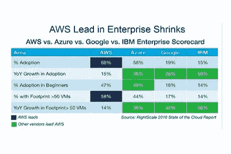

# 我继续购买这些股票的 5 个理由

> 原文：<https://medium.datadriveninvestor.com/5-reasons-why-i-m-gonna-keep-buying-these-stock-cf72216869c9?source=collection_archive---------5----------------------->

## 像沃伦·巴菲特一样进行无聊的长途旅行

Photo by [Ishant Mishra](https://unsplash.com/@ishant_mishra54?utm_source=medium&utm_medium=referral) on [Unsplash](https://unsplash.com?utm_source=medium&utm_medium=referral)

我有一些朋友甚至不想谈论股票。他们宁愿从商业银行购买股票，也不愿赔钱。或者他们的父亲告诉他们，股票市场是每个人失去财富的地方。

但是他们从来不读任何关于股票市场的东西。当市场大幅下跌时，他们只会看到更多血腥的开盘新闻。这是新闻服务的工作。他们只注意到不好的东西。

他们听说过沃伦·巴菲特，但从未听说过 T2、伯克希尔·哈撒韦和他们的故事。*这只是一个运气好的老人的一些股票。他们不知道他是如何做到的，也不知道这对他有什么作用。*

当然，当你买股票的时候，有一个内在的风险。你总是可以把钱存入储蓄账户，然后等待，等待，等待。

或者你可以做作业。阅读有关该主题的内容。学习最好的是怎么做的，开始用你的风险规避模式投资。

投资股票就像拥有心理学学位一样。正如霍华德·马克斯所说，它是关于人的:

> 没有所谓的市场…有的只是人。而且人是有感情的。因此，情绪往往会让人们在顶部买、买、买，直到最后一个潜在买家买下并花光了他所有的钱——此时到达顶部，二阶导数为负——然后在底部卖、卖、卖，直到最后一个恐慌的人这样做。

看起来很简单，对吧？

不是。尤其是如果你的钱处于危险之中。心理学就是从这里开始的。太情绪化了。如果你不能在股市中控制自己的情绪，那么你就不应该在股市中。

> 股票市场是一个把钱从没有耐心的人那里转移到有耐心的人那里的工具

Photo by [Sincerely Media](https://unsplash.com/@sincerelymedia?utm_source=medium&utm_medium=referral) on [Unsplash](https://unsplash.com?utm_source=medium&utm_medium=referral)

我阅读了所有大师的作品:沃伦·巴菲特、霍华德·马克斯、彼得·林奇、保罗·都铎·琼斯、杰克·博格尔、雷伊·达里奥等等。

他们都这么说。你必须有耐心。投资股票是一个漫长的旅程。

除非你是一名神风特攻队队员，并努力实现全垒打，否则你不可能在几年内就在股票市场上发大财。但是如果你这么做了，就做好失去一切的准备吧。或者你真的必须**设计一个简单的策略**并长期坚持下去。

没有 b 计划。

当然，当你的投资组合很小的时候，你应该采取风险更大的策略来增加收益。但是随着时间的推移，你需要有一个强大而平衡的投资组合来抵御所有的坏天气。

> 这就是我投资微软的原因。

在过去的几年里，这家公司一直是最可靠的公司之一。在一个公司里拥有我喜欢的一切。多样化，低竞争，优秀的资产负债表，和一个伟大的领导者(塞特亚·纳德拉)。

以下是我决定长期投资微软的 5 个原因。

 [## 股票回购以及为什么我们都要为此买单。数据驱动的投资者

### 我们在创纪录的债务负担、地缘政治紧张局势、选举和气候战争的背景下进入 2020 年。连 3 个都没有…

www.datadriveninvestor.com](https://www.datadriveninvestor.com/2020/04/08/stock-buybacks-and-why-we-all-pay-for-them/) 

# 1.多样化

微软本质上是一家软件公司，最著名的是其操作系统 Windows 和微软 Azure 云平台。

Windows 控制了全球超过 76%的桌面操作系统。即使你包括手机和平板电脑，Windows 以 37.86%对 36.08%的比例紧随 Android 之后，微软的愿望是一个令人印象深刻的统计数据。

Image from Cloud Report

年复一年的增长使 Azure 在强大的竞争中处于领先地位。更好的是，企业 SaaS 市场为软件供应商创造了 200 亿美元的季度收入，这个数字每年增长 32%。微软拥有超过 17%的全球市场份额，目前遥遥领先于 SaaS 厂商。

微软还涉足高增长市场，如数据分析、带有 Azure 认知服务的人工智能、Azure 机器学习和 Azure 宇宙数据库。这三个领域为公司带来了超过 1 亿美元的收入。

微软也在游戏市场。这个市场预计到 2021 年将达到 1800 亿美元的市场份额。Xbox 正在取得重大进展，一些分析师猜测，这可能会使其成为游戏行业的下一个网飞。

> 我们正在游戏领域寻求一个昂贵的机会——从游戏的创作和发行方式到游戏的播放和观看方式——今年的收入首次超过 100 亿美元。我们正积极投资于任何终端的内容、社区和云服务，以扩大使用范围并深化与游戏的互动。Xbox Live 现在每月有 5700 万活跃用户。

最后，微软在自动驾驶汽车市场也有所发展。它充分利用 Azure，将它作为连接汽车服务的基础。最近有消息称，从 2020 年开始，大众汽车将在超过 500 万辆汽车上使用该产品。大众有一个非常雄心勃勃的项目，即到 2020 年，以一半的价格生产像特斯拉一样好的电动汽车。这两家巨头公司携手合作，将在行业内实施大规模赋能，并与特斯拉展开无畏的竞争。

# 2.获得

微软在 2016 年收购了 GitHub。这个开发平台被 3100 万开发人员使用，他们共享代码、托管和审查项目管理，并构建从开源到商业的软件。

MSFT 在全股票交易中以 75 亿美元的高价收购 GitHub。但是因为 GitHub 有一个庞大的粉丝俱乐部，它为微软打开了成千上万的大门，让他们接触到每一个大型技术趋势背后的开发者。

关于 LinkedIn，全球最大的职业网络，在 200 多个国家拥有超过 5.62 亿用户。微软以 270 亿美元的总收购价收购了它。尽管价格似乎很高，但微软的 LinkedIn 收入比 2018 年增加了 30 亿美元，达到 53 亿美元，同比增长 130%。

# 3.收益和资产负债表

我知道，随着下一场激动人心的大型游戏的到来，再写一些关于游戏的东西会更有趣。或者关于自动驾驶汽车，它用所有的下一代技术把我们投射到未来。

不幸的是，我要谈的是世界上最无聊公司的无聊数字。

微软 Q4 新闻稿告诉我们，这家公司几乎处于完美模式。我们知道，疫情问题加速了向远程工作的转变，一些公司正从中受益。但你也看到一些大型科技公司的广告收入大幅下降。

然而，微软在 2020 年第一季度开始时，每个领域都有惊人的增长。Office 365 上涨 27%。领英 22%。Dynamics 产品和云服务 20%。动态 365 49%。服务器产品和云服务 32%。和 Azure 61%。

萨提亚·纳德拉说:

> 我们在两个月内见证了为期两年的数字化转型。从远程团队合作和学习到销售和客户服务，再到关键的云基础设施和安全性，我们每天都在与客户一起工作，帮助他们适应并保持业务在远程一切的世界中开放。

如果你看到第四季度的报告，微软的收入比预期的 360 亿美元高出 380 亿美元。

微软第四季度每股收益 1.46 美元，高于预期的 1.36 美元。

只有在生产率方面，结果低于预期，收入为 117.5 亿美元，而预期为 119 亿美元。

今年迄今，微软的股价已经上涨了 34.24%。

通过这一分析，我们看到市盈率上升，这让我希望等待一个修正，继续购买股票。本益比是 36.89，对我来说愿望太高了。但是你知道市场是如何运作的。等待更好的时机买入，继续跟踪优秀的、管理良好的公司。

我的平均成本基础是 152.23 美元，现在我认为有太多的赌徒在阻塞应用程序中购买和娱乐自己，而他们不能去赌场。有了疫情，全世界都依赖于科技设备。我认为封锁之后，事情会正常化，价格也会正常化。

# 4.明天的价格

微软证明了它将成为在家工作、生活甚至娱乐新模式的主要赢家之一。

萨提亚·纳德拉说，在这一点上，技术密集度是商业弹性的关键。

但是一个重大事件正在向我们所有人走来，它将戏剧性地改变我们所看到的世界。

技术是一种通货紧缩的力量。技术解决的所有事情都是让东西越来越便宜。技术解决的所有事情都取代了工作。因此，这种通缩力量正在与现代经济一直试图控制的通胀背道而驰。

通货紧缩的大部分仍在我们面前——由以指数速度发展的技术推动。在过去的二十年里，185 万亿美元的债务产生了大约 46 万亿美元的 GDP 增长。

纳西姆·尼古拉斯·塔勒布在他的书中指出:

> “为了安全”而系统地防止森林火灾的发生会使大火灾更加严重

另一方面，解释债务确实创造了就业机会，让我们的生活变得更好也很重要。总的来说，在世界各地，这万亿美元债务的好处解决了贫困，赋予了妇女权力，给了那些没有家的人一个家。

讽刺的是，轻松的信贷创造了真正的财富，甚至帮助了风险投资和初创公司。他们受益并茁壮成长，将自己转变为巨大的控股公司和大型科技公司，创造就业机会，并发展整个行业。

但是这种繁荣现在导致了另一次繁荣。技术的简单力量在于，它允许在没有同等数量的工作或收入的情况下实现富足。因此，我们必须重新思考新兴经济体的支柱。尤其是政治，似乎远离这些新的现实。

# 5.国会如何盲目看待科技公司

微软是目前唯一没有被美国政府和国会追究垄断问题的大型科技公司(亚马逊、脸书、苹果和 Alphabet)。

但这是个时间问题。最近有消息称，微软可能收购 Tik Tok 的美国业务，该公司正在进行领土战。

大数据的未来和这些垄断问题可能会成为政治斗争的下一个巨大武器。从美国和中国开始。

作为投资者，可能的报复将是这个行业中真正损害科技公司价值的一个因素。

坦率地说，我不相信美国国会和政府会伤害他们自己的公司。在中国公司与硅谷争夺全球霸权的时候，在微软、苹果、亚马逊、脸书和 Alphabet 不得不在全球经济中打得火热的时候进行监管将是一个愚蠢的决定。

美国要想继续赢得这场竞赛，他们必须增强这些公司的实力，因为中国正全力以赴。

Photo by [Drew Beamer](https://unsplash.com/@drew_beamer?utm_source=medium&utm_medium=referral) on [Unsplash](https://unsplash.com?utm_source=medium&utm_medium=referral)

有时候世界似乎颠倒了。疫情问题。技术颠覆。另一个大债务周期的结束。两大帝国(美国和中国)争夺绝对霸权的斗争。

这将是非常有趣的时刻。我非常好奇，作为人类，我们如何解决这些差异。

作为一个星球，我们到底进化了多少，我们都希望我们的未来是什么样的？

又一场战争？更多的战斗？更多的饥饿和疾病？

这是我们为之奋斗的吗？

在历史上，我们从未有过如此多的文化和种族间的和平与爱。50 年前，100 年前，几乎每个国家都在和别人打仗。

技术的简单力量是允许富足。我不相信任何人不想过富足的生活。因为每天我们每个人都在为富足而战。

微软将成为这一新模式的主要参与者之一。计算机能够将原始数据转化为对人类经验的更深入理解。有了人工智能，这个过程比你想象的要近得多。

微软 AI 在开发计算机语言。这是一个非常复杂的过程。我们人类需要几年时间来发展语言技能。现在想象一下在人工智能计算机上的过程？但是微软正在开发你能想象的最大、最强大的语言模型。

2017 年，人工智能可以实现语音识别，将对话语音转换为文本。

2018 年，AI 可以做阅读理解。阅读文件并回答相关问题。同年，他们实现了语音合成，这是一种人工制造人类语音的技术。另一件事是准确地将文本从一种语言转换成另一种语言。

2019 年，出现了一种新的人工智能趋势，即允许模型使用自我监督学习，通过随时可用的相关内容，形成对语言丰富上下文语义的理解。自我监督学习，通过现成的相关内容形成对丰富的语言语境语义的理解。

我们不知道 2020 年会给我们带来什么。即使在媒体中，我们也能感觉到某种无形的力量在帮助我们以更简单的方式写作。我感觉到了，你也感觉到了。

未来就在眼前。微软全天候工作，为我们提供更好的工具来创造财富。代价是什么？我们不知道。

我很乐观。我热爱科技。

只希望微软能继续做好这段不平凡的旅程。

我可以向你们承诺，我将继续关注这家公司，希望我能继续成为数百万股东之一，为我们的家园、我们的孩子、我们的国家以及我们的生活带来奇妙的东西，并从中受益。

**进入专家视角—** [**订阅 DDI 英特尔**](https://datadriveninvestor.com/ddi-intel)