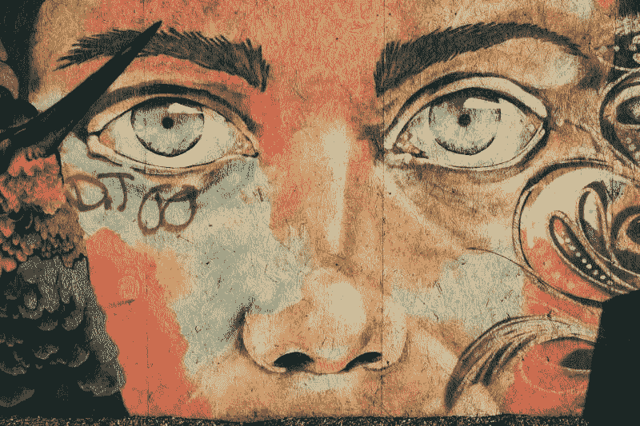

# 今年我想投资艺术的 5 个理由

> 原文：<https://medium.datadriveninvestor.com/5-reasons-why-i-want-to-invest-in-art-this-year-a1b8937f2c38?source=collection_archive---------24----------------------->

## 生活充满了惊喜；直到上周日，我对艺术一点也不感兴趣

Photo by [Dan Farrell](https://unsplash.com/@farreal?utm_source=unsplash&utm_medium=referral&utm_content=creditCopyText) on [Unsplash](https://unsplash.com/s/photos/art?utm_source=unsplash&utm_medium=referral&utm_content=creditCopyText)

当我还是个孩子的时候，我和父母乘坐大篷车在欧洲旅行时，参观了许多美术馆和博物馆。但是，我觉得挺无聊的。另一方面，我姐姐很喜欢，因为她自己在画画。我想去看足球场，但今天提起这个有点尴尬。

我现在 51 了，对艺术的态度也变了。上周日就变了。发生了什么事？

我的一个朋友前阵子开始投资艺术品。我觉得他这么做只是为了钱。我确信这与我无关，因为我相信你需要对你想投资的东西有激情，而且你必须理解它。如果你投资比特币，你必须对什么是区块链有一个基本的了解，你必须相信去中心化货币系统的概念。ETF 也是如此:你投资清洁能源是因为你想要改变。如果你是一个有清晰眼光的负责任的投资者，钱只是投资故事的一部分。

在过去的几周里，我的朋友给我发了几个如何投资艺术的视频，直到上周日我才注意到。我很无聊，所以我打开了其中的一个视频:一个人展示了如何廉价获得限量版印刷品，以及如何以更高的价格出售它们。低买高卖。有时为了 600%的回报。有人可以不带感情地购买比特币之类的艺术品和股票，这有点奇怪。我喜欢视频中所有这些可爱的印花。那天剩下的时间里，我在网上搜索不同艺术家的作品。最近，我压力很大，充满了 FOMO 和贪婪，因为我觉得我过早地兑现了我的密码。检查艺术品非常令人平静。然后我有一个强烈的愿望，第二天去参观美术馆。不幸的是，因为疫情，德国所有的美术馆现在都关门了。

我决定我也想投资一些我的秘密现金在艺术上。

# 1.艺术产生心灵的平静

我相信买一件你喜欢的艺术品是有治疗作用的。有时你喜欢把它握在手里，看着它，你会发现新的方面。投资一件艺术品就像冥想:你停留在当下。是用心的温暖投资。

然而，这仍然是一项有利可图的投资，因为价格大幅上涨。我想知道当你对一件价格上涨了 1000%的艺术品产生强烈的情感联系时会发生什么。你是卖了它还是留着它？

# 2.你投资支持艺术家

在电晕危机期间，我们了解到文化场景是多么重要。当我们错过去音乐会、剧院和博物馆的时候，许多艺术家、演员和音乐家都在挣扎。他们是社会的重要组成部分。随着你对艺术的投资，你支持文化场景。这叫做负责任的投资。

# 3.你分散投资

我们都知道分散投资有多重要。尤其是在这个动荡的时代。股票，商品，密码，房地产。艺术品是另一种降低风险的资产类别，但缺点是你必须把它放在某个地方。这更像是拥有实物黄金、白银或钻石。

# 4.你投资于与其他资产不相关的东西

艺术品和其他投资没有关联。它的价格与商品、股票或密码的价格无关。因此，在高波动时期，这是一个完美的投资。

# 5.提高生活质量的投资

艺术是一种投资，你可以坐在客厅或办公室里欣赏。入口角落里的雕塑或客厅墙上可爱的印花带来纯粹的快乐。这使得它不同于其他投资。

# 摘要

我想投资艺术，因为这是一种负责任的投资，它将快乐与利润结合在一起。接下来的几周，我想从我喜欢的艺术家那里寻找艺术投资。为了使它成为一项有利可图的投资，我将遵循一种数据驱动的方法来寻找也有潜力提高价格的艺术品。

你想参与我投资艺术品的冒险吗？

## [是的，我想成为投资艺术品的“Artventure”的一员。](https://www.artventure.me/join-me-on-my-artventure)

*原载于 2021 年 2 月 19 日*[*https://art venture . me*](https://artventure.me/5_reasons_why_i_want_to_invest_in_art_this_year/)*。*